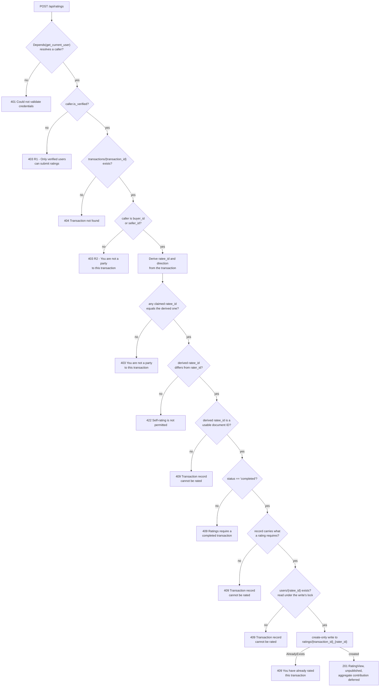
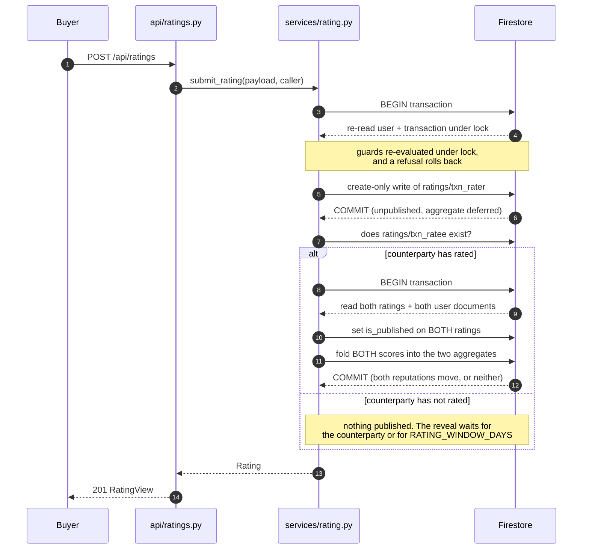

# Ratings — Bidirectional Peer Reputation (F010)

The rating system lets the two counterparties of a completed purchase rate each other: the buyer rates the seller and the seller rates the buyer, on an integer scale of 1 to 5 with an optional written review. Two authorization gates govern every submission. The first is that the rater's account must be verified — an unverified caller is refused before any transaction is read. The second is that the rater and the person being rated must be the buyer and the seller of the same transaction, which must be `completed`, and each of them may rate it exactly once. This document is the authoritative reference for the delivered behaviour; where it disagrees with the source files it names, the source file is right and this document is the defect. It is developer- and integrator-facing detail, distinct from the three stakeholder deliverables under `documentation/`, which this feature does not modify.

The feature is built entirely on the stack the system already uses — a Python and FastAPI backend over Google Cloud Firestore, with a React and TypeScript client (`documentation/Technical Specifications.md` §1.1.4 Technology Stack, L89–L101). It needed no new runtime capability: everything it does is FastAPI, Pydantic v1, the Firestore client, React, Redux Toolkit, axios and Zod, all already in use.

Two package manifests did change, and they are repairs rather than additions: `frontend/package.json` now **declares** `zod` (3.25.76) and `dompurify` (3.4.13), with `@types/dompurify` as a development dependency. Both packages were already imported by existing source — every file in `frontend/src/schema/` opens with `import { z } from 'zod'`, and `frontend/src/utils/validation.ts` imports DOMPurify — while the manifest listed neither, so the declarations make an existing dependency honest rather than introducing a new one. `backend/requirements.txt` likewise pins what the backend already imports, every direct dependency at an exact version; no library was added for this feature.

## 1. Data model

### The `ratings` collection

Ratings live in a Firestore collection named `ratings`, in native mode, with snake_case field names. That matches the convention of the four collections the design already describes — Users, VehicleListings, Transactions and Messages (`documentation/Technical Specifications.md` §5.2 DATABASE DESIGN, L295–L370, with the four collection blocks at L304, L318, L342 and L358). Firestore is schemaless, so the collection needs no DDL, no table definition and no migration: it comes into existence with its first document.

The persisted document shape is declared by the `Rating` model in `backend/app/schema/rating.py`. Field order and spelling here are the contract that the `fieldPath` entries in `infrastructure/firestore.indexes.json` and the camelCase mirror in `frontend/src/schema/rating.ts` are keyed to.

| Field | Type | Semantics |
|---|---|---|
| `id` | `str` | Equal to the document ID |
| `transaction_id` | `str` | The transaction that authorizes this rating |
| `vehicle_listing_id` | `str` | Denormalized from the transaction so a rating renders with context without a second read |
| `rater_id` | `str` | Always the authenticated caller; never accepted from the request body |
| `ratee_id` | `str` | **Server-derived** — the other participant of the transaction |
| `direction` | `str` | `buyer_to_seller` or `seller_to_buyer`; **server-derived** |
| `score` | `int` | Bounded `RATING_MIN`..`RATING_MAX` inclusive |
| `review` | `Optional[str]` | Free text, length-bounded by `RATING_REVIEW_MAX_LENGTH` and normalized to plain text |
| `is_published` | `bool` | Defaults to `false`; gates visibility and aggregate inclusion |
| `moderation_status` | `str` | `pending`, `approved`, or `rejected` |
| `moderation_reason` | `Optional[str]` | Policy-violation reason; never a score-based reason |
| `created_at` | timestamp | Server timestamp |
| `updated_at` | timestamp | Server timestamp |

The identifier fields are validated document IDs rather than bare strings, because these values construct document paths: a forward slash would be read as a nested path and the write would land somewhere other than where every reader looks, a control character forges a log line, and an oversized value produces a key that cannot be typed back. A component is held to 128 characters and a rating's own `id` to 769 — two escaped components plus the joining underscore, where escaping can at worst triple a component's length — so a rating that can be created can always be moderated afterwards. Section 3 explains the escaping and why the bound is what it is.

Both participant IDs are also validated *as read from the transaction*, before anything is derived from them or staged for writing. A stored `buyer_id` or `seller_id` that is not a usable document ID is refused as a stored-data invariant failure (`409`, `TransactionInvariantError`) rather than written into a rating: a rating carrying an unusable `ratee_id` could not be validated on the way out, could not be published, and could not be resubmitted, because the second attempt would collide with the record of the first.

### Enumerations

These two enumerations in `backend/app/schema/rating.py` are the single source of the allowed values; nothing else in the feature defines a rating direction or a moderation state.

| Enumeration | Members |
|---|---|
| `RatingDirection` | `buyer_to_seller`, `seller_to_buyer` |
| `ModerationStatus` | `pending`, `approved`, `rejected` |

### Request shape

`RatingCreate` is the body accepted by `POST /api/ratings`. It declares three fields and no more.

| Field | Type | Required |
|---|---|---|
| `transaction_id` | `str` | Yes |
| `score` | `int` | Yes |
| `review` | `Optional[str]` | No |

It deliberately **excludes `ratee_id` and `direction`**. Both are derived on the server from the cited transaction, which is what makes counterparty spoofing and self-rating structurally impossible rather than merely validated against. A client that supplies `ratee_id` anyway is claiming who it believes the counterparty is, and that claim is **refused rather than ignored**: the model retains the key so the service can compare it against the derived counterparty and answer `403`, because silently discarding it would answer `201` to a request the server did not honour. That tolerance extends to `ratee_id` alone — every other unrecognised key draws a `422` naming it — and no key in the body can reach the datastore, because the write path names every field it persists explicitly.

### Response shapes

The persisted model is never returned directly. `backend/app/schema/rating.py` projects it into two response models, so the field set a caller receives is decided in one place, plus two further models for the aggregate and the eligibility decision.

| Model | Fields | Used by |
|---|---|---|
| `RatingView` | `id`, `transaction_id`, `vehicle_listing_id`, `rater_id`, `ratee_id`, `direction`, `score`, `review`, `is_published`, `created_at`, `updated_at` | `POST /api/ratings`, and both rating reads |
| `ModeratedRatingView` | `RatingView` plus `moderation_status` and `moderation_reason` | `PATCH /api/ratings/{rating_id}/moderation` |
| `RatingAggregate` | `average` (nullable float, default `null`), `count` (int, default `0`) | `GET /api/ratings/user/{user_id}/aggregate`, and the aggregate half of the user read |
| `EligibilityDecision` | `eligible`, `reason`, `ratee_id`, `direction`, `already_rated` | `GET /api/ratings/eligibility/{transaction_id}` |

`moderation_status` and `moderation_reason` are absent from `RatingView` by construction rather than blanked out, so the moderation state reaches administrators through the admin-only endpoint and nobody else. `RatingAggregate.average` is `null` — not `0` — when a user has no published ratings, so "no ratings yet" stays distinguishable from a genuine average of zero.

### Additive fields on `users`

`users` documents gain exactly three fields, declared with these defaults in `backend/app/schema/user.py` alongside the seven that were already there:

```python
is_verified: StrictBool = False
rating_average: Optional[float] = None
rating_count: int = 0
```

`is_verified` is a strict boolean, so the string `"false"` or the integer `0` is rejected rather than coerced — for an authorization flag, a stored value nobody intended as `true` must never read as `true`.

**There is no migration and no backfill, and none is needed.** Because every new field carries a default, a pre-existing `users` document that lacks the keys deserializes cleanly as `is_verified = False`, `rating_average = None` and `rating_count = 0`. Those are the semantically correct values in every case: an existing user is not verified until verification is recorded, and has no reputation until somebody rates them. A backfill script would add operational risk to achieve nothing.

`rating_average` and `rating_count` are a **denormalized** aggregate whose sole writer is `backend/app/services/rating.py`, and it only ever writes them inside a Firestore transaction. Denormalizing them onto the user document is what keeps a reputation read inside the budget of 200 ms for 95% of requests (`documentation/Software Requirements Specifications (SRS).md` L451): the summary is read from one document rather than recomputed by scanning every rating a user has received.

Stated precisely, because "one read" is easy to overclaim. `GET /api/ratings/user/{user_id}/aggregate` costs one bounded settlement query — which returns nothing on a system with no overdue ratings, the ordinary case — followed by **one get-by-ID**, and nothing else. `GET /api/ratings/user/{user_id}` costs that plus the paginated walk that builds the list it returns, which is bounded but is not one read. Neither ever recomputes the average from the ratings themselves.

`rating_average` stores the **exact, unrounded mean** of the published scores; rounding to two decimals happens on the way out, at the presentation boundary, and never in the stored value. Section 4 sets out why that distinction is load-bearing rather than cosmetic.

The `transactions` collection is **read-only** for this feature — no field is added to it and nothing in the rating paths writes to it.

### Indexes and index exemptions

Every query this feature issues is served by a declared index, and every field it never queries is exempted from being indexed. Both halves are declared in `infrastructure/firestore.indexes.json`, which is the single source of truth for them:

```json
{
  "indexes": [
    { "collectionGroup": "ratings", "queryScope": "COLLECTION", "fields": [
      { "fieldPath": "ratee_id", "order": "ASCENDING" },
      { "fieldPath": "is_published", "order": "ASCENDING" },
      { "fieldPath": "created_at", "order": "DESCENDING" } ] },
    { "collectionGroup": "ratings", "queryScope": "COLLECTION", "fields": [
      { "fieldPath": "ratee_id", "order": "ASCENDING" },
      { "fieldPath": "is_published", "order": "ASCENDING" },
      { "fieldPath": "created_at", "order": "ASCENDING" } ] },
    { "collectionGroup": "ratings", "queryScope": "COLLECTION", "fields": [
      { "fieldPath": "is_published", "order": "ASCENDING" },
      { "fieldPath": "created_at", "order": "ASCENDING" } ] },
    { "collectionGroup": "ratings", "queryScope": "COLLECTION", "fields": [
      { "fieldPath": "transaction_id", "order": "ASCENDING" },
      { "fieldPath": "rater_id", "order": "ASCENDING" } ] }
  ],
  "fieldOverrides": [
    { "collectionGroup": "ratings", "fieldPath": "review", "indexes": [] },
    { "collectionGroup": "ratings", "fieldPath": "moderation_reason", "indexes": [] }
  ]
}
```

Four composite indexes, one per query shape:

| Index | Query it serves |
|---|---|
| `ratee_id`, `is_published`, `created_at DESC` | The published ratings a user has received, newest first — the list half of `GET /api/ratings/user/{user_id}` |
| `ratee_id`, `is_published`, `created_at ASC` | The ratings **already due** for one user, **oldest first** — the settlement pass every reputation read performs |
| `is_published`, `created_at ASC` | Every due rating in the collection, oldest first — the scheduled sweep |
| `transaction_id`, `rater_id` | One transaction's ratings, ordered by rater — the per-transaction read and the reciprocal pre-check |

The two ascending declarations are what make publication starvation-free rather than merely bounded, and Section 4 explains why. They are declared with the direction their query asks for rather than relying on Firestore serving an ascending order from the descending sibling by scanning it backwards. That reverse-scan behaviour is not something this project can verify: the local emulator serves any query whether or not an index is declared, so a wrong assumption about it would first appear as a `FailedPrecondition` on a public read path in a deployment where indexes are enforced. One extra index is the cheaper side of that trade.

The two `fieldOverrides` are the other half of the arithmetic. Firestore indexes every field of every document automatically, in both directions, unless told otherwise. `review` and `moderation_reason` are the two large text fields on a rating and no query in this feature filters or orders by either, so every rating write was paying — in write latency and in storage, permanently — to maintain index entries nothing would ever read. An empty `indexes` array means "no single-field indexes for this field at all". Exempting the two removes four automatic entries per write, which more than pays for the two composite indexes added beside them.

Nothing under `backend/app/` reads this file, and nothing in the repository installs it either. `scripts/deploy.sh` is the intended consumer - it reaches `gcloud firestore indexes create firestore.indexes.json` after building and deploying everything else - but that is not a real gcloud verb: `gcloud firestore indexes` offers `composite create|delete|describe|list` and `fields describe|list|update`, so passing a filename to `create` exits 2 with "Invalid choice: 'create'". The script also runs under `set -e` and, well before that line, builds three image contexts (`./backend/api`, `./backend/auth`, `./backend/search`), enters a `terraform` directory at the repository root and applies a `k8s/` directory - none of which exist, the Terraform actually living at `infrastructure/terraform` - so the run aborts on the first of those. The script is reference-only for this feature and is left as it stands.

**The practical consequence: nothing installs these indexes today.** Install them by running the equivalent `gcloud firestore indexes composite create` command per declared index, and apply each `fieldOverrides` entry with `gcloud firestore indexes fields update --collection-group=ratings --field=<path> --clear-indexes`, or accept that a query needing a composite index will fail at request time against a real project. A local Firestore emulator will not reveal the problem: it serves queries whether or not a composite index is declared.

Because nothing reads it at runtime, a shape whose index is missing cannot fail before a deployment - so the test suite enforces the file instead. `backend/tests/conftest.py` parses it at import and refuses any query whose shape no declared index serves, with the real `FailedPrecondition`, exactly as production would; and `backend/tests/test_rating_service.py` asserts the file's own contents, including that no queried field has been exempted by mistake.

No Terraform change accompanies the new collection. `google_firestore_database.database` in `infrastructure/terraform/main.tf` provisions the database itself, and because Firestore is schemaless, collections are not declared in infrastructure at all.

## 2. API endpoints

`backend/app/api/ratings.py` exposes a single `APIRouter`, mounted in `backend/app/main.py` with `prefix='/api/ratings'` and `tags=['Ratings']`. Every path is declared **relative to that prefix**, so the paths resolve exactly as tabulated below.

The matrix below is the **complete** set of statuses each endpoint can answer with; it matches what the generated `/openapi.json` declares, route for route and status for status.

| Method | Resolved path | Authorization | Success | `401` | `403` | `404` | `409` | `422` | `503` |
|---|---|---|---|:--:|:--:|:--:|:--:|:--:|:--:|
| `POST` | `/api/ratings` | Authenticated **and** verified **and** a participant of a completed transaction | `201` `RatingView` | ● | ● | ● | ● | ● | ● |
| `GET` | `/api/ratings/user/{user_id}` | Public read | `200` `{ items, aggregate }` — **published ratings only** | — | — | ● | — | ● | ● |
| `GET` | `/api/ratings/user/{user_id}/aggregate` | Public read | `200` `RatingAggregate` — the summary alone | — | — | ● | — | ● | ● |
| `GET` | `/api/ratings/transaction/{transaction_id}` | Participant-only | `200` `RatingView[]` | ● | ● | ● | — | ● | ● |
| `GET` | `/api/ratings/eligibility/{transaction_id}` | Authenticated | `200` `EligibilityDecision` | ● | — | ● | — | ● | ● |
| `PATCH` | `/api/ratings/{rating_id}/moderation` | `role == 'admin'` | `200` `ModeratedRatingView` | ● | ● | ● | — | ● | ● |

What each failure means, per endpoint:

- **`401`** — no credentials, or a credential that cannot be validated: absent, malformed, expired or wrongly signed, missing a required claim, or naming a user document that does not exist or does not satisfy the `User` model. The public user read is the one endpoint that never answers it, because it requires no caller.
- **`403`** — on `POST`, either R1 (the rater's account is not verified) or R2 (the caller is not a party to the cited transaction, which includes supplying a `ratee_id` that disagrees with the derived counterparty); on the transaction read, the caller is neither buyer nor seller; on `PATCH`, the caller's stored role is not `admin`. Nothing is written on any of these paths.
- **`404`** — no transaction at the cited ID (`POST`, both transaction-scoped reads), no such user (both user reads), or no rating at that ID — or a stored rating whose body cannot be interpreted (`PATCH`).
- **`409`** — `POST` only: the transaction has not completed, this rater has already rated it, or the transaction record is missing data a rating requires.
- **`422`** — request validation, and it is reachable on **every** endpoint, because each path parameter is a constrained document-ID type rather than a bare string. On `POST` it additionally covers a score outside `RATING_MIN..RATING_MAX`, a non-integer score, an over-length review, an unsupported body key and a degenerate self-rating; on `PATCH` it covers an unrecognised `moderation_status`, a rejection carrying no reason, a reason accompanying a state that displays the review, and an over-long reason.
- **`503`** — the datastore could not be reached within its deadline. That answer is only possible because every datastore operation carries a wall-clock budget — see "When the datastore cannot be reached" below. A `Retry-After` header accompanies the response, so a transient provider fault is reported as retryable rather than as a client mistake, and the request may be repeated unchanged.

The two user reads are siblings rather than one endpoint with a mode. The reputation badge that renders beside every listing needs an average and a count; serving it from `/user/{user_id}` meant the most frequent read in the product returned a page of rating documents, with their review text, for a client that discarded every one of them. A query flag would have made one response model describe two shapes, so the summary has its own path and its own model. What it does **not** drop is settlement: both endpoints publish whatever is already due before answering, so they cannot report different reputations for the same user.

All six paths follow the `/api/<resource>` REST convention the design establishes (`documentation/Technical Specifications.md` §5.3 API DESIGN, L372–L406). The admin gate on moderation reads the caller's role from their stored user document, never from a request header, and matches the Guest/Buyer/Seller/Admin role model with `403` on denial described at §7.1.2 (L584–L623) — the role-based access control with least privilege that `documentation/Software Requirements Specifications (SRS).md` L494–L495 requires.

### Error contract

The service raises typed domain exceptions and the router translates each into an `HTTPException`, reusing the exception's own caller-facing message as the response `detail`. That reuse is what keeps the string a client is shown identical to the `reason` the eligibility endpoint reports for the same condition. No `detail` names a field, a document, a hostname or any other internal value — those stay in the log.

**Every failure carries one envelope**, declared as `ErrorDetail` on every failure response of all six operations:

```json
{
  "detail": "Only verified users can submit ratings",
  "errors": null
}
```

- `detail` is **always a sentence** fit to render. Whatever refused the request — a domain guard, the admin gate, the auth dependency, an unreachable datastore, or request validation — a client reads one string from one place.
- `errors` is present **only** when request validation located specific fields, and then carries one `{ loc, msg, type }` object per problem, `loc` outermost-first (`["body", "score"]`, `["path", "transaction_id"]`). It is absent or null on every failure the router raises itself, because those requests were well formed and no single field is at fault.

A validation failure therefore looks like this, with the offending fields named in the sentence **and** located in the list:

```json
{
  "detail": "score: ensure this value is less than or equal to 5",
  "errors": [
    {
      "loc": ["body", "score"],
      "msg": "ensure this value is less than or equal to 5",
      "type": "value_error.number.not_le"
    }
  ]
}
```

That single shape is delivered by a `RequestValidationError` handler registered in `backend/app/main.py`. It exists because 422 is reachable two ways — the framework rejecting a field, and a domain refusal the service raises — and the framework's own body for the first is `{"detail": [{…}]}`, a list where every other failure carries a string. Two incompatible bodies under one status code cannot both be declared, so a generated client had a type for only one of them and the official client had to inspect the runtime type of `detail` to tell which it had been sent. The handler summarises the field problems into the sentence, keeps them verbatim in `errors`, and so publishes a superset of what the default produced.

The handler is **scoped to the `/api/ratings` paths**. Validation failures on any other path are delegated to the framework's own handler unchanged: the listings, transactions and messages routers publish 422 as `HTTPValidationError`, they are not part of this feature, and reshaping their bodies while leaving their generated schema in place would recreate for them exactly the mismatch this closes.

`detail` for a validation failure names at most five fields and then says how many further problems there are, because it is rendered verbatim to a user; `errors` always carries the complete set, so nothing is withheld.

| Domain exception | HTTP status | `detail` a caller receives |
|---|---|---|
| `RaterNotVerified` | `403` | Only verified users can submit ratings |
| `TransactionNotFound` | `404` | Transaction not found |
| `NotATransactionParticipant` | `403` | You are not a party to this transaction |
| `SelfRatingNotAllowed` | `422` | Self-rating is not permitted |
| `TransactionNotCompleted` | `409` | Ratings require a completed transaction |
| `DuplicateRating` | `409` | You have already rated this transaction |
| `TransactionInvariantError` | `409` | This transaction is missing information a rating requires, so it cannot be rated until its record is repaired |

The mapping is a closed list with no fallback, deliberately: an exception absent from it is not answered by this API at all. An earlier revision caught the base exception class beneath the table and answered `400` for anything unrecognised, which would have published the message of any future failure mode to callers without anyone deciding that it should be. A new failure mode has to be given a status on its merits or surface as the defect it is.

`TransactionInvariantError` is a `409` rather than a `500` because the request is well formed and the caller is authorized; what refuses it is the stored state of the cited transaction, which is exactly why `TransactionNotCompleted` is also a `409`. It covers all three ways a stored record can be unratable — missing `vehicle_listing_id`, a counterparty that is not a usable identifier, and a counterparty with no account — and the specific defect is logged with the transaction named, so the operator signal is kept rather than traded away.

A `422` for an out-of-range or non-integer score, or a review that is over-long once normalized, is raised by Pydantic **before any handler body runs**, because `backend/app/schema/rating.py` binds those bounds to `RATING_MIN`, `RATING_MAX` and `RATING_REVIEW_MAX_LENGTH`. "Once normalized" is the operative phrase: the limit is measured on the text that would actually be stored, so the server and the client's character counter agree about what it means. Those failures arrive in the envelope above with `errors` populated; the two `422`s in the table — self-rating, and a moderation decision the service refuses — arrive in the same envelope without it.

The same is true of the identifiers in a URL. Each path parameter is declared as a constrained document-ID type rather than a bare string, so a value carrying a slash, a control character or more than 128 characters — 257 for a rating's own composite ID — is refused as a `422` before the handler runs, on **every** endpoint including the public read. A malformed identifier is a malformed request, not a missing document.

Beyond both of those, any endpoint may answer `503` with `Retry-After` when the datastore is unreachable. The `PATCH` endpoint additionally answers a `422` for a moderation decision the reason matrix refuses; the specific rules are in Section 5.

### Submitting a rating

```http
POST /api/ratings HTTP/1.1
Authorization: Bearer <access token>
Content-Type: application/json

{"transaction_id": "8fJ2kQ", "score": 5, "review": "Straightforward sale, car as described."}
```

```http
HTTP/1.1 201 Created
Content-Type: application/json

{
  "id": "8fJ2kQ_u7Bd91",
  "transaction_id": "8fJ2kQ",
  "vehicle_listing_id": "vL44mZ",
  "rater_id": "u7Bd91",
  "ratee_id": "s3Xc20",
  "direction": "buyer_to_seller",
  "score": 5,
  "review": "Straightforward sale, car as described.",
  "is_published": false,
  "created_at": "2024-11-04T09:12:44.518000+00:00",
  "updated_at": "2024-11-04T09:12:44.518000+00:00"
}
```

`ratee_id` and `direction` in that response were derived by the server; neither was supplied. `is_published` is `false` because the counterparty has not rated yet — see Section 4.

### Asking whether a rating may be submitted

```http
GET /api/ratings/eligibility/8fJ2kQ HTTP/1.1
Authorization: Bearer <access token>
```

```http
HTTP/1.1 200 OK
Content-Type: application/json

{
  "eligible": false,
  "reason": "You have already rated this transaction",
  "ratee_id": "s3Xc20",
  "direction": "buyer_to_seller",
  "already_rated": true
}
```

**Every refusal that is a decision about the caller is reported as a `200` carrying a reason**, which is the whole point of this endpoint: a client can explain why submission is unavailable instead of discovering it from an error. Not verified, not a participant, transaction not completed, already rated, a record too incomplete to rate — all of them are a `200` whose `eligible` is `false` and whose `reason` is the very message the write path would have raised.

Only four outcomes are not a decision, and the matrix above lists them: `401` when the caller cannot be resolved, `404` when no transaction exists at the cited ID, `422` when the ID in the URL is not a well-formed document ID, and `503` when the datastore is unreachable.

`ratee_id` and `direction` are populated only once the caller is confirmed a participant of a transaction that names both parties, so a rejected caller learns nothing about a transaction they are not part of. The endpoint performs no writes of its own.

### Reading a reputation

`GET /api/ratings/user/{user_id}` is unauthenticated by design, matching the public-read precedent the existing listing reads already set, and it returns **only published ratings**. A `404` means no such user; a user who exists and has never been rated is a `200` carrying an empty `items` list beside `average: null, count: 0`.

**`items` is capped at the 50 newest visible ratings, and there is no pagination.** The response is `{items, aggregate}` and nothing else: no cursor, no continuation token, no total-pages field. A user with more than 50 published ratings therefore has ratings this endpoint does not return, while `aggregate` still describes all of them. That is a real limit, and it is deliberate rather than unfinished — a cursor was implemented here and removed, because the cursor was a caller-supplied rating ID that the server looked up and positioned a public query from, which turned a public read into an existence oracle for any rating ID a caller cared to try. A read with no cursor cannot be asked that question. Paging is a contract change for whoever plans one, not a fix; Section 7 records it as a limitation.

`aggregate.count` may therefore legitimately exceed the number of entries in `items`, for two independent reasons. The first is the cap above. The second is moderation: the aggregate covers every published rating, whereas the list covers only what a reader may be shown, so a rating withheld by moderation is counted and not listed. Both are properties of the contract rather than discrepancies — Section 5 explains why the moderation half must be that way round.

`GET /api/ratings/user/{user_id}/aggregate` answers the same reputation without the list, for a caller that only renders the two numbers:

```http
GET /api/ratings/user/s3Xc20/aggregate HTTP/1.1
```

```http
HTTP/1.1 200 OK
Content-Type: application/json

{"average": 4.5, "count": 12}
```

It is public on the same grounds, distinguishes "no such user" (`404`) from "never rated" (`200` with `average: null, count: 0`) in exactly the same way, and settles due publications exactly as the full read does. It costs one settlement query plus one get-by-ID, which is what makes it the right endpoint for a badge rendered on every listing.

### When the datastore cannot be reached

Every datastore operation in this feature runs under a wall-clock budget of `DATASTORE_TIMEOUT_SECONDS` (10 seconds), built per operation by `datastore_call()` in `backend/app/db/firestore.py`. The budget bounds the retry policy *and* the retry predicate, which matters because two loops in the pinned client (`google-cloud-firestore==2.13.1`) consult that predicate rather than a deadline: `Query.stream` resumes a failed stream from a cursor in an unbounded loop, and each resume would otherwise start with a fresh deadline.

Transaction control is bounded by the same means. `_BoundedTransaction` in the same module issues `BeginTransaction`, `Commit` and `Rollback` with an explicit retry policy and timeout, replacing the client's own `_commit_with_retry`, which retries `ServiceUnavailable` in a `while True` loop with no attempt ceiling and no deadline. Rollback carries a shorter budget still, because it runs on an already-failed path where the goal is to abandon promptly rather than to succeed.

The consequence a caller sees is that an unreachable datastore produces a bounded failure rather than a hung request: the retry gives up with `RetryError`, the router answers `503` with `Retry-After`, and the request ends. Both that shape and the raw gRPC `ServiceUnavailable` are mapped, on all six routes.

## 3. Eligibility rules

Both authorization gates are expressed as one ordered guard sequence, held in a single function in `backend/app/services/rating.py`. `evaluate_eligibility` reports its outcome and `submit_rating` enforces it, so the reason a user is shown can never disagree with the reason a write is refused.

The order is part of the contract, because the most specific failure has to win — a caller should receive something they can act on rather than a generic rejection.

1. **Authenticated** — the caller resolves through `Depends(get_current_user)`, else `401 Could not validate credentials`.
2. **Verified rater** — `current_user.is_verified` must be literally `True`, else `403` (`RaterNotVerified`). This is authorization requirement **R1**. It runs first, before any document is read, so an unverified caller who also happens not to be a participant learns about verification rather than about participation.
3. **Transaction exists** — `transactions/{transaction_id}` must exist, else `404` (`TransactionNotFound`).
4. **Caller is a participant** — the caller's ID must be the transaction's `buyer_id` or its `seller_id`, else `403` (`NotATransactionParticipant`). This is authorization requirement **R2**.
5. **Counterparty derived server-side** — `ratee_id` is computed as `seller_id` when the caller is the buyer and `buyer_id` when the caller is the seller, with `direction` set to `buyer_to_seller` or `seller_to_buyer` accordingly. A `ratee_id` the client claimed must equal the derived value, else `403` (`NotATransactionParticipant`); the claim is then discarded and never used as the ratee. A degenerate transaction naming the caller as both parties yields `422` (`SelfRatingNotAllowed`). The derived value must itself satisfy the document-ID grammar, else `409` (`TransactionInvariantError`): the counterparty comes off a stored document, so it can be a non-string, a slash-bearing value that would resolve a nested path, or one too long to key a rating — and it is held to the grammar here, before it is reported to the caller or composed into anything.

6. **Transaction is `completed`** — any other status yields `409` (`TransactionNotCompleted`). The three states a transaction can hold are `pending`, `completed` and `cancelled` (`documentation/Technical Specifications.md` §5.2, L342–L356).
7. **Transaction record is complete** — the transaction must carry the data a rating record requires, else `409` (`TransactionInvariantError`). This comes after the status check on purpose: "wait until the transaction completes" is something a caller can act on, whereas a malformed stored document is not, so when both apply the actionable failure is reported first.
8. **Counterparty has an account** — `users/{ratee_id}` must exist, else `409` (`TransactionInvariantError`). A rating is a record about somebody, and this proves the somebody is there before anything is written. It is the only guard that costs a read of its own, which is why it runs last: a rating created about a participant the datastore does not have could never publish — the publication transaction refuses without the ratee's document to credit the score to — so the record would stay invisible and uncounted with no route back. On the write path this read is taken **through the submission transaction**, so a counterparty deleted between the check and the commit aborts the commit rather than stranding a rating.
9. **One rating per rater per transaction** — the write is a create-only write to the deterministic document ID `ratings/{transaction_id}_{rater_id}`; a collision yields `409` (`DuplicateRating`).

Guard 9 is deliberately not part of the sequence above it. Uniqueness is never assessed by reading, because an existence read followed by a write would race; it is enforced at the moment of the write.

One part of guards 7 and 8's job cannot wait for them, and that is deliberate rather than an inconsistency. The general "does this transaction carry what a rating needs?" check runs late, because "wait until the transaction completes" is the more actionable failure when both apply. But the usability of the **derived counterparty** has to be settled at guard 5, at the moment the value is derived, because guard 5 does not merely require it — it *uses* it, to build the rating and to name the document the aggregate will credit. A malformed `buyer_id` or `seller_id` allowed through would be written into the rating, and the damage would not be a bad response: the stored rating could never be validated on the way out, could never be published, and could never be resubmitted, because the second attempt would collide with the record of the first. So both participants are validated where they are read — one check suffices, since guard 1 proved the caller's own ID and guard 4 proved the caller is one of the two — and the failure is reported as a stored-data invariant rather than as a refusal of the caller, who has done nothing wrong.

Guards 3 to 7 cost **one document read** between them, and guard 8 adds a second. `buyer_id` and `seller_id` are sibling required fields on the same `Transaction` model (`backend/app/schema/transaction.py`), so the shared-transaction gate is decidable from a single get-by-ID — no join, no fan-out query and no denormalized participant list. Guard 4 has an exact precedent in the codebase: the transaction read handler already performs the identical "caller is neither buyer nor seller, so `403`" check, and the rating guard is that same shape extended with a terminal-state check and a uniqueness constraint.

Guards 5, 7 and 8 report a defect in stored data rather than a mistake the caller made, which is why all three answer `409` with the same sentence and why the specific defect goes to the log instead of to the response. The eligibility endpoint converts each of them into `eligible=false` carrying that sentence, so it stays inside its published `200`/`401`/`404` contract.



### Why self-rating is impossible rather than merely rejected

`ratee_id` and `direction` are derived from the transaction and are not declared fields of `RatingCreate`, so no request body can produce `ratee_id == rater_id` — no request body decides `ratee_id` at all. The only way the two can coincide is a transaction whose stored `buyer_id` and `seller_id` are the same value, which guard 5 catches. A client that claims a counterparty has its claim checked against the derived value and refused on a mismatch, so the claim is answered rather than quietly overridden.

### Why the verification gate cannot be bypassed by a stale token

`get_current_user` in `backend/app/api/auth.py` re-reads the caller's user document from Firestore on every single request, and **no authorization state is consumed from the token**. It reads exactly two things out of the token — the `sub` naming a user document and the `exp` it insists on — and everything that decides what the caller may do, `is_verified` and `role` included, comes from the freshly read document instead.

Note that this is a statement about what the API *consumes*, not about what a token contains: `create_access_token` copies every key of the payload it is handed, so a token could carry additional claims and they would simply be ignored. That is the property that matters, and it is the stronger one. Because no claim can grant anything, `is_verified` reaches every handler without any change to the token format, and revoking verification takes effect on the caller's very next request — no token rotation, no revocation list, no waiting for an expiry.

Both gates are additionally re-evaluated **inside** the Firestore transaction that writes, against documents re-read under its lock. Deciding beforehand and trusting that decision would leave a window in which verification is revoked, or the transaction reassigned, between the decision and the commit, and the rating would land on authority the datastore no longer granted. A rating refused inside the transaction rolls back, so nothing is written.

### Why uniqueness is the datastore's job

Firestore provides no unique constraints and no unique indexes, and this project has no server-side schema and no database-enforced constraint of any kind. A read-then-write check would therefore race: two concurrent submissions could both observe "no existing rating" and both write.

Encoding the natural key into the document ID removes that race rather than narrowing it. The key is built by one function in `backend/app/services/rating.py`, so the router, the publication paths and the tests all derive it identically, and the write goes through `create_document_with_id` in `backend/app/db/firestore.py`, which calls Firestore's create-only `DocumentReference.create()` and lets `AlreadyExists` propagate. The second attempt fails however the two requests interleave. That helper exists because the pre-existing `create_document` lets Firestore allocate the ID and so cannot set a deterministic key at all.

**The composition is injective, and it has to be.** A plain `{transaction_id}_{rater_id}` join is ambiguous, because an underscore is a legal character in a Firestore document ID: the pairs `('a_b', 'c')` and `('a', 'b_c')` would compose the same key `a_b_c`, and one legitimate rating would be refused as the other's duplicate — a wrong `409` telling a user they had already rated a transaction they had never seen. So each component is escaped before the join: `%` becomes `%25` **first**, so the escape character itself cannot be forged, and `_` then becomes `%5F`. The composed key therefore contains exactly one bare underscore, the pair is recoverable from it, and distinct pairs cannot collide.

For an ordinary Firestore identifier the escaping is the **identity** — auto-allocated IDs are alphanumeric — so a key composed today is byte-identical to one composed before the escaping existed, and no stored rating needs rewriting. The bound follows from the worst case rather than the typical one: `2 × 3 × 128 + 1 = 769`, since escaping can at worst triple a 128-character component. That is far inside Firestore's own key limit, and `backend/app/schema/rating.py` and the service's validator share the constant.

The composite key carries no write-hotspot risk: both components are Firestore scatter-allocated identifiers, so the key space is well distributed. What Google's Firestore best-practice guidance warns against is a monotonically increasing document ID, which this is not.

### Why there is an eligibility endpoint

`GET /api/ratings/eligibility/{transaction_id}` runs the identical guard sequence and returns the decision as structured data — `eligible`, `reason`, `ratee_id`, `direction`, `already_rated` — taking its `reason` from the very exception the write path would have raised. It performs no writes; an eligibility check is a question, not an event.

It exists so a client can disable the submission control and say why, rather than letting somebody compose a rating and discover the refusal afterwards. That is an accessibility obligation rather than a convenience: WCAG 2.1 Level AA compliance is a stated requirement (`documentation/Software Requirements Specifications (SRS).md` L555–L557), and an interface where the user cannot tell why an action is unavailable fails it.

## 4. Publication model (double-blind)

A rating is created with `is_published = false`, and its contribution to the ratee's aggregate is **deferred**. It becomes visible, and starts counting, by either of two paths:

- **Reciprocal submission** — immediately after a successful create, the service looks up `ratings/{transaction_id}_{ratee_id}`. If the counterparty's rating is there, one transaction flips **both** documents to `is_published = true` and applies **both** deferred aggregate updates.
- **Window expiry** — once `RATING_WINDOW_DAYS` has elapsed since a rating was created, it becomes **due** for publication. Expiry does not itself publish anything: no scheduler runs in this build, so the write is performed either by the next read that touches the rating — the per-user reputation read settles what is due for that ratee, and the per-transaction read settles that transaction — or by `publish_expired_ratings` if someone invokes it. A due rating that nobody reads stays unpublished until somebody does, potentially indefinitely. See *What drives window expiry* below.

The invariant is exact: **`rating_average` and `rating_count` reflect published ratings only, at every instant.** An unpublished rating is not returned by the public read endpoint and contributes nothing to anyone's reputation.

### Why the model exists

A mutual rating system in which each side can see the other's verdict before committing their own invites review extortion — the threat of a bad review held over the counterparty in exchange for a good one. The established mitigation, and the one implemented here, is a double-blind reveal: while both ratings are still pending, neither is visible and neither counts, so there is nothing yet to retaliate against and nothing to hold over the other party.

**It reduces retaliation; it does not eliminate it,** and the residual path is worth naming precisely rather than leaving to be discovered. No deadline is imposed on *submitting*: a party who has not yet rated remains eligible indefinitely. So when one rating publishes on window expiry, the counterparty can read it and then submit their own — which publishes immediately, because its counterpart already exists. The reveal removes the pre-reveal window; it cannot remove that one. Nor does any of this adjudicate a rating a party believes is unfair: there is no dispute process, which Section 7 records as a known limitation.

Window expiry exists to stop the model being abused in the other direction, where a counterparty who simply declines to answer could otherwise suppress a verdict for good. That is the trade it makes, deliberately: an unanswered rating eventually surfaces, at the cost of the residual path above.

### Atomicity

The rating document and the aggregate live on different documents, so the publication transition spans documents and has to commit as a unit. It runs inside `run_in_transaction` from `backend/app/db/firestore.py` — the first transactional primitive in this codebase — which rolls back everything the body wrote if the body raises.

Five properties of a Firestore transaction shape the design, and two of them are commonly misremembered:

1. **All reads must precede all writes.** A read issued after the transaction's first write is rejected.
2. **Every read must go through the transaction to be locked.** On the pinned client (`google-cloud-firestore==2.13.1`) a transactional read accepts a query as well as a document reference, so it is *not* restricted to get-by-ID.
3. **A transactional read holds a lock until the transaction commits, fails or times out**, blocking other writers meanwhile. This is a server-client transaction against Firestore in native mode, which applies pessimistic concurrency control by default, so the read set should be as small as the invariant allows and the transaction short.
4. **The body must be safe to run more than once**, because a commit rejected under contention is rerun from the top. It performs no side effect a rollback cannot undo.
5. **Retries are finite**, on two independent counts, and neither comes free with the pinned client. Contention retries are capped by the client's own attempt ceiling, which surfaces exhaustion as a `ValueError` chained from the final abort rather than as an abort. Availability retries are capped by this project's own `_BoundedTransaction`, because the client's `_commit_with_retry` otherwise retries `ServiceUnavailable` in a `while True` loop with no ceiling and no deadline — an unreachable datastore would hang the request rather than fail it. See "When the datastore cannot be reached" in Section 2.

Because a locked query is possible, recomputing the average from all of a user's ratings would be *technically* available here. It is rejected on two grounds: reading a popular seller's entire history grows without bound and cannot hold the 200 ms budget for 95% of requests (`documentation/Software Requirements Specifications (SRS).md` L451), and locking a result set rather than one document would widen the conflict footprint and make reruns far more likely.

The aggregate is therefore an **incremental mean over an exact total**, held in one function in `backend/app/services/rating.py` that every publication path routes through so they cannot diverge:

```text
total   = round(stored_average * n)      # the exact integer sum of n scores
count   = n + len(new_scores)
average = (total + sum(new_scores)) / count
```

The stored `rating_average` is the **exact unrounded mean**, and rounding to two decimals happens only where the value is presented. That is not a stylistic choice; the earlier form rounded the stored value and was wrong. Because the incremental step reconstructs the running total *from the stored average*, rounding that average made every subsequent fold inherit the previous fold's error, and the result was **path-dependent**: the scores `(1, 1, 1, 1, 1, 2, 1)` published one at a time stored `1.15`, while the same seven published in one batch stored `1.14`. Only one of those can be the mean of the scores a seller actually received — the true value is `8/7 ≈ 1.142857`, which presents as `1.14` — so a reputation depended on the accident of when each counterparty happened to reciprocate.

Keeping the exact mean fixes it without adding a fourth field to the user document, because `(average, count)` is a faithful encoding of `(total, count)`: scores are integers in `1..5`, so `round(average × count)` recovers the integer total exactly, and the pair is a bijection at any realistic count. A stored average that could not have come from an integer total — a value written by some other producer, or a legacy rounded one — is snapped to the nearest total and logged at `WARNING`, so publication stays live and the drift is repaired by the next fold rather than blocking it.

The arithmetic is correct including the first-rating case, where `rating_count` moves `0 → 1` and `rating_average` moves from `null` to the submitted score. When the resulting count is zero the pair resets to `null` and `0`, so "no ratings yet" stays distinguishable from a genuine average of zero. Because the aggregate is only ever written inside a transaction and every read of it is a direct get-by-ID, a reader never observes a torn aggregate. And because the stored value is exact, publishing a set of ratings individually, in groups, or all at once produces the same average — a property the test suite asserts directly, by comparing the stored value against the mean of the source scores rather than against a figure derived the same way the implementation derives it.

Note where the multi-document transaction is and is not. `submit_rating` writes only the rating document, because the aggregate contribution is deferred and there is no cross-document invariant to hold yet. The aggregate transaction belongs at the publication transition, where `publish_if_reciprocal` and `publish_if_window_elapsed` apply it. Both re-read the rating under the transaction's lock and skip it if it is already published, so no score can be counted twice, and both are safe to call repeatedly.



### What drives window expiry

**Publication on expiry is lazy, and it is worth being exact about what that means.** Passing `RATING_WINDOW_DAYS` changes nothing by itself — it only makes a rating *due*. The state transition is a write, and a write needs something to perform it. Two things can:

- **A read that touches the rating.** `GET /api/ratings/user/{user_id}` settles what is already due for that ratee before reporting the reputation, and `GET /api/ratings/transaction/{transaction_id}` settles that transaction. Both are bounded — a scan ceiling, and a batch that folds a group into one aggregate write — because they run on the critical path of a public read against the 200 ms budget.
- **`publish_expired_ratings`, invoked deliberately.** `publish_expired_rating_window` is a Celery task in `backend/app/tasks/background_jobs.py` and is the conventional home for the sweep: a thin delegation that decides nothing except when to ask, handing the work to `publish_expired_ratings` in `backend/app/services/rating.py`, which asks the datastore for the ratings that are already due, oldest first, and delegates each to `publish_if_window_elapsed` so the deadline arithmetic exists in exactly one place. The task is named differently from the service function it calls so the two stay distinguishable in a traceback.

The task reports the number of ratings it published and logs that count beside a bounded sample of at most five IDs — a pass may publish thousands, and joining every ID into one line produced a record that could approach a megabyte, slow the pass it was describing, and be truncated by whatever collected it.

**Both settlement walks ask the datastore for records that are already due, oldest first.** That ordering is what makes them starvation-free rather than merely bounded, and both are bounded: a per-user pass examines at most `SETTLE_SCAN_LIMIT` records and a sweep pass at most `DEFAULT_SWEEP_SCAN_LIMIT`, because either can run on a request path.

The two failures this replaced are worth recording, because a capped pass is only as live as its ordering. The per-user walk was ordered newest-first, so with ratings continually falling due, every read refilled the cap from the young end and the record that had waited longest was never reached. The sweep asked only for unpublished ratings, walked them by document **name**, and decided due-ness in Python — and document name has nothing to do with age, so a run of not-yet-due ratings filling the cap hid every due record sorting after them, on that pass and on every future pass, since each one examined the same prefix. Filtering in the query removes those records from the result set altogether, and the ascending order spends the cap on the oldest.

Progress is therefore durable with no stored cursor: publishing a record removes it from the query permanently, so each pass faces a strictly smaller due set than the last and always works on the records that have waited longest. A backlog larger than one cap drains across successive passes from the oldest end. One consequence of filtering in the query is worth stating rather than discovering: Firestore omits a document that lacks the ordered field, so a rating with no readable `created_at` is not returned at all — the same verdict `publish_if_window_elapsed` reached by reading it and declining, one round trip earlier.

**Neither is a schedule.** No request path imports the tasks module, there is no `.delay()` or `apply_async` call anywhere in the repository, no broker is provisioned, no periodic schedule is registered, and the broker URL is a module-level in-memory transport rather than a setting — the honest form, since a setting unset in every environment configures nothing. The consequence is precise: **a rating whose window has closed and which nobody reads stays unpublished indefinitely.** There is no moment at which the system publishes it of its own accord. That is a limitation rather than a defect — nothing that a reader can observe is ever wrong, because an unpublished rating is consistently absent from both the list and the aggregate — and Section 7 states it as one.

What this design does buy is that correctness never depends on a worker: every path that could *show* a stale answer settles the due ratings first, so a reputation a caller reads is up to date with respect to everything that path can see, running worker or not.

A rating whose `created_at` cannot be read — absent, or still holding the unwritten server-side sentinel — counts as "window still open". Deferring a reveal is the safe direction to fail; making one early is not.

## 5. Moderation policy

**`moderation_status` transitions must be driven only by policy violations — abuse, personally identifying information, profanity — and never by the score.** A low score is never itself grounds for withholding anything. `rating_average` counts **every published rating regardless of how low it is**, and `moderation_reason` exists so that a withheld review carries a policy justification on the record.

That is an **obligation on whoever moderates**, and it is worth separating from what the code can prove, because conflating the two would misrepresent the guarantee a reader is being offered.

What the implementation does enforce, and a reviewer can verify:

- There is **no score threshold, no score-correlated filter and no "hide low ratings" path anywhere in the feature.** Nothing reads a score in order to decide visibility, and there is no mechanism that could be switched on to make it do so. `_visible_projection` decides by `moderation_status` alone.
- A **rejection cannot be recorded without a reason**, and `approved`/`pending` **refuse** one — both halves answered as a `422` during request validation.
- **Aggregates are never moved by a moderation decision.** `rating_average` and `rating_count` are written at publication and not adjusted afterwards, so no moderation outcome can change a score's arithmetic weight.
- A **score and a review are never rewritten.** The moderation request body accepts a state and a reason and nothing else.

What the implementation does **not** enforce, and no reading of it should suggest otherwise:

- **The reason's meaning is not checked.** It is validated for shape only — present when rejecting, absent otherwise, plain text within `MODERATION_REASON_MAX_LENGTH`. An administrator can withhold any rating with any non-empty reason, including one that is a pretext for the score. No classifier, allow-list or vocabulary check stands in the way.
- **The moderator's motive is not observable**, and nothing records who acted. There is no `moderated_by` field, no audit collection and no history collection anywhere in the repository, so a moderation decision cannot be attributed or reviewed after the fact.

So sentiment neutrality is a **policy the code supports rather than a property the code proves**. Any score-correlated display behaviour would need legal review before being implemented; the code's contribution is that it offers no way to implement one accidentally, and that the aggregate stays score-neutral whatever a moderator does. Section 7 records the missing audit trail and the absent moderator interface as limitations.

### What each state does

Moderation governs the review **text**. It never governs the score, because a number cannot contain abuse, someone's phone number or profanity. The decision is made by `moderation_status` alone.

| State | Effect on a reader other than the rating's author |
|---|---|
| `pending` | The rating is returned **without its review text**. This is what "moderation before display" means: unreviewed content, which may contain personally identifying information, is not published by default. |
| `approved` | The rating is returned in full. A moderator has read the words and cleared them. |
| `rejected` | The rating is **withheld** from the reader's view entirely, because a moderator found a policy violation in it. |

`moderation_reason` never crosses the API boundary except to the administrator who just set it. Two things enforce that: `_visible_projection` blanks it on every path, approved or not, and every response outside the moderation endpoint is projected through `RatingView`, which declares no moderation fields at all. It is absent from `RatingView` by construction, so no public read, no per-transaction read and no submission response carries it — and that includes the rating's own author, who sees their review and their score but not the note a moderator recorded about them. `ModeratedRatingView`, returned by `PATCH /api/ratings/{rating_id}/moderation` and by nothing else, is the only shape that carries it.

It is not written to the log either. The transition is logged as the rating's ID, the state it moved to, the administrator who set it, whether a reason was recorded and how long that reason was — never the text. It also keeps the newlines the content normalizer preserves for prose, so a line carrying it could forge a second, plausible-looking record. A moderation note is the field most likely to quote the very material the rejection exists to withhold, and it is also the field a moderator is most likely to paste from; a log has a different audience, a different retention period and no access control of its own, and a line written there outlives both the reason being edited and the rating being deleted.

**Moderation state is administrator-only, on every response.** `moderation_status` and `moderation_reason` are not declared on `RatingView` at all, so neither crosses the API boundary on the public read or on the per-transaction read — they are reachable exclusively through `ModeratedRatingView`, which the admin-gated `PATCH` returns and nothing else does. They are operational state: a record that a moderator acted and the policy basis they cited, written for the people who run the platform.

What an author *does* see is their own words. On the per-transaction read their own rating is returned in full — while it is still unpublished, and even when moderation has rejected its review — so a withheld review never simply vanishes on its author. What they do not see is the internal reason or the state name; those are the moderator's record, not the author's, and an author who wants to know why must be told out of band. Note the consequence: nothing in the delivered API notifies an author that their review was withheld. Section 7 records the absence of a moderator-facing surface; this is the author-facing half of the same gap.

The reason field has a strict matrix, enforced in `backend/app/services/rating.py`. A rejection **requires** a reason — the transition that removes somebody's words from view either cites the violation that justifies it or does not happen. `approved` and `pending` **refuse** a reason, and any previously stored reason is cleared by the same write that moves the state, because a justification beside a displayed review contradicts itself and a stale one reads as a live finding.

This is the origin of the `aggregate.count` behaviour Section 2 describes. The two halves of a reputation answer different questions, and they are documented as answering them rather than reconciled by weakening either: `rating_average` and `rating_count` cover every published rating, whatever its score and whatever its moderation state, and are never adjusted after publication, while the visible list covers only what a reader may be shown. Letting a moderation decision move a score would make moderation sentiment-relevant, which is precisely what must never happen.

### Regulatory basis

The sentiment-neutrality requirement is not a house preference — it tracks a rule that carries real penalties. The United States Federal Trade Commission's Trade Regulation Rule on the Use of Consumer Reviews and Testimonials, 16 CFR Part 465, took effect on 21 October 2024.

Two of its provisions bear on this feature:

- The rule addresses reviews that misrepresent themselves as being by someone who does not exist or who had no genuine experience of the product or service. A verified account combined with a real, completed, shared transaction is evidence of exactly the kind of experience the rule is concerned with, so the two authorization gates in Section 3 **support** authenticity rather than merely expressing a product preference.
- The rule prohibits misrepresenting that the reviews on display represent all or most of those submitted when reviews have been suppressed on the basis of their rating or negative sentiment. That is why suppression here must be policy-based only, and why a low score never causes a rating to be withheld or discounted.

**Two disclaimers, because the distinction matters and it is easy to overstate.** First, the rule prescribes no particular verification mechanism: account or email verification is not a safe harbour it grants, and nothing in it makes a verified-rater gate sufficient for compliance. Second, this feature's alignment with the second provision is procedural — the code offers no score-based suppression path, but as Section 5 states above, it does not verify a moderator's stated reason or record who acted, so it cannot by itself demonstrate that no suppression occurred. Read the sources rather than this summary, and treat compliance as a question for counsel rather than one this document settles.

Primary sources: [FTC announcement of the final rule](https://www.ftc.gov/news-events/news/press-releases/2024/08/federal-trade-commission-announces-final-rule-banning-fake-reviews-testimonials) and the [Federal Register text of 16 CFR Part 465](https://www.federalregister.gov/documents/2024/08/22/2024-18519/trade-regulation-rule-on-the-use-of-consumer-reviews-and-testimonials).

### The moderation surface

`PATCH /api/ratings/{rating_id}/moderation` is the complete moderation API. It is gated on `role == 'admin'`, read from the caller's stored user document, and it satisfies `F010-4` "Moderation system for reviews" (`documentation/Software Requirements Specifications (SRS).md` L440). Its body carries the target `moderation_status` and, for a rejection, the `moderation_reason`. No moderator interface, moderation queue or automated policy classifier ships with it — Section 7 records that.

### Reputation records are append-only

A rating's score is never mutated after submission. Moderation moves `moderation_status` and `moderation_reason` and touches nothing else: a submitted `score` or `review` is never rewritten, so a correction is a moderation-state transition with a recorded reason rather than an edit. That discipline matters because the repository has no audit collection and no history collection — there is nowhere to reconstruct a rating's earlier value from, so the stored record has to *be* the record, which is only true if nothing silently overwrites it.

## 6. Configuration

Four settings govern the feature. They are declared in `backend/app/core/config.py` and mirrored in `backend/.env.example`. Every one is overridable from the environment, and every one carries a default.

| Setting | Type | Required | Default | Accepted values | Effect |
|---|---|:---:|---|---|---|
| `RATING_MIN` | integer | No | `1` | Any integer not greater than `RATING_MAX` | Inclusive lower bound of `score` |
| `RATING_MAX` | integer | No | `5` | Any integer not less than `RATING_MIN`, enforced at import | Inclusive upper bound of `score` |
| `RATING_REVIEW_MAX_LENGTH` | integer | No | `2000` | Any integer (a value below `1` would refuse every review) | Maximum characters accepted in `review`, measured on the normalized text |
| `RATING_WINDOW_DAYS` | integer | No | `14` | `1`..`365` inclusive, enforced at import | Days after creation at which an unreciprocated rating becomes **due** for publication (Section 4) |

Changing `RATING_MIN`, `RATING_MAX` or `RATING_REVIEW_MAX_LENGTH` on the server alone is not enough: the client mirrors all three, so an operator who moves one must ship the matching client change or the interface will offer a value the server answers with `422`.

None of the four is required, which is the point of the defaults: the feature configures itself. But the application as a whole will not import without the settings it *does* require, and the rating keys are only part of what a working deployment needs — the eight required settings, the process-environment-only Google Cloud variables, and the frontend's `REACT_APP_API_BASE_URL` are documented as one complete set in `backend/.env.example` and in the README's *Configure the environment* section. Read one of those before starting the service; this table is only the rating slice of it.

`RATING_WINDOW_DAYS` is bounded at both ends. The floor is `1` rather than `0`: a zero-day window makes every rating due for publication the moment it is written, which does not shorten the double-blind reveal so much as remove it, and a value that silently disables a documented protection should not be reachable by setting an environment variable. The ceiling is `365` so that a mistyped value cannot park a rating unpublished for a decade. An out-of-range value is refused when the settings object is constructed, which is at import time, so the failure names the field instead of producing a system whose reveal never happens.

`RATING_MIN` and `RATING_MAX` are checked only against each other: an inverted pair (`RATING_MIN` above `RATING_MAX`) is refused at import, because it would make every possible score invalid and every submission a `422`. Beyond that they are free.

**THE SCALE IS A CROSS-STACK CONTRACT AND NOTHING ENFORCES IT MECHANICALLY.** `RATING_MIN` and `RATING_MAX` are mirrored by constants of the same name in `frontend/src/schema/rating.ts`, by the number of options the score control renders, and by the "out of 5" text every rating surface reads out; `RATING_REVIEW_MAX_LENGTH` is mirrored by the client's `REVIEW_MAX_LENGTH` and drives its live character counter. The client is a separately built artefact and cannot read a server environment variable, so a server-side override that is not matched in the client produces silent drift: setting `RATING_MAX=4` leaves the interface offering a fifth star the server answers with `422`, and widening it to `6` leaves a score no rater can choose. Change the scale in both places, in the same commit. The mirroring is stated in both client files so that whoever edits one is told about the other.

The 1–5 scale and the average aggregate are the project's own targets rather than an invention of this feature: the success criteria set "4.5/5 star average rating from both buyers and sellers" as the user satisfaction metric (`documentation/Software Project Proposal.md:L76`).

**Every one of these settings carries a default, and that is a correctness requirement rather than a convenience.** The eight pre-existing settings are required with no defaults, and the settings object is instantiated at import time in `backend/app/core/config.py`, so a new *required* key would make the application unimportable in every environment not already updated. Changing any rating setting therefore requires no code change and breaks no deployment.

Two further settings are declared by the same change and are context rather than part of this feature. `ALGORITHM` defaults to `HS256` and is constrained to that one value, because both authentication modules read `settings.ALGORITHM` while neither declared it, and because the token code, its tests and this documentation all assume a symmetric HMAC: an asymmetric algorithm would need a key pair the deployment does not have, and `none` would accept unsigned tokens. `ALLOWED_ORIGINS` defaults to `["http://localhost:3000"]` — the frontend dev server's origin — and each entry is validated as a scheme-plus-host origin with no trailing path; because `app/main.py` pairs it with `allow_credentials=True`, a non-loopback `http://` origin is refused, since sending credentials to a plaintext origin is the CORS configuration that mistake looks like.

The server-side bounds are authoritative and the client-side Zod mirror is a convenience, not a substitute. `frontend/src/schema/rating.ts` declares `score: z.number().int().min(RATING_MIN).max(RATING_MAX)` against the same literal values, which is why the paragraph above insists the two be edited together. Server-side validation of all user input is a stated requirement, alongside XSS sanitization of free text such as the review body (`documentation/Technical Specifications.md` §7.3.2 Application Security, L671–L686).

## 7. Known limitations

These are the boundaries of what ships. Each is stated so that nobody has to infer it from silence.

**The rating user interface cannot be reached in a browser.** All four components ship as reviewed source with component tests — `StarRatingInput`, `RatingSubmissionForm`, `ReputationBadge` and `RatingList` — and they are mounted at their three intended insertion points in `TransactionPage.tsx`, `UserProfilePage.tsx` and `VehicleDetailsPage.tsx`. None of it renders, because the frontend does not build or serve: `npx tsc --noEmit` reports **92 errors across 22 files** and `npm run build` fails on them, while the dev server returns an HTTP 200 document whose React root stays empty. Two independent, pre-existing failures sit on the entry path — `src/index.tsx` imports `@stripe/react-stripe-js` and `@stripe/stripe-js`, which the manifest does not declare and `node_modules` does not contain, and `src/App.tsx` imports through an `@/…` path prefix that neither `tsconfig.json` nor `vite.config.ts` maps, as do 15 other modules including both rating host pages. Not one of the 92 errors names a rating module, and repairing either failure alone is not sufficient. **Treat the API, not the interface, as this feature's delivered surface**, and read the component behaviour below as verified by tests rather than by use.

**Reputation reads are capped at 50 items with no pagination.** Section 2 states the contract; the limitation is that a user with more than 50 published, visible ratings has ratings this endpoint will not return, and no cursor exists to fetch them. `aggregate` continues to describe all of them, so the numbers stay right while the list is partial.

**What is verified, and how.** The feature's tests run without touching any cloud service, which bounds what passing means:

```bash
# from backend/, with the environment loaded: set -a && . ./.env && set +a
.venv/bin/python -m pytest -q                                                          # 410 passed
# from frontend/
npx vitest run                                                                         # 11 files, 445 tests
```

`backend/tests/conftest.py` seeds every required setting before the application is imported, replaces Firestore with an in-memory double — including an `AlreadyExists` error on a second create to the same document ID, so the uniqueness rule of Section 3 is genuinely exercised rather than mocked away — stubs the Google Cloud clients, and installs a guard over `socket.connect` so an accidental outbound call fails loudly. Consequently **no test exercises a live Firestore, a real project, or Stripe**, and the behaviours only a real datastore can demonstrate are not covered: composite-index enforcement above all, since the emulator serves queries without declared indexes and a missing index therefore fails first in production. Note also that the repository's three legacy backend test modules fail at collection for reasons unrelated to this feature, so `tests/conftest.py` excludes them by name and a bare `pytest` run is green.

**The accessibility contract of the score control, in full.** `StarRatingInput` renders a `role="radiogroup"` with an accessible name via `aria-labelledby` and five `role="radio"` children each carrying its own name and `aria-checked`; `aria-required` marks it when a score is mandatory. Keyboard behaviour: the group is a **single tab stop** with roving focus, the left/right/up/down arrows move between options and wrap at both ends, `Home` and `End` jump to the extremes, `Space` selects the focused option and `Enter` is left to the native button. A focus ring is visible at every position (`focus:ring-2 focus:ring-offset-2`), and the selected value is echoed **as text** — "4 out of 5", or "No score selected" before a choice — so the score is never conveyed by colour or shape alone. That is what satisfies WCAG 2.1 Level AA (`documentation/Software Requirements Specifications (SRS).md` L555–L557) for this control, and `frontend/src/components/__tests__/StarRatingInput.test.tsx` is what checks it. The obligation applies to the delivered source; it says nothing about screens that cannot currently be reached.

**Search-result ranking is not implemented.** `F010-5` "Integration of ratings into search result ranking" (`documentation/Software Requirements Specifications (SRS).md:L441`) is deliberately out of scope. The enabling data is delivered and exposed through the API — `rating_average` and `rating_count` are on the user document and readable via `GET /api/ratings/user/{user_id}` and `GET /api/ratings/user/{user_id}/aggregate` — but the listing query semantics are unchanged, so a seller's reputation does not influence where their listings appear.

**The window-expiry sweep cannot be relied upon.** No request path imports the tasks module, there is no `.delay()` or `apply_async` call anywhere in the repository, no broker is provisioned, and the broker URL is an in-memory transport declared in the module rather than a configurable setting. No scheduled job runs. The rating read paths publish an expired rating opportunistically when they encounter one, which is what makes the feature correct without a worker, but a rating whose window has closed and which nobody reads stays unpublished until someone does read it. The task's body is not untested for that reason: the suite invokes it directly, which is exactly what a worker would do.

**A settlement pass is bounded, so a large backlog needs more than one.** Both walks are capped because either can run on a request path. They are ordered so that a capped pass always advances on the records that have waited longest, and publishing removes a record from the candidate set permanently, so a backlog drains across successive passes rather than accumulating a tail nothing reaches — but a single read or a single sweep does not clear an arbitrary backlog, and nothing here claims it does.

**A rating whose `created_at` is unreadable is never published by any path.** An absent or still-unresolved timestamp counts as "window still open", which is the safe direction to fail, and the record is simply absent from the due query. Such a record needs its timestamp repaired; no reader will settle it.

**Retaliation is reduced, not eliminated, and there is no dispute-resolution process.** The double-blind reveal closes the window in which each side could see the other's verdict before committing their own, which is what removes the incentive for an extortionate review. It does not close every window: because nothing bounds *when* a party may submit, one who has not yet rated can read a rating that published on window expiry and then submit their own, which publishes at once. And nothing adjudicates a rating a party believes is unfair — no appeal, no arbitration, no correction path. Section 4 sets out the mechanism; this is the residual risk it leaves.

**There is no moderator interface, and no audit trail.** The admin-gated `PATCH` endpoint is the complete moderation surface: no moderation queue, no reviewer screen, no automated policy classifier, so a decision is made by an administrator calling the API directly. Nor is any decision recorded as an event — there is no `moderated_by` field and no audit or history collection anywhere in the repository — so a moderation action cannot be attributed to a person or reviewed afterwards, and the sentiment-neutral policy of Section 5 rests on procedure rather than on evidence the system retains. An author is not notified that their review was withheld, either.

**"Verified" means account verification only.** There is no identity or KYC verification anywhere in the platform, and identity verification beyond basic account creation is an explicitly excluded feature of the project (`documentation/Software Project Proposal.md:L176`, out-of-scope item 9). This feature *consumes* an account-verification flag; it does not build a verification programme, and it adds no registration or email-confirmation flow.

**There is no platform rate limiting, account lockout or audit logging.** None exists anywhere in the repository. The one-rating-per-rater-per-transaction uniqueness constraint is this feature's own abuse control, and it is a strong one, but a platform limiter would additionally blunt enumeration of the eligibility endpoint. Rate limiting and throttling for state-changing operations is a stated design requirement (`documentation/Technical Specifications.md` §7.3.2, L671–L686) that remains unimplemented.

**There are no Firestore security rules, and the controls are per-path rather than one blanket gate.** Three distinct write paths reach the `ratings` collection, each with its own control, and describing them as "one guard sequence" would overstate all three:

| Write path | What controls it |
|---|---|
| Submission (`POST /api/ratings`) | The full ordered guard sequence of Section 3 — authenticated, verified (R1), participant (R2), server-derived counterparty, completed transaction, complete record, create-only uniqueness — with R1 and R2 re-proved inside the transaction against documents re-read under its lock |
| Publication (reciprocal reveal, or a due rating settled by a read or by the sweep) | **No caller authorization at all**, because it is not a caller's action: it re-proves the invariants instead — the rating exists, is still unpublished, and its transaction and ratee documents still support it — and skips anything it cannot re-prove, so no score is counted twice and nothing is published on authority the datastore no longer grants |
| Moderation (`PATCH /api/ratings/{rating_id}/moderation`) | `role == 'admin'`, read from the caller's stored user document, plus the reason matrix. It is **not** subject to R1 or R2: an administrator is not a party to the transaction |

Two further qualifications follow from that, and both matter more than the reassurance they replace:

- **Not every access is over HTTP.** `backend/app/services/rating.py` and the Celery task in `backend/app/tasks/background_jobs.py` are ordinary importable modules. Anything running in the process — a shell, a script, a future task — can call `submit_rating`, `moderate_rating` or a publication function directly, and the router's `403`/`401` checks are the router's, not theirs. What survives that bypass differs by function, and it would be wrong to read the submission guards as covering all three:
  - `submit_rating` re-proves R1 and R2 inside its transaction, against documents re-read under its lock, so a direct call cannot produce a rating that breaks the eligibility rules. It takes the caller's *identity* as given, though: `rater_id` is whatever `User` object it is handed, and while that user's `is_verified` flag is re-read from the datastore, the claim to *be* that user is not checked at all — nothing below the router authenticates. So an in-process call can submit **as** any user whose stored document does satisfy the gates.
  - `moderate_rating` performs no authorization at all. It takes no caller, and its own contract states that authorization is the router's concern, so a direct call can approve or reject any rating without being an administrator. The `role == 'admin'` gate in the table above protects the HTTP route and nothing else.
  - The publication functions also take no caller, but for them that is the design rather than a gap: they authorize nobody, and re-prove the invariants instead, as the table above describes.
- **A credential that reaches Firestore directly bypasses everything in this document.** With no security rules declared, the datastore enforces nothing on its own: such a credential could write a rating document, flip `is_published`, or set `rating_average` to any value, and no guard described here would see it. The deployed service account is also broadly privileged. Declaring security rules and narrowing that binding are platform-level concerns beyond this feature, and until they are done the application path is the only place these rules exist.

### Repository-wide validation and reproducibility blockers

The limitations above are the feature's. These are the repository's, and they bound what "validated" can honestly mean for it. Every figure below was measured against this commit, not estimated.

**The frontend production build does not complete.** `npm run build` is `tsc && vite build`, and `tsc --noEmit` reports **92 errors across 22 files**, so the build stops before Vite is reached. 64 of the 92 are `TS2307` "cannot find module", and they have three pre-existing causes, none of them in this feature: 16 modules import through a `@/…` prefix that `tsconfig.json` does not declare (it declares `@components/*`, `@pages/*`, `@utils/*`, `@styles/*` without the slash); several imported components — `PhotoGallery`, `VehicleSpecs`, `MaintenanceHistory`, `ProfileForm`, `ListingManagement`, `TransactionDetails`, `PaymentStatus` — do not exist; and packages the source imports are undeclared in `package.json`, including `@stripe/react-stripe-js`, `@stripe/stripe-js`, `browser-image-compression`, `date-fns`, `formik` and `react-dropzone`. No rating module contributes an error: the four rating components, `schema/rating.ts`, `services/rating.ts` and `store/ratingSlice.ts` are all clean. `src/index.tsx`, which this feature edits by one line, carries three errors that predate and survive that edit — two for the undeclared `@stripe` packages and one for a `setupInterceptors` import that `services/api.ts` never exported.

**The rating interface therefore cannot be exercised in a browser from this commit.** This was measured, not inferred: the dev server starts and answers `GET /` with the HTML shell, but requesting the entry module returns **HTTP 500**, and it does so before any rating code is reached. Vite reports two failures in `src/index.tsx` — `Failed to resolve import "@stripe/react-stripe-js"`, because the package is imported but undeclared, and `No matching export in "src/services/api.ts" for import "setupInterceptors"`, because that function was never written. Repairing either means editing `src/index.tsx` or `services/api.ts` beyond the single line this feature is permitted there, so both stand. Behind them, `src/App.tsx` is one of the 16 modules importing through the undeclared `@/…` prefix and would fail next. Everything in this document about the three rating surfaces is therefore verified at the component level, by the Vitest suites, and not through a running page. The backend half is verified differently and more strongly: the API boots, and all six endpoints answer at the paths in Section 2 — driven against a live Firestore emulator, an unverified rater is refused `403`, a caller who is not a party to the transaction is refused `403`, a second rating for the same transaction is refused `409`, a submitted rating is stored unpublished, the counterparty's submission publishes both and moves the aggregate to the exact mean, and a non-administrator is refused `403` by the moderation endpoint.

**The frontend lint gate passes only because it carries an explicit debt list.** `npm run lint` runs with `--max-warnings 0`, and ten warnings sit on lines that predate this work — `no-explicit-any` in five pages and components, an unused parameter in `MessageBox`, an exhaustive-deps warning in `SearchResultsPage`, an unused import in `services/auth.ts`, and the non-null assertion on the Stripe key in `src/index.tsx`. `.eslintrc.cjs` names each file and the single rule it breaches in a LEGACY EXCEPTION REGISTER, so the gate reports the truth about new code while those lines remain. The register is a debt list to be deleted entry by entry, not a policy.

**The backend lint gate does not pass repository-wide.** `flake8 .` from `backend/` reports **125 violations**. Every one is in a module outside this feature — `services/ai_vision.py`, `services/document_processing.py`, `api/listings.py`, `api/transactions.py`, `api/messages.py`, `services/payment.py`, `core/security.py`, `db/cloud_storage.py`, `schema/listing.py`, `schema/transaction.py` and the three legacy test modules. All thirteen files this feature creates or updates report zero.

**The backend test suite is green only because three legacy modules are excluded from collection.** `tests/test_api.py`, `tests/test_services.py` and `tests/test_tasks.py` import `app.models`, `app.database`, `app.auth` and `backend.tasks`, none of which exist, and they mock AWS Rekognition and Textract against a codebase that uses Google Cloud Vision and Document AI. They fail at import, not at assertion, so they cannot be repaired by any change to this feature. `tests/conftest.py` lists them in `collect_ignore` with that reason recorded, which is what lets `pytest` exit 0 on the 410 rating tests. Deleting three lines from `collect_ignore` restores three collection errors; repairing the modules is a separate piece of work.

**Neither CI workflow can run these gates as written.** `.github/workflows/backend_ci.yml` runs `pip install -r requirements.txt` and `pytest` from the repository root, where there is no `requirements.txt` and no `tests/`; `.github/workflows/frontend_ci.yml` runs `npm ci`, `npm run lint`, `npm test` and `npm run build` from the repository root, where there is no `package.json`. Both manifests live one directory down. The workflows also reference a Docker build and a GKE deployment for which the repository contains no `Dockerfile` and no `k8s/` manifests. Run the commands in `README.md` locally to reproduce every figure above.

**Dependency advisories remain open in the frontend toolchain.** `npm audit` reports five advisories — one critical, one high, three moderate — against `vitest`, `vite`, `esbuild`, `react-router` and `react-router-dom`. Every available fix requires a major version whose `engines` field demands Node 18 or 20 and above, and the toolchain here is pinned to versions chosen for a Node 14 runtime, so `npm audit fix` changes nothing without `--force`. All five are development-time tools: none is bundled into the deployed artefact. Backend advisories were closed by upgrading `Pillow`, with one exception — `PyPDF2 3.0.1` is end-of-life and superseded by `pypdf`, and migrating it means editing `app/services/document_processing.py`, which is outside this feature.

*Operator note.* For a brand-new Firestore collection, Google's guidance is to ramp write traffic gradually rather than starting at full volume — the "500/50/5" rule: begin at a maximum of 500 operations per second and increase by 50% every 5 minutes. This imposes no code change and is recorded here for whoever operates the deployment.

## Authoritative sources

Where this document and one of these files disagree, the file is right.

- `backend/app/schema/rating.py` — the rating models and both enumerations
- `backend/app/schema/user.py` — `is_verified`, `rating_average`, `rating_count`
- `backend/app/schema/transaction.py` — the participant and status evidence the guards read
- `backend/app/api/ratings.py` — the six endpoints and the exception-to-status mapping
- `backend/app/services/rating.py` — the guard sequence, the deterministic key, the aggregate arithmetic and the publication transitions
- `backend/app/db/firestore.py` — `create_document_with_id`, `run_in_transaction`, and the per-operation call budget that bounds an outage
- `backend/app/core/config.py` and `backend/.env.example` — the four settings and their defaults
- `backend/app/tasks/background_jobs.py` — the window sweep task
- `backend/app/main.py` — the `/api/ratings` router registration
- `infrastructure/firestore.indexes.json` — the four composite indexes and the two field exemptions
- `scripts/deploy.sh` — the two loops that install both from that file
- `frontend/src/schema/rating.ts` — the client-side mirror of the bounds
