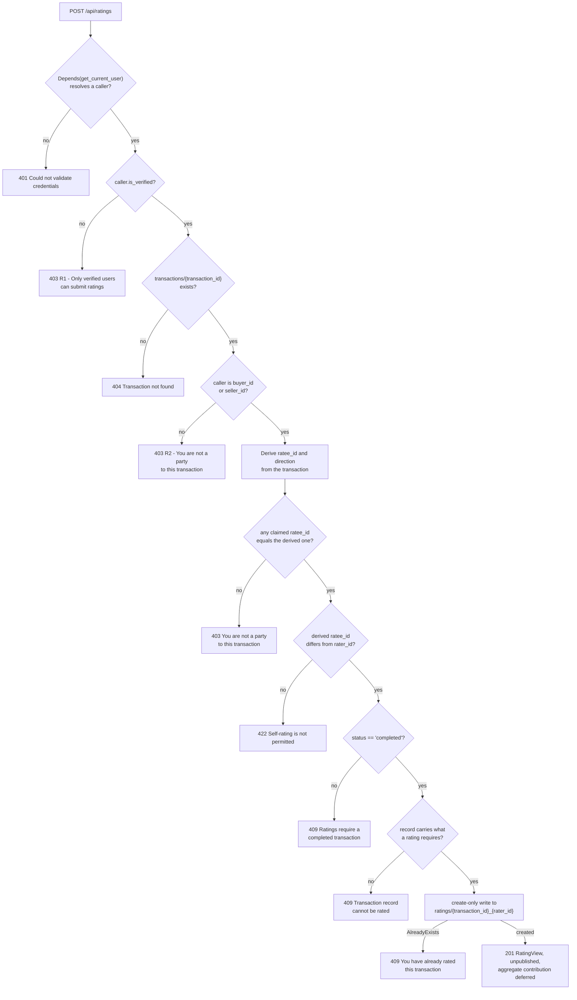
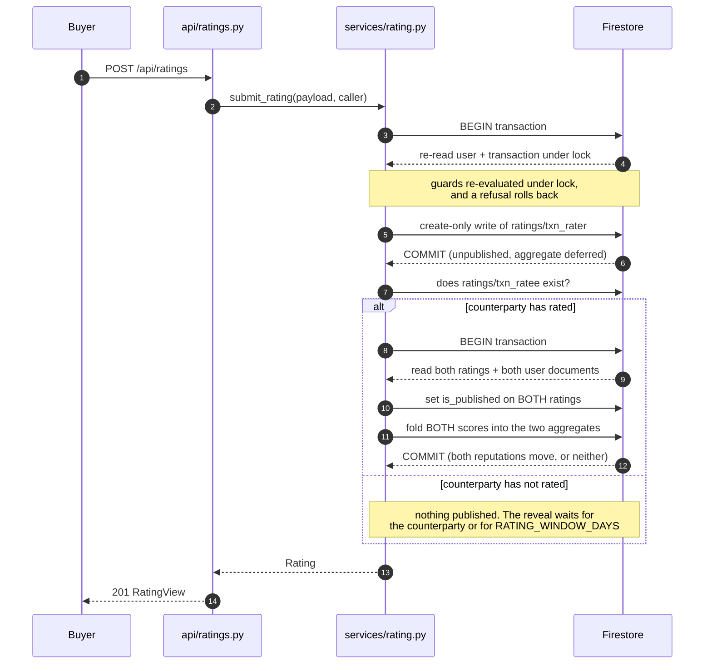

# Ratings — Bidirectional Peer Reputation (F010)

The rating system lets the two counterparties of a completed purchase rate each other: the buyer rates the seller and the seller rates the buyer, on an integer scale of 1 to 5 with an optional written review. Two authorization gates govern every submission. The first is that the rater's account must be verified — an unverified caller is refused before any transaction is read. The second is that the rater and the person being rated must be the buyer and the seller of the same transaction, which must be `completed`, and each of them may rate it exactly once. This document is the authoritative reference for the delivered behaviour; where it disagrees with the source files it names, the source file is right and this document is the defect. It is developer- and integrator-facing detail, distinct from the three stakeholder deliverables under `documentation/`, which this feature does not modify.

The feature is built entirely on the stack the system already uses — a Python and FastAPI backend over Google Cloud Firestore, with a React and TypeScript client (`documentation/Technical Specifications.md` §1.1.4 Technology Stack, L89–L101) — and adds no runtime library.

## 1. Data model

### The `ratings` collection

Ratings live in a Firestore collection named `ratings`, in native mode, with snake_case field names. That matches the convention of the four collections the design already describes — Users, VehicleListings, Transactions and Messages (`documentation/Technical Specifications.md` §5.2 DATABASE DESIGN, L295–L370, with the four collection blocks at L304, L318, L342 and L358). Firestore is schemaless, so the collection needs no DDL, no table definition and no migration: it comes into existence with its first document.

The persisted document shape is declared by the `Rating` model in `backend/app/schema/rating.py`. Field order and spelling here are the contract that the `fieldPath` entries in `infrastructure/firestore.indexes.json` and the camelCase mirror in `frontend/src/schema/rating.ts` are keyed to.

| Field | Type | Semantics |
|---|---|---|
| `id` | `str` | Equal to the document ID |
| `transaction_id` | `str` | The transaction that authorizes this rating |
| `vehicle_listing_id` | `str` | Denormalized from the transaction so a rating renders with context without a second read |
| `rater_id` | `str` | Always the authenticated caller; never accepted from the request body |
| `ratee_id` | `str` | **Server-derived** — the other participant of the transaction |
| `direction` | `str` | `buyer_to_seller` or `seller_to_buyer`; **server-derived** |
| `score` | `int` | Bounded `RATING_MIN`..`RATING_MAX` inclusive |
| `review` | `Optional[str]` | Free text, length-bounded by `RATING_REVIEW_MAX_LENGTH` and normalized to plain text |
| `is_published` | `bool` | Defaults to `false`; gates visibility and aggregate inclusion |
| `moderation_status` | `str` | `pending`, `approved`, or `rejected` |
| `moderation_reason` | `Optional[str]` | Policy-violation reason; never a score-based reason |
| `created_at` | timestamp | Server timestamp |
| `updated_at` | timestamp | Server timestamp |

The identifier fields are validated document IDs rather than bare strings, because these values construct document paths: a forward slash would be read as a nested path and the write would land somewhere other than where every reader looks, a control character forges a log line, and an oversized value produces a key that cannot be typed back. A component is held to 128 characters and a rating's own `id` to 257 — two components plus the joining underscore — so a rating that can be created can always be moderated afterwards.

### Enumerations

These two enumerations in `backend/app/schema/rating.py` are the single source of the allowed values; nothing else in the feature defines a rating direction or a moderation state.

| Enumeration | Members |
|---|---|
| `RatingDirection` | `buyer_to_seller`, `seller_to_buyer` |
| `ModerationStatus` | `pending`, `approved`, `rejected` |

### Request shape

`RatingCreate` is the body accepted by `POST /api/ratings`. It declares three fields and no more.

| Field | Type | Required |
|---|---|---|
| `transaction_id` | `str` | Yes |
| `score` | `int` | Yes |
| `review` | `Optional[str]` | No |

It deliberately **excludes `ratee_id` and `direction`**. Both are derived on the server from the cited transaction, which is what makes counterparty spoofing and self-rating structurally impossible rather than merely validated against. A client that supplies `ratee_id` anyway is claiming who it believes the counterparty is, and that claim is **refused rather than ignored**: the model retains the key so the service can compare it against the derived counterparty and answer `403`, because silently discarding it would answer `201` to a request the server did not honour. That tolerance extends to `ratee_id` alone — every other unrecognised key draws a `422` naming it — and no key in the body can reach the datastore, because the write path names every field it persists explicitly.

### Response shapes

The persisted model is never returned directly. `backend/app/schema/rating.py` projects it into two response models, so the field set a caller receives is decided in one place, plus two further models for the aggregate and the eligibility decision.

| Model | Fields | Used by |
|---|---|---|
| `RatingView` | `id`, `transaction_id`, `vehicle_listing_id`, `rater_id`, `ratee_id`, `direction`, `score`, `review`, `is_published`, `created_at`, `updated_at` | `POST /api/ratings`, and both rating reads |
| `ModeratedRatingView` | `RatingView` plus `moderation_status` and `moderation_reason` | `PATCH /api/ratings/{rating_id}/moderation` |
| `RatingAggregate` | `average` (nullable float, default `null`), `count` (int, default `0`) | The aggregate half of the user read |
| `EligibilityDecision` | `eligible`, `reason`, `ratee_id`, `direction`, `already_rated` | `GET /api/ratings/eligibility/{transaction_id}` |

`moderation_status` and `moderation_reason` are absent from `RatingView` by construction rather than blanked out, so the moderation state reaches administrators through the admin-only endpoint and nobody else. `RatingAggregate.average` is `null` — not `0` — when a user has no published ratings, so "no ratings yet" stays distinguishable from a genuine average of zero.

### Additive fields on `users`

`users` documents gain exactly three fields, declared with these defaults in `backend/app/schema/user.py` alongside the seven that were already there:

```python
is_verified: StrictBool = False
rating_average: Optional[float] = None
rating_count: int = 0
```

`is_verified` is a strict boolean, so the string `"false"` or the integer `0` is rejected rather than coerced — for an authorization flag, a stored value nobody intended as `true` must never read as `true`.

**There is no migration and no backfill, and none is needed.** Because every new field carries a default, a pre-existing `users` document that lacks the keys deserializes cleanly as `is_verified = False`, `rating_average = None` and `rating_count = 0`. Those are the semantically correct values in every case: an existing user is not verified until verification is recorded, and has no reputation until somebody rates them. A backfill script would add operational risk to achieve nothing.

`rating_average` and `rating_count` are a **denormalized** aggregate whose sole writer is `backend/app/services/rating.py`, and it only ever writes them inside a Firestore transaction. Denormalizing them onto the user document is what keeps a profile view inside the budget of 200 ms for 95% of requests (`documentation/Software Requirements Specifications (SRS).md` L451): reading a reputation is one get-by-ID, not a scan of every rating a user has received.

The `transactions` collection is **read-only** for this feature — no field is added to it and nothing in the rating paths writes to it.

### Composite indexes

Two composite indexes are declared in `infrastructure/firestore.indexes.json`:

```json
{
  "indexes": [
    {
      "collectionGroup": "ratings",
      "queryScope": "COLLECTION",
      "fields": [
        { "fieldPath": "ratee_id", "order": "ASCENDING" },
        { "fieldPath": "is_published", "order": "ASCENDING" },
        { "fieldPath": "created_at", "order": "DESCENDING" }
      ]
    },
    {
      "collectionGroup": "ratings",
      "queryScope": "COLLECTION",
      "fields": [
        { "fieldPath": "transaction_id", "order": "ASCENDING" },
        { "fieldPath": "rater_id", "order": "ASCENDING" }
      ]
    }
  ],
  "fieldOverrides": []
}
```

The first powers "published ratings received by a user, newest first", behind `GET /api/ratings/user/{user_id}`; the second powers the reciprocal-existence lookup the publication transition uses.

`scripts/deploy.sh` installs them, deriving the arguments for each declared index from this file and issuing one `gcloud firestore indexes composite create` per index, with an "already exists" result treated as success so a redeploy is not a failure. The declaration file stays the single source of truth: an index added there is installed without editing the script.

No Terraform change accompanies the new collection. `google_firestore_database.database` in `infrastructure/terraform/main.tf` provisions the database itself, and because Firestore is schemaless, collections are not declared in infrastructure at all.

## 2. API endpoints

`backend/app/api/ratings.py` exposes a single `APIRouter`, mounted in `backend/app/main.py` with `prefix='/api/ratings'` and `tags=['Ratings']`. Every path is declared **relative to that prefix**, so the paths resolve exactly as tabulated below.

| Method | Resolved path | Authorization | Success | Failure modes |
|---|---|---|---|---|
| `POST` | `/api/ratings` | Authenticated **and** verified **and** a participant of a completed transaction | `201` `RatingView` | `401`, `403` (unverified rater, or not a participant), `404`, `409` (duplicate, transaction not completed, or an unrateable transaction record), `422` (score out of range, over-length review, degenerate self-rating, unsupported body key) |
| `GET` | `/api/ratings/user/{user_id}` | Public read | `200` `{ items, aggregate }` — **published ratings only** | `404` |
| `GET` | `/api/ratings/transaction/{transaction_id}` | Participant-only | `200` `RatingView[]` | `401`, `403`, `404` |
| `GET` | `/api/ratings/eligibility/{transaction_id}` | Authenticated | `200` `EligibilityDecision` | `401`, `404` |
| `PATCH` | `/api/ratings/{rating_id}/moderation` | `role == 'admin'` | `200` `ModeratedRatingView` | `401`, `403`, `404` |

Every endpoint additionally answers `503` with a `Retry-After` header when the datastore is unreachable, so a transient provider fault is reported as retryable rather than as a client mistake.

All five paths follow the `/api/<resource>` REST convention the design establishes (`documentation/Technical Specifications.md` §5.3 API DESIGN, L372–L406). The admin gate on moderation reads the caller's role from their stored user document, never from a request header, and matches the Guest/Buyer/Seller/Admin role model with `403` on denial described at §7.1.2 (L584–L623) — the role-based access control with least privilege that `documentation/Software Requirements Specifications (SRS).md` L494–L495 requires.

### Error contract

The service raises typed domain exceptions and the router translates each into an `HTTPException`, reusing the exception's own caller-facing message as the response `detail`. That reuse is what keeps the string a client is shown identical to the `reason` the eligibility endpoint reports for the same condition. Every failure body has the same shape, `{"detail": "..."}`, and no `detail` names a field, a document, a hostname or any other internal value — those stay in the log.

| Domain exception | HTTP status | `detail` a caller receives |
|---|---|---|
| `RaterNotVerified` | `403` | Only verified users can submit ratings |
| `TransactionNotFound` | `404` | Transaction not found |
| `NotATransactionParticipant` | `403` | You are not a party to this transaction |
| `SelfRatingNotAllowed` | `422` | Self-rating is not permitted |
| `TransactionNotCompleted` | `409` | Ratings require a completed transaction |
| `DuplicateRating` | `409` | You have already rated this transaction |
| `TransactionInvariantError` | `409` | This transaction is missing information a rating requires |

The mapping is a closed list with no fallback, deliberately: an exception absent from it is not answered by this API at all. An earlier revision caught the base exception class beneath the table and answered `400` for anything unrecognised, which would have published the message of any future failure mode to callers without anyone deciding that it should be. A new failure mode has to be given a status on its merits or surface as the defect it is.

`TransactionInvariantError` is a `409` rather than a `500` because the request is well formed and the caller is authorized; what refuses it is the stored state of the cited transaction, which is exactly why `TransactionNotCompleted` is also a `409`. The specific defect is logged with the transaction named, so the operator signal is kept rather than traded away.

A `422` for an out-of-range or non-integer score, or a review that is over-long once normalized, is raised by Pydantic **before any handler body runs**, because `backend/app/schema/rating.py` binds those bounds to `RATING_MIN`, `RATING_MAX` and `RATING_REVIEW_MAX_LENGTH`. "Once normalized" is the operative phrase: the limit is measured on the text that would actually be stored, so the server and the client's character counter agree about what it means.

### Submitting a rating

```http
POST /api/ratings HTTP/1.1
Authorization: Bearer <access token>
Content-Type: application/json

{"transaction_id": "8fJ2kQ", "score": 5, "review": "Straightforward sale, car as described."}
```

```http
HTTP/1.1 201 Created
Content-Type: application/json

{
  "id": "8fJ2kQ_u7Bd91",
  "transaction_id": "8fJ2kQ",
  "vehicle_listing_id": "vL44mZ",
  "rater_id": "u7Bd91",
  "ratee_id": "s3Xc20",
  "direction": "buyer_to_seller",
  "score": 5,
  "review": "Straightforward sale, car as described.",
  "is_published": false,
  "created_at": "2024-11-04T09:12:44.518000+00:00",
  "updated_at": "2024-11-04T09:12:44.518000+00:00"
}
```

`ratee_id` and `direction` in that response were derived by the server; neither was supplied. `is_published` is `false` because the counterparty has not rated yet — see Section 4.

### Asking whether a rating may be submitted

```http
GET /api/ratings/eligibility/8fJ2kQ HTTP/1.1
Authorization: Bearer <access token>
```

```http
HTTP/1.1 200 OK
Content-Type: application/json

{
  "eligible": false,
  "reason": "You have already rated this transaction",
  "ratee_id": "s3Xc20",
  "direction": "buyer_to_seller",
  "already_rated": true
}
```

This endpoint answers `200`, `401` or `404` and nothing else. Every refusal other than "no such transaction" is reported as a `200` decision carrying a reason, which is the whole point of it: a client can explain why submission is unavailable instead of discovering it from an error. `ratee_id` and `direction` are populated only once the caller is confirmed a participant of a transaction that names both parties, so a rejected caller learns nothing about a transaction they are not part of.

### Reading a reputation

`GET /api/ratings/user/{user_id}` is unauthenticated by design, matching the public-read precedent the existing listing reads already set, and it returns **only published ratings**. A `404` means no such user; a user who exists and has never been rated is a `200` carrying an empty `items` list beside `average: null, count: 0`.

`aggregate.count` may legitimately exceed the number of entries in `items`. The aggregate covers every published rating, whereas the list covers only what a reader may be shown, and a rating withheld by moderation is counted and not listed. This is a property of the contract rather than a discrepancy — Section 5 explains why it must be that way round.

## 3. Eligibility rules

Both authorization gates are expressed as one ordered guard sequence, held in a single function in `backend/app/services/rating.py`. `evaluate_eligibility` reports its outcome and `submit_rating` enforces it, so the reason a user is shown can never disagree with the reason a write is refused.

The order is part of the contract, because the most specific failure has to win — a caller should receive something they can act on rather than a generic rejection.

1. **Authenticated** — the caller resolves through `Depends(get_current_user)`, else `401 Could not validate credentials`.
2. **Verified rater** — `current_user.is_verified` must be literally `True`, else `403` (`RaterNotVerified`). This is authorization requirement **R1**. It runs first, before any document is read, so an unverified caller who also happens not to be a participant learns about verification rather than about participation.
3. **Transaction exists** — `transactions/{transaction_id}` must exist, else `404` (`TransactionNotFound`).
4. **Caller is a participant** — the caller's ID must be the transaction's `buyer_id` or its `seller_id`, else `403` (`NotATransactionParticipant`). This is authorization requirement **R2**.
5. **Counterparty derived server-side** — `ratee_id` is computed as `seller_id` when the caller is the buyer and `buyer_id` when the caller is the seller, with `direction` set to `buyer_to_seller` or `seller_to_buyer` accordingly. A `ratee_id` the client claimed must equal the derived value, else `403` (`NotATransactionParticipant`); the claim is then discarded and never used as the ratee. A degenerate transaction naming the caller as both parties yields `422` (`SelfRatingNotAllowed`).
6. **Transaction is `completed`** — any other status yields `409` (`TransactionNotCompleted`). The three states a transaction can hold are `pending`, `completed` and `cancelled` (`documentation/Technical Specifications.md` §5.2, L342–L356).
7. **Transaction record is complete** — the transaction must carry the data a rating record requires, else `409` (`TransactionInvariantError`). This is last on purpose: "wait until the transaction completes" is something a caller can act on, whereas a malformed stored document is not, so when both apply the actionable failure is reported first.
8. **One rating per rater per transaction** — the write is a create-only write to the deterministic document ID `ratings/{transaction_id}_{rater_id}`; a collision yields `409` (`DuplicateRating`).

Guard 8 is deliberately not part of the sequence above it. Uniqueness is never assessed by reading, because an existence read followed by a write would race; it is enforced at the moment of the write.

The whole of guards 3 to 7 costs **one document read**. `buyer_id` and `seller_id` are sibling required fields on the same `Transaction` model (`backend/app/schema/transaction.py`), so the shared-transaction gate is decidable from a single get-by-ID — no join, no fan-out query and no denormalized participant list. Guard 4 has an exact precedent in the codebase: the transaction read handler already performs the identical "caller is neither buyer nor seller, so `403`" check, and the rating guard is that same shape extended with a terminal-state check and a uniqueness constraint.



### Why self-rating is impossible rather than merely rejected

`ratee_id` and `direction` are derived from the transaction and are not declared fields of `RatingCreate`, so no request body can produce `ratee_id == rater_id` — no request body decides `ratee_id` at all. The only way the two can coincide is a transaction whose stored `buyer_id` and `seller_id` are the same value, which guard 5 catches. A client that claims a counterparty has its claim checked against the derived value and refused on a mismatch, so the claim is answered rather than quietly overridden.

### Why the verification gate cannot be bypassed by a stale token

`get_current_user` in `backend/app/api/auth.py` re-reads the caller's user document from Firestore on every single request, and the access token carries only `sub` and `exp`. No authorization state is embedded in the token, so `is_verified` reaches every handler without any change to the token format, and revoking verification takes effect on the caller's very next request — no token rotation, no revocation list, no waiting for an expiry.

Both gates are additionally re-evaluated **inside** the Firestore transaction that writes, against documents re-read under its lock. Deciding beforehand and trusting that decision would leave a window in which verification is revoked, or the transaction reassigned, between the decision and the commit, and the rating would land on authority the datastore no longer granted. A rating refused inside the transaction rolls back, so nothing is written.

### Why uniqueness is the datastore's job

Firestore provides no unique constraints and no unique indexes, and this project has no server-side schema and no database-enforced constraint of any kind. A read-then-write check would therefore race: two concurrent submissions could both observe "no existing rating" and both write.

Encoding the natural key into the document ID removes that race rather than narrowing it. The key `{transaction_id}_{rater_id}` is built by one function in `backend/app/services/rating.py`, so the router, the publication paths and the tests all derive it identically, and the write goes through `create_document_with_id` in `backend/app/db/firestore.py`, which calls Firestore's create-only `DocumentReference.create()` and lets `AlreadyExists` propagate. The second attempt fails however the two requests interleave. That helper exists because the pre-existing `create_document` lets Firestore allocate the ID and so cannot set a deterministic key at all.

The composite key carries no write-hotspot risk: both components are Firestore scatter-allocated identifiers, so the key space is well distributed. What Google's Firestore best-practice guidance warns against is a monotonically increasing document ID, which this is not.

### Why there is an eligibility endpoint

`GET /api/ratings/eligibility/{transaction_id}` runs the identical guard sequence and returns the decision as structured data — `eligible`, `reason`, `ratee_id`, `direction`, `already_rated` — taking its `reason` from the very exception the write path would have raised. It performs no writes; an eligibility check is a question, not an event.

It exists so a client can disable the submission control and say why, rather than letting somebody compose a rating and discover the refusal afterwards. That is an accessibility obligation rather than a convenience: WCAG 2.1 Level AA compliance is a stated requirement (`documentation/Software Requirements Specifications (SRS).md` L555–L557), and an interface where the user cannot tell why an action is unavailable fails it.

## 4. Publication model (double-blind)

A rating is created with `is_published = false`, and its contribution to the ratee's aggregate is **deferred**. It becomes visible, and starts counting, by either of two paths:

- **Reciprocal submission** — immediately after a successful create, the service looks up `ratings/{transaction_id}_{ratee_id}`. If the counterparty's rating is there, one transaction flips **both** documents to `is_published = true` and applies **both** deferred aggregate updates.
- **Window expiry** — if the counterparty never submits, the rating publishes once `RATING_WINDOW_DAYS` has elapsed since it was created.

The invariant is exact: **`rating_average` and `rating_count` reflect published ratings only, at every instant.** An unpublished rating is not returned by the public read endpoint and contributes nothing to anyone's reputation.

### Why the model exists

A mutual rating system in which each side can see the other's verdict before committing their own invites review extortion — the threat of a bad review held over the counterparty in exchange for a good one. The established mitigation, and the one implemented here, is a double-blind reveal: neither rating is visible and neither counts until both have been submitted, so there is no window in which retaliation is possible. It reduces the incentive rather than removing the eventual need for a dispute process, which Section 7 records as a known limitation. Window expiry stops the model being abused in the other direction, where a counterparty who declines to answer could otherwise suppress a verdict indefinitely.

### Atomicity

The rating document and the aggregate live on different documents, so the publication transition spans documents and has to commit as a unit. It runs inside `run_in_transaction` from `backend/app/db/firestore.py` — the first transactional primitive in this codebase — which rolls back everything the body wrote if the body raises.

Five properties of a Firestore transaction shape the design, and two of them are commonly misremembered:

1. **All reads must precede all writes.** A read issued after the transaction's first write is rejected.
2. **Every read must go through the transaction to be locked.** On the pinned client (`google-cloud-firestore==2.13.1`) a transactional read accepts a query as well as a document reference, so it is *not* restricted to get-by-ID.
3. **A transactional read holds a lock until the transaction commits, fails or times out**, blocking other writers meanwhile. This is a server-client transaction against Firestore in native mode, which applies pessimistic concurrency control by default, so the read set should be as small as the invariant allows and the transaction short.
4. **The body must be safe to run more than once**, because a commit rejected under contention is rerun from the top. It performs no side effect a rollback cannot undo.
5. **Retries are finite**, and the pinned client surfaces their exhaustion as a `ValueError` chained from the final abort rather than as an abort.

Because a locked query is possible, recomputing the average from all of a user's ratings would be *technically* available here. It is rejected on two grounds: reading a popular seller's entire history grows without bound and cannot hold the 200 ms budget for 95% of requests (`documentation/Software Requirements Specifications (SRS).md` L451), and locking a result set rather than one document would widen the conflict footprint and make reruns far more likely.

The aggregate is therefore an **incremental, two-decimal-rounded running mean**, held in one function in `backend/app/services/rating.py` that every publication path routes through so they cannot diverge:

```text
count   = n + len(new_scores)
average = round(((old_average or 0) * n + sum(new_scores)) / count, 2)
```

This is correct including the first-rating case, where `rating_count` moves `0 → 1` and `rating_average` moves from `null` to the submitted score. When the resulting count is zero the pair resets to `null` and `0`, so "no ratings yet" stays distinguishable from a genuine average of zero. Rounding the stored value rather than only the displayed one follows from the incremental form: the running total is reconstructed from the stored average, so successive folds inherit at most a two-decimal rounding error. Because the aggregate is only ever written inside a transaction and every read of it is a direct get-by-ID, a reader never observes a torn aggregate.

Note where the multi-document transaction is and is not. `submit_rating` writes only the rating document, because the aggregate contribution is deferred and there is no cross-document invariant to hold yet. The aggregate transaction belongs at the publication transition, where `publish_if_reciprocal` and `publish_if_window_elapsed` apply it. Both re-read the rating under the transaction's lock and skip it if it is already published, so no score can be counted twice, and both are safe to call repeatedly.



### What drives window expiry

Two things do, and only the second of them is dependable.

`publish_expired_rating_window` is a Celery task in `backend/app/tasks/background_jobs.py` and is the conventional home for the sweep. It is a thin delegation that decides nothing except when to ask, handing the work to `publish_expired_ratings` in `backend/app/services/rating.py`, which walks the candidates with a bounded cursor and delegates each to `publish_if_window_elapsed` so the deadline arithmetic exists in exactly one place. The task is named differently from the service function it calls so the two stay distinguishable in a traceback.

**Correctness does not depend on that task running.** No request path imports the tasks module, there is no `.delay()` or `apply_async` call anywhere in the repository, no broker is provisioned, and the broker URL is a module-level in-memory transport rather than a setting — the honest form, since a setting unset in every environment configures nothing. So the read paths **also publish opportunistically**: a read that encounters an unpublished rating whose window has elapsed publishes it there and then. The feature behaves correctly with or without a running worker, and Section 7 states that as a limitation rather than leaving it implied.

A rating whose `created_at` cannot be read — absent, or still holding the unwritten server-side sentinel — counts as "window still open". Deferring a reveal is the safe direction to fail; making one early is not.

## 5. Moderation policy

**`moderation_status` transitions are driven only by policy violations — abuse, personally identifying information, profanity — and never by the score.** A low score is never itself grounds for withholding anything. `rating_average` counts **every published rating regardless of how low it is**, and `moderation_reason` exists so that a withheld review carries a policy justification on the record.

This is a hard semantic constraint on the field, not a stylistic preference. There is no score threshold, no score-correlated filter and no "hide low ratings" path anywhere in the feature, and none may be added. Any score-correlated display behaviour would need legal review before being implemented, and no mechanism that would enable one exists to be switched on.

### What each state does

Moderation governs the review **text**. It never governs the score, because a number cannot contain abuse, someone's phone number or profanity. The decision is made by `moderation_status` alone.

| State | Effect on a reader other than the rating's author |
|---|---|
| `pending` | The rating is returned **without its review text**. This is what "moderation before display" means: unreviewed content, which may contain personally identifying information, is not published by default. |
| `approved` | The rating is returned in full. A moderator has read the words and cleared them. |
| `rejected` | The rating is **withheld** from the reader's view entirely, because a moderator found a policy violation in it. |

`moderation_reason` is redacted on every public path regardless of state: it is an internal note recording why a moderator acted, written for operators, and the rating's own author sees it through their own view.

The reason field has a strict matrix, enforced in `backend/app/services/rating.py`. A rejection **requires** a reason — the transition that removes somebody's words from view either cites the violation that justifies it or does not happen. `approved` and `pending` **refuse** a reason, and any previously stored reason is cleared by the same write that moves the state, because a justification beside a displayed review contradicts itself and a stale one reads as a live finding.

This is the origin of the `aggregate.count` behaviour Section 2 describes. The two halves of a reputation answer different questions, and they are documented as answering them rather than reconciled by weakening either: `rating_average` and `rating_count` cover every published rating, whatever its score and whatever its moderation state, and are never adjusted after publication, while the visible list covers only what a reader may be shown. Letting a moderation decision move a score would make moderation sentiment-relevant, which is precisely what must never happen.

### Regulatory basis

The sentiment-neutrality requirement is not a house preference — it tracks a rule that carries real penalties. The United States Federal Trade Commission's Trade Regulation Rule on the Use of Consumer Reviews and Testimonials, 16 CFR Part 465, took effect on 21 October 2024.

Two of its provisions bear directly on this feature:

- The rule targets reviews written by people who had no genuine experience of the product or service. A verified account combined with a real, completed, shared transaction is exactly that evidence, which means the two authorization gates in Section 3 align with a regulatory standard rather than merely expressing a product preference.
- The rule prohibits misrepresenting that the reviews on display represent all or most of those submitted when reviews have been suppressed on the basis of their rating or negative sentiment. That is why suppression here is policy-based only, and why a low score never causes a rating to be withheld or discounted.

Primary sources: [FTC announcement of the final rule](https://www.ftc.gov/news-events/news/press-releases/2024/08/federal-trade-commission-announces-final-rule-banning-fake-reviews-testimonials) and the [Federal Register text of 16 CFR Part 465](https://www.federalregister.gov/documents/2024/08/22/2024-18519/trade-regulation-rule-on-the-use-of-consumer-reviews-and-testimonials).

### The moderation surface

`PATCH /api/ratings/{rating_id}/moderation` is the complete moderation API. It is gated on `role == 'admin'`, read from the caller's stored user document, and it satisfies `F010-4` "Moderation system for reviews" (`documentation/Software Requirements Specifications (SRS).md` L440). Its body carries the target `moderation_status` and, for a rejection, the `moderation_reason`. No moderator interface, moderation queue or automated policy classifier ships with it — Section 7 records that.

### Reputation records are append-only

A rating's score is never mutated after submission. Moderation moves `moderation_status` and `moderation_reason` and touches nothing else: a submitted `score` or `review` is never rewritten, so a correction is a moderation-state transition with a recorded reason rather than an edit. That discipline matters because the repository has no audit collection and no history collection — there is nowhere to reconstruct a rating's earlier value from, so the stored record has to *be* the record, which is only true if nothing silently overwrites it.

## 6. Configuration

Four settings govern the feature. They are declared in `backend/app/core/config.py` and mirrored in `backend/.env.example`.

| Setting | Default | Overridable | Effect |
|---|---|---|---|
| `RATING_MIN` | `1` | No — pinned | Inclusive lower bound of `score` |
| `RATING_MAX` | `5` | No — pinned | Inclusive upper bound of `score` |
| `RATING_REVIEW_MAX_LENGTH` | `2000` | No — pinned | Maximum characters accepted in `review`, measured on the normalized text |
| `RATING_WINDOW_DAYS` | `14` | Yes, within `0`..`365` | Days after creation at which an unreciprocated rating publishes |

The first three are declared `const=True`, so an environment that tries to override one fails at import with the conflict named rather than starting up. Each is half of a cross-stack contract: `RATING_MIN` and `RATING_MAX` are mirrored by constants of the same name in `frontend/src/schema/rating.ts`, by the number of options the score control renders and by the "out of 5" text every rating surface reads out, and `RATING_REVIEW_MAX_LENGTH` is mirrored by the client's `REVIEW_MAX_LENGTH` and drives its live character counter. The client is a separately built artefact and cannot discover a server environment variable, so genuine tunability could only produce drift — an operator setting `RATING_MAX=4` would leave the interface offering a fifth star the server answers with `422`. Changing the scale remains possible; it is a code change on both sides committed together, which is what a contract change should be.

`RATING_WINDOW_DAYS` stays freely tunable because only the server reads it, no client surface mirrors it, and how long an unreciprocated rating stays unpublished is exactly the kind of policy an operator should be able to change without a deployment. It keeps a bound because a negative window would make every rating due for publication the instant it was written, silently collapsing the double-blind reveal.

The 1–5 scale and the average aggregate are the project's own targets rather than an invention of this feature: the success criteria set "4.5/5 star average rating from both buyers and sellers" as the user satisfaction metric (`documentation/Software Project Proposal.md:L76`).

**Every one of these settings carries a default, and that is a correctness requirement rather than a convenience.** The eight pre-existing settings are required with no defaults, and the settings object is instantiated at import time in `backend/app/core/config.py`, so a new *required* key would make the application unimportable in every environment not already updated. Changing the rating window therefore requires no code change and breaks no deployment. The same change adds `ALGORITHM` with a default of `HS256`, because both authentication modules read `settings.ALGORITHM` while neither declared it — context rather than part of this feature.

The server-side bounds are authoritative and the client-side Zod mirror is a convenience, not a substitute. `frontend/src/schema/rating.ts` declares `score: z.number().int().min(RATING_MIN).max(RATING_MAX)` against the same values, so the two agree by construction, and the pinning above is what keeps them agreeing. Server-side validation of all user input is a stated requirement, alongside XSS sanitization of free text such as the review body (`documentation/Technical Specifications.md` §7.3.2 Application Security, L671–L686).

## 7. Known limitations

These are the boundaries of what ships. Each is stated so that nobody has to infer it from silence.

**Search-result ranking is not implemented.** `F010-5` "Integration of ratings into search result ranking" (`documentation/Software Requirements Specifications (SRS).md:L441`) is deliberately out of scope. The enabling data is delivered and exposed through the API — `rating_average` and `rating_count` are on the user document and readable via `GET /api/ratings/user/{user_id}` — but the listing query semantics are unchanged, so a seller's reputation does not influence where their listings appear.

**The window-expiry sweep cannot be relied upon.** No request path imports the tasks module, there is no `.delay()` or `apply_async` call anywhere in the repository, no broker is provisioned, and the broker URL is an in-memory transport declared in the module rather than a configurable setting. No scheduled job runs. The rating read paths publish an expired rating opportunistically when they encounter one, which is what makes the feature correct without a worker, but a rating whose window has closed and which nobody reads stays unpublished until someone does read it.

**There is no dispute-resolution process.** The double-blind reveal removes the window in which retaliation is possible, which reduces the incentive for an extortionate review, but it does not adjudicate a rating that one party believes is unfair. Nothing is built for that.

**There is no moderator interface.** The admin-gated `PATCH` endpoint is the complete moderation surface. There is no moderation queue, no reviewer screen and no automated policy classifier, so a moderation decision is made by an administrator calling the API directly.

**"Verified" means account verification only.** There is no identity or KYC verification anywhere in the platform, and identity verification beyond basic account creation is an explicitly excluded feature of the project (`documentation/Software Project Proposal.md:L176`, out-of-scope item 9). This feature *consumes* an account-verification flag; it does not build a verification programme, and it adds no registration or email-confirmation flow.

**There is no platform rate limiting, account lockout or audit logging.** None exists anywhere in the repository. The one-rating-per-rater-per-transaction uniqueness constraint is this feature's own abuse control, and it is a strong one, but a platform limiter would additionally blunt enumeration of the eligibility endpoint. Rate limiting and throttling for state-changing operations is a stated design requirement (`documentation/Technical Specifications.md` §7.3.2, L671–L686) that remains unimplemented.

**There are no Firestore security rules.** Every access to the `ratings` collection is mediated by this API, and every write passes the guard sequence in Section 3, so the feature is safe through the application path. The datastore itself imposes no defence in depth, however: a credential that could reach Firestore directly would not be stopped by anything described in this document. Declaring security rules is a platform-level concern beyond this feature.

*Operator note.* For a brand-new Firestore collection, Google's guidance is to ramp write traffic gradually rather than starting at full volume — the "500/50/5" rule: begin at a maximum of 500 operations per second and increase by 50% every 5 minutes. This imposes no code change and is recorded here for whoever operates the deployment.

## Authoritative sources

Where this document and one of these files disagree, the file is right.

- `backend/app/schema/rating.py` — the rating models and both enumerations
- `backend/app/schema/user.py` — `is_verified`, `rating_average`, `rating_count`
- `backend/app/schema/transaction.py` — the participant and status evidence the guards read
- `backend/app/api/ratings.py` — the five endpoints and the exception-to-status mapping
- `backend/app/services/rating.py` — the guard sequence, the deterministic key, the aggregate arithmetic and the publication transitions
- `backend/app/db/firestore.py` — `create_document_with_id` and `run_in_transaction`
- `backend/app/core/config.py` and `backend/.env.example` — the four settings and their defaults
- `backend/app/tasks/background_jobs.py` — the window sweep task
- `backend/app/main.py` — the `/api/ratings` router registration
- `infrastructure/firestore.indexes.json` — the two composite indexes
- `frontend/src/schema/rating.ts` — the client-side mirror of the bounds
