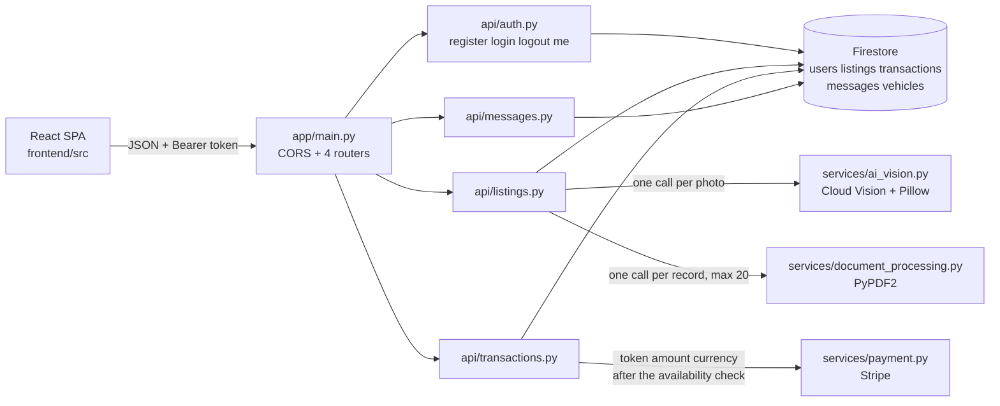

# 1. SETUP

## 1.1 WHAT THIS SYSTEM IS

The Used Car Marketplace is a **Python/FastAPI** service whose application persistence is **Google Cloud Firestore** (native mode, NoSQL documents), using **Google Cloud Vision** to analyse vehicle photographs — with **Pillow** decoding the image bytes on the way in — **PyPDF2** to read maintenance documents, and **Stripe** to settle payments. A **React/TypeScript** single-page application in `frontend/` consumes the API over JSON.

Two points of precision about the data and integration story, because the repository contains material that suggests otherwise:

- **No application code issues a SQL query.** Every read and write in `backend/app/` goes through the single Firestore client in [`app/db/firestore.py`](../backend/app/db/firestore.py); there is no ORM, no connection string and no migration directory. You will nonetheless find SQL named elsewhere: [`Technical Specifications.md`](Technical%20Specifications.md) lists SQL among the project's languages (§4.1, §5.1, §6.1), names SQLAlchemy in its backend framework list (§6.2) and describes Google Cloud SQL as a relational store for transaction history (§6.3), while [`infrastructure/docker/docker-compose.yml`](../infrastructure/docker/docker-compose.yml) declares a `postgres:13` service and hands the backend a `DATABASE_URL`. **That compose service is vestigial** — nothing in the codebase reads `DATABASE_URL`, and that compose file cannot start at all today (**NT-15**). Treat the relational plan as unimplemented intent, not as a second live datastore.
- **Google Cloud Storage is present but unwired.** [`app/db/cloud_storage.py`](../backend/app/db/cloud_storage.py) builds a client at import and offers `upload_file`, `delete_file` and `get_file_url`, but **no module imports it**, so no request path uploads or serves an object. `GOOGLE_CLOUD_STORAGE_BUCKET` is required all the same — `Settings` declares it without a default, so startup fails without it — and the only code that reads it is that unimported module. Photo handling today stores whatever URL strings the caller supplies (**HCF-5**).

This guide takes you from a clean machine to a checkout you can configure, compile, lint, extend and exercise in process — and, once the one blocker in [section 3.8](#38-a-clean-boot-still-stops-in-the-payment-module) is repaired, serve. It then explains the domain, the traps, and how to add to the codebase. It is deliberately the *deep* companion to [`README.md`](../README.md), which carries the same setup path in brief. For requirements, personas and scope, read [`Software Requirements Specifications (SRS).md`](Software%20Requirements%20Specifications%20%28SRS%29.md); for architecture, data models and API design, read [`Technical Specifications.md`](Technical%20Specifications.md); for the business case and scope boundary, read [`Software Project Proposal.md`](Software%20Project%20Proposal.md). This guide does not restate those documents — where they are authoritative it links to them, and where the running code has diverged from them it says so explicitly and names the reason.

> **Read this before you judge the system — and before you trust any number in it.** `uvicorn app.main:app` **does not start on a clean install.** The import chain stops in `app/services/payment.py`, a module that lies outside the change set which made the rest of this backend importable (**HCF-3**, [section 3.8](#38-a-clean-boot-still-stops-in-the-payment-module)). So every claim below is labelled with how it was established, and none of them is a promise that a fresh clone serves traffic:
>
> | Claim | How it was established |
> | --- | --- |
> | The seven recently changed modules compile and are free of undefined and unused names | `py_compile` and the `flake8` F-code gate, both of which parse rather than import ([section 1.9](#19-verify-your-checkout)) |
> | **13 routes across 9 unique paths** | Read statically off disk — four `include_router` prefixes against thirteen `@router` decorators ([section 2.7](#27-the-routes-as-actually-served)) |
> | The four authentication routes, listing creation and transaction creation behave as documented | Exercised **in process**, with the one out-of-scope Stripe import stubbed, using Starlette’s `TestClient` ([section 6](#6-verifying-behaviour-in-process)) |
> | Two of the thirteen registered routes still fail on their own logic | Both message routes — reproduced, and tracked as **HCF-8** ([section 3.10](#310-messaging-is-reachable-but-not-functional)) |
>
> **The first-party import chain is closed, and the closure stops at that chain.** Every name `app.main` and the four routers it mounts need now exists, is spelled the way its module exports it, and is imported where it is used. One first-party module outside that chain is still un-importable: `backend/app/tasks/background_jobs.py` uses `List` without importing it, reads a `CELERY_BROKER_URL` setting that `Settings` does not declare, and imports a `process_refund` that `app/services/payment.py` does not define. No worker can run until that is fixed (task **NT-6**), and nothing in this guide should be read as saying otherwise.
>
> **Read 13 as routes *registered*, never as endpoints *working*** — two of them do not work, and on a clean install none of them answers at all.
>
> Every one of those claims is reproducible, two ways and neither of them a running server: [section 1.10](#110-the-full-acceptance-protocol) is the protocol that establishes them, written out as ten categories and thirty-seven numbered assertions, and [section 6](#6-verifying-behaviour-in-process) is a self-contained script that asserts eighty-five of the same properties in about four seconds. Both say plainly what they cannot prove.
>
> Every gap named here is recorded with its reasons in [section 5](#5-suggested-next-tasks). None of them is something you have misconfigured, and [section 3](#3-common-pitfalls) tells you what each failure looks like so you can recognise it in a second rather than debug it for an hour.

## 1.2 PREREQUISITES

| Requirement | Version | Why |
| --- | --- | --- |
| Python | **3.9 – 3.12** | 3.9 is the floor pinned by continuous integration in [`.github/workflows/backend_ci.yml`](../.github/workflows/backend_ci.yml) (line 19); 3.12 is the validated ceiling. |
| Git | any recent | Repository access. |
| A Google Cloud project | — | Firestore (native mode), Cloud Storage and Cloud Vision enabled, with Application Default Credentials available locally. Needed for **runtime**, not for compiling or linting. |
| A Stripe test API key | — | Read at import by the payment service. |
| Node.js + npm | 18 or later | Only if you also want to run the SPA. |
| Docker, Terraform | — | Optional, and only for the deployment material under `infrastructure/`. |

**All backend code must stay source-compatible with Python 3.9.** Continuous integration runs on 3.9, so a genuinely 3.10+ construct — `match`, or an `X | Y` union in an annotation that is evaluated at runtime — will pass locally and fail there.

Separately from that floor, **use `typing.List`, `typing.Optional` and `typing.Dict`** rather than the builtin generics `list[...]` and `dict[...]`. This one is house style, not a compatibility requirement: PEP 585 made the builtin generics work in 3.9, so `dict[str, str]` would run — but every existing module uses the `typing` spelling, and a file that mixes the two is harder to read than either.

**Do not exceed 3.12.** Nothing above 3.12 has been validated against this pinned dependency set, and the risk is concentrated in `passlib 1.7.4`, which is unmaintained and predates 3.13. It is not a specific known failure: `passlib` guards its optional `from crypt import crypt` in a `try/except ImportError`, so the standard library's removal of `crypt` in 3.13 does not by itself break the bcrypt backend this project uses. Treat 3.13 and above as untested rather than as broken, and if you must go there, verify hashing and verification first.

Check what you have before you go any further:

```bash
python3 --version
```

If that reports anything outside 3.9–3.12, **do not proceed with it.** Install an in-range interpreter and call it explicitly, substituting `python3.12` wherever `python3` appears below. Skipping this wastes real time: on a 3.13 host, `python3 -m venv` can fail outright, and when it does not, the failure surfaces much later as a confusing dependency error.

## 1.3 CREATE AN ISOLATED ENVIRONMENT

Unless a command says otherwise, run everything below from the **repository root**, in the order given. Nothing here assumes prior state.

```bash
python3 -m venv .venv
source .venv/bin/activate
```

**The repository has no `.gitignore`, so nothing keeps anything out of your commits automatically.** That is a build-artefact nuisance and a credential hazard, and the second one matters more. Before you create anything:

- Keep the environment directory out of every `git add` you run, or create it outside the working tree entirely.
- **Never commit a file containing secrets** — no `.env`, no service-account JSON, no exported key. `SECRET_KEY` signs every access token, and `STRIPE_API_KEY` moves money; either one in history is a rotation exercise, not a `git rm`. Note that this guide deliberately steers you to *exported* variables rather than a `.env` file ([section 1.5](#15-configure-the-environment)), which keeps the values out of the working tree in the first place.
- If you want local ignores without adding a tracked `.gitignore` — which is a repository-wide decision, not yours to make in passing — put your patterns in `.git/info/exclude`. It is per-clone, never committed, and does the same job.
- Keep your Google credentials file and any key material **outside the repository directory** and point `GOOGLE_APPLICATION_CREDENTIALS` at it there. For anything beyond local development, use a secret manager (Google Secret Manager, or your platform's equivalent) and inject the values as environment variables at deploy time rather than storing them in a file at all.
- Before your first push, run `git status` and read it. In a repository with no ignore rules, that one habit is the whole safety net.

## 1.4 INSTALL DEPENDENCIES

There is deliberately **no `requirements.txt`** in this repository, so the dependency set is installed explicitly. Do not create the manifest as a convenience — one was removed on purpose, and recreating it needs a decision rather than an initiative (task **NT-1** in [section 5](#5-suggested-next-tasks)).

```bash
pip install \
  "fastapi==0.95.2" "pydantic==1.10.26" "uvicorn==0.23.2" \
  "python-jose==3.3.0" "passlib==1.7.4" "bcrypt==4.0.1" \
  "PyPDF2==3.0.1" python-multipart \
  google-cloud-firestore google-cloud-storage google-cloud-vision Pillow stripe
pip check
```

`pip check` must print `No broken requirements found.` The seven pinned versions are the verified, mutually compatible set; **treat every one of them as fixed.** Two of the pins are load-bearing in ways that are not obvious, and both are explained in [section 3](#3-common-pitfalls): `pydantic` must stay on v1, and `passlib` must be paired with `bcrypt` below 4.1.

Note what this set does **not** contain: `python-dotenv`. Pydantic reads a `.env` file only through that optional extra, so configuration comes from exported environment variables — [section 1.5](#15-configure-the-environment) explains what happens if you create a `.env` anyway.

The cloud and media packages are intentionally unpinned — they are the moving parts of this system and the pin set has not been fixed for them.

For linting and compiling you also want:

```bash
pip install flake8
```

## 1.5 CONFIGURE THE ENVIRONMENT

The settings object declares **eleven** fields. **Eight have no default**: if any one of them is unset, importing `app.core.config` raises a Pydantic `ValidationError` and nothing starts.

```bash
export PROJECT_NAME="used-car-marketplace"
export API_V1_STR="/api"
export SECRET_KEY="$(openssl rand -hex 32)"
export ACCESS_TOKEN_EXPIRE_MINUTES="60"
export GOOGLE_CLOUD_PROJECT="your-gcp-project"
export GOOGLE_CLOUD_STORAGE_BUCKET="your-bucket"
export STRIPE_API_KEY="sk_test_xxx"
export STRIPE_WEBHOOK_SECRET="whsec_xxx"

# Optional, and shown because it is the one setting whose absence is invisible:
# this is exactly the value the field already defaults to, so exporting it changes
# nothing today but puts the origin your browser will use in front of you. Accepts
# a comma-separated list or a JSON array -- see section 3.4.
export ALLOWED_ORIGINS="http://localhost:3000"
```

`sk_test_xxx` and `whsec_xxx` are placeholders — substitute your own test credentials. If `openssl` is unavailable, generate the key with `python3 -c "import secrets; print(secrets.token_hex(32))"` instead.

**Three of these values are secrets, and this repository has no `.gitignore` to protect you.** `SECRET_KEY` signs and verifies every access token — anyone holding it can mint a valid token for any user id — and `STRIPE_API_KEY` and `STRIPE_WEBHOOK_SECRET` are live payment credentials on a real Stripe account, test mode or not. Use a distinct `SECRET_KEY` per environment and never reuse a production one locally; keep all three out of the working tree, out of shell history where you can (a leading space, or a sourced file kept outside the repository), and out of any file you might `git add`. Beyond local development, load them from a secret manager at deploy time rather than from a file. See [section 1.3](#13-create-an-isolated-environment) for the local-ignore mechanism that needs no committed file.

**Export the variables. Do not reach for a `.env` file.** `Settings` does declare `env_file = ".env"` (UTF-8), but the installed dependency set cannot honour it: Pydantic 1.10.26 reads an env file through `python-dotenv`, that package is not installed, and adding a dependency is outside the current change scope. The consequence is worse than the feature simply being absent — if a `.env` file exists in your working directory, importing `app.core.config` **fails** instead of falling back to the environment:

```text
ImportError: python-dotenv is not installed, run `pip install pydantic[dotenv]`
```

and, because `settings = Settings()` runs at module scope, that happens while `app.core.config` is still being imported — so nothing starts. So the export block above is the supported configuration path. If you want `.env` support, get `python-dotenv` authorised and installed first (keeping `pydantic==1.10.26`), and only then create the file; the alternative is to drop the `env_file` declaration altogether so the exports are the only path.

No `.env.example` exists in this repository and this change did not add one; whether to add it, and whether to authorise the dependency that would make it work, is an open task (**NT-2**).

### 1.5.1 Every Setting, And What Actually Reads It

Two of the required variables are not yet consumed by any code. They are still mandatory — the settings object refuses to construct without them — so set them anyway and do not spend time looking for their effect.

| Variable | Required | Default | Purpose |
| --- | --- | --- | --- |
| `PROJECT_NAME` | Yes | — | **No consumer yet.** `app/main.py` constructs `FastAPI()` with no title, so this value is required but unused (task **NT-8**). |
| `API_V1_STR` | Yes | — | Builds the OAuth2 `tokenUrl` published in the OpenAPI schema. **Keep it as `/api`**: the router prefixes in `app/main.py` are literals, so a different value desynchronises the advertised token URL from the real one. |
| `SECRET_KEY` | Yes | — | HS256 signing and verification key for every access token. Use a long random value; never reuse one across environments. |
| `ALGORITHM` | No | `HS256` | JWT algorithm, used for both signing and verification. Change it only if you change both. |
| `ACCESS_TOKEN_EXPIRE_MINUTES` | Yes | — | Access-token lifetime in minutes. Honoured on every issued token. |
| `GOOGLE_CLOUD_PROJECT` | Yes | — | Project for the Firestore client and the Cloud Storage client, both built at import. |
| `GOOGLE_CLOUD_STORAGE_BUCKET` | Yes | — | Bucket handle acquired at import by `app/db/cloud_storage.py`. |
| `STRIPE_API_KEY` | Yes | — | Passed to the Stripe client at import by `app/services/payment.py`. |
| `STRIPE_WEBHOOK_SECRET` | Yes | — | **No consumer yet.** No webhook route exists; the variable is required regardless (task **NT-9**). |
| `SENTRY_DSN` | No | unset | Optional error-reporting endpoint. No consumer yet. |
| `ALLOWED_ORIGINS` | No | `["http://localhost:3000"]` | Origins accepted by the CORS middleware. Accepts a comma-separated list **or** a JSON array — see [section 3.4](#34-allowed_origins-takes-two-forms-and-neither-may-crash). |

`CELERY_BROKER_URL` is **not** in this table on purpose. The background-task module reads it, but the settings object does not declare it, so that module cannot import at all (task **NT-6**).

## 1.6 SET `PYTHONPATH` — MANDATORY

```bash
export PYTHONPATH="$PWD/backend"
```

This is not a convenience. **The source root is `backend/`, while every import in the codebase is written as top-level `app.…`** — `app.api.auth`, never `backend.app.api.auth`. Python resolves `app` only when the directory that *contains* it is on `sys.path`, and running from the repository root puts the repository root there, not `backend/`. Omit this and every command in this guide fails identically:

```text
ModuleNotFoundError: No module named 'app'
```

Because the path is set to `backend/`, imports are always written `app.api.auth`, never `backend.app.api.auth`. A secondary detail, worth knowing once: `backend/` contains no `__init__.py` files, so `app` and its subdirectories resolve as implicit namespace packages. That works, but it is also why a mistyped path yields a silently empty package rather than an import error.

## 1.7 RUN THE API

> **Read this before you run it: on a clean install this command fails, and that is expected.** Startup aborts with `ImportError: cannot import name 'Stripe' from 'stripe'`, raised at line 1 of `backend/app/services/payment.py` — a module outside the change set that made the rest of this backend importable, sitting on the transactions router's import path. You have not misconfigured anything. It is known issue **HCF-3**, the single highest-value task in [section 5](#5-suggested-next-tasks), and [section 3.8](#38-a-clean-boot-still-stops-in-the-payment-module) explains it in full. **Until it is repaired, this repository has no served HTTP surface** — verify your work with the gates in [section 1.9](#19-verify-your-checkout) and by driving handlers in process ([section 3.7](#37-pytest-is-not-a-gate)), neither of which needs a server.

Once HCF-3 is repaired, this is the command:

```bash
uvicorn app.main:app --reload --port 8000
```

and these become available:

- Swagger UI — <http://localhost:8000/docs>
- OpenAPI schema — <http://localhost:8000/openapi.json>

> **This will stop with an import error on a clean install — it is not you.** Against a current Stripe SDK, startup aborts with `ImportError: cannot import name 'Stripe' from 'stripe'`, raised at line 1 of `backend/app/services/payment.py`. That module is outside the change set that made the rest of this backend importable, and it sits on the transactions router's import path, so **no amount of configuration will get a served port out of a clean checkout.** It is known issue **HCF-3**, the single highest-value task in [section 5](#5-suggested-next-tasks), and [section 3.8](#38-a-clean-boot-still-stops-in-the-payment-module) explains it and shows how the backend is exercised in the meantime.

Everything in [section 1.9](#19-verify-your-checkout) works regardless, because none of it needs the server running.

## 1.8 RUN THE SPA (OPTIONAL)

The SPA is not required to work on the backend. If you want it:

```bash
cd frontend
npm install
npm start -- --port 3000
```

`npm start` runs **Vite**. Two things to know before you run it:

- **There is no `npm run dev` script.** Earlier documentation instructed one; it has never existed here. The scripts are `start`, `build`, `test`, `lint` and `preview`, and `test` and `lint` both fail immediately because neither `vitest` nor `eslint` is declared as a dependency.
- **Pass the port explicitly.** The repository ships no `vite.config.ts`, so Vite falls back to its own default of `5173` — while `ALLOWED_ORIGINS` defaults to `http://localhost:3000`. Serving on 3000, as above, is what makes the browser's cross-origin requests pass the CORS check.

The dev server starts, but **the application does not render**. Vite resolves its entry `index.html` from the project root and this repository keeps it at `frontend/public/index.html`, and four modules import from an `app/…` prefix that `frontend/tsconfig.json` does not map. Frontend repair is out of scope for the backend work this guide covers and is recorded as task **NT-15**.

## 1.9 VERIFY YOUR CHECKOUT

Four static gates, then one behavioural gate. None of the static gates needs cloud credentials or a running server; the behavioural gate needs neither either, because it runs the application in-process against doubles — it is [section 6](#6-verifying-behaviour-in-process), and it is where every claim in this guide about what the endpoints *do* comes from.

### 1.9.1 Gate 1 — compile every module you changed

The list below is the seven most recently changed — substitute your own files. Silence and exit code 0 is a pass.

```bash
python -m py_compile \
  backend/app/main.py backend/app/core/config.py backend/app/api/auth.py \
  backend/app/api/listings.py backend/app/api/transactions.py \
  backend/app/api/messages.py backend/app/schema/message.py
```

### 1.9.2 Gate 2 — undefined and unused names, across the whole package

This F-code selection is the project's authoritative static gate; it is what catches the class of defect — a name used but never imported — that previously stopped this backend from importing at all. The gate is the **package**, not a file list:

```bash
python -m flake8 --select=F401,F811,F821,F841 backend/app/
```

**The expected result is one finding.** That is the acceptance criterion the remediation plan for this backend set for this exact command: six findings before the work, one after — a single unused `typing.Optional` import in a file it deliberately did not touch.

**Measured against the delivered tree the command reports ten, so this gate does not pass.** The discrepancy is in the *before* figure, not in the work: run the same selection over the baseline commit and it reports **fifteen**, not six —

```bash
mkdir -p /tmp/baseline
git archive d758168f8b898822b87bc700ddb44a4585abade3 backend/app | tar -x -C /tmp/baseline
(cd /tmp/baseline && python -m flake8 --select=F401,F811,F821,F841 backend/app/ | wc -l)
```

Five of those fifteen were the undefined names that stopped the backend importing — `User` twice in `api/transactions.py`, `User` twice and `firestore` once in `api/messages.py` — and all five are gone. The remaining ten were never counted. Every one of them:

| # | Finding | File:line | Tracked as |
| --- | --- | --- | --- |
| 1 | `F401` unused `typing.Optional` | `backend/app/schema/listing.py:2` | **NT-10** |
| 2 | `F401` unused `typing.Optional` | `backend/app/schema/transaction.py:2` | **NT-10** |
| 3 | `F401` unused `typing.List` | `backend/app/services/ai_vision.py:4` | **NT-10**, in a file frozen by **HCF-4** |
| 4 | `F401` unused `app.core.config.settings` | `backend/app/services/ai_vision.py:5` | **NT-10**, in a file frozen by **HCF-4** |
| 5 | `F841` local `image` assigned and never used | `backend/app/services/ai_vision.py:14` | **HCF-4** — the value the provider call should have used |
| 6 | `F841` local `e` assigned and never used | `backend/app/services/payment.py:46` | **NT-10**, in a file frozen by **HCF-3** |
| 7 | `F841` local `e` assigned and never used | `backend/app/services/payment.py:88` | **NT-10**, in a file frozen by **HCF-3** |
| 8 | `F401` unused `celery.schedules.crontab` | `backend/app/tasks/background_jobs.py:2` | **NT-6** |
| 9 | `F821` undefined name `List` | `backend/app/tasks/background_jobs.py:12` | **NT-6** |
| 10 | `F821` undefined name `List` | `backend/app/tasks/background_jobs.py:34` | **NT-6** |

Every one of the ten sits in a file that the change set which repaired the boot chain was not authorised to modify, so **the gate is reported as blocked rather than rewritten to fit**: the command above stays exactly as it is, the milestone it belongs to is short of its own criterion by nine findings, and it keeps failing until **NT-6** and **NT-10** in [section 5.2](#52-work-worth-picking-up) are authorised and done. Two of the ten are not cosmetic — the `F821` pair at entries 9 and 10 is why `backend/app/tasks/background_jobs.py` cannot be imported at all, so clearing them is a functional repair, not tidying.

Until then, treat those ten as the baseline a clean checkout reports. **An eleventh finding is yours, and so is any `F821` in a file you touched.**

While you are working, the same selection over only your own files is the faster pre-commit check. It is a convenience, **not** this gate, and a clean result from it says nothing about whether the gate above passed:

```bash
python -m flake8 --select=F401,F811,F821,F841 <the files you changed>
```

### 1.9.3 Gate 3 — change containment

Check that you changed only what you meant to change. Run the diff against the commit your work started from; for the change set that repaired this backend, that commit is `d758168f8b898822b87bc700ddb44a4585abade3`:

```bash
git diff d758168f8b898822b87bc700ddb44a4585abade3 --name-status
```

For that change set the output is exactly these nine paths, and nothing else:

```text
M	README.md
M	backend/app/api/auth.py
M	backend/app/api/listings.py
M	backend/app/api/messages.py
M	backend/app/api/transactions.py
M	backend/app/core/config.py
M	backend/app/main.py
A	backend/app/schema/message.py
A	documentation/ONBOARDING.md
```

**Any additional path fails the gate.** The repository has no `.gitignore` ([section 1.3](#13-create-an-isolated-environment)), so a stray `.venv`, a `__pycache__` directory, a scratch script or an editor file will appear here — which is the point of running it. When you run the same command against your own branch point, read every line: a path you did not intend to change is either a mistake or a decision you have not written down yet.

### 1.9.4 Gate 4 — style, which is not clean and is not a gate you can pass

There is no Flake8 configuration file anywhere, so a bare `python -m flake8 backend/app/` applies the defaults — including an unusually narrow 79-character line limit — and reports dozens of pre-existing `E501` and `E302` findings in code nobody is being asked to reformat. Do not reformat them, and do not add to them either: keep the lines you write within 79 characters, and put two blank lines before a new top-level `def` or `class`. Comparing the output for a file before and after your change is the quickest way to see that you added nothing.

### 1.9.5 Gate 5 — behaviour

`pytest` cannot serve as this gate: it collects nothing here ([section 3.7](#37-pytest-is-not-a-gate)), and a served port is not available either ([section 3.8](#38-a-clean-boot-still-stops-in-the-payment-module)). What is available is the in-process harness in [section 6](#6-verifying-behaviour-in-process): one script, no credentials, no network, 85 assertions covering the routes, the authentication flow, both write paths, CORS, the settings parser and the logging subsystem. Run it before you claim any behaviour works.

## 1.10 THE FULL ACCEPTANCE PROTOCOL

[Section 1.9](#19-verify-your-checkout) is what you run before every commit. This section is what you run before you call a change **done**. It is **ten categories and thirty-seven numbered assertions**, and it is written out in full so that nobody has to re-derive it from prose — the whole point is that two people checking the same change check the same things.

Every assertion here is reproducible on a laptop with no cloud credentials and **no running server**. Nothing in it is aspirational: each one was executed against this checkout and each one passed.

Two sections cover verification, and they are not the same thing. This one is the **checklist** — what has to be true, written out so a reviewer and an author check the same things. [Section 6](#6-verifying-behaviour-in-process) is the **executable** form: one self-contained script that installs the same two stubs, drives the same flows against an in-memory datastore and asserts eighty-five properties in about four seconds. Run section 6 to get an answer; use this section to know what the answer has to cover, including the categories the script deliberately leaves to you.

| # | Category | Assertions | Needs |
| --- | --- | ---: | --- |
| 1 | Compilation | A1 | nothing |
| 2 | F-code lint | A2–A3 | nothing |
| 3 | Import probes | A4–A6 | the stubs in [1.10.1](#1101-the-two-sanctioned-stubs) for A6 |
| 4 | Route and OpenAPI inventory | A7–A9 | stubs |
| 5 | Authentication | A10–A19 | stubs + a datastore |
| 6 | Listing write path | A20–A24 | stubs + a datastore |
| 7 | Transaction write path | A25–A30 | stubs + a datastore |
| 8 | CORS and settings | A31–A34 | stubs for A31–A32 |
| 9 | Log assertions | A35–A36 | stubs + a datastore |
| 10 | Change-set containment | A37 | git |

**Two things are deliberately *not* gates here.** `pytest` collects nothing ([section 3.7](#37-pytest-is-not-a-gate)), and an unstubbed `uvicorn app.main:app` cannot start ([section 3.8](#38-a-clean-boot-still-stops-in-the-payment-module)). Neither can be used, and neither is a substitute for what follows.

### 1.10.1 The two sanctioned stubs

Categories 3 through 9 import `app.main`, which means they need the two out-of-scope third-party constructors replaced. **Stub them in the process, never in the repository** — editing `app/services/payment.py` or `app/services/ai_vision.py` is a different change with its own authorization. Put this at the top of your scratch harness, before any `app.*` import:

```python
import sys, types

_stripe = types.ModuleType('stripe')                 # HCF-3: the installed SDK
class _StripeStub:                                   # exposes StripeClient, not Stripe
    def __init__(self, api_key=None): self.api_key = api_key
_stripe.Stripe = _StripeStub
_err = types.ModuleType('stripe.error')
class _StripeError(Exception): pass
_err.StripeError = _StripeError
_stripe.error = _err
sys.modules['stripe'] = _stripe
sys.modules['stripe.error'] = _err

_vision = types.ModuleType('google.cloud.vision')    # HCF-4: no .image() method
class _ImageAnnotatorClientStub:
    def image(self, content=None): raise RuntimeError('stubbed')
_vision.ImageAnnotatorClient = _ImageAnnotatorClientStub
sys.modules['google.cloud.vision'] = _vision
```

**For the datastore, use the Firestore emulator, not a hand-written double.** `gcloud emulators firestore start --host-port=localhost:8080`, then `export FIRESTORE_EMULATOR_HOST=localhost:8080`. Give each run its own `GOOGLE_CLOUD_PROJECT` value — `app/db/firestore.py` builds its client with `project=settings.GOOGLE_CLOUD_PROJECT`, so a fresh project id is a fresh, empty dataset and runs cannot contaminate each other. A hand-written double would also pass; the emulator is preferred because the query shapes this code uses (`where(...).limit(1).get()`, `SERVER_TIMESTAMP`) are then exercised for real.

Drive the app with Starlette's `TestClient` (`from fastapi.testclient import TestClient`). Keep `httpx` below 0.28 — 0.28 removed the `Client(app=…)` shortcut `starlette 0.27` relies on. Use it as a **context manager**, or the startup event never fires and A35 cannot pass.

### 1.10.2 Categories 1–4 — the static and structural gates

| # | Assertion | How |
| --- | --- | --- |
| **A1** | All seven changed modules compile | `python -m py_compile` over them exits 0 ([section 1.9](#19-verify-your-checkout)) |
| **A2** | Those modules report **zero** `F401`/`F811`/`F821`/`F841` | the changed-file `flake8` command in [section 1.9](#19-verify-your-checkout) prints nothing |
| **A3** | The tree-wide F-code baseline is still **ten** findings, none in a file you changed | the package-wide `flake8` command in [section 1.9](#19-verify-your-checkout); compare against the table there |
| **A4** | `Message.__fields__` is exactly `['content', 'id', 'read', 'recipient_id', 'sender_id', 'timestamp', 'vehicle_listing_id']` | `python -c "from app.schema.message import Message; print(sorted(Message.__fields__))"` — no stubs needed |
| **A5** | `app.api.messages` and `app.api.transactions` each import with no `ModuleNotFoundError` and no `NameError` | `python -c "import app.api.messages, app.api.transactions"` with the stubs in place |
| **A6** | `import app.main` succeeds | prints your own marker; this is the assertion that the boot chain is whole |
| **A7** | **13 routes across 9 unique `/api` paths**, and the four auth paths are exactly `/api/auth/register`, `/login`, `/logout`, `/me` | the route-table snippet in [section 2.7](#27-the-routes-as-actually-served) |
| **A8** | The nine pre-existing routes are unchanged, **doubled segments included** — `/api/listings/listings` (GET, POST), `/api/listings/listings/{listing_id}` (GET, PUT, DELETE), `/api/transactions/transactions` (POST), `/api/transactions/transactions/{transaction_id}` (GET), `/api/messages/messages` (GET, POST) | same snippet; aggregate the methods per path before comparing, since each method is its own route object |
| **A9** | The OpenAPI security scheme publishes `tokenUrl: /api/auth/login`, and `GET /openapi.json` returns 200 | `app.openapi()['components']['securitySchemes']['OAuth2PasswordBearer']['flows']['password']['tokenUrl']`, then a `TestClient` GET |

A8 is the one people skip, and it is the one that catches an accidental "tidy" of the doubled paths ([section 3.9](#39-the-doubled-path-segments-are-deliberate)). Assert it every time.

### 1.10.3 Categories 5–7 — the behavioural gates

**Category 5 — authentication (A10–A19).** Ten cases, and the last one is the only way to catch a silently wrong token lifetime.

| # | Request | Expect |
| --- | --- | --- |
| **A10** | `POST /api/auth/register`, fresh email | **201**; body keys exactly `access_token`, `token_type`, `token`, `user`; the string `hashed_password` appears **nowhere** in the serialized payload |
| **A11** | the same body again | **409** `Email is already registered`, and the `users` query for that email still returns **one** document |
| **A12** | `POST /api/auth/login`, correct credentials | **200**; `access_token == token`; `user` is an object |
| **A13** | login, wrong password | **401** with header `WWW-Authenticate: Bearer` |
| **A14** | login, unknown email | **401** with a detail **byte-identical** to A13 — this is the no-enumeration property |
| **A15** | `GET /api/auth/me` with the token | **200**; `user` holds exactly `id, email, first_name, last_name, role, created_at, updated_at` |
| **A16** | `/me` with no `Authorization` header | **401** + `WWW-Authenticate: Bearer` (detail `Not authenticated` — see [section 2.5](#25-authentication-and-tokens)) |
| **A17** | `/me` with `Bearer not-a-real-token` | **401** + `WWW-Authenticate: Bearer` (detail `Could not validate credentials`) |
| **A18** | `POST /api/auth/logout` with the token | **200**, body exactly `{"detail": "Logged out"}` |
| **A19** | decode the issued token with `SECRET_KEY` | claims are exactly `['exp', 'sub']`, `sub` is the user's document id, and the measured lifetime matches `ACCESS_TOKEN_EXPIRE_MINUTES` — **not** the 15-minute fallback |

**Category 6 — listing write path (A20–A24).** Patch the module-level name, not the service module: `app.api.listings.analyze_vehicle_photo = my_fake`. That is the call site under test.

| # | Request | Expect |
| --- | --- | --- |
| **A20** | `POST` a listing (as a `seller`) with two photo URLs | **200**; the helper is called **exactly twice**, and **each argument is `bytes`** |
| **A21** | the same with `photos: []` | **200**; the helper is **not** called; the stored `photo_analysis` is `[]` |
| **A22** | the same where the helper raises on **every** photo | **200** — a degraded analysis, never a 500; stored `photo_analysis` is `[]` |
| **A23** | the same where it raises on one of two | **200**, and the one successful result is retained |
| **A24** | `POST` a listing as a `buyer` | **403** `Only sellers can create listings`, and **no** helper call |

A20 through A23 also prove there is no `await` in front of the call: awaiting a `dict` would turn every one of them into a 500.

**Category 7 — transaction write path (A25–A30).** Patch `app.api.transactions.process_payment`. Create the vehicle document yourself — nothing in this codebase creates one (**HCF-7**).

| # | Request | Expect |
| --- | --- | --- |
| **A25** | `POST` a transaction as the buyer, vehicle `status: 'available'` | **200**; the helper receives **exactly three** arguments — the transaction's `stripe_payment_intent_id`, its `amount`, and `'usd'` — and the vehicle document becomes `{'status': 'sold'}` |
| **A26** | the same | the vehicle was looked up by **`vehicle_listing_id`**; no `AttributeError` for a field the schema does not declare |
| **A27** | the helper returns `success: False` | **400**; **no** transaction document written; the vehicle **not** marked sold |
| **A28** | the helper returns a dict with **no** `success` key | **400** — `.get('success')` fails safe where `['success']` would raise `KeyError` |
| **A29** | `POST` a transaction whose `buyer_id` is not the caller | **403**, and **no** payment attempted |
| **A30** | `POST` against a `sold` vehicle, and against a vehicle id that does not exist | **400** both times, and **no** payment attempted |

### 1.10.4 Categories 8–9 — configuration, CORS and logs

| # | Assertion | How |
| --- | --- | --- |
| **A31** | A preflight from an allowed origin returns **200** with `access-control-allow-origin` echoing that origin and `access-control-allow-credentials: true` | `client.options('/api/auth/login', headers={'Origin': 'http://localhost:3000', 'Access-Control-Request-Method': 'POST', 'Access-Control-Request-Headers': 'content-type'})` |
| **A32** | A preflight from an origin outside the list returns **400** with **no** allow-origin header | the same with `Origin: http://evil.test` |
| **A33** | `ALLOWED_ORIGINS` resolves correctly for all five input forms and **never** raises `SettingsError` — unset → `['http://localhost:3000']`, comma-separated → both origins, JSON array → both origins, empty or whitespace → `[]`, `*` → `['*']` | set the variable and construct `Settings()` directly, once per form; see [section 3.4](#34-allowed_origins-takes-two-forms-and-neither-may-crash) |
| **A34** | Unsetting **any one** of the eight required variables still fails validation | loop over them, popping one at a time and constructing `Settings()`; each iteration must raise |
| **A35** | The startup hook logs exactly `startup complete: firestore and vision clients initialised at import`, and no initializer traceback | attach a `logging.Handler` to the root logger, then enter the `TestClient` context |
| **A36** | Under A22, `photo analysis failed` is logged **once per failed photo**, every record carries a `correlation_id`, and **all records from one request share the same id** | inspect `record.correlation_id` on the captured records; the request must still be a 200 |

A33 and A34 need **no** stubs and no server — they construct `Settings` in isolation. Run them even when you are only changing configuration.

### 1.10.5 Category 10 — change-set containment

| # | Assertion | How |
| --- | --- | --- |
| **A37** | The change set is exactly the nine paths the current work authorises, and nothing else | `git diff --name-status <base-commit> HEAD` |

This is a scope gate, not a quality gate, and it is the cheapest one on the list. An extra path in that output means a frozen file was touched — see [section 5](#5-suggested-next-tasks) for why several of them are frozen and what it takes to unfreeze one.

### 1.10.6 What this protocol cannot prove

Say this plainly rather than letting a green run imply more than it earned:

- **No real Cloud Vision or Stripe traffic is exercised.** Categories 6 and 7 verify the **call sites** — arity, types, synchronicity, result handling. The services themselves are stubbed, and both have known defects behind the stub (**HCF-3**, **HCF-4**).
- **A clean install still serves nothing.** Every category from 3 onwards runs under the stubs. On an unstubbed checkout the import fails ([section 3.8](#38-a-clean-boot-still-stops-in-the-payment-module)), so a fully green protocol and a working deployment are not the same claim.
- **The two messaging endpoints are out of scope for categories 5–7 on purpose.** They are reachable and non-functional (**HCF-8**); asserting their behaviour would only assert a known defect.
- **The frontend is untested here.** The SPA does not render ([section 1.8](#18-run-the-spa-optional)), so the contract in [section 2.6](#26-the-spa-contract--treat-it-as-frozen) is verified by reading the client, not by driving it. Anything that needs a browser — rendering, real preflight behaviour in a browser, the login round trip through the SPA — belongs to whoever can run one, and is not covered by any assertion above.

## 1.11 WHERE THE LOGS GO

`backend/app/main.py` configures logging for this application's own loggers, and it has to. **Uvicorn configures only its `uvicorn*` loggers**, so without that the whole `app.*` namespace inherits root's `WARNING` with no handler attached: an `INFO` record is created and then dropped, and a `WARNING` escapes through `logging.lastResort`, which prints the bare message with no timestamp, no level, no logger name and none of its context. Every audit and diagnostic line this backend emits was invisible for exactly that reason.

What the composition root sets up, once, at import:

| Property | Value |
| --- | --- |
| Namespace | `app` — every module logs through `logging.getLogger(__name__)`, so all of them inherit it |
| Level | `INFO` |
| Destination | one `StreamHandler`, on standard error, alongside Uvicorn's own output |
| Format | `%(asctime)s %(levelname)s %(name)s: %(message)s`, then the context |
| Context | every field a caller passed through `extra`, appended as `[key=value ...]` in alphabetical order, with backslash, newline, carriage return and tab escaped so a value cannot forge a line |
| Propagation | off, so a handler on the root logger cannot print the same record a second time |

A successful start therefore prints exactly one line from the startup hook:

```text
2026-01-01 12:00:00,000 INFO app.main: startup complete: firestore and vision clients initialised at import
```

and a guarded failure prints its context and its traceback together. Listing creation generates one `correlation_id` per request and attaches it to every line it emits, which is what ties the photo loop and the maintenance loop of a single request together:

```text
2026-01-01 12:00:05,123 ERROR app.api.listings: photo analysis failed [correlation_id=3f2b9c14-...]
Traceback (most recent call last):
  ...
RuntimeError: ...
```

**Adding context needs no change to the formatter.** `logger.warning("...", extra={"listing_id": listing_id})` renders as `[listing_id=...]`: the formatter prints whatever a record carries beyond the standard `LogRecord` attributes, so there is no key registry to keep in step. Keep using `correlation_id` for the per-request identifier — [section 4.4](#44-call-services-synchronously-and-guard-them) shows the shape — and never put a password, a token, an email address or a payload into a log line or an `extra` value.

**To take the configuration over**, configure the `app` logger yourself *before* `app.main` is imported — attach your own handler, point it at a JSON formatter, or set a different level. The application only configures the namespace when it has no handler, so your configuration is left exactly as you set it.

Every row of the table above, that last guarantee included, is asserted by gate G of the harness in [section 6](#6-verifying-behaviour-in-process) — the escaping, the alphabetical context, the exclusion of standard `LogRecord` fields, the traceback landing beneath the message rather than inside it, the single handler, the `INFO` level, the suppressed propagation, and the fact that configuring twice changes nothing. If you touch this code, run that gate: none of it is covered by any committed test, because this project has none that collect ([section 3.7](#37-pytest-is-not-a-gate)).

# 2. DOMAIN CONTEXT

## 2.1 THE SHAPE OF THE BACKEND



Four API modules, each exporting an `APIRouter` named `router`, are mounted by `app/main.py` under `/api/auth`, `/api/listings`, `/api/transactions` and `/api/messages`. Handlers own their HTTP concerns and delegate real work to `app/services/`; persistence goes through the single Firestore client in `app/db/firestore.py`. Request/response bodies are Pydantic **v1** models under `app/schema/`.

## 2.2 ROLES AND WHO MAY DO WHAT

Every user document carries a `role` string. The three values the system recognises are **`buyer`**, **`seller`** and **`admin`**, as specified in [`Technical Specifications.md`](Technical%20Specifications.md) §5.2.

**Registration takes the role from the request body and stores whatever it is sent, unchecked** — including `admin`. Know what that means before you build on it: the role is persisted verbatim, read back on every request by `get_current_user`, and trusted by the listing-delete branch below, so **any anonymous caller can register itself as an administrator and delete any seller's listing.** There is no allow-list, no case normalisation and no rejection anywhere on that path. This is a real, open gap, not a subtlety — it is task **NT-24**, the decision behind it is **HCF-11**, and it is the highest-value security item in [section 5](#5-suggested-next-tasks).

Nor is the value normalised: `role: 'Seller'` is stored as written, and every authorization check below compares the string exactly, so that account then fails the seller gate on listing creation while looking correctly configured.

**Until NT-24 lands, constrain the role outside the application.** Nothing in the code will do it for you:

- Treat `role` as **untrusted input on a public endpoint**. If you are exposing this service to anyone at all, put a check in front of it — a gateway rule, a proxy, or the validation NT-24 describes — before you expose registration.
- Provision administrators only through an **authorized operator channel**: a named service account or human principal with an IAM grant scoped to the `users` collection, never a shared or long-lived key, and never the same credential the running service uses.
- Require the same **change approval** you would require of a deployment — who asked, who approved, which user id, why — and keep that record where your team already keeps change history.
- Keep an **audit trail**. Firestore's own audit logging is the cheapest route: with Data Access audit logs enabled on the project, a direct write is attributable to a principal after the fact, which a bare edit from a developer laptop is not. Note that a role granted *through registration* leaves no such trail at all — the API records only that an account was created.
- **Grant the minimum.** `admin` currently confers exactly one privilege in this codebase — deleting another seller's listing — so neither an over-broad IAM grant nor a self-assigned role buys an attacker anything else.

None of that is enforced by code, which is the point: it is compensating control for missing validation and a missing feature. The code-side fixes are **NT-24** (reject or constrain the submitted role) and **NT-14** (an authenticated, administrator-only elevation endpoint that writes its own audit record).

Authorization is enforced inline in each handler — there is no shared dependency or decorator for it. These are all of the checks that exist:

| Action | Rule | On violation |
| --- | --- | --- |
| Register | **No rule.** Any `role` string is accepted and stored as sent (**NT-24**) | nothing is rejected |
| Create a listing | `role` must be exactly `seller` | 403 `Only sellers can create listings` |
| Update a listing | Caller must be the listing's `seller_id` | 403 |
| Delete a listing | Caller must be the listing's `seller_id` **or** have `role == 'admin'` | 403 |
| Create a transaction | Caller's id must equal the request's `buyer_id` | 403 |
| Read a transaction | Caller must be the transaction's `buyer_id` or `seller_id` | 403 |
| Send or list messages | Authenticated only; no role restriction | 401 if unauthenticated |

`admin` grants exactly one privilege — deleting another seller's listing. There is no admin-only endpoint, and no endpoint that hands the role out deliberately; registration hands it out by accident (**NT-24**).

### 2.2.1 What Registration Accepts

`POST /api/auth/register` is the only unauthenticated write in this API, and **it validates nothing beyond field presence and type.** `RegisterRequest` in `app/api/auth.py` declares five plain required strings — `email`, `password`, `first_name`, `last_name`, `role` — and carries no validators, so the only body FastAPI rejects is one that is missing a field or holds a value it cannot coerce to `str`. Everything else is hashed and written.

| Field | What is checked | Stored as |
| --- | --- | --- |
| `email` | Presence only. No shape check, no length bound, no trimming — ` a@b.com ` and `a@b.com` become two separate accounts, and `not-an-email` is accepted as an identity nobody can be reached at | Exactly as sent |
| `password` | Presence only. No minimum length, and no 72-byte ceiling — bcrypt hashes only the first 72 bytes and `passlib` discards the rest silently, so a longer password promises strength it does not have and two passwords sharing a 72-byte prefix are interchangeable | Never stored; only its bcrypt hash is |
| `first_name`, `last_name` | Presence only. A whitespace-only name is stored, leaving a profile that renders blank | Exactly as sent |
| `role` | **Nothing.** Any string is accepted, `admin` included, with no case normalisation — see [section 2.2](#22-roles-and-who-may-do-what) | Exactly as sent |

That is the current state, and it is a gap rather than a design: bounding and validating this body is task **NT-24**, and the reasoning for each rule it should apply is recorded there. Two consequences to plan around in the meantime:

- **A duplicate account is one whitespace character away.** The pre-write duplicate check queries `users` for the email exactly as submitted, so it cannot see that ` a@b.com ` is the same person as `a@b.com`. The 409 is real but only for byte-identical addresses.
- **Every field reaches Firestore unbounded.** A Firestore document may not exceed 1 MiB, and an over-size write is rejected by Firestore with an error this handler does not catch — see [section 2.8](#28-what-the-write-endpoints-bound).

`LoginRequest` is likewise a plain required `email: str` and `password: str` with no validators — and here that is deliberate, not a gap. Nothing about the *credential* is judged before `authenticate_user` runs, which is what keeps every credential rejection uniform: an unknown email and a wrong password are both **401 `Incorrect email or password`** with a `WWW-Authenticate: Bearer` header, so the response cannot be used to enumerate accounts.

**Two different rejections live at this route, and they are easy to confuse.** FastAPI validates the request body before `login()` is entered, so a body that is not *shaped* like a login attempt never reaches the credential check at all:

| Request | Answer | Rejected by |
| --- | --- | --- |
| No body; `{}`; only `email`; only `password`; `null` for either; a value no coercion can turn into a string; malformed JSON; a form-encoded body | **422**, listing the offending `body/…` locations, with **no** `WWW-Authenticate` header | FastAPI request validation, before the handler |
| Both fields present and coercible to strings — including `""`, whitespace, an unknown email, a wrong password, or a number Pydantic v1 coerces to `str` | **401 `Incorrect email or password`** with `WWW-Authenticate: Bearer` | `authenticate_user`, inside the handler |

Adding validators here to force those 422s into 401s was considered and rejected: it would hide malformed-request bugs from clients that are simply posting the wrong shape, and the enumeration argument does not apply — a 422 names a *field of the request*, never whether an account exists. What must stay uniform is the credential answer, and it is.

## 2.3 FIRESTORE COLLECTIONS

Firestore is schemaless: collections exist because code writes to them, and nothing enforces field presence, types or uniqueness. The documented models live in [`Technical Specifications.md`](Technical%20Specifications.md) §5.2 and are not repeated here — what follows is what the code actually does.

| Collection | Written by | Read by | Notes |
| --- | --- | --- | --- |
| `users` | `app/api/auth.py` (register) | `app/api/auth.py` (authenticate, resolve token subject), `app/api/messages.py` (recipient exists) | Document id is also stored in the document’s own `id` field. The email is stored exactly as submitted. **No unique index on `email`** — registration’s only guard is its own pre-write duplicate check, which is why it can answer 409. That check matches the submitted address byte-for-byte, so it does not catch a differently-spaced variant (**NT-24**), and because the query and the write are separate steps two simultaneous registrations for one address can both succeed — after which `authenticate_user`’s `limit(1)` decides which password works (**HCF-12**). |
| `listings` | `app/api/listings.py` | `app/api/listings.py` | Stores the listing plus derived `photo_analysis` and `maintenance_data`. |
| `transactions` | `app/api/transactions.py` | `app/api/transactions.py` | Written only after payment succeeds, with `status: 'completed'` and its own document id in `id`. Nothing reads it before charging, so a repeated request charges again — **HCF-14**. |
| `messages` | `app/api/messages.py` | `app/api/messages.py` | The handler writes `message.dict()` straight in and `Message.content` carries **no bound and no non-blank check**, so an over-1-MiB body is rejected by Firestore rather than by this application (**NT-25**). Reachable but not yet functional — see **HCF-8**. |
| `vehicles` | `app/api/transactions.py` (updates `status` only) | `app/api/transactions.py` | Read to check `status == 'available'`, then updated to `'sold'` on a successful purchase — so writes do occur here. What is missing is a **creator**: **no module ever creates or populates a vehicle document**, so a purchase can only be tested against a document you write yourself. See **HCF-7**. |

Note that a listing lives in `listings` while the availability check reads `vehicles`. That gap is the substance of **HCF-7**, not an accident of naming, and resolving it is a data-model decision rather than a bug fix.

## 2.4 INTEGRATION POINTS

| Integration | Entry point | Called from | Shape |
| --- | --- | --- | --- |
| Cloud Vision | `analyze_vehicle_photo(image_data: bytes)` | `app/api/listings.py`, once per photo, inline, **with no cap on how many** (**HCF-13**, **NT-25**) | Synchronous; returns a `dict` of extracted vehicle details. This is the only module that imports **Pillow**, which it uses to open the image bytes before the Vision call |
| PyPDF2 | `process_maintenance_document(document_data: bytes, document_type: str)` | `app/api/listings.py`, once per record, at most `_MAX_MAINTENANCE_RECORDS` (20) per request | Synchronous; returns a `dict`. PDFs are parsed with `PyPDF2.PdfReader`; the module imports no imaging library |
| Stripe | `process_payment(token: str, amount: float, currency: str)` | `app/api/transactions.py`, once per request, after the availability check | Synchronous; returns a `dict` with a `success` key. Validates `currency` against `usd`, `eur`, `gbp` |
| Cloud Storage | `upload_file`, `delete_file`, `get_file_url` | **nothing** | The module is complete but has no importer; photo upload is not wired to it |

**Every one of these is a plain `def`.** None may be awaited. That rule has its own pitfall entry — [section 3.5](#35-never-await-a-service-function-and-never-read-a-dict-by-attribute) — because violating it was one of the defects this codebase was just repaired for.

**Because they are blocking, the handler that calls them ought to be a plain `def` — and mostly is not.** Starlette runs a synchronous endpoint in its threadpool, so a slow Vision or Stripe call occupies one worker thread instead of the event loop every other request shares; inside an `async def` a single 1-second payment call delays every concurrent request by the full second. Only the four authentication handlers are `def` today. `create_listing`, `create_transaction`, the four other listing routes, `get_transaction` and both message routes are all `async def` bodies doing synchronous I/O directly on the event loop. Converting them is task **NT-22**; it touches frozen route logic, so it needs authorization rather than initiative. [Section 4.1](#41-add-a-router) says the same thing from the other direction: choose `def` whenever the body is blocking, and copy the authentication handlers rather than the ones around them.

## 2.5 AUTHENTICATION AND TOKENS

Tokens are **HS256 JWTs** signed with `SECRET_KEY`, carrying **exactly two claims**:

| Claim | Value |
| --- | --- |
| `sub` | The Firestore document id of the user |
| `exp` | Expiry, computed as `datetime.utcnow()` plus `ACCESS_TOKEN_EXPIRE_MINUTES` |

There is no `iat`, no `jti`, no role claim and no refresh token. Authorization is resolved per request by loading the user document named by `sub`, so a role change takes effect on the next request rather than on the next login.

`ACCESS_TOKEN_EXPIRE_MINUTES` is honoured on every token issued. This is worth stating because it was not always true: the setting had no reader at all, and the token helper's hard-coded 15-minute fallback silently governed every token, so a deployment configured for 60 minutes received 15. The login path now passes the configured lifetime explicitly. The fallback still exists in `create_access_token` for callers that supply no lifetime — **if you add a token-issuing path, pass the lifetime explicitly**, exactly as `_issue_token` in `app/api/auth.py` does.

A rejected request yields **401** with a `WWW-Authenticate: Bearer` header, but **the body depends on which of two guards rejected it**, and they are different pieces of code:

| Request | Rejected by | Detail |
| --- | --- | --- |
| No `Authorization` header at all | `OAuth2PasswordBearer` (`fastapi.security`), before any handler code runs | `Not authenticated` |
| An `Authorization` header that is not a Bearer header — `Basic …`, a bare token, any other scheme | The same, for the same reason: it looks for the `Bearer` scheme and finds something else | `Not authenticated` |
| `Bearer <token>` where the token is malformed, unsigned, signed with another key, or expired | `get_current_user`, when `jose` raises `JWTError` | `Could not validate credentials` |
| `Bearer <token>` that is valid but whose `sub` names no user document | `get_current_user`, after the Firestore lookup misses | `Could not validate credentials` |
| `Bearer ` with an empty token | `get_current_user` — the scheme matched, so the empty string is passed on and fails to decode | `Could not validate credentials` |

The practical consequence: **`Not authenticated` means the header never arrived in a form the framework recognised; `Could not validate credentials` means a bearer token arrived and was rejected on its merits.** When a client reports the first, look at how it is attaching the header, not at the token. Unifying the two bodies would mean constructing the scheme with `auto_error=False` and handling the missing-token case in `get_current_user` — a change to the frozen dependency, so it has not been made.

Registration and login are the only two authentication routes that answer anything other than 401 on rejection. Register answers **409** on a duplicate email, or **422** when a field is absent or holds a value no coercion can turn into a string — that is the whole of what it rejects ([section 2.2.1](#221-what-registration-accepts)).

**Login has two different rejections and they are easy to confuse.** FastAPI validates the body before `login()` is entered, so a request that is not *shaped* like a login attempt never reaches the credential check:

| Request | Answer | Rejected by |
| --- | --- | --- |
| No body; `{}`; only `email`; only `password`; `null` for either; a value no coercion can turn into a string; malformed JSON; a form-encoded body | **422**, listing the offending `body/…` locations, with **no** `WWW-Authenticate` header | FastAPI request validation, before the handler |
| Both fields present and coercible to strings — including `""`, whitespace, an unknown email, a wrong password, or a number Pydantic v1 coerces to `str` | **401 `Incorrect email or password`** with `WWW-Authenticate: Bearer` | `authenticate_user`, inside the handler |

Forcing those 422s into 401s was considered and rejected: it would hide malformed-request bugs from clients that are simply posting the wrong shape, and the enumeration argument does not apply — a 422 names a *field of the request*, never whether an account exists. What must stay uniform is the credential answer, and it is.

Passwords are hashed with bcrypt through `passlib`'s `CryptContext`. Hashes are stored on the user document as `hashed_password` and are **never returned by any endpoint** — see [section 4.5](#45-projection-discipline-there-is-no-response_model).

### 2.5.1 Logout Is Stateless

`POST /api/auth/logout` returns **200** and does nothing else. There is no denylist, no revocation list, no server-side session and no token store anywhere in this codebase, and the token carries no identifier that could be revoked. **The JWT remains valid until `exp`, including after a successful logout.** You can observe this directly: call `/api/auth/me` with the same token after logging out and it still answers 200.

The route exists because the SPA posts to it and clears its stored token in a `finally` block whatever the response — before this route existed it received a 404 on every sign-out. Its value is that the client's request succeeds. **Do not describe or rely on this endpoint as revocation.** Real revocation is task **HCF-10**.

### 2.5.2 What The Public Routes Do Not Check

`POST /api/auth/register` and `POST /api/auth/login` bind Pydantic v1 models whose fields are plain `str`. Nothing beyond the type is enforced, and nothing limits how often either route may be called. This is the delivered state, not an oversight to rediscover: the repair set that gave authentication an HTTP surface was authorized to wire the existing helpers to four routes, and validation, a role allow-list, atomic uniqueness and throttling each change behaviour beyond that. Each is written up, with the shape it would take, in [section 5.1](#51-decisions-awaiting-confirmation).

| Not enforced | What that permits today | Tracked as |
| --- | --- | --- |
| A role allow-list | Any string in `role`, `admin` included, from a public request ([section 2.2](#22-roles-and-who-may-do-what)) | **HCF-11** |
| Email syntax, trimming or case normalisation | `"  "` or `not-an-address` is accepted and stored; and because Firestore equality is case-sensitive, an address stored as `User@x.test` cannot sign in as `user@x.test` | **HCF-12** |
| Atomic uniqueness | Two simultaneous registrations for one address both write a user document; `authenticate_user`'s `limit(1)` then picks one of them, so which password works is not determined | **HCF-12** |
| Any password rule | An empty password is accepted; and past 72 bytes **bcrypt hashes only the first 72 and passlib truncates the rest silently**, so a 100-character password verifies against its first 72 | **HCF-12** |
| A name rule | A blank or arbitrarily long name is persisted and echoed back | **HCF-12** |
| Attempt limits | Unlimited sign-in guesses, each costing one bcrypt verification, and unlimited registrations from one client | **HCF-15** |

What *is* enforced: a duplicate email is answered **409** by a query run before the write, which handles the ordinary sequential case; a failed sign-in is answered **401** with `WWW-Authenticate: Bearer` and one message for both an unknown address and a wrong password, so responses cannot be used to enumerate accounts.

## 2.6 THE SPA CONTRACT — TREAT IT AS FROZEN

The React client is already written against a specific contract, and the backend was shaped to match it rather than the reverse. Changing any of the following breaks the SPA:

- **Login takes a JSON body**, `{"email": "...", "password": "..."}` — *not* an OAuth2 form post. The client sends JSON, so the route binds a request model. One consequence: Swagger's "Authorize" control, which submits a form, cannot complete the password flow (**HCF-9**). Get a token by calling `POST /api/auth/login` directly and paste it as a bearer header.
- **Login and register return four keys**: `access_token`, `token_type`, `token` and `user`. `access_token` and `token` hold the same string — the first honours the OAuth2 convention, the second is the one the client actually reads. It raises `Login failed: Invalid response from server` if a top-level `token` is missing.
- **`GET /api/auth/me` returns `{"user": {...}}`**, nested, because the client reads `response.data.user`. A flat body hands it `undefined`.
- **The public user projection is exactly seven fields**: `id`, `email`, `first_name`, `last_name`, `role`, `created_at`, `updated_at`. `hashed_password` appears in no response, anywhere.
- **Protected requests carry `Authorization: Bearer <token>`**, attached by the client's request interceptor.
- The client reads its base URL from **`REACT_APP_API_BASE_URL`**. Note that `infrastructure/docker/docker-compose.yml` sets a differently named `REACT_APP_API_URL`, which therefore has no effect (task **NT-15**).

The client has **no register function** — registration is API-only today, so its request shape comes from the `User` schema rather than from the client, and what it accepts is spelled out in [section 2.2.1](#221-what-registration-accepts).

## 2.7 THE ROUTES AS ACTUALLY SERVED

Thirteen routes registered across nine unique paths, eleven of them working ([section 3.10](#310-messaging-is-reachable-but-not-functional)). The OpenAPI security scheme publishes `tokenUrl: /api/auth/login`.

| Method | Served path | Router prefix + decorator |
| --- | --- | --- |
| POST | `/api/auth/register` | `/api/auth` + `/register` (201) |
| POST | `/api/auth/login` | `/api/auth` + `/login` |
| POST | `/api/auth/logout` | `/api/auth` + `/logout` |
| GET | `/api/auth/me` | `/api/auth` + `/me` |
| POST, GET | `/api/listings/listings` | `/api/listings` + `/listings` |
| GET, PUT, DELETE | `/api/listings/listings/{listing_id}` | `/api/listings` + `/listings/{listing_id}` |
| POST | `/api/transactions/transactions` | `/api/transactions` + `/transactions` |
| GET | `/api/transactions/transactions/{transaction_id}` | `/api/transactions` + `/transactions/{transaction_id}` |
| POST, GET | `/api/messages/messages` | `/api/messages` + `/messages` |

The four authentication paths match [`Technical Specifications.md`](Technical%20Specifications.md) §5.3 exactly.

**The repeated segments in the other five paths are real.** Each router is mounted under a prefix that already names its area, while its own decorators repeat that segment — so the served path is `/api/listings/listings`, not `/api/listings`. The specification documents the single-segment form, and the SPA calls the single-segment form. **Do not tidy this.** The paths are frozen so that no client contract changes silently as a side effect of unrelated work; reconciling them is a deliberate, breaking change tracked as **HCF-6** and covered again in [section 3.9](#39-the-doubled-path-segments-are-deliberate).

See [section 4.2](#42-mount-it-in-mainpy) for how a prefix and a decorator concatenate into a served path.

To read the two halves off disk — which works today, needs no imports and no server, and shows exactly thirteen decorators against four prefixes:

```bash
grep -n "include_router" backend/app/main.py
grep -rn "^@router\." backend/app/api/
```

Asking the application itself is authoritative, and it needs one thing the two `grep`s do not: the stand-in for the third-party import that stops a bare `python -c "import app.main"` ([section 3.8](#38-a-clean-boot-still-stops-in-the-payment-module)). The harness in [section 6](#6-verifying-behaviour-in-process) supplies it, so its first gate is exactly this question, asked of the composed application and answered as assertions rather than as output you have to eyeball:

```text
PASS 13 routes are registered
PASS across 9 unique paths
PASS the four auth operations are exactly as documented
PASS the nine pre-existing operations keep their served paths
PASS OpenAPI publishes tokenUrl /api/auth/login
PASS GET /openapi.json answers 200
```

The fourth of those is the regression guard for this table: it compares the nine non-auth operations against the literal list above, so a prefix "tidied" by accident fails the gate instead of silently changing a client contract.

## 2.8 WHAT THE WRITE ENDPOINTS BOUND

Two facts make bounds a correctness concern here rather than a nicety: **a Firestore document may not exceed 1 MiB**, and handlers write `model.dict()` straight into a collection, so an unbounded field is an unbounded document. Every external call these endpoints make is also blocking, so where a bound *does* exist the input is checked before any of that work is paid for — a rejected request performs no external call and writes nothing.

**Three bounds exist. Three obvious ones do not.** Read both halves of this table before you assume an input is guarded.

| Endpoint | Bound | Answer when exceeded | Enforced by |
| --- | --- | --- | --- |
| `POST /api/listings/listings` | At most **20 maintenance records** (`_MAX_MAINTENANCE_RECORDS`), and at most **900 KiB of decoded content in aggregate** across them (`_MAX_MAINTENANCE_CONTENT_BYTES`); each record's `content` must be non-empty | 422 `Unable to process maintenance documents` | The handler; the aggregate is checked as it accumulates, so it stops at the record that crosses the line |
| `POST /api/listings/listings` | The serialized listing — request fields plus the derived `photo_analysis` and `maintenance_data` — must stay under **1,000,000 bytes** (`_MAX_SERIALIZED_LISTING_BYTES`) | 422 `Listing payload is too large to store` | The handler, after assembly and **before** the Firestore write |
| `POST /api/listings/listings` | Nothing bounds **`photos`** — not its length, not the size of an entry. One request fans out into as many blocking Cloud Vision calls as it asks for, and the cost is only discovered at the serialized-size check afterwards | accepted; a 500-photo request returns 200 | **nobody — NT-25** |
| `POST /api/messages/messages` | Nothing bounds **`content`**, and a blank body is stored | accepted, until Firestore itself refuses a document over 1 MiB with an error this handler does not catch | **nobody — NT-25** |
| `POST /api/auth/register` | Nothing bounds any field, and nothing validates `role` — see [section 2.2.1](#221-what-registration-accepts) | accepted | **nobody — NT-24** |

Three things to carry from that table:

- **Where a bound lives changes what it protects.** A bound on the model rejects the request before your handler exists; a bound in the handler is the only option when the value is derived, as the serialized-listing check is. Both are legitimate — an absent bound is not.
- **The maintenance bounds are byte bounds, not length bounds.** `len()` on a `str` under-counts every non-ASCII character, so the size checked is always the size of the encoded payload that is actually handed on. Copy that when you add the missing ones.
- **The 1 MiB ceiling is Firestore's, not ours.** An over-size document that slips past these checks is rejected by Firestore with an error no handler here catches — which is why the serialized check exists at all, and why any new field you add to a written model needs one too ([section 4.3](#43-add-a-schema)).

## 2.9 THE PURCHASE PATH

`POST /api/transactions/transactions` moves real money against an external provider and then writes to Firestore, so read it before you change anything near it. What the handler does, in order:

1. **Authorise.** The caller must be the request's `buyer_id`, or 403.
2. **Check availability.** `vehicles/{vehicle_listing_id}` must exist with `status == 'available'`, or 400. Note the field: the schema has no `vehicle_id`, and reading one was the `AttributeError` that made this endpoint fail on every request.
3. **Charge**, synchronously — `process_payment(stripe_payment_intent_id, amount, 'usd')`. The token is the request's payment intent id because that is the only Stripe-credential-shaped field the frozen schema declares (**HCF-1**), and the currency is pinned because the schema has no currency field.
4. **Read the result by key.** `payment_result.get('success')` — the helper returns a plain `dict`, and `.get` rather than `['success']` means a malformed result is treated as a failed payment instead of raising. Falsey means 400, before anything is written.
5. **On success**, write the transaction document with `status: 'completed'` and its own id, then update the vehicle to `status: 'sold'`.

**Four things this path does not do, all of which matter if real money is involved.** They are the delivered state, each recorded in [section 5.1](#51-decisions-awaiting-confirmation), and none of them is something you have misconfigured:

- **The amount and the seller come from the request.** Nothing compares them with the vehicle record, and the provider validates only that the amount is positive and the currency supported — so a request naming its own amount names its own discount, and a request naming its own `seller_id` decides who the sale is recorded against (**HCF-16**).
- **A repeat charges again.** Nothing looks for a transaction already recorded against the same `stripe_payment_intent_id`, so a retried or duplicated request pays twice (**HCF-14**).
- **Two buyers can both pay for one car.** The availability read and the `'sold'` update are separate, unguarded steps, so two concurrent requests can both see `'available'` and both be charged (**HCF-14**).
- **The two writes are not atomic.** A crash between them leaves a charged card with either no transaction document or a vehicle still marked `'available'` (**HCF-14**).

One consequence for local work: nothing in this system creates a vehicle document (**HCF-7**), so to exercise the endpoint at all you must write `vehicles/{id}` yourself with `{"status": "available"}`.

# 3. COMMON PITFALLS

Most of what follows was learned the hard way. Several entries exist because the exact mistake they describe was shipped into this repository, stopped the backend from importing, and had to be diagnosed from a stack trace — including three defects nobody had reported and which only surfaced once the reported ones were cleared.

## 3.1 SYMPTOM LOOKUP

Start here. Match the message, then read the section.

| What you see | What it means | Section |
| --- | --- | --- |
| `ModuleNotFoundError: No module named 'app'` | `PYTHONPATH` is not set | [1.6](#16-set-pythonpath--mandatory) |
| `pydantic...ValidationError: 1 validation error for Settings` | One of the eight required variables is unset — the message names it | [1.5](#15-configure-the-environment) |
| `ImportError: python-dotenv is not installed` | You have a `.env` file and the dependency that reads it is not installed. Delete the file and export the variables | [1.5](#15-configure-the-environment) |
| `SettingsError: error parsing env var "allowed_origins"` | You are running an older checkout; the current one accepts both forms | [3.4](#34-allowed_origins-takes-two-forms-and-neither-may-crash) |
| `ImportError: cannot import name 'Stripe' from 'stripe'` | Known, out of scope, not your setup | [3.8](#38-a-clean-boot-still-stops-in-the-payment-module) |
| `TypeError: object dict can't be used in 'await' expression` | You awaited a synchronous service function | [3.5](#35-never-await-a-service-function-and-never-read-a-dict-by-attribute) |
| `AttributeError: 'dict' object has no attribute 'success'` | You read a dict result by attribute instead of by key | [3.5](#35-never-await-a-service-function-and-never-read-a-dict-by-attribute) |
| `NameError: name 'User' is not defined` at import | A name used in an annotation was never imported | [3.6](#36-annotations-are-evaluated-at-import) |
| `AttributeError: 'Settings' object has no attribute '…'` | A setting is read but not declared on `Settings` | [4.6](#46-add-a-setting) |
| `ImportError: cannot import name 'x_router'` | A router was imported under a name its module does not export | [4.2](#42-mount-it-in-mainpy) |
| 404 on a path you are sure exists | Probably the doubled segment: try `/api/listings/listings` | [3.9](#39-the-doubled-path-segments-are-deliberate) |
| 422 `field required` from `POST /api/auth/register` | A field is absent or holds a value no coercion can turn into a string. That is the *only* thing registration rejects — it validates nothing else, `role` included | [2.2.1](#221-what-registration-accepts) |
| 422 from `POST /api/auth/login` where you expected 401 | The body is not shaped like a login attempt — a field is missing, `null`, uncoercible, or the payload is not JSON. Credential rejection is 401; request-shape rejection is 422 | [2.5](#25-authentication-and-tokens) |
| 422 `field required` for `id`, `seller_id`, `status`, `created_at` or `updated_at` when creating a listing or transaction | Not your mistake: those schemas declare server-assigned fields as required, so a caller must send placeholders. **NT-23** | [4.3](#43-add-a-schema) |
| A listing with hundreds of photos is **accepted**, and the request takes forever | Expected, and a gap: nothing bounds the photo list, so each entry becomes its own blocking Vision call. **NT-25** | [2.8](#28-what-the-write-endpoints-bound) |
| An account registered with `role: "admin"` is **accepted** | Expected, and a gap: registration stores the role verbatim. **NT-24** | [2.2](#22-roles-and-who-may-do-what) |
| 401 `Not authenticated` where you expected `Could not validate credentials` | The `Authorization` header is missing or is not a Bearer header, so the token never reached the dependency | [2.5](#25-authentication-and-tokens) |
| `TypeError: … got multiple values for keyword argument 'id'` on `GET /api/messages/messages` | Known messaging defect | [3.10](#310-messaging-is-reachable-but-not-functional) |
| CORS failure in the browser with the API answering fine in `curl` | Origin is not in `ALLOWED_ORIGINS`, or the SPA is on Vite's default port 5173 | [1.8](#18-run-the-spa-optional), [3.4](#34-allowed_origins-takes-two-forms-and-neither-may-crash) |
| `pytest` reports collection errors | Expected; the suite is broken | [3.7](#37-pytest-is-not-a-gate) |
| `ImportError: python-dotenv is not installed` | There is a `.env` file in the working directory and the optional extra is not installed | [1.5](#15-configure-the-environment) |
| 409 `Email is already registered` on register | An earlier registration used that address | [2.5.2](#252-what-the-public-routes-do-not-check) |
| 422 `Unable to process maintenance documents` | More than 20 records, over 900 KiB of content in total, or a record whose `content` is empty | [4.4](#44-call-services-synchronously-and-guard-them) |
| 400 `Vehicle is not available for purchase` | No `vehicles/{vehicle_listing_id}` document, or its `status` is not `available` — remember nothing writes that collection | [2.9](#29-the-purchase-path) |
| Nothing at all in the log where you expected a line | Something reconfigured the `app` logger, or you are reading a logger outside that namespace | [1.11](#111-where-the-logs-go) |

## 3.2 PYDANTIC V1 IS MANDATORY

**Symptom.** After a well-meant `pip install --upgrade pydantic`, `BaseSettings` cannot be imported from `pydantic` and every schema module fails.

**Cause.** `fastapi 0.95.2` is built against Pydantic **v1**. The pin is `pydantic==1.10.26`. Pydantic v2 moved `BaseSettings` to the separate `pydantic-settings` package and changed validator, config and parsing APIs — `app/core/config.py` depends on all of them.

**What to do.** Keep the pin. Write v1-style models: `class Config`, `@validator`, `Optional[X] = None`, `.dict()`. If you find v2 syntax in a snippet you are copying (`model_config`, `@field_validator`, `.model_dump()`), translate it. Upgrading both FastAPI and Pydantic together is a real project, not a housekeeping step.

## 3.3 `passlib 1.7.4` NEEDS `bcrypt` BELOW 4.1

**Symptom.** Password hashing or verification raises, or logs a `bcrypt version` error, and login stops working.

**Cause.** `passlib 1.7.4` reads the bcrypt backend's version through an attribute that `bcrypt 4.1` removed. The pin `bcrypt==4.0.1` is deliberate, not incidental.

**What to do.** Never upgrade `bcrypt` on its own. If hashing breaks, check `pip show bcrypt` first — it is the likeliest cause and takes ten seconds to rule out.

## 3.4 `ALLOWED_ORIGINS` TAKES TWO FORMS, AND NEITHER MAY CRASH

**Symptom.** Historically, exporting the obvious `ALLOWED_ORIGINS=http://localhost:3000` raised `SettingsError: error parsing env var "allowed_origins"` **at import**, before the application existed.

**Cause.** Pydantic v1 JSON-decodes complex-typed environment values inside its settings source, *before* any field validator can run. A bare comma-separated string is not valid JSON, so the decode failed and took the whole process with it — the very class of import-time failure this backend was repaired for. A `pre=True` validator cannot intercept it, because it never runs.

**What to do.** Nothing — it is handled, via a `Config.parse_env_var` override that special-cases this one field and delegates everything else to the default behaviour. Both of these are correct, and so are the edge cases:

```bash
export ALLOWED_ORIGINS="http://localhost:3000,http://localhost:5173"
export ALLOWED_ORIGINS='["http://localhost:3000","http://localhost:5173"]'
```

| Value | Result |
| --- | --- |
| unset | `['http://localhost:3000']` |
| `http://a.test,http://b.test` | `['http://a.test', 'http://b.test']` |
| `["http://a.test","http://b.test"]` | `['http://a.test', 'http://b.test']` |
| empty, or whitespace only | `[]` — restrictive, and never a crash |
| `*` | `['*']` — parsed, **but do not deploy it**; see the warning below |

> **`ALLOWED_ORIGINS='*'` is a local diagnostic value, never a production one.** The middleware is registered with `allow_credentials=True` and `allow_methods=['*']` / `allow_headers=['*']`, so a wildcard origin tells the browser that *any* site may send credentialed cross-origin requests with any method and any header — which is how a logged-in user's session gets driven by a page they did not visit. Use it only to rule CORS out while debugging locally, and set **exact origins** everywhere else: `ALLOWED_ORIGINS="https://app.example.com,https://admin.example.com"`.
>
> **Do not expect the framework to fail safe here.** Because `allow_credentials=True`, Starlette answers the preflight by echoing back the *exact requesting origin* rather than a literal `*` (`preflight_explicit_allow_origin` in `starlette/middleware/cors.py`), so every origin passes the check — and on the response itself it echoes the origin whenever the request carries cookies. The wildcard is not a half-measure; it is an allow-all. Narrowing the method and header lists is task **NT-11**; restricting the origin list needs no authorization and is yours to get right today.

If you add another complex-typed setting, it needs the same treatment; [section 4.6](#46-add-a-setting) shows where.

A browser CORS failure while `curl` succeeds means the browser's `Origin` is not in this list — `curl` sends no `Origin` header, so it never exercises the check at all.

## 3.5 NEVER AWAIT A SERVICE FUNCTION, AND NEVER READ A DICT BY ATTRIBUTE

**Symptom.** `TypeError: object dict can't be used in 'await' expression`, or `AttributeError: 'dict' object has no attribute 'success'`, on every single request to the endpoint — including with empty input, because the `await` fails before any work is attempted.

**Cause.** Everything in `app/services/` is a plain `def` returning a plain value. `async def` handlers make it *look* as though `await` belongs in front of a call, and it does not. Two live call sites had this exact defect, which is why neither listing creation nor transaction creation could ever succeed.

**What to do.** Call them directly and read their results by key:

```python
# Correct — synchronous call, one image at a time, result read by key.
analysis = analyze_vehicle_photo(payload)          # payload must be bytes
result = process_payment(token, amount, 'usd')     # all three arguments required
if not result.get('success'):                      # .get, not ['success'], not .success
    raise HTTPException(status_code=400, detail="Payment processing failed")
```

Three details are worth copying exactly:

- **`.get('success')`, not `['success']`.** A malformed result then reads as a payment failure instead of raising `KeyError` — it fails safe.
- **`analyze_vehicle_photo` takes one image as `bytes`**, not a collection and not a URL string. Loop, and normalise each entry.
- **`process_payment` takes all three of `(token, amount, currency)`.** Passing two raises `TypeError`, and passing them in the wrong order silently sends an amount where a token belongs. `currency` is validated against `usd`, `eur` and `gbp`.

One refinement, not an exception: inside an `async def` handler you may hand the call to a worker thread with `await run_in_threadpool(analyze_vehicle_photo, payload)`. That is still calling a synchronous function synchronously — the `await` is on the thread, never on the callee — and it stops a provider round trip from stalling the event loop. No handler does it today (task **NT-22**), and `await analyze_vehicle_photo(payload)` remains wrong in every context.

Before you call anything in `app/services/`, read its signature. Only two of the three service modules are even reachable at runtime today (see **HCF-3**, **HCF-4**), so the signature is the contract.

## 3.6 ANNOTATIONS ARE EVALUATED AT IMPORT

**Symptom.** `NameError: name 'User' is not defined` when a module is imported — not when a handler is called.

**Cause.** Python evaluates function annotations when the `def` statement executes. No module here uses `from __future__ import annotations`, so every name in a signature must be importable at import time. Two modules annotated `current_user: User = Depends(get_current_user)` without importing `User`, and the whole backend failed to boot as a result. This is precisely the class of defect the F-code lint gate in [section 1.9](#19-verify-your-checkout) catches, and why that gate is worth running before every commit.

**What to do.** Import every name you annotate with. Run the `F821` gate. Do not "fix" this by deferring annotation evaluation — the codebase does not use that mechanism anywhere, and FastAPI needs real objects to build its request models from.

The same rule explains a related convention: **`datetime.utcnow()` is this codebase's UTC clock.** It is non-deprecated on the 3.9 CI floor, though 3.12 warns about it. Use it in new code for consistency; migrating the whole codebase to timezone-aware datetimes is a coordinated change, tracked as task **NT-12**, not something to do incidentally in a feature branch.

## 3.7 `pytest` IS NOT A GATE

**Symptom.** `pytest` reports `3 errors during collection` and runs zero tests.

**Cause.** All three modules under `backend/tests/` were written against a completely different application: `test_api.py` imports `app.models`, `app.database` and `app.auth`; `test_services.py` imports top-level `services.*` and `integrations.*`; `test_tasks.py` imports `backend.tasks`. None of those modules has ever existed here.

**What to do.** Use `py_compile` and the `flake8` F-code selection from [section 1.9](#19-verify-your-checkout) as your static gates, and the in-process harness in [section 6](#6-verifying-behaviour-in-process) as your behavioural one — it drives the app with Starlette's `TestClient` and needs `pip install "httpx==0.27.2"`, because `httpx 0.28` removed the `Client(app=…)` shortcut that `starlette 0.27` relies on. Install that for the harness only; it is not a project dependency. Repairing the suite so that `pytest` becomes a real gate is task **NT-5** and is a genuinely valuable first contribution — section 6 is a ready-made specification for what those tests should assert.

## 3.8 A CLEAN BOOT STILL STOPS IN THE PAYMENT MODULE

**Symptom.**

```text
File ".../backend/app/services/payment.py", line 1, in <module>
    from stripe import Stripe
ImportError: cannot import name 'Stripe' from 'stripe'
```

**Cause.** Current Stripe SDKs expose `StripeClient`; they have no `Stripe` symbol. `app/services/payment.py` sits on the import chain `app.main` → `app.api.transactions` → `app.services.payment`, so this one line stops the whole application.

**What to do.** Recognise it and move on — **this is not something you have misconfigured.** It is known issue **HCF-3**, it lies outside the change set that made this backend importable, and repairing it needs a decision about which Stripe API generation to target, because the surrounding code also calls a legacy Charge creation. Until it is authorised, a real `uvicorn` boot cannot be an acceptance gate for backend work: use the compile and lint gates from [section 1.9](#19-verify-your-checkout), and exercise handlers in-process.

Exercising them in-process means supplying the two symbols the installed SDKs do not have, then importing the app and driving it with Starlette's `TestClient`. That is how every behavioural claim in this guide was verified, and the complete, runnable procedure is [section 6](#6-verifying-behaviour-in-process) — use it rather than assembling your own, because three details are easy to get wrong and each one has bitten someone here:

```python
# The shape that matters. Section 6 is this, complete and asserted.
from contextlib import ExitStack
from unittest import mock
import sys

with ExitStack() as stack:
    # patch.dict, not sys.modules['stripe'] = ...: the entry is removed
    # again on exit, so nothing that runs later inherits a fake SDK.
    stack.enter_context(mock.patch.dict(sys.modules,
                                        {'stripe': stripe_stand_in()}))
    # Both cloud clients are built at module import, so the constructors
    # are replaced BEFORE app.main is imported -- and replacing the
    # Firestore one with an in-memory double is what makes it impossible
    # for the run to reach a real project or a shared emulator.
    stack.enter_context(mock.patch('google.cloud.firestore.Client',
                                   lambda *a, **k: store))
    stack.enter_context(mock.patch('google.cloud.vision'
                                   '.ImageAnnotatorClient',
                                   lambda *a, **k: None))
    from fastapi.testclient import TestClient
    import app.db.firestore, app.main
    assert app.db.firestore.db is store      # fail closed, or do not run
    # A context manager, because a bare TestClient(app) never fires the
    # startup event -- so anything you assert about startup is vacuous.
    with TestClient(app.main.app) as client:
        ...
```

**Do not reach for the Firestore emulator to fill the gap.** A double you construct in-process cannot touch anything you care about; an emulator can, and the same environment variable that points at it (`FIRESTORE_EMULATOR_HOST`) is absent by default, which means an unguarded script silently falls through to whatever `GOOGLE_APPLICATION_CREDENTIALS` names. If you do want an emulator — to check an index, or a query the double does not model — assert the variable is set before you import anything, give the run its own throwaway project id, and delete the collections you wrote afterwards. Section 6 removes both variables outright and asserts they are gone, which is the safer default.

**State the gate you used when you report results:** "verified in-process against doubles, with the payment import stood in for" and "verified against a running server" are different claims, and only the first is available today.


**What "everything else works" does and does not mean.** With this one import stubbed, the whole authentication flow — register, login, logout, `/me`, and every 401 branch — was driven end to end in process, as were listing creation and transaction creation. That is the extent of the claim. It excludes four things that remain broken with or without the stub: both message routes fail on their own logic (**HCF-8**), real Cloud Vision calls fail so photo analysis degrades to nothing (**HCF-4**), transaction creation cannot find an `available` vehicle document because no module ever creates one (**HCF-7**), and the SPA does not render ([section 1.8](#18-run-the-spa-optional)).

## 3.9 THE DOUBLED PATH SEGMENTS ARE DELIBERATE

**Symptom.** `POST /api/listings` returns 404 and you are certain the route exists.

**Cause.** It does exist, at `/api/listings/listings`. The prefix in `app/main.py` and the path in the decorator each contribute the same segment. Only the four authentication routes are free of this, because that module had no routes to preserve when it was given its HTTP surface.

**What to do.** Use the served paths from [section 2.7](#27-the-routes-as-actually-served) and print the route table when in doubt. **Do not renumber the prefixes to make them prettier.** The specification and the SPA both use the single-segment form, so correcting this is a breaking change that has to be coordinated across both — tracked as **HCF-6**.

## 3.10 MESSAGING IS REACHABLE BUT NOT FUNCTIONAL

**Symptom.** `GET /api/messages/messages` answers 200 while you have no messages, then fails once one exists. `POST` fails with a serialization error mentioning a `Sentinel` object; the subsequent `GET` fails with `TypeError: … Message() got multiple values for keyword argument 'id'`.

**Cause.** Two defects inside handler logic that the import-level repair did not touch. Sending writes Firestore's `SERVER_TIMESTAMP` sentinel into the object it then returns, and the response encoder cannot serialize a sentinel. Listing hydrates each document with `Message(**msg.to_dict(), id=msg.id)` while the stored document already carries an `id` key, so the keyword is supplied twice.

**What to do.** Do not chase it as a regression, and do not "fix" it by changing the message schema — a schema that rejects the sentinel simply fails one line earlier. Both defects are in route logic that is out of scope for the current work and are tracked together as **HCF-8**. Stated precisely, with the qualification that matters: **13 routes are registered — read off disk — and 11 of them behaved as documented when exercised in process with the Stripe import stubbed. On a clean install none of the 13 answers at all**, because the application does not import ([section 3.8](#38-a-clean-boot-still-stops-in-the-payment-module)).

The schema enforces nothing beyond the presence of `recipient_id` and `content`: no length bound, no non-blank check. So an over-1-MiB body reaches the write and is refused by Firestore with an error this handler does not catch. Bounding `Message.content` is the schema-side half of task **NT-25**, and unlike the two defects above it *can* be done without touching the frozen route logic — a `@validator` on the model answers 422 before the handler is entered ([section 4.3](#43-add-a-schema)).

## 3.11 CLIENTS ARE BUILT AT IMPORT, NOT AT STARTUP

**Symptom.** An import of almost any module fails on credentials or configuration, long before you have started a server or called an endpoint.

**Cause.** Module-level construction, in four places. Note the last column: being constructed at import only matters if something actually imports the module, and one of these four is never imported by anything.

| Module | Line | Constructed when this module is imported | Reached by importing `app.main`? |
| --- | --- | --- | --- |
| `app/db/firestore.py` | 5 | Firestore `Client` | **Yes** — all four API modules import `db` |
| `app/services/ai_vision.py` | 7 | `ImageAnnotatorClient` | **Yes** — via `app.api.listings` |
| `app/services/payment.py` | 5 | The Stripe client | **Yes** — via `app.api.transactions`, and this is where the chain stops today (**HCF-3**) |
| `app/db/cloud_storage.py` | 4–5 | Storage `Client` and a bucket handle | **No** — the module has zero importers, so nothing on the request path ever builds it |

So importing `app.main` builds three of the four: Firestore, Vision and Stripe. The Cloud Storage client is built only if you import `app.db.cloud_storage` yourself — which nothing does (**HCF-5**) — yet `GOOGLE_CLOUD_STORAGE_BUCKET` is still required, because `Settings` declares it without a default and settings validation does not care who reads it. Configuration must be valid *before* any import — which is why [section 1.5](#15-configure-the-environment) comes before [section 1.7](#17-run-the-api).

**What to do.** Export the variables first. Note the corollary, because it explains something you will otherwise find puzzling: **the startup hook in `app/main.py` deliberately performs no initialization.** It once imported and awaited `initialize_db`, `initialize_vision_model` and `initialize_document_processor`, none of which was ever defined anywhere in the repository — three `ImportError`s waiting at line 8. Since the clients are already built at import and the document processor needs no client, there was no initialization work left to do, so the awaits were **removed rather than stubbed out**, and the hook now logs one line — `startup complete: firestore and vision clients initialised at import`, which you will see because the same module configures the `app` logger at `INFO` ([section 1.11](#111-where-the-logs-go)). Whether to reintroduce real initializers — for lazy construction, or a startup health check — is an open decision, **HCF-2**. If you add one, put it in that hook; do not add a second startup event.

Being built at import is also why credentials are not needed for the compile and lint gates: those never import the modules, they only parse them.

## 3.12 A SECOND REGISTRATION FOR ONE ADDRESS CAN SUCCEED

**Symptom.** Two user documents exist for the same email, and signing in with one of the two passwords fails for no apparent reason. Or an address registered as `Sam@example.test` cannot sign in as `sam@example.test`.

**Cause.** Registration's uniqueness guard is a query run before the write, so two requests can both find nothing and both write ([section 2.5.2](#252-what-the-public-routes-do-not-check)). `authenticate_user` then resolves sign-in with `.limit(1)`, which returns one of the duplicates — and Firestore's equality filter is case-sensitive, so a differently-cased address is a different account as far as the query is concerned.

**What to do.** Register sequentially while working locally, and lower-case addresses yourself before sending them. If you find duplicates in the emulator, delete the extra documents. The proper fix — normalise the address and make uniqueness atomic — is **HCF-12**; do not work around it by making `authenticate_user` cleverer, because that leaves the duplicate documents in place.

# 4. HOW TO EXTEND

The patterns below are the ones the codebase already uses. Follow them rather than importing habits from other FastAPI projects — several of the conventions here exist because the alternative demonstrably broke this application.

## 4.1 ADD A ROUTER

Create `backend/app/api/<area>.py`. **Export the router under the name `router`** — every one of the four existing API modules does, and `app/main.py` relies on it.

```python
from fastapi import APIRouter, Depends, HTTPException
from app.schema.user import User          # import every name you annotate with
from app.db.firestore import db
from app.api.auth import get_current_user

router = APIRouter()                       # the name must be `router`


# A plain `def`, not `async def`: the body's only real work is a blocking
# Firestore read, so Starlette runs this in its threadpool instead of on the
# event loop. See the note below before you reach for `async`.
@router.get('/widgets/{widget_id}')
def get_widget(widget_id: str, current_user: User = Depends(get_current_user)):
    doc = db.collection('widgets').document(widget_id).get()
    if not doc.exists:
        raise HTTPException(status_code=404, detail="Widget not found")
    return doc.to_dict()
```

`Depends(get_current_user)` is the whole authentication story: it resolves the bearer token, loads the user document and raises 401 with a `WWW-Authenticate: Bearer` header if anything is wrong. Add authorization inline in the handler, matching the style in [section 2.2](#22-roles-and-who-may-do-what).

**`def` or `async def` is the one decision in this template that has a wrong answer, so make it deliberately.** The rule is simple: `async def` is correct only if the body actually `await`s something. Every I/O client in this codebase is synchronous — the Firestore client, Cloud Vision, PyPDF2, Stripe — so a handler that touches any of them has nothing to await, and declaring it `async` puts blocking calls directly on the event loop where they delay every other in-flight request. A plain `def` handler goes to Starlette's threadpool instead, which is what you want. That is why the example above is a `def`, and why the four authentication handlers are.

Two consequences worth carrying:

- **The four authentication handlers are the only ones that get this right; copy those.** `create_listing`, `create_transaction`, `get_listings`, `get_listing`, `update_listing`, `delete_listing`, `get_transaction` and both message routes are all `async def` bodies performing synchronous I/O on the event loop. That is the pattern this section is warning you about, left in place only because converting frozen route logic needs authorization — it is tracked as **NT-22**. Follow the rule in new code rather than the majority of the existing code.
- **Never make a handler `async` and then `await` something that is not awaitable.** That was a real defect in this repository, on two live call sites; see [section 3.5](#35-never-await-a-service-function-and-never-read-a-dict-by-attribute). An `async def` handler calling a synchronous service **without** `await` — which is what `create_listing` and `create_transaction` do today — is correct as far as it goes; it is the event-loop cost, not the call itself, that NT-22 addresses.

## 4.2 MOUNT IT IN `main.py`

In `backend/app/main.py`, import the router **with an alias** and include it:

```python
from app.api.widgets import router as widgets_router
...
app.include_router(widgets_router, prefix='/api/widgets', tags=['Widgets'])
```

The alias is not decoration. `app/main.py` previously did `from app.api.auth import auth_router` against modules that export `router`, which raised `ImportError: cannot import name 'auth_router'` on line 3 of the composition root — the backend could not be imported at all, so no port was ever bound. Aliasing on import keeps each module's public surface as `router` while `app/main.py` reads clearly. **Keep the pattern.**

**The prefix and the decorator path concatenate.** `prefix='/api/widgets'` with a decorator of `@router.get('/widgets/{widget_id}')` serves `/api/widgets/widgets/{widget_id}`. That is exactly how the existing doubled paths arose ([section 3.9](#39-the-doubled-path-segments-are-deliberate)). For a new router, pick one place to name the area — a decorator of `/{widget_id}` under prefix `/api/widgets` serves the clean `/api/widgets/{widget_id}` — and verify with the route-table commands in [section 2.7](#27-the-routes-as-actually-served) before you commit.

## 4.3 ADD A SCHEMA

Put request and response models in `backend/app/schema/` as **Pydantic v1** `BaseModel` subclasses:

```python
from pydantic import BaseModel
from typing import Any, Optional


class Widget(BaseModel):
    id: Optional[str] = None       # server-assigned: optional on input
    owner_id: Optional[str] = None # server-assigned from the token
    name: str                      # client-supplied and required
    active: bool = False
    created_at: Optional[Any] = None
```

Conventions that matter:

- **Fields the server assigns must be optional**, or the client cannot post a valid body. Ids and owner ids are set from the document reference and the token, never trusted from input. **The two pre-existing schemas do not follow this rule, and it bites immediately:** `VehicleListing` and `Transaction` declare *every* field required — including `id`, `seller_id`/`buyer_id`, `status`, `created_at` and `updated_at` — so a caller has to send placeholder values for fields the handler then overwrites, or the request is a 422 before the handler runs. `Message` is the schema that does follow the rule: only `recipient_id` and `content` are required. Follow `Message`, not the other two, and see **NT-23** — those two schemas are frozen for now, so this is documented rather than fixed.
- **Use `typing.Optional` and `typing.List`.** `X | None` in an annotation genuinely breaks on the 3.9 CI floor; `list[X]` would work there (PEP 585) but is not the spelling any module in this repository uses — see [section 1.2](#12-prerequisites).
- **Pydantic v1 ignores unknown keys and permits attribute assignment.** That is why handlers can construct a model from a Firestore dict carrying extra derived keys, and then set `model.id = doc_ref.id` afterwards.
- **A Firestore sentinel value needs a permissive annotation.** `Optional[Any]` is used for a timestamp field that holds `SERVER_TIMESTAMP` on the way out and a real timestamp on the way back in.
- **Validate what an endpoint accepts, on the model.** A `@validator` runs while FastAPI binds the body, so a bad request is a 422 that names the field and your handler never runs — nothing is queried, hashed or written. Return the normalised value from the validator so the handler has exactly one thing to trust. **There is no worked example to copy: not one model in this repository declares a validator**, which is exactly why registration accepts `role: "admin"` and why `Message.content` is unbounded ([NT-24](#52-work-worth-picking-up), [NT-25](#52-work-worth-picking-up)). Write the validator anyway — a new model is the cheapest place in this codebase to get input handling right.
- **Bound every field that reaches Firestore, authenticated or not.** A Firestore document may not exceed **1 MiB**, and handlers here write `model.dict()` straight into a collection, so an unbounded `str` is an unbounded document. The minimum is a named `_MAX_*_BYTES` ceiling, a non-empty check, and a length measured on the **UTF-8 encoding** rather than the character count — `len(value)` under-counts every non-ASCII string. `_MAX_MAINTENANCE_CONTENT_BYTES` in `app/api/listings.py` is the in-repo precedent for the byte measurement; there is no schema-level precedent yet, so yours would be the first. Authentication only changes who can do it, not whether it works.

### 4.3.1 When The Code And The Specification Disagree, The Code Wins

`backend/app/schema/message.py` names its fields `recipient_id` and `timestamp`, while [`Technical Specifications.md`](Technical%20Specifications.md) §5.2 names the same concepts `receiverId` and `createdAt`. The schema follows the code because `backend/app/api/messages.py` — which already reads `message.recipient_id` and writes `timestamp`, and whose route logic is out of scope for the current work — is the frozen consumer. A specification-faithful schema would have raised `AttributeError` on the first request.

The judgement generalises: **when a frozen consumer and a document disagree, conform to the consumer and record the divergence** rather than silently breaking working code or silently contradicting the specification. Every divergence in this repository is written down in [section 5](#5-suggested-next-tasks); add yours there too.

## 4.4 CALL SERVICES SYNCHRONOUSLY, AND GUARD THEM

Copy this shape from `app/api/listings.py`. One correlation id per request, hoisted so every log line in the handler shares it; one call per item, each guarded, so a failure degrades the result instead of failing the request.

The block below is an **excerpt of the real handler, quoted as it stands on disk** — comments trimmed for length and a few added for orientation, nothing else altered. The body stops after the photo loop; the real handler continues with the same guard-then-call shape for maintenance records, then assembly, a serialized-size check and the Firestore write.

```python
import logging
import uuid

from fastapi import APIRouter, Depends, HTTPException

from app.api.auth import get_current_user
from app.schema.listing import VehicleListing
from app.schema.user import User
from app.services.ai_vision import analyze_vehicle_photo

logger = logging.getLogger(__name__)        # renders under the `app` namespace
router = APIRouter()


@router.post('/listings')
async def create_listing(listing: VehicleListing,
                         current_user: User = Depends(get_current_user)):
    if current_user.role != 'seller':
        raise HTTPException(status_code=403, detail="Only sellers can create listings")

    correlation_id = str(uuid.uuid4())      # once per request, not once per loop

    photo_analysis = []
    for photo in listing.photos:
        # Normalise the argument to the type the callee declares -- bytes here.
        payload = photo.encode('utf-8') if isinstance(photo, str) else photo
        try:
            photo_analysis.append(analyze_vehicle_photo(payload))
        except Exception:
            logger.exception(
                "photo analysis failed",
                extra={"correlation_id": correlation_id},
            )
    # ... the real handler goes on to process maintenance records, assemble the
    # listing, check its serialized size and write it to Firestore.
```

Copy four things from it, and fix two:

- **No `await` on the callee.** It is synchronous ([section 3.5](#35-never-await-a-service-function-and-never-read-a-dict-by-attribute)), and `await analyze_vehicle_photo(...)` raised `TypeError` on every request until this loop replaced it. This is the part that was actually broken and is now right — never reintroduce it.
- **One item per call**, with the argument normalised to the declared type. `analyze_vehicle_photo` declares `image_data: bytes` and takes one image, not a collection; the old call passed the whole `List[str]`.
- **`logger.exception` inside `except Exception`** records the traceback and continues. The photo pipeline has a known unresolved defect (**HCF-4**), so an unguarded call would turn every listing creation into a 500 for the seller.
- **`extra={"correlation_id": …}`**, generated once per request above the loop, ties every line from one request together — including the maintenance loop further down — and is rendered in brackets by the formatter in [section 1.11](#111-where-the-logs-go). Use the same key.

The two things **not** to copy, because they are the gaps this handler still has:

- **`async def` with a fully blocking body.** Every call here blocks, so all of it runs on the event loop and one slow request delays every other in-flight one. A plain `def` would go to Starlette's threadpool instead. The handler is `async` because its signature is frozen for the current work; converting it is task **NT-22**. **In new code, choose `def`** ([section 4.1](#41-add-a-router)).
- **No bound on `photos`.** It is a caller-supplied list that no schema constrains, so the loop fans out into one blocking Vision call per entry with no ceiling — and the cost is only noticed at the serialized-size check afterwards. A bound belongs *before* the loop, rejecting with a **422** and a `logger.warning` exactly as the maintenance guards in the same handler do, so that a rejected request performs no external work and writes nothing. Adding it is task **NT-25**; write it that way in anything you add.

**Bound anything a client can lengthen, and do it before the first outbound call.** The maintenance loop does; the photo loop does not, which is why an unbounded `photos` list is one request amplified into arbitrarily many provider calls, tracebacks and charges (**HCF-13**). If you add a loop over client-supplied items, bound the count, the per-item size and the aggregate first — arithmetic on data already in memory is cheap, and rejecting with 422 there is far better than noticing after the work is paid for.

Both loops call their service inline, so a provider round trip occupies the event loop for the duration of the request. Moving them onto a worker thread with `fastapi.concurrency.run_in_threadpool` is task **NT-22**.

## 4.5 PROJECTION DISCIPLINE: THERE IS NO `response_model`

**No route in this repository declares a `response_model`.** Whatever a handler returns is what the client receives, so nothing stops a model with sensitive fields from being serialized in full — and the `User` schema carries `hashed_password`.

Project explicitly. The reference is `_public_user` in `backend/app/api/auth.py`, which returns exactly the seven public fields and makes hash leakage structurally impossible rather than merely unlikely:

```python
def _public_user(user: User) -> dict:
    return {
        'id': user.id, 'email': user.email,
        'first_name': user.first_name, 'last_name': user.last_name,
        'role': user.role,
        'created_at': user.created_at, 'updated_at': user.updated_at,
    }
```

**Never return a `User` object from a handler.** If you introduce another model with sensitive fields, give it a projection helper in the same way. Adding `response_model` declarations across the API would enforce this at the framework level and is task **NT-13**; until then the discipline is manual.

One subtlety to know before you add a return annotation: **FastAPI infers a `response_model` from one.** Five handlers carry annotations — four in `app/api/listings.py` (`get_listings` → `List[VehicleListing]`, `get_listing` → `VehicleListing`, `update_listing` → `VehicleListing`, `delete_listing` → `dict`) and one in `app/api/messages.py` (`get_messages` → `List[Message]`) — so those five are filtered through the annotated model whether or not that was intended. The four authentication handlers and both transaction handlers deliberately carry none, returning plain dicts so that the four-key body the SPA expects survives intact. Annotate a return type only when you want that filtering, and check what it removes before you do.

## 4.6 ADD A SETTING

Declare it on `Settings` in `backend/app/core/config.py`. Reading `settings.ANYTHING_UNDECLARED` raises `AttributeError` at the point of use — and because middleware is registered at module scope, that means **at import**, which is exactly how `ALLOWED_ORIGINS` once prevented the application from starting.

- **Required**: annotate with no default, and accept that every environment must now supply it or fail to boot. Eight settings are in this category.
- **Optional**: give it a default. `SENTRY_DSN: Optional[str] = None` is the in-file precedent.
- **Complex-typed** (`List`, `Dict`, nested models): it needs handling in `Config.parse_env_var`, or a plain comma-separated value from an operator raises `SettingsError` at import. See [section 3.4](#34-allowed_origins-takes-two-forms-and-neither-may-crash).

Then document it in [section 1.5.1](#151-every-setting-and-what-actually-reads-it) — a required variable with no documentation is a boot failure waiting for the next person — and give it a reader in the same change. Two required settings currently have no consumer at all (**NT-8**, **NT-9**), which is a small trap for everyone who follows.

## 4.7 UNIQUENESS AND MONEY NEED PATTERNS THIS CODEBASE DOES NOT YET HAVE

Firestore has no unique index and no multi-document constraint, and an external payment provider has no rollback. **Neither of the two places that need a pattern for that has one today** — registration guards uniqueness with a query (**HCF-12**) and the purchase path charges between unguarded reads and writes (**HCF-14**). Read this section as what to build when either is authorized, and as the reason not to copy the current shape into anything new.

**A marker document is how you get uniqueness.** A query cannot enforce it: two requests can both find nothing and both write. Derive a document id from the value that must be unique and create it in the same Firestore transaction as the record it protects. A digest rather than the raw value, because a Firestore id may not contain `/` and may not be `.` or `..`:

```python
index_ref = db.collection('user_emails').document(
    hashlib.sha256(email.encode('utf-8')).hexdigest()
)
transaction = db.transaction()

@firestore.transactional
def _commit(txn):
    if index_ref.get(transaction=txn).exists:      # read inside the transaction
        raise DuplicateEmailError()
    txn.create(index_ref, {...})                   # create fails if it appeared
    txn.create(user_ref, user_data)                # both, or neither

_commit(transaction)
```

**Reserve before you call an external service, and compensate if it fails.** Claim the thing being bought — move the vehicle to a `pending_payment` status and record the attempt — inside one transaction, *then* charge, then either release on a decline or settle on success. Without a reservation, two buyers can both read `'available'` and both be charged for one car.

Three rules that come from getting this wrong:

- **Translate datastore errors, never let them surface.** Contention aborts a transaction without saying why: `google.api_core.exceptions.AlreadyExists` means someone else won, and a bare `GoogleAPICallError` means "unknown — re-read and decide". Catch both and answer 409 or 503; an uncaught abort is a 500 for what is really a race you already handle. Import them as `from google.api_core import exceptions as google_exceptions`.
- **Do everything that can fail before the write that cannot be undone.** Registration already follows this one: it builds the `User` and mints the token *before* `user_ref.set(...)`, so a validation or signing failure cannot leave an account whose owner was never told it exists — and whose retry would answer 409.
- **Make a retry safe.** Look for the work already recorded — by payment credential, by marker, by whatever identifies the operation — and answer with that result instead of repeating the side effect.

# 5. SUGGESTED NEXT TASKS

Everything below was found while making this backend importable and giving authentication an HTTP surface. None of it was in scope for that work, and none of it is in the delivered code. Each entry records the **interim position** actually taken, so you can see what the code does today before deciding what it should do.

Two groups. **HCF** entries need a *decision* — a human has to choose between defensible options, and picking one unilaterally would be the wrong kind of initiative. **NT** entries need *work*, and most are self-contained enough to be a good first contribution.

**Read HCF-11 through HCF-16 before you deploy anything.** Those six are not refinements; they are the difference between an API that behaves correctly for a cooperative caller and one that holds up against an uncooperative one.

## 5.1 DECISIONS AWAITING CONFIRMATION

| ID | Item | Interim position taken |
| --- | --- | --- |
| **HCF-1** | Should `Transaction` gain `payment_method`, `currency`, or a `vehicle_id` distinct from `vehicle_listing_id`? Explicit fields would enable genuine multi-currency and multi-instrument payments. | The **caller** was corrected instead of the schema: it now uses the existing `vehicle_listing_id` and passes `stripe_payment_intent_id` as the payment token, with currency pinned to `'usd'`. `backend/app/schema/transaction.py` is untouched. Related, and part of the same decision: `stripe_payment_intent_id` names a **PaymentIntent**, while `process_payment` passes its `token` argument to a legacy **Charge** creation — a generation mismatch that a currency or payment-method field would not fix on its own. |
| **HCF-2** | Should the three startup initializers be reinstated as real functions? | Removed, with the rationale recorded in the code. The Firestore and Vision clients are already built at import and the document processor needs no client, so there was nothing left to initialize; the awaits were removed rather than stubbed. Confirm that no lazy construction or startup health check is wanted. See [section 3.11](#311-clients-are-built-at-import-not-at-startup). |
| **HCF-3** | `backend/app/services/payment.py` line 1 does `from stripe import Stripe`, which the installed SDK cannot satisfy — it exposes `StripeClient`. | Flagged, not fixed: authorization is needed to touch `app/services/payment.py`. **This is why an unstubbed boot cannot be the acceptance gate** for backend work. The highest-value task here. |
| **HCF-4** | `backend/app/services/ai_vision.py` lines 20 and 44 call `client.image(...)`, which the installed Cloud Vision SDK does not provide, so real photo analysis fails. | Flagged; it sits inside logic that is out of scope. The calling loop is guarded, so a failure is logged with a correlation id and degrades the analysis instead of failing the request. |
| **HCF-5** | `VehicleListing.photos` holds URL **strings** while `analyze_vehicle_photo` declares **bytes**, so a fetch step is needed before analysis can produce meaningful labels. | The corrected call is type-correct and guarded — each entry is encoded to bytes — but no fetch was added, because that would be a behavioural expansion. Do not expect `app/db/cloud_storage.py` to supply the missing half: it exposes `upload_file`, `delete_file` and `get_file_url`, and `get_file_url` returns a URL string, so there is **no download or read-bytes path anywhere in the codebase**. Whoever takes this on has to write one — give it a timeout — and decide whether photos should be uploaded through that module in the first place, since nothing imports it today. Settle **HCF-13** in the same change: real image bytes make an unbounded photo list far more expensive than URL strings do. |
| **HCF-6** | Served paths are `/api/listings/listings` and siblings, not the documented `/api/listings`. | Paths and prefixes left exactly as they are, per the contract freeze. Both the specification and the SPA use the single-segment form, so fixing this is a coordinated breaking change. See [section 3.9](#39-the-doubled-path-segments-are-deliberate). |
| **HCF-7** | Nothing **creates or populates** a `'vehicles'` document. `app/api/transactions.py` reads one to check availability and updates it to `status = 'sold'`, so the collection is written — but only ever updated, never created, and by no other module. | Flagged; explicitly out of scope. Consequence today: transaction creation cannot succeed against data this system produced, because no vehicle document with `status == 'available'` ever comes into existence. You have to write a `vehicles/{id}` document by hand to exercise the endpoint at all ([section 2.9](#29-the-purchase-path)). Deciding whether `listings` and `vehicles` are one collection or two is the data-model decision behind **HCF-1**; the obvious resolution is for listing creation to write it, and whatever does so should also carry the `price` and `seller_id` that **HCF-16** needs in order to settle a purchase’s terms from the record. |
| **HCF-8** | `backend/app/api/messages.py` writes a non-serializable Firestore `SERVER_TIMESTAMP` sentinel into its own response (line 38), and lines 54 and 56 hydrate with `Message(**msg.to_dict(), id=msg.id)` against a document that already carries an `id` key, raising a duplicate-keyword `TypeError` once any message exists. | Creating the missing schema restored **importability and reachability only** — **both message endpoints remain non-functional.** Post-fix state: 13 routes registered (read statically off disk), of which 11 behaved as documented in process with the Stripe import stubbed; a clean install still serves none of them (**HCF-3**). A schema change cannot fix this; the route logic has to change. See [section 3.10](#310-messaging-is-reachable-but-not-functional). |
| **HCF-9** | Swagger's "Authorize" password flow cannot complete, because login consumes JSON rather than form data. | The frozen client contract governs; a separate form-encoded token route would be a tenth endpoint and exceed scope. Obtain a token from `POST /api/auth/login` and paste it as a bearer header. |
| **HCF-10** | Logout is stateless — no revocation mechanism exists anywhere. | Flagged and documented as a limitation, never presented as revocation. Any real solution needs a token store or a denylist, plus a `jti` claim to key it on. See [section 2.5.1](#251-logout-is-stateless). |

The six entries below were **implemented once and then removed**, because the change set that repaired this backend was authorized to fix named call sites and add four authentication routes, and each of these changes behaviour past that line — new status codes, new collections, new statuses, new validation. They are recorded here in full, with the shape the removed implementation had, so that whoever authorizes them does not start from a blank page. **Every one is a real exposure in the delivered code**, not a nicety: read them before this API meets an untrusted caller.

| ID | Item | Interim position taken |
| --- | --- | --- |
| **HCF-11** | Should `POST /api/auth/register` restrict `role`? Today it persists whatever string arrives, `admin` included, and `admin` is the one role permitted to delete another seller's listing — so one public request can grant itself that privilege. | Not restricted. The removed implementation validated `role` against `('buyer', 'seller')` and answered **422** otherwise, provisioning administrators out of band. Deciding this means deciding the 422 contract as well, since the SPA has no register call to break. See [section 2.2](#22-roles-and-who-may-do-what). |
| **HCF-12** | Should the credential fields be validated and email uniqueness made atomic? Today `email`, `password`, `first_name`, `last_name` and `role` are plain `str` with no format, length or content rule, the address is stored as submitted, and uniqueness rests on a query run before the write. | Not validated. The removed implementation normalised the address (trim, lower-case, syntax check, 254-character ceiling), required a non-blank name of at most 100 characters, required a password of at least 8 characters and at most 72 **bytes** — bcrypt hashes only the first 72 and passlib truncates the rest silently — mixing a letter with a digit or symbol, and made uniqueness atomic with a `user_emails/{sha256(email)}` marker created in the same Firestore transaction as the user document. [Section 4.7](#47-uniqueness-and-money-need-patterns-this-codebase-does-not-yet-have) keeps that pattern. See also [section 3.12](#312-a-second-registration-for-one-address-can-succeed). |
| **HCF-13** | Should the photo list be bounded? `VehicleListing.photos` declares no limit, and each entry costs one inline call into the vision provider, so one request amplifies into arbitrarily many provider calls, tracebacks and charges before the serialized-size guard can object. | Unbounded. The removed implementation rejected more than 12 photos, any entry over 256 KiB, an aggregate over 900 KiB, or a blank entry, all with **422** and before the first outbound call — the shape [section 4.4](#44-call-services-synchronously-and-guard-them) describes. Settle it with **HCF-5**, since a fetch step turns URL strings into real image bytes. |
| **HCF-14** | Should the purchase path be made concurrency-safe and idempotent? Today the availability read, the charge, the transaction write and the `'sold'` update are four independent, non-idempotent steps. | Not guarded. Two buyers can both be charged for one vehicle, a retried request charges twice, and a crash between the last two writes leaves a charged card with no transaction document or an unsold vehicle. The removed implementation answered a repeat by looking up the `stripe_payment_intent_id` already recorded, reserved the vehicle into a `pending_payment` status together with a `payment_operations` attempt record in one Firestore transaction, released the reservation on a decline, and marked the attempt `charged` before the two final writes. Do it with **NT-27** and **NT-28** in one change. See [section 2.9](#29-the-purchase-path). |
| **HCF-15** | Should the public authentication routes be throttled? Neither is, and every sign-in attempt costs one bcrypt verification, so an unthrottled pair is both a credential-stuffing surface and a CPU amplifier. | Not throttled. The removed implementation counted fixed one-minute windows per client peer address and per account — 10 sign-ins, 5 registrations — answered **429** with `Retry-After` and one message whether or not the account existed, cleared the counters after a successful sign-in, and ignored `X-Forwarded-For` deliberately. Its counters were per-process, which is why **NT-26** belongs to the same decision. |
| **HCF-16** | Should a purchase's amount and seller be settled from the vehicle record rather than the request? Today both come from the request body, and `process_payment` validates only that the amount is positive and the currency supported. | Taken from the request. A caller therefore names its own price and names who the sale is recorded against. The removed implementation required the vehicle document's `price` to match the request amount to within half a cent and its `seller_id` to match exactly, answering **400** otherwise, and **409** when the record could not supply either — which needs **HCF-7** settled first, since nothing writes that collection today. |

## 5.2 WORK WORTH PICKING UP

| ID | Task | Detail |
| --- | --- | --- |
| **NT-1** | Add a pinned dependency manifest | `backend/requirements.txt` is absent, and a previous one was removed as out of scope, so recreating it needs authorization rather than initiative. Until then the install block in [section 1.4](#14-install-dependencies) is the manifest — and continuous integration installs from a file that does not exist. |
| **NT-2** | Make `.env` work, then add `.env.example` | Two halves, and the order matters. `Settings` declares `env_file = ".env"`, but `python-dotenv` is not in the installed set, so a `.env` file makes `app.core.config` raise `ImportError` rather than load ([section 1.5](#15-configure-the-environment)). Authorising and installing that dependency is the first half — it is blocked by the same no-new-dependency scope as **NT-1**. Only then is a committed `.env.example` useful; until both land, the export block in [section 1.5](#15-configure-the-environment) is the configuration. |
| **NT-3** | Add Dockerfiles | There is no Dockerfile anywhere in the repository, so `infrastructure/docker/docker-compose.yml` cannot build either service and the CI `docker build` step cannot work. |
| **NT-4** | Decide on a license | No `LICENSE` file exists. Earlier documentation asserted MIT; **do not invent a license** — the terms of use are genuinely undetermined and only the project owners can settle them. |
| **NT-5** | Repair the test suite | All three modules under `backend/tests/` import packages that have never existed here, so nothing collects. Rewriting them against the real `app.*` layout would give the project its first real gate. See [section 3.7](#37-pytest-is-not-a-gate). |
| **NT-6** | Fix the Celery task module | `backend/app/tasks/background_jobs.py` **cannot be imported**, so no worker can run and none of this code has ever executed. Do not treat it as working code with a bug in it — read it as a draft. Every defect below is deterministic and each was confirmed against the module and its callees. **Import-time, in the order the interpreter hits them:** *(1)* line 7 imports `process_refund` from `app.services.payment`, which defines only `process_payment` and `create_refund` — `ImportError`; *(2)* line 9 reads `settings.CELERY_BROKER_URL`, which `Settings` never declares — `AttributeError`; *(3)* lines 12 and 34 annotate parameters `List[str]` while the module imports no `typing` name — two `NameError`s, and the two `F821` entries in the [section 1.9](#19-verify-your-checkout) baseline. **Call-site defects that surface once it imports:** *(4)* line 19 passes a URL string to `analyze_vehicle_photo`, which declares `image_data: bytes` — the same class of defect as **HCF-5**; *(5)* line 41 calls `process_maintenance_document(url)`, whose real signature is `(document_data: bytes, document_type: str)` — so it is both the wrong type *and* one required argument short; *(6)* line 74 calls the refund helper with one argument, while `create_refund(charge_id, amount)` takes two; *(7)* lines 76, 83 and 85 read `refund_result.success` and `refund_result.error_message`, but every return path in `payment.py` builds a plain `dict` — and its failure key is `error`, not `error_message`, so both the access style and the key name are wrong. **Logic that would still be wrong afterwards:** *(8)* the six helper functions at the foot of the file — `aggregate_photo_results`, `check_for_discrepancies`, `aggregate_document_results`, `check_for_inconsistencies`, `is_listing_expired`, `log_failed_refund` — are `pass` stubs, so each task would write `None` into Firestore or silently never fire; *(9)* `@celery_app.task` is stacked over `@celery_app.on_after_configure.connect` on lines 55–56 and 66–67, which registers a signal receiver rather than a schedule, so nothing is periodic and the unused `crontab` import at line 2 (the baseline's `F401`) is the trace of a schedule that was never written. Fix (1)–(3) first — nothing else is observable until the module imports — and note that **NT-21** builds directly on this. |
| **NT-7** | Remove or adopt `backend/app/core/security.py` | Dead code: zero importers anywhere. It duplicates the password and token helpers from `app/api/auth.py` and holds a *correct* `tokenUrl` expression that can never take effect. Two copies of security logic, one of them unreachable, is a trap for the next reader — delete it or make it the single source. |
| **NT-8** | Wire up `PROJECT_NAME` | Required, and read by nothing: `app/main.py` calls `FastAPI()` with no `title`. Pass it, so `/docs` and the OpenAPI document are named. |
| **NT-9** | Wire up or drop `STRIPE_WEBHOOK_SECRET` | Required, and read by nothing, because no webhook route exists. Either add webhook handling or stop demanding the value. |
| **NT-10** | Clear the residual lint baseline — and with it, the project's own acceptance gate | Ten findings, in five files across four areas of the package, all listed with their line numbers in [section 1.9.2](#192-gate-2--undefined-and-unused-names-across-the-whole-package): two unused `typing.Optional` imports (`schema/listing.py:2`, `schema/transaction.py:2`); three in `services/ai_vision.py` — an unused `typing.List`, an unused `settings`, and an `image` local that is assigned and then never passed to the provider call; two unused `except … as e` bindings in `services/payment.py` (lines 46 and 88); and three in `tasks/background_jobs.py` — an unused `crontab` plus the two `F821 undefined name 'List'` entries that are the reason that module cannot be imported. **This is not one edit.** Each area needs its own judgement: deleting an unused import is trivial, but the `image` local is a symptom of **HCF-4**, the two `e` bindings sit in the module frozen behind **HCF-3** and should either log the exception or stop capturing it, and the `background_jobs.py` entries belong with the rest of **NT-6**. The two schema files are the only genuinely mechanical part, and they were left untouched because the change set that repaired the boot chain was not authorised to touch them. Clearing all ten is what takes the gate in section 1.9.2 from failing to passing, so it is worth more than its size suggests. |
| **NT-11** | Narrow the CORS policy | `allow_methods` and `allow_headers` are both `['*']` with `allow_credentials=True`. Only the missing *setting* was a defect; narrowing the policy is a security improvement that was not authorized here. |
| **NT-12** | Migrate to timezone-aware datetimes | `datetime.utcnow()` is the codebase's convention and is non-deprecated on the 3.9 floor, but 3.12 warns and a future release removes it. This has to be done consistently across token issuance, expiry and every stored timestamp — coordinated, not incidental. |
| **NT-13** | Declare `response_model` on the routes | No route declares one today, which is why hand-written projection is the only thing keeping password hashes out of responses. See [section 4.5](#45-projection-discipline-there-is-no-response_model). |
| **NT-14** | Add a privileged administrator-elevation workflow | There is no deliberate way to create an administrator: no endpoint grants the role and nothing audits a grant. What is missing in code is an authenticated, administrator-only path that grants the role and writes its own audit record — and, since a role change takes effect on the very next request ([section 2.5](#25-authentication-and-tokens)), a corresponding path to revoke it. Until then the intended procedure is a direct Firestore write, which is **unauthenticated, unauthorized and unrecorded by the application**; [section 2.2](#22-roles-and-who-may-do-what) sets out the operator-channel, approval and audit-logging controls that have to compensate. Do **NT-24 first** — while registration still accepts `role: "admin"`, an elevation endpoint would be guarding a door that is already open. It was not added here because the change set is fixed at four authentication routes; a fifth would need authorization. |
| **NT-15** | Fix the frontend's identity and configuration | Several independent pre-existing gaps: `frontend/package.json` is named `task-management-frontend` and described as a task-management app; `frontend/public/index.html` is titled "Personal Finance Tracker"; `infrastructure/docker/docker-compose.yml` sets `REACT_APP_API_URL` while `frontend/src/services/api.ts` reads `REACT_APP_API_BASE_URL`; the compose backend is published on port 5000 rather than 8000; and the compose stack runs a `postgres:13` service with a `DATABASE_URL`, contradicting the Firestore implementation entirely. The SPA also cannot render: there is no `vite.config.ts`, Vite resolves its entry `index.html` from the project root while the file sits in `public/`, and four modules import from an `app/…` prefix that `frontend/tsconfig.json` does not map. |
| **NT-16** | Get continuous integration green | [`.github/workflows/backend_ci.yml`](../.github/workflows/backend_ci.yml) has three defects you can prove from this clone and one dependency you cannot: it installs from a `requirements.txt` that does not exist (**NT-1**), runs a non-collectable test suite (**NT-5**), and builds a Docker image with no Dockerfile (**NT-3**). It also references four repository secrets — `GCP_PROJECT_ID`, `GCP_SA_KEY`, `GKE_CLUSTER_NAME` and `GKE_ZONE` — and whether those are configured is **not observable from a local checkout**; confirm it in the repository settings rather than assuming either way. Its `flake8 .` step lints the whole tree with default rules, not the F-code selection this project actually uses, so it would report a different set of findings from [section 1.9](#19-verify-your-checkout). |
| **NT-17** | Adopt a component library or design system | None is in use. Tailwind CSS is declared in `frontend/package.json` but is not wired up — there is no `tailwind.config.js`, no `postcss.config.js`, and **not one `.css` file in the repository**. Adopting one is a separate deliverable, not a side effect of backend work. |
| **NT-18** | Rewrite or delete the shell scripts | Both are stale enough to mislead. `scripts/setup_environment.sh` installs Node 14, runs `pip install -r requirements.txt` and `cp .env.example .env` against files that do not exist, runs `npm install` at a root with no `package.json`, calls `gcloud init` interactively, and sets up a local SQL database this system does not use. `scripts/deploy.sh` builds `./backend/api`, `./backend/auth` and `./backend/search`, none of which exist — the backend is a single application — and changes into a root `terraform/` directory that lives at `infrastructure/terraform/`. **Do not run either script; follow [section 1](#1-setup) instead.** |
| **NT-19** | Add `CONTRIBUTING.md` | No such file exists, and [`README.md`](../README.md) points at this guide in its place. A short document covering branch naming, the commit style already visible in the log, and the two gates in [section 1.9](#19-verify-your-checkout) would be enough. |
| **NT-20** | Page and order the collection queries | Every list query in this codebase streams a whole collection with no `limit`, no `order_by` and no cursor, so response time and memory grow with the data: `app/api/listings.py`'s `get_listings` streams all `listings` matching its filters (and applies none of them when a filter is zero-like, a truthiness quirk worth fixing in the same pass); `app/api/messages.py` runs **two** unbounded streams and then sorts the combined result **in memory**; `app/db/firestore.py`'s `query_documents` helper streams whatever it is given; and `app/tasks/background_jobs.py` scans `listings` and `transactions` by status. Add `limit`/`start_after` paging and explicit `order_by`, and return a page cursor rather than a bare list. Firestore also needs a composite index for any ordered multi-filter query, so this task includes declaring those indexes. |
| **NT-21** | Batch the per-document writes in the task module | `app/tasks/background_jobs.py` issues **one `update()` per result** — `update_listing_status` writes once per expired listing, `process_scheduled_refunds` once per refunded transaction, and both re-resolve the document reference they already hold. That is an N+1 write pattern against a per-second write budget. Use `db.batch()` (or `bulk_writer()`), reuse the reference from the streamed snapshot, and chunk at Firestore's 500-write batch limit. **NT-6** must land first — the module cannot import today. |
| **NT-22** | Move the blocking handlers off the event loop | Only the four authentication handlers are plain `def`, so only they get Starlette's threadpool ([section 4.1](#41-add-a-router)). **Every other route is an `async def` body doing synchronous I/O directly on the event loop**: `create_listing` (Cloud Vision once per photo, PyPDF2 once per maintenance record, then a Firestore write), `create_transaction` (a network round trip to Stripe plus two Firestore writes — the worst one to make the whole process wait on), and the read handlers `get_listings`, `get_listing`, `update_listing`, `delete_listing`, `get_transaction` and both message routes. One slow call there delays every other in-flight request. Converting them is mechanical — delete the `async` keyword, since none of them awaits anything — but it changes handler signatures that were frozen for the current work, so it needs authorization rather than initiative. Do it together with **NT-20**, whose paging changes the same lines. `fastapi.concurrency.run_in_threadpool` is the alternative where a signature must stay `async` ([section 3.5](#35-never-await-a-service-function-and-never-read-a-dict-by-attribute)); note too that `analyze_vehicle_photo` and `process_payment` accept no timeout, so add one when their signatures are opened. |
| **NT-23** | Make server-assigned schema fields optional | `VehicleListing` (`backend/app/schema/listing.py`) and `Transaction` (`backend/app/schema/transaction.py`) declare every field required, including `id`, `seller_id`/`buyer_id`, `status`, `created_at` and `updated_at` — all of which the server assigns or overwrites. A caller therefore has to invent placeholder values purely to pass body validation, and any client written the obvious way gets a 422 listing five fields it should never have had to send. Give each one `Optional[...] = None` as `Message` does ([section 4.3](#43-add-a-schema)), and let the handler remain the only writer of them. It was not done here because both schema files are frozen for the current work — and because it changes what an existing client may send, it wants the same coordination as **HCF-6**. |
| **NT-24** | Validate and bound the registration body | `POST /api/auth/register` is the only unauthenticated write in this API and it validates **nothing** beyond field presence ([section 2.2.1](#221-what-registration-accepts)). Two halves, and the first is a live security gap rather than a robustness nicety. **(a) `role` is stored verbatim, `admin` included.** The role is read back on every request by `get_current_user` and trusted by `delete_listing`, so any anonymous caller can register itself as an administrator and delete any seller's listing. Constrain it to an explicit allow-list of the roles a caller may give itself — `buyer` and `seller` — refuse `admin` outright, log the attempt, and normalise the case, since every authorization check compares the stored string exactly and `Seller` would otherwise be stored as written and then fail the seller gate. **(b) No field carries a bound.** Trim and shape-check `email` (hand-rolled: pydantic's `EmailStr` needs `email-validator`, which is not installed and is blocked by the same no-new-dependency scope as **NT-1**) and cap it at 254 characters, the longest address SMTP carries. Require a minimum password length and **reject anything over 72 bytes UTF-8 encoded** — bcrypt hashes only the first 72 and `passlib` discards the rest silently, so a longer password promises strength it does not have and two sharing a 72-byte prefix are interchangeable; truncating quietly is the one option to avoid. Trim the names, reject whitespace-only, and cap them. Do all of it with `@validator`s on `RegisterRequest` rather than in the handler, so a bad body is a 422 before the duplicate lookup, before bcrypt and before Firestore ([section 4.3](#43-add-a-schema)) — and return the normalised value, which also makes the pre-write duplicate check see the same trimmed address that gets stored, closing the ` a@b.com ` / `a@b.com` duplicate-account gap. Leave `LoginRequest` alone: it is unvalidated on purpose ([section 2.5](#25-authentication-and-tokens)). **Do this before NT-14.** |
| **NT-25** | Bound the unbounded write inputs | Three inputs reach Firestore or a blocking service with no ceiling at all ([section 2.8](#28-what-the-write-endpoints-bound)), while the maintenance path in the very same handler shows the shape to copy. **(a) The photo list.** `VehicleListing.photos` is caller-supplied and unconstrained, so `create_listing` fans out into one blocking Cloud Vision call per entry — a 500-photo request is accepted today and returns 200 eventually. Add a count cap and a per-entry byte cap **before** the loop, answer 422 with a `logger.warning`, and measure the size of the **encoded** payload after normalising to bytes so the size you bound is the size you hand on ([section 4.4](#44-call-services-synchronously-and-guard-them)). **(b) `Message.content`.** Unbounded and may be blank, and `send_message` writes `message.dict()` straight in, so an over-1-MiB body is refused by Firestore with an error the handler does not catch. A `@validator` on the model answers 422 before the handler is entered, which is the one messaging improvement reachable without touching the frozen route logic of **HCF-8**. **(c) Recheck the ceilings once HCF-5 lands.** A per-photo byte cap sized for a URL string is the wrong cap once photos are real image bytes. |
| **NT-26** | Give an authentication rate limit somewhere to live | **HCF-15** decides whether to throttle at all; this entry is about where the counters go. An in-process limiter multiplies by the worker count, so a global limit needs a shared store or a gateway policy. Note that no dependency may be added to this project without authorization, so a store-backed implementation needs that decision first. |
| **NT-27** | Give the payment call an idempotency key | `process_payment` sends none, so nothing at the provider prevents a double charge and nothing application-side does either today (**HCF-14**). A provider-level key makes the guarantee end-to-end, but it means editing `app/services/payment.py`, which is frozen pending **HCF-3**. Do all three in one change. |
| **NT-28** | Finalise a purchase in one transaction, and reconcile | The transaction document and the vehicle’s `'sold'` update are two separate writes, so a crash between them leaves a charged card with no matching transaction, or a sale with an unsold vehicle. Move both into one Firestore transaction, and add a job that sweeps charges with no transaction: settle them, or refund through `create_refund` and release the vehicle. Part of the same work as **HCF-14**. |
| **NT-29** | Decide what the logs should feed | [Section 1.11](#111-where-the-logs-go) configures the `app` namespace at `INFO` with a plain text formatter, which is right for a terminal and wrong for a log aggregator. If this system gets one, swap the formatter for JSON and give each request an id at middleware level rather than per handler, so that every line of a request — not only listing creation’s — carries the same identifier. |

## 5.3 WHERE TO START

**If you are going to expose this service to anyone, start with NT-24.** Registration accepts `role: "admin"` from an anonymous caller, and `admin` can delete any seller's listing ([section 2.2](#22-roles-and-who-may-do-what)). It is a small, self-contained change to one model, it needs no decision from anyone, and it is the only item on this list that is exploitable rather than merely unfinished.

If you want the single most useful change to the *project*: **HCF-3**. It is the one gap between a fresh clone and a served API, and everything else becomes easier to verify once `uvicorn app.main:app` actually stays up.

If you would rather start small, **NT-8**, **NT-10** and **NT-19** are each self-contained, need no decision from anyone, and are low-risk — but each still has something to check before you call it done:

If anyone is thinking about exposing this API, the decisions come in this order: **HCF-11** (a public request can make itself an administrator, the code half of which is **NT-24**), then **HCF-16** and **HCF-14** (a caller names its own price, and a retry pays twice), then **HCF-12** and **HCF-15**. None of the five is large; each needs a decision first, which is why they sit in the register rather than in the code.

| Task | How you know it worked |
| --- | --- |
| **NT-24** — validate the registration body | `POST /api/auth/register` with `role: "admin"` answers **422** and writes nothing; `buyer` and `seller` still answer 201; a 73-byte password is refused rather than silently truncated. Assertions A10–A11 in [section 1.10](#110-the-full-acceptance-protocol) must still pass unchanged, and the register cases there want extending with yours. |
| **NT-8** — pass `PROJECT_NAME` to `FastAPI()` | The compile and F-code gates in [section 1.9](#19-verify-your-checkout) stay clean, and `app.openapi()['info']['title']` reads back your value. That second check imports `app.main`, so it needs the **HCF-3** blocker resolved or stubbed ([section 3.8](#38-a-clean-boot-still-stops-in-the-payment-module)). |
| **NT-10** — delete the two unused schema imports | `python -m flake8 --select=F401,F811,F821,F841 backend/app/` reports **8** findings instead of 10, and the two files still `py_compile`. Do not touch the other eight ([NT-10](#52-work-worth-picking-up) explains why). Note this moves the A3 baseline in [section 1.10](#110-the-full-acceptance-protocol) from ten to eight — update that assertion in the same change. |
| **NT-19** — write `CONTRIBUTING.md` | There is no automated gate, which is exactly why it needs care: check that every link in it resolves, and that the gates it documents are the same commands as [section 1.9](#19-verify-your-checkout) and [section 1.10](#110-the-full-acceptance-protocol) rather than a paraphrase that will drift. |

If you want to make the project verifiable, **NT-5** — a collectable test suite — is worth more than any other single contribution on this list.

If you are looking at this before it carries real traffic, do **NT-20**, **NT-21** and **NT-22** while the data is still small. Each one is a pattern repeated in several places, and every one of them gets more expensive to change once there are documents to migrate and clients depending on a list response that has no page cursor.

# 6. VERIFYING BEHAVIOUR IN-PROCESS

## 6.1 WHAT THIS IS, AND WHAT IT IS NOT

Everything this guide says about what the endpoints *do* — that registration answers 201 and a repeat answers 409, that the vision helper is called once per photo with `bytes`, that a declined charge writes nothing, that a log line carries its correlation id — was established by running the script in [section 6.3](#63-the-script). It is published here so that you can repeat it rather than take it on trust, and so that when you change a handler you can find out in four seconds whether you broke one of those properties.

It is **verification only**, and that has consequences worth being explicit about:

- **It is not a test suite and it is not committed.** Save it outside the working tree — `/tmp/verify_backend.py` is fine — or delete it when you are done. The repository has no `.gitignore` ([section 1.3](#13-create-an-isolated-environment)), so a copy left in the tree will show up in [gate 3](#193-gate-3--change-containment), which is exactly the point of that gate. Making these checks permanent means rewriting `backend/tests/` against the real `app.*` layout, which is task **NT-5**; until someone does, this script is the closest thing the project has to a specification for that work.
- **It needs no cloud credentials, no emulator, no server and no network.** It replaces Firestore with an in-memory double and both unsatisfiable third-party constructors with stand-ins, and it removes every environment variable that could point a client somewhere real. It cannot reach a Google Cloud project, a shared Firestore emulator or a Stripe account, and it asserts that before it does anything else.
- **The one dependency it adds is not a project dependency.** `TestClient` needs `httpx`, and `httpx 0.28` removed the `Client(app=…)` shortcut that `starlette 0.27` relies on, so install `httpx==0.27.2` for the harness. Do not add it to any manifest: no dependency may be added to this project without authorisation ([section 5.2](#52-work-worth-picking-up)), and nothing in `backend/app/` imports it.

## 6.2 BEFORE YOU RUN IT

```bash
# from the repository root, with the virtual environment active
export PYTHONPATH="$PWD/backend"
pip install "httpx==0.27.2"
```

That is all the preparation there is. You do **not** need the eight required environment variables set: the script exports its own throwaway values for all of them, which is deliberate, because it keeps a real `STRIPE_API_KEY` out of a verification run and makes the token-lifetime assertion deterministic (`ACCESS_TOKEN_EXPIRE_MINUTES=60`). It then deletes `GOOGLE_APPLICATION_CREDENTIALS`, `FIRESTORE_EMULATOR_HOST`, `FIRESTORE_DATASET` and `GCLOUD_PROJECT` from its own environment, and refuses to continue if `PYTHONPATH` is unset.

Save the script and run it:

```bash
python /tmp/verify_backend.py
```

It prints one line per assertion and a summary, takes about four seconds, and exits 0 only when every assertion held:

```text
PASS fail closed: the application holds the double, not a client
PASS fail closed: no emulator or credential variable is in the environment
PASS the startup hook logs exactly one line
PASS 13 routes are registered
...
PASS an unset required setting still refuses to import

85 assertions, 85 passed, 0 failed
```

A `FAIL` line prints what it got and what it wanted, so the label plus that pair is normally enough to locate the change that caused it.

## 6.3 THE SCRIPT

```python
"""Behavioural verification harness for this backend. VERIFICATION ONLY.

Not application code, not a pytest module, and not committed: save it
outside the working tree, or delete it when you are done. Run it from the
repository root:

    export PYTHONPATH="$PWD/backend"
    pip install "httpx==0.27.2"          # TestClient needs httpx < 0.28
    python /tmp/verify_backend.py

It supplies its own throwaway configuration, replaces Firestore with an
in-memory double and the two unsatisfiable third-party constructors with
stand-ins, so it needs no cloud credentials and reaches no network. Exit
code 0 means every assertion held.
"""

import io
import json
import logging
import os
import subprocess
import sys
import time
import types
import uuid
from contextlib import ExitStack, contextmanager
from datetime import datetime
from unittest import mock

# --- 0. Fail closed --------------------------------------------------------
# Configuration is supplied here and every variable that could point a
# client at real or shared infrastructure is removed, so the harness cannot
# reach a live Firestore, a Firestore emulator or a real Stripe account even
# when the shell that launched it is configured for one.
HARNESS_ENV = {
    'PROJECT_NAME': 'verification-harness',
    'API_V1_STR': '/api',
    'SECRET_KEY': 'harness-only-' + uuid.uuid4().hex,
    'ACCESS_TOKEN_EXPIRE_MINUTES': '60',
    'GOOGLE_CLOUD_PROJECT': 'harness-no-such-project',
    'GOOGLE_CLOUD_STORAGE_BUCKET': 'harness-no-such-bucket',
    'STRIPE_API_KEY': 'sk_test_harness_not_a_real_key',
    'STRIPE_WEBHOOK_SECRET': 'whsec_harness_not_a_real_secret',
    'ALLOWED_ORIGINS': 'http://localhost:3000',
}
FORBIDDEN_ENV = ('GOOGLE_APPLICATION_CREDENTIALS', 'FIRESTORE_EMULATOR_HOST',
                 'FIRESTORE_DATASET', 'GCLOUD_PROJECT')
os.environ.update(HARNESS_ENV)
for _name in FORBIDDEN_ENV:
    os.environ.pop(_name, None)
if not os.environ.get('PYTHONPATH'):
    sys.exit('PYTHONPATH is unset: export PYTHONPATH="$PWD/backend" first')

RESULTS = []
STAMP = '2026-01-01T12:00:00'
PASSWORD = 'harness-password'


def ok(label, condition, detail=''):
    RESULTS.append(bool(condition))
    print('%-4s %s%s' % ('PASS' if condition else 'FAIL', label,
                         '' if condition else ' -> ' + str(detail)))


def eq(label, actual, expected):
    ok(label, actual == expected, 'got %r, wanted %r' % (actual, expected))


# --- 1. In-memory Firestore double ----------------------------------------
# Exactly the surface the five api modules use. It is a stand-in for call
# and response shape, not an emulator: it enforces no index, no uniqueness
# and no ordering, and an operator it does not implement raises instead of
# quietly matching everything.
class Snap:
    def __init__(self, doc_id, data):
        self.id, self._data = doc_id, data

    @property
    def exists(self):
        return self._data is not None

    def to_dict(self):
        return None if self._data is None else dict(self._data)


class Doc:
    def __init__(self, store, collection, doc_id):
        self._store, self._name, self.id = store, collection, doc_id

    def get(self):
        return Snap(self.id, self._store.docs(self._name).get(self.id))

    def set(self, data):
        self._store.docs(self._name)[self.id] = dict(data)
        self._store.writes += 1

    def update(self, data):
        docs = self._store.docs(self._name)
        if self.id not in docs:
            raise KeyError('%s/%s does not exist' % (self._name, self.id))
        docs[self.id].update(dict(data))
        self._store.writes += 1

    def delete(self):
        self._store.docs(self._name).pop(self.id, None)
        self._store.writes += 1


class Query:
    OPS = {'==': lambda v, t: v == t,
           '>=': lambda v, t: v is not None and v >= t,
           '<=': lambda v, t: v is not None and v <= t}

    def __init__(self, store, collection, filters=(), cap=None):
        self._store, self._name = store, collection
        self._filters, self._cap = tuple(filters), cap

    def where(self, field, operator, value):
        if operator not in self.OPS:
            raise NotImplementedError('operator %r not doubled' % operator)
        return Query(self._store, self._name,
                     self._filters + ((field, operator, value),), self._cap)

    def limit(self, count):
        return Query(self._store, self._name, self._filters, count)

    def get(self):
        found = []
        for doc_id, data in self._store.docs(self._name).items():
            if all(self.OPS[op](data.get(f), v) for f, op, v in self._filters):
                found.append(Snap(doc_id, data))
            if self._cap is not None and len(found) >= self._cap:
                break
        return found

    def stream(self):
        return iter(self.get())


class Collection(Query):
    def document(self, doc_id=None):
        return Doc(self._store, self._name, doc_id or uuid.uuid4().hex[:20])

    def add(self, data):
        ref = self.document()
        ref.set(data)
        return (datetime(2026, 1, 1, 12, 0), ref)


class Firestore:
    def __init__(self):
        self._collections, self.writes = {}, 0

    def collection(self, name):
        return Collection(self, name)

    def docs(self, name):
        return self._collections.setdefault(name, {})

    def count(self, name):
        return len(self.docs(name))

    def reset(self):
        self._collections.clear()
        self.writes = 0


def stripe_stand_in():
    """The `Stripe` symbol app/services/payment.py line 1 imports.

    The installed SDK exposes StripeClient and no Stripe, which is known
    issue HCF-3 and outside the authorised change set, so the symbol is
    supplied here rather than repaired there.
    """
    module = types.ModuleType('stripe')

    class StripeError(Exception):
        pass

    charge = types.SimpleNamespace(create=lambda **kw: types.SimpleNamespace(
        id='ch_harness', status='succeeded'))
    module.Stripe = lambda api_key: types.SimpleNamespace(
        Charge=charge, Refund=charge,
        error=types.SimpleNamespace(StripeError=StripeError))
    module.error = types.SimpleNamespace(StripeError=StripeError)
    return module


class Spy:
    """Records every call, then returns a result or raises."""

    def __init__(self, result=None, raises=None):
        self.result, self.raises, self.calls = result, raises, []

    def __call__(self, *args, **kwargs):
        self.calls.append((args, kwargs))
        if self.raises is not None:
            raise self.raises
        return self.result


@contextmanager
def spying(module, name, spy):
    with mock.patch.object(module, name, spy):
        yield spy


def listing_body(photos=(), records=()):
    return {'id': 'server-assigned', 'seller_id': 'server-assigned',
            'make': 'Toyota', 'model': 'Corolla', 'year': 2019,
            'mileage': 42000, 'price': 15000.0, 'condition': 'good',
            'photos': list(photos), 'maintenance_records': list(records),
            'status': 'available', 'created_at': STAMP, 'updated_at': STAMP}


def purchase_body(buyer_id, seller_id, vehicle_id, amount=15000.0):
    return {'id': 'server-assigned', 'buyer_id': buyer_id,
            'seller_id': seller_id, 'vehicle_listing_id': vehicle_id,
            'amount': amount, 'status': 'pending',
            'stripe_payment_intent_id': 'pi_harness_abc',
            'created_at': STAMP, 'updated_at': STAMP}


def register(client, email, role):
    """Register one account and return its public user and auth header."""
    reply = client.post('/api/auth/register', json={
        'email': email, 'password': PASSWORD, 'first_name': 'Test',
        'last_name': 'User', 'role': role})
    assert reply.status_code == 201, reply.text
    body = reply.json()
    return body['user'], {'Authorization': 'Bearer ' + body['token']}


# --- 2. Gates -------------------------------------------------------------
def gate_composition(app, client, log):
    eq('the startup hook logs exactly one line', log.getvalue().count(
        'startup complete: firestore and vision clients initialised at '
        'import'), 1)
    rows = sorted((r.path, ','.join(sorted(r.methods)))
                  for r in app.main.app.routes if r.path.startswith('/api'))
    eq('13 routes are registered', len(rows), 13)
    eq('across 9 unique paths', len({path for path, _ in rows}), 9)
    eq('the four auth operations are exactly as documented',
       [r for r in rows if r[0].startswith('/api/auth')],
       [('/api/auth/login', 'POST'), ('/api/auth/logout', 'POST'),
        ('/api/auth/me', 'GET'), ('/api/auth/register', 'POST')])
    eq('the nine pre-existing operations keep their served paths',
       [r for r in rows if not r[0].startswith('/api/auth')],
       [('/api/listings/listings', 'GET'),
        ('/api/listings/listings', 'POST'),
        ('/api/listings/listings/{listing_id}', 'DELETE'),
        ('/api/listings/listings/{listing_id}', 'GET'),
        ('/api/listings/listings/{listing_id}', 'PUT'),
        ('/api/messages/messages', 'GET'),
        ('/api/messages/messages', 'POST'),
        ('/api/transactions/transactions', 'POST'),
        ('/api/transactions/transactions/{transaction_id}', 'GET')])
    eq('OpenAPI publishes tokenUrl /api/auth/login',
       app.main.app.openapi()['components']['securitySchemes']
       ['OAuth2PasswordBearer']['flows']['password']['tokenUrl'],
       '/api/auth/login')
    eq('GET /openapi.json answers 200',
       client.get('/openapi.json').status_code, 200)


def gate_auth(store, client, jwt, settings):
    fresh = client.post('/api/auth/register', json={
        'email': 'seller@harness.test', 'password': PASSWORD,
        'first_name': 'Sam', 'last_name': 'Seller', 'role': 'seller'})
    eq('a fresh registration answers 201', fresh.status_code, 201)
    eq('it returns exactly four keys', sorted(fresh.json()),
       ['access_token', 'token', 'token_type', 'user'])
    ok('no hash appears anywhere in that payload',
       'hashed_password' not in fresh.text and '$2b$' not in fresh.text)
    eq('one user document is written', store.count('users'), 1)

    again = client.post('/api/auth/register', json={
        'email': 'seller@harness.test', 'password': 'another', 'role':
        'seller', 'first_name': 'Sam', 'last_name': 'Seller'})
    eq('a duplicate email answers 409 with its own detail',
       (again.status_code, again.json()['detail']),
       (409, 'Email is already registered'))
    eq('and writes no second document', store.count('users'), 1)

    good = client.post('/api/auth/login', json={
        'email': 'seller@harness.test', 'password': PASSWORD})
    eq('login with the right credentials answers 200', good.status_code, 200)
    eq('access_token and token carry one value',
       good.json()['access_token'], good.json()['token'])
    eq('the public user comes back with it',
       good.json()['user']['email'], 'seller@harness.test')

    wrong = client.post('/api/auth/login', json={
        'email': 'seller@harness.test', 'password': 'not-the-password'})
    eq('a wrong password answers 401 with WWW-Authenticate: Bearer',
       (wrong.status_code, wrong.headers.get('www-authenticate')),
       (401, 'Bearer'))
    unknown = client.post('/api/auth/login', json={
        'email': 'nobody@harness.test', 'password': PASSWORD})
    eq('an unknown email answers 401 with the identical detail',
       (unknown.status_code, unknown.json()['detail']),
       (401, wrong.json()['detail']))

    token = good.json()['token']
    headers = {'Authorization': 'Bearer ' + token}
    me = client.get('/api/auth/me', headers=headers)
    eq('GET /me with a valid token answers 200', me.status_code, 200)
    eq('/me returns exactly the seven public fields', sorted(me.json()
       ['user']), ['created_at', 'email', 'first_name', 'id', 'last_name',
                   'role', 'updated_at'])
    ok('no hash appears in the /me payload either',
       'hashed_password' not in me.text and '$2b$' not in me.text)
    for label, sent in (('no token', {}),
                        ('a malformed token',
                         {'Authorization': 'Bearer not.a.jwt'})):
        refused = client.get('/api/auth/me', headers=sent)
        eq('/me with %s answers 401 and the Bearer challenge' % label,
           (refused.status_code, refused.headers.get('www-authenticate')),
           (401, 'Bearer'))
    out = client.post('/api/auth/logout', headers=headers)
    eq('logout answers 200 and acknowledges',
       (out.status_code, out.json()), (200, {'detail': 'Logged out'}))

    claims = jwt.decode(token, settings.SECRET_KEY,
                        algorithms=[settings.ALGORITHM])
    eq('the token carries exactly sub and exp', sorted(claims),
       ['exp', 'sub'])
    lifetime = claims['exp'] - int(time.time())
    ok('the configured lifetime governs, not the 15-minute fallback',
       3480 < lifetime <= 3600, '%d seconds' % lifetime)


def gate_listings(app, store, client, log):
    seller, as_seller = register(client, 'sell@harness.test', 'seller')
    buyer, as_buyer = register(client, 'buy@harness.test', 'buyer')
    admin, as_admin = register(client, 'admin@harness.test', 'admin')
    vision = Spy(result={'type': 'Car'})
    with spying(app.api.listings, 'analyze_vehicle_photo', vision):
        made = client.post('/api/listings/listings', headers=as_seller,
                           json=listing_body(photos=['https://a/1.jpg',
                                                     'https://a/2.jpg']))
    eq('two photos answer 200', made.status_code, 200)
    eq('the vision helper is called once per photo', len(vision.calls), 2)
    eq('each argument arrives as encoded bytes',
       [call[0][0] for call in vision.calls],
       [b'https://a/1.jpg', b'https://a/2.jpg'])
    listing_id = made.json()['id']
    eq('every result is stored against the listing',
       store.docs('listings')[listing_id]['photo_analysis'],
       [{'type': 'Car'}, {'type': 'Car'}])

    idle = Spy(result={'type': 'Car'})
    with spying(app.api.listings, 'analyze_vehicle_photo', idle):
        none = client.post('/api/listings/listings', headers=as_seller,
                           json=listing_body())
    eq('an empty photo list answers 200 without calling the helper',
       (none.status_code, len(idle.calls)), (200, 0))

    log.seek(0), log.truncate(0)
    failing = Spy(raises=RuntimeError('vision provider unavailable'))
    with spying(app.api.listings, 'analyze_vehicle_photo', failing):
        degraded = client.post('/api/listings/listings', headers=as_seller,
                               json=listing_body(photos=['https://a/1.jpg',
                                                         'https://a/2.jpg']))
    logged = log.getvalue()
    eq('every photo failing still answers 200', degraded.status_code, 200)
    eq('the analysis degrades to empty instead of failing the request',
       store.docs('listings')[degraded.json()['id']]['photo_analysis'], [])
    eq('each failure is logged once', logged.count('photo analysis failed'), 2)
    eq('both lines share one correlation id',
       len({line.split('[correlation_id=')[1].rstrip(']')
            for line in logged.splitlines() if '[correlation_id=' in line}), 1)
    ok('the traceback is rendered under the message line',
       'Traceback (most recent call last):' in logged
       and 'RuntimeError: vision provider unavailable' in logged)

    with spying(app.api.listings, 'analyze_vehicle_photo', Spy(result={})):
        eq('a caller who is not a seller answers 403',
           client.post('/api/listings/listings', headers=as_buyer,
                       json=listing_body()).status_code, 403)
        eq('more than 20 maintenance records answers 422',
           client.post('/api/listings/listings', headers=as_seller,
                       json=listing_body(records=[
                           {'content': 'oil change', 'format': 'text'}] * 21)
                       ).status_code, 422)
        heavy = listing_body(records=[
            {'content': 'x' * 500000, 'format': 'text'},
            {'content': 'y' * 500000, 'format': 'text'}])
        eq('more than 900 KiB of maintenance content answers 422',
           client.post('/api/listings/listings', headers=as_seller,
                       json=heavy).status_code, 422)
        eq('a serialized listing over 1 MB answers 422',
           client.post('/api/listings/listings', headers=as_seller,
                       json=listing_body(photos=['u' * 250000] * 5)
                       ).status_code, 422)
    body = listing_body()
    eq('the owner may update the listing',
       client.put('/api/listings/listings/' + listing_id, headers=as_seller,
                  json=body).status_code, 200)
    eq('another seller may not update it',
       client.put('/api/listings/listings/' + listing_id, headers=as_buyer,
                  json=body).status_code, 403)
    eq('a non-owner who is not an admin may not delete it',
       client.delete('/api/listings/listings/' + listing_id,
                     headers=as_buyer).status_code, 403)
    eq('an admin may delete another seller listing',
       client.delete('/api/listings/listings/' + listing_id,
                     headers=as_admin).status_code, 200)


def gate_purchase(app, store, client):
    buyer, as_buyer = register(client, 'buy@harness.test', 'buyer')
    seller, as_seller = register(client, 'sell@harness.test', 'seller')
    store.collection('vehicles').document('veh-1').set(
        {'status': 'available'})
    body = purchase_body(buyer['id'], seller['id'], 'veh-1')

    settled = Spy(result={'success': True, 'charge_id': 'ch_harness',
                          'amount': 15000.0, 'currency': 'usd',
                          'status': 'succeeded'})
    with spying(app.api.transactions, 'process_payment', settled):
        bought = client.post('/api/transactions/transactions',
                             headers=as_buyer, json=body)
    eq('a purchase answers 200', bought.status_code, 200)
    eq('the provider receives exactly (token, amount, currency)',
       settled.calls, [(('pi_harness_abc', 15000.0, 'usd'), {})])
    eq('the transaction is recorded as completed',
       (bought.json()['status'], store.count('transactions')),
       ('completed', 1))
    eq('the vehicle is marked sold', store.docs('vehicles')['veh-1'],
       {'status': 'sold'})
    recorded = next(iter(store.docs('transactions')))

    for label, result in (('a declined payment', {'success': False,
                                                  'status': 'failed'}),
                          ('a result with no success key', {})):
        store.docs('vehicles')['veh-1'] = {'status': 'available'}
        writes = store.writes
        with spying(app.api.transactions, 'process_payment', Spy(result)):
            refused = client.post('/api/transactions/transactions',
                                  headers=as_buyer, json=body)
        eq('%s answers 400 and writes nothing' % label,
           (refused.status_code, store.writes, store.count('transactions'),
            store.docs('vehicles')['veh-1']),
           (400, writes, 1, {'status': 'available'}))

    with spying(app.api.transactions, 'process_payment', Spy({})):
        eq('a caller who is not the buyer answers 403',
           client.post('/api/transactions/transactions', headers=as_seller,
                       json=body).status_code, 403)
        eq('an absent vehicle answers 400',
           client.post('/api/transactions/transactions', headers=as_buyer,
                       json=purchase_body(buyer['id'], seller['id'], 'gone')
                       ).status_code, 400)
        store.docs('vehicles')['veh-1'] = {'status': 'sold'}
        eq('a vehicle that is not available answers 400',
           client.post('/api/transactions/transactions', headers=as_buyer,
                       json=body).status_code, 400)
    eq('a participant may read the transaction',
       client.get('/api/transactions/transactions/' + recorded,
                  headers=as_buyer).status_code, 200)
    outsider, as_outsider = register(client, 'third@harness.test', 'buyer')
    eq('a third party may not', client.get(
        '/api/transactions/transactions/' + recorded,
        headers=as_outsider).status_code, 403)
    eq('an unknown transaction answers 404', client.get(
        '/api/transactions/transactions/nope',
        headers=as_buyer).status_code, 404)


def gate_cors(client):
    request = {'Access-Control-Request-Method': 'POST',
               'Access-Control-Request-Headers': 'content-type'}
    allowed = client.options('/api/auth/login', headers=dict(
        request, Origin='http://localhost:3000'))
    eq('a preflight from an allowed origin answers 200 and echoes it',
       (allowed.status_code,
        allowed.headers.get('access-control-allow-origin'),
        allowed.headers.get('access-control-allow-credentials')),
       (200, 'http://localhost:3000', 'true'))
    denied = client.options('/api/auth/login', headers=dict(
        request, Origin='http://evil.harness.test'))
    eq('a preflight from any other origin answers 400 with no allow header',
       (denied.status_code,
        'access-control-allow-origin' in denied.headers), (400, False))


def gate_messaging(app, store, TestClient):
    """HCF-8: both message routes are mounted, and neither works.

    Server exceptions become responses here so the two known defects are
    observed rather than raised. This is what substantiates "13 registered,
    11 functional" instead of asserting it.
    """
    with TestClient(app.main.app, raise_server_exceptions=False) as client:
        sender, as_sender = register(client, 'sender@harness.test', 'buyer')
        recipient, _ = register(client, 'recipient@harness.test', 'seller')
        missing = client.post('/api/messages/messages', headers=as_sender,
                              json={'recipient_id': 'nobody',
                                    'content': 'hello'})
        eq('the route is mounted: an unknown recipient is its own 404',
           (missing.status_code, missing.json()['detail']),
           (404, 'Recipient user not found'))
        sent = client.post('/api/messages/messages', headers=as_sender,
                           json={'recipient_id': recipient['id'],
                                 'content': 'hello'})
        eq('sending still fails on the unserializable timestamp sentinel',
           sent.status_code, 500)
        eq('the document is written before that failure',
           store.count('messages'), 1)
        eq('listing still fails on the duplicated id keyword',
           client.get('/api/messages/messages',
                      headers=as_sender).status_code, 500)


def gate_logging(app):
    formatter = app.main.ContextFormatter('%(levelname)s %(name)s: '
                                          '%(message)s')

    def record(message='hello', exc_info=None, **context):
        item = logging.LogRecord('app.probe', logging.INFO, __file__, 1,
                                 message, None, exc_info)
        for key, value in context.items():
            setattr(item, key, value)
        return item

    eq('a record with no context renders no brackets',
       formatter.format(record()), 'INFO app.probe: hello')
    eq('context renders in alphabetical order', formatter.format(
        record(listing_id='l1', correlation_id='c1')),
       'INFO app.probe: hello [correlation_id=c1 listing_id=l1]')
    eq('control characters are escaped, so a value cannot forge a line',
       formatter.format(record(note='a\nb\rc\td\\e')),
       'INFO app.probe: hello [note=a\\nb\\rc\\td\\\\e]')
    ok('no standard LogRecord field is rendered as context',
       all(field not in formatter.format(record(k='v')) for field in
           ('levelno=', 'msg=', 'args=', 'pathname=', 'lineno=', 'name=')))
    try:
        raise RuntimeError('boom')
    except RuntimeError:
        failed = record('photo analysis failed', sys.exc_info(),
                        correlation_id='c9')
    rendered = formatter.format(failed).splitlines()
    eq('the context stays on the message line, above the traceback',
       (rendered[0], rendered[1]),
       ('INFO app.probe: photo analysis failed [correlation_id=c9]',
        'Traceback (most recent call last):'))
    ok('the exception itself is rendered', 'RuntimeError: boom' in
       '\n'.join(rendered))

    namespace = logging.getLogger('app')
    handler = namespace.handlers[0]
    eq('the app namespace carries exactly one handler',
       len(namespace.handlers), 1)
    ok('it formats with ContextFormatter and the documented format string',
       isinstance(handler.formatter, app.main.ContextFormatter)
       and handler.formatter._fmt ==
       '%(asctime)s %(levelname)s %(name)s: %(message)s')
    eq('the namespace is INFO with propagation off',
       (namespace.level, namespace.propagate), (logging.INFO, False))
    app.main._configure_application_logging()
    eq('configuring again adds no second handler',
       (len(namespace.handlers), namespace.handlers[0]), (1, handler))

    saved = (list(namespace.handlers), namespace.level, namespace.propagate)
    operator = logging.NullHandler()
    try:
        namespace.handlers = [operator]
        namespace.setLevel(logging.WARNING)
        namespace.propagate = True
        app.main._configure_application_logging()
        eq('a namespace an operator already configured is left untouched',
           (namespace.handlers, namespace.level, namespace.propagate),
           ([operator], logging.WARNING, True))
    finally:
        namespace.handlers, level, propagate = saved
        namespace.setLevel(level)
        namespace.propagate = propagate

    stream, root_stream = io.StringIO(), io.StringIO()
    handler.setStream(stream)
    root_handler = logging.StreamHandler(root_stream)
    logging.getLogger().addHandler(root_handler)
    try:
        logging.getLogger('app.probe').info('probe line', extra={'k': 'v'})
    finally:
        logging.getLogger().removeHandler(root_handler)
    eq('an INFO record reaches the app handler exactly once',
       stream.getvalue().count('probe line [k=v]'), 1)
    eq('and never reaches a root handler as a duplicate',
       root_stream.getvalue(), '')


def gate_settings():
    """Each form in its own process: Settings is built once, at import."""
    probe = ('from app.core.config import settings\n'
             'import json; print(json.dumps(settings.ALLOWED_ORIGINS))')

    def parse(value):
        environment = dict(os.environ)
        if value is None:
            environment.pop('ALLOWED_ORIGINS', None)
        else:
            environment['ALLOWED_ORIGINS'] = value
        done = subprocess.run([sys.executable, '-c', probe], env=environment,
                              capture_output=True, text=True)
        if done.returncode:
            return done.stderr.strip().splitlines()[-1]
        return json.loads(done.stdout)

    for label, value, expected in (
            ('unset falls back to the default', None,
             ['http://localhost:3000']),
            ('one origin parses', 'http://localhost:3000',
             ['http://localhost:3000']),
            ('a comma-separated list parses', 'http://a.test, http://b.test',
             ['http://a.test', 'http://b.test']),
            ('a JSON array parses', '["http://a.test", "http://b.test"]',
             ['http://a.test', 'http://b.test']),
            ('an empty value yields no origins rather than raising', '', []),
            ('whitespace yields no origins rather than raising', '   ', []),
            ('a wildcard parses as one entry', '*', ['*'])):
        eq('ALLOWED_ORIGINS: ' + label, parse(value), expected)

    without = dict(os.environ)
    without.pop('SECRET_KEY')
    done = subprocess.run([sys.executable, '-c', probe], env=without,
                          capture_output=True, text=True)
    ok('an unset required setting still refuses to import',
       done.returncode != 0 and 'validation error' in done.stderr.lower(),
       done.stderr.strip()[-120:])


def main():
    store = Firestore()
    with ExitStack() as stack:
        # sys.modules is mutated through patch.dict so the entry is removed
        # again on exit, and both client constructors are replaced before
        # the application imports them, because both are built at import.
        stack.enter_context(mock.patch.dict(sys.modules,
                                            {'stripe': stripe_stand_in()}))
        stack.enter_context(mock.patch('google.cloud.firestore.Client',
                                       lambda *a, **k: store))
        stack.enter_context(mock.patch(
            'google.cloud.vision.ImageAnnotatorClient', lambda *a, **k: None))
        from fastapi.testclient import TestClient
        from jose import jwt
        import app.api.listings          # noqa: F401  patched below
        import app.api.transactions      # noqa: F401  patched below
        import app.db.firestore
        import app.main
        from app.core.config import settings

        ok('fail closed: the application holds the double, not a client',
           app.db.firestore.db is store)
        ok('fail closed: no emulator or credential variable is in the '
           'environment', not any(os.environ.get(n) for n in FORBIDDEN_ENV))

        log = io.StringIO()
        logging.getLogger('app').handlers[0].setStream(log)
        # TestClient as a context manager, so the startup event runs; a bare
        # TestClient(app) never fires it.
        with TestClient(app.main.app) as client:
            gate_composition(app, client, log)
            store.reset()
            gate_auth(store, client, jwt, settings)
            store.reset()
            gate_listings(app, store, client, log)
            store.reset()
            gate_purchase(app, store, client)
            gate_cors(client)
        store.reset()
        gate_messaging(app, store, TestClient)
        gate_logging(app)
        gate_settings()

    passed = sum(RESULTS)
    print('\n%d assertions, %d passed, %d failed'
          % (len(RESULTS), passed, len(RESULTS) - passed))
    return 0 if passed == len(RESULTS) else 1


if __name__ == '__main__':
    sys.exit(main())
```

## 6.4 WHAT IT ASSERTS

Two fail-closed preflight assertions and eight gates, 85 assertions in all. The order matters: the preflight first, because a run that reached real infrastructure would be worse than no run; composition next, because nothing else can be true if the application does not compose; and the settings gate last, because it spawns subprocesses.

| Gate | Assertions | What it establishes |
| --- | --- | --- |
| Fail closed | 2 | The application under test holds the in-memory double rather than a Firestore client, and no credential or emulator variable survives in the environment. |
| A — composition | 7 | The startup hook logs exactly one line; 13 routes register across 9 unique paths; the four authentication operations are exactly `POST /register`, `POST /login`, `POST /logout`, `GET /me` under `/api/auth`; the nine pre-existing operations still serve the paths in [section 2.7](#27-the-routes-as-actually-served), character for character; OpenAPI publishes `tokenUrl: /api/auth/login`; `GET /openapi.json` answers 200. |
| B — authentication | 19 | A fresh registration answers 201 with exactly `access_token`, `token_type`, `token`, `user` and writes exactly one user document; a repeat of that email answers 409 with `Email is already registered` and writes no second document; a correct login answers 200 with `access_token` equal to `token`; a wrong password and an unknown email both answer 401 with an identical detail and `WWW-Authenticate: Bearer`; `GET /me` answers 200 with exactly the seven public fields; `/me` with no token and with a malformed token both answer 401 with the same challenge; logout answers 200 with `{"detail": "Logged out"}`; the issued token carries exactly `sub` and `exp`, and its measured lifetime is the configured hour rather than the helper's 15-minute fallback. No response payload contains `hashed_password` or a bcrypt prefix — checked against the raw response text, not the parsed body, so a nested occurrence cannot slip through. |
| C — listing creation | 18 | Two photos produce exactly two calls into the vision helper, each receiving one `bytes` payload, and both results are stored on the listing document; an empty photo list calls it not at all; every photo raising still answers 200, stores an empty analysis, logs `photo analysis failed` twice with one shared `correlation_id`, and renders the traceback beneath the message line; a caller who is not a seller answers 403; the record-count, aggregate-content and serialized-size guards each answer 422; the owner may update, another seller may not, a non-owner who is not an admin may not delete, and an admin may. |
| D — the purchase path | 12 | A purchase answers 200; the provider receives exactly `('pi_harness_abc', 15000.0, 'usd')` — three positional arguments, the payment-intent id as the token, the pinned currency; the transaction document is written once with `status: 'completed'` and the vehicle becomes `{'status': 'sold'}`. A declined result and a result with **no** `success` key both answer 400 with the store's write counter unchanged, no transaction recorded and the vehicle still `'available'`. A caller who is not the buyer answers 403; an absent vehicle and a vehicle that is not `'available'` answer 400; a participant may read the transaction, a third party answers 403, an unknown id answers 404. |
| E — CORS | 2 | A preflight from `http://localhost:3000` answers 200 with the origin echoed and `access-control-allow-credentials: true`; a preflight from any other origin answers 400 with no allow-origin header at all. |
| F — messaging | 4 | Both message routes are mounted — an unknown recipient produces the handler's own 404, not a route miss — and both are still broken: sending answers 500 on the unserializable `SERVER_TIMESTAMP` sentinel *after* the document has been written, and listing answers 500 on the duplicated `id` keyword. This is what makes "13 registered, 11 functional" a measurement rather than a claim (**HCF-8**). |
| G — logging | 13 | See the table below. |
| H — settings | 8 | Seven `ALLOWED_ORIGINS` forms — unset, one origin, comma-separated, JSON array, empty, whitespace, `*` — each parsed in its own subprocess, because `Settings` is constructed once at import and a value cannot be re-read in a live process; plus proof that unsetting a required variable still refuses the import with a `ValidationError`. |

Gate G covers the logging code in `backend/app/main.py` branch by branch, because that code is what decides whether a diagnostic line is legible, forgeable or printed twice:

| Behaviour | Assertion |
| --- | --- |
| A record with no `extra` renders no empty brackets | formatted output equals the format string's own result |
| Several context keys render in a stable order | `[correlation_id=c1 listing_id=l1]`, alphabetical, from an unordered `extra` |
| A context value cannot forge a log line | backslash, newline, carriage return and tab all escaped, backslash first so the escapes are unambiguous |
| No standard `LogRecord` attribute leaks into the context | none of `levelno=`, `msg=`, `args=`, `pathname=`, `lineno=`, `name=` appears |
| Context belongs to the message line, not the traceback | with `exc_info` set, line 1 ends in `[correlation_id=c9]` and line 2 is `Traceback (most recent call last):` |
| The exception itself still reaches the log | `RuntimeError: boom` present in the rendered record |
| The namespace is configured once, and correctly | exactly one handler on `app`, a `ContextFormatter`, the documented format string, level `INFO` |
| Reconfiguration is idempotent | calling `_configure_application_logging()` again leaves the same single handler object |
| An operator's configuration is never overwritten | with a handler already attached and level `WARNING`, propagation on, the call changes nothing |
| Nothing prints twice | one `app.*` `INFO` record reaches the app handler exactly once and a root handler not at all |

## 6.5 WHAT IT DOES NOT COVER

Stated plainly, because a coverage claim is worth nothing without its boundary:

- **No real provider traffic.** Cloud Vision and Stripe are stood in for, so the defects inside them (**HCF-3**, **HCF-4**) are neither reproduced nor cleared here. The harness proves the *call sites* are correct — arity, types, synchronicity, how the result is read — and nothing about the providers themselves.
- **The double is not an emulator.** It models call and response shape only: no index requirements, no uniqueness constraints, no ordering guarantees, no transactions. The concurrency and idempotency defects in **HCF-12** and **HCF-14** cannot be reproduced against it, and passing this harness says nothing about them.
- **A `photos` entry that is already `bytes`.** The handler's `isinstance(photo, str)` guard has a bytes branch, and it is unreachable through HTTP: `VehicleListing.photos` is `List[str]`, and Pydantic v1 coerces every entry to `str` before the handler sees it. The branch is defensive, and it is covered by inspection rather than by a request — do not read the 85 as covering it.
- **Nothing outside the backend's HTTP surface.** The SPA, the Celery module (**NT-6**, which cannot even be imported), the Terraform under `infrastructure/`, and performance or load behaviour of any kind.
- **It is not a regression gate.** Nothing runs it for you. Continuous integration is red for four unrelated reasons (**NT-16**) and would not run this script even when green, so it protects the properties above only at the moment you choose to run it.

## 6.6 EXTENDING IT

Add a case where its gate lives, and keep the three properties that make the script safe to run: state is reset between gates with `store.reset()`, a stand-in is installed with `mock.patch.object` so it is removed again afterwards, and no assertion depends on the order of anything Firestore returned. Two habits are worth copying — assert against the *store* as well as the response when a handler's real effect is a write, and assert a negative with the write counter (`store.writes` unchanged) rather than with the absence of a document, because the second passes for the wrong reason when a name is misspelled.

If a case you want needs a Firestore behaviour the double does not model, do not reach for the emulator inside this script — read [section 3.8](#38-a-clean-boot-still-stops-in-the-payment-module) first, and give the emulator run its own throwaway project id and its own teardown.
