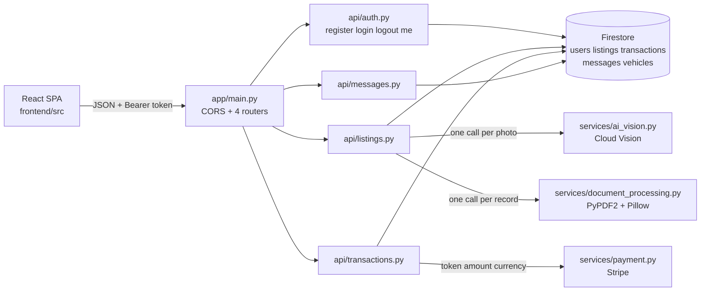

# 1. SETUP

## 1.1 WHAT THIS SYSTEM IS

The Used Car Marketplace is a **Python/FastAPI** service backed by **Google Cloud Firestore** (native mode, NoSQL documents — there is no SQL database anywhere in this system), using **Google Cloud Vision** to analyse vehicle photographs, **Google Cloud Storage** for uploaded objects, **PyPDF2** with **Pillow** to read maintenance documents, and **Stripe** to settle payments. A **React/TypeScript** single-page application in `frontend/` consumes the API over JSON.

This guide takes you from a clean machine to a running, modifiable backend, then explains the domain, the traps, and how to add to the codebase. It is deliberately the *deep* companion to [`README.md`](../README.md), which carries the same setup path in brief. For requirements, personas and scope, read [`Software Requirements Specifications (SRS).md`](Software%20Requirements%20Specifications%20%28SRS%29.md); for architecture, data models and API design, read [`Technical Specifications.md`](Technical%20Specifications.md); for the business case and scope boundary, read [`Software Project Proposal.md`](Software%20Project%20Proposal.md). This guide does not restate those documents — where they are authoritative it links to them, and where the running code has diverged from them it says so explicitly and names the reason.

> **Read this before you judge the system.** The backend imports cleanly and serves **13 routes across 9 unique paths**, of which **11 are fully functional**. The two message routes are mounted and reachable but not yet working, and starting the server against a current Stripe SDK still aborts on an unrelated pre-existing import. Both are known, both are recorded with their reasons in [section 5](#5-suggested-next-tasks), and neither is something you have misconfigured. Section 3 tells you what each failure looks like so you can recognise it in one second rather than debugging it for an hour.

## 1.2 PREREQUISITES

| Requirement | Version | Why |
| --- | --- | --- |
| Python | **3.9 – 3.12** | 3.9 is the floor pinned by continuous integration in [`.github/workflows/backend_ci.yml`](../.github/workflows/backend_ci.yml) (line 19); 3.12 is the validated ceiling. |
| Git | any recent | Repository access. |
| A Google Cloud project | — | Firestore (native mode), Cloud Storage and Cloud Vision enabled, with Application Default Credentials available locally. Needed for **runtime**, not for compiling or linting. |
| A Stripe test API key | — | Read at import by the payment service. |
| Node.js + npm | 18 or later | Only if you also want to run the SPA. |
| Docker, Terraform | — | Optional, and only for the deployment material under `infrastructure/`. |

**All backend code must stay source-compatible with Python 3.9.** Continuous integration runs on 3.9, so a 3.10+ construct — `match`, `X | Y` unions in annotations evaluated at runtime, `dict[str, str]` in place of `typing.Dict` — will pass locally and fail there. Use `typing.List`, `typing.Optional` and `typing.Dict`, exactly as every existing module does.

**Do not exceed 3.12.** The pinned `passlib 1.7.4` imports the standard-library `crypt` module, which Python 3.13 removes; on 3.12 it already warns that it will. Nothing above 3.12 has been validated against this dependency set.

Check what you have before you go any further:

```bash
python3 --version
```

If that reports anything outside 3.9–3.12, **do not proceed with it.** Install an in-range interpreter and call it explicitly, substituting `python3.12` wherever `python3` appears below. Skipping this wastes real time: on a 3.13 host, `python3 -m venv` can fail outright, and when it does not, the failure surfaces much later as a confusing dependency error.

## 1.3 CREATE AN ISOLATED ENVIRONMENT

Unless a command says otherwise, run everything below from the **repository root**, in the order given. Nothing here assumes prior state.

```bash
python3 -m venv .venv
source .venv/bin/activate
```

The repository has no `.gitignore`, so nothing keeps build artefacts out of your commits automatically. Either keep the environment directory out of every `git add` you run, or create it outside the working tree entirely.

## 1.4 INSTALL DEPENDENCIES

There is deliberately **no `requirements.txt`** in this repository, so the dependency set is installed explicitly. Do not create the manifest as a convenience — one was removed on purpose, and recreating it needs a decision rather than an initiative (task **NT-1** in [section 5](#5-suggested-next-tasks)).

```bash
pip install \
  "fastapi==0.95.2" "pydantic==1.10.26" "uvicorn==0.23.2" \
  "python-jose==3.3.0" "passlib==1.7.4" "bcrypt==4.0.1" \
  "PyPDF2==3.0.1" python-multipart \
  google-cloud-firestore google-cloud-storage google-cloud-vision Pillow stripe
pip check
```

`pip check` must print `No broken requirements found.` The seven pinned versions are the verified, mutually compatible set; **treat every one of them as fixed.** Two of the pins are load-bearing in ways that are not obvious, and both are explained in [section 3](#3-common-pitfalls): `pydantic` must stay on v1, and `passlib` must be paired with `bcrypt` below 4.1.

The cloud and media packages are intentionally unpinned — they are the moving parts of this system and the pin set has not been fixed for them.

For linting and compiling you also want:

```bash
pip install flake8
```

## 1.5 CONFIGURE THE ENVIRONMENT

The settings object declares **eleven** fields. **Eight have no default**: if any one of them is unset, importing `app.core.config` raises a Pydantic `ValidationError` and nothing starts.

```bash
export PROJECT_NAME="used-car-marketplace"
export API_V1_STR="/api"
export SECRET_KEY="$(openssl rand -hex 32)"
export ACCESS_TOKEN_EXPIRE_MINUTES="60"
export GOOGLE_CLOUD_PROJECT="your-gcp-project"
export GOOGLE_CLOUD_STORAGE_BUCKET="your-bucket"
export STRIPE_API_KEY="sk_test_xxx"
export STRIPE_WEBHOOK_SECRET="whsec_xxx"
```

`sk_test_xxx` and `whsec_xxx` are placeholders — substitute your own test credentials. If `openssl` is unavailable, generate the key with `python3 -c "import secrets; print(secrets.token_hex(32))"` instead.

Settings are also read from a `.env` file in the working directory when one is present (`env_file = ".env"`, UTF-8). No `.env.example` exists in this repository and none is intended; the block above is the reference configuration (task **NT-2**).

### 1.5.1 Every Setting, And What Actually Reads It

Two of the required variables are not yet consumed by any code. They are still mandatory — the settings object refuses to construct without them — so set them anyway and do not spend time looking for their effect.

| Variable | Required | Default | Purpose |
| --- | --- | --- | --- |
| `PROJECT_NAME` | Yes | — | **No consumer yet.** `app/main.py` constructs `FastAPI()` with no title, so this value is required but unused (task **NT-8**). |
| `API_V1_STR` | Yes | — | Builds the OAuth2 `tokenUrl` published in the OpenAPI schema. **Keep it as `/api`**: the router prefixes in `app/main.py` are literals, so a different value desynchronises the advertised token URL from the real one. |
| `SECRET_KEY` | Yes | — | HS256 signing and verification key for every access token. Use a long random value; never reuse one across environments. |
| `ALGORITHM` | No | `HS256` | JWT algorithm, used for both signing and verification. Change it only if you change both. |
| `ACCESS_TOKEN_EXPIRE_MINUTES` | Yes | — | Access-token lifetime in minutes. Honoured on every issued token. |
| `GOOGLE_CLOUD_PROJECT` | Yes | — | Project for the Firestore client and the Cloud Storage client, both built at import. |
| `GOOGLE_CLOUD_STORAGE_BUCKET` | Yes | — | Bucket handle acquired at import by `app/db/cloud_storage.py`. |
| `STRIPE_API_KEY` | Yes | — | Passed to the Stripe client at import by `app/services/payment.py`. |
| `STRIPE_WEBHOOK_SECRET` | Yes | — | **No consumer yet.** No webhook route exists; the variable is required regardless (task **NT-9**). |
| `SENTRY_DSN` | No | unset | Optional error-reporting endpoint. No consumer yet. |
| `ALLOWED_ORIGINS` | No | `["http://localhost:3000"]` | Origins accepted by the CORS middleware. Accepts a comma-separated list **or** a JSON array — see [section 3.4](#34-allowed_origins-takes-two-forms-and-neither-may-crash). |

`CELERY_BROKER_URL` is **not** in this table on purpose. The background-task module reads it, but the settings object does not declare it, so that module cannot import at all (task **NT-6**).

## 1.6 SET `PYTHONPATH` — MANDATORY

```bash
export PYTHONPATH="$PWD/backend"
```

This is not a convenience. `backend/` contains **zero `__init__.py` files**, so `app` resolves only as an implicit namespace package and the interpreter finds it only when `backend/` is on the path. Omit this and every command in this guide fails identically:

```text
ModuleNotFoundError: No module named 'app'
```

Because the path is set to `backend/`, imports are always written `app.api.auth`, never `backend.app.api.auth`.

## 1.7 RUN THE API

```bash
uvicorn app.main:app --reload --port 8000
```

Then:

- Swagger UI — <http://localhost:8000/docs>
- OpenAPI schema — <http://localhost:8000/openapi.json>

> **Expect this to stop with an import error on a clean install.** Against a current Stripe SDK, startup aborts with `ImportError: cannot import name 'Stripe' from 'stripe'`, raised at line 1 of `backend/app/services/payment.py`. You have not misconfigured anything: that module is outside the change set that made the rest of this backend bootable, and it sits on the transactions router's import path. It is known issue **HCF-3**, the single highest-value task in [section 5](#5-suggested-next-tasks), and [section 3.8](#38-a-clean-boot-still-stops-in-the-payment-module) explains it.

Everything in [section 1.9](#19-verify-your-checkout) works regardless, because none of it needs the server running.

## 1.8 RUN THE SPA (OPTIONAL)

The SPA is not required to work on the backend. If you want it:

```bash
cd frontend
npm install
npm start -- --port 3000
```

`npm start` runs **Vite**. Two things to know before you run it:

- **There is no `npm run dev` script.** Earlier documentation instructed one; it has never existed here. The scripts are `start`, `build`, `test`, `lint` and `preview`, and `test` and `lint` both fail immediately because neither `vitest` nor `eslint` is declared as a dependency.
- **Pass the port explicitly.** The repository ships no `vite.config.ts`, so Vite falls back to its own default of `5173` — while `ALLOWED_ORIGINS` defaults to `http://localhost:3000`. Serving on 3000, as above, is what makes the browser's cross-origin requests pass the CORS check.

The dev server starts, but **the application does not render**. Vite resolves its entry `index.html` from the project root and this repository keeps it at `frontend/public/index.html`, and four modules import from an `app/…` prefix that `frontend/tsconfig.json` does not map. Frontend repair is out of scope for the backend work this guide covers and is recorded as task **NT-15**.

## 1.9 VERIFY YOUR CHECKOUT

None of these gates needs cloud credentials or a running server.

**Compile the modules you are working on.** The list below is the seven most recently changed — substitute your own files. Silence and exit code 0 is a pass.

```bash
python -m py_compile \
  backend/app/main.py backend/app/core/config.py backend/app/api/auth.py \
  backend/app/api/listings.py backend/app/api/transactions.py \
  backend/app/api/messages.py backend/app/schema/message.py
```

**Catch undefined and unused names.** This F-code selection is the project's authoritative static gate; it is what catches the class of defect — a name used but never imported — that previously stopped this backend from importing at all.

```bash
python -m flake8 --select=F401,F811,F821,F841 \
  backend/app/main.py backend/app/core/config.py backend/app/api/auth.py \
  backend/app/api/listings.py backend/app/api/transactions.py \
  backend/app/api/messages.py backend/app/schema/message.py
```

Expect **no output and exit code 0**.

Widening that same gate to the whole package reports **ten findings**, every one of them pre-existing in a module that recent work deliberately left alone:

```bash
python -m flake8 --select=F401,F811,F821,F841 backend/app/
```

| Finding | File | Tracked as |
| --- | --- | --- |
| `F401` unused `typing.Optional` | `backend/app/schema/listing.py:2` | **NT-10** |
| `F401` unused `typing.Optional` | `backend/app/schema/transaction.py:2` | **NT-10** |
| `F401` unused `typing.List`, `F401` unused `settings`, `F841` unused `image` | `backend/app/services/ai_vision.py:4,5,14` | **HCF-4** |
| `F841` unused `e` (twice) | `backend/app/services/payment.py:46,88` | **HCF-3** |
| `F401` unused `crontab`, `F821` undefined `List` (twice) | `backend/app/tasks/background_jobs.py:2,12,34` | **NT-6** |

Treat that list of ten as the baseline: it is what a clean checkout reports today. **Any eleventh finding, and every `F821` in a file you touched, is yours.** Note that the two `F821` entries above are real defects, not lint noise — that module cannot import.

**Do not reach for `pytest`.** It collects nothing here; see [section 3.7](#37-pytest-is-not-a-gate).

# 2. DOMAIN CONTEXT

## 2.1 THE SHAPE OF THE BACKEND



Four API modules, each exporting an `APIRouter` named `router`, are mounted by `app/main.py` under `/api/auth`, `/api/listings`, `/api/transactions` and `/api/messages`. Handlers own their HTTP concerns and delegate real work to `app/services/`; persistence goes through the single Firestore client in `app/db/firestore.py`. Request/response bodies are Pydantic **v1** models under `app/schema/`.

## 2.2 ROLES AND WHO MAY DO WHAT

Every user document carries a `role` string. The three values the system recognises are **`buyer`**, **`seller`** and **`admin`**, as specified in [`Technical Specifications.md`](Technical%20Specifications.md) §5.2.

Registration accepts the role from the request body, so **any caller can currently self-assign `admin`**. Nothing in the codebase restricts that. Treat it as a real constraint on how you deploy this, and see task **NT-14**.

Authorization is enforced inline in each handler — there is no shared dependency or decorator for it. These are all of the checks that exist:

| Action | Rule | On violation |
| --- | --- | --- |
| Create a listing | `role` must be exactly `seller` | 403 `Only sellers can create listings` |
| Update a listing | Caller must be the listing's `seller_id` | 403 |
| Delete a listing | Caller must be the listing's `seller_id` **or** have `role == 'admin'` | 403 |
| Create a transaction | Caller's id must equal the request's `buyer_id` | 403 |
| Read a transaction | Caller must be the transaction's `buyer_id` or `seller_id` | 403 |
| Send or list messages | Authenticated only; no role restriction | 401 if unauthenticated |

`admin` grants exactly one privilege — deleting another seller's listing. There is no admin-only endpoint.

## 2.3 FIRESTORE COLLECTIONS

Firestore is schemaless: collections exist because code writes to them, and nothing enforces field presence, types or uniqueness. The documented models live in [`Technical Specifications.md`](Technical%20Specifications.md) §5.2 and are not repeated here — what follows is what the code actually does.

| Collection | Written by | Read by | Notes |
| --- | --- | --- | --- |
| `users` | `app/api/auth.py` (register) | `app/api/auth.py` (authenticate, resolve token subject), `app/api/messages.py` (recipient exists) | Document id is also stored in the document's own `id` field. **No unique index on `email`** — registration performs its own pre-write duplicate check, which is why it can answer 409. |
| `listings` | `app/api/listings.py` | `app/api/listings.py` | Stores the listing plus derived `photo_analysis` and `maintenance_data`. |
| `transactions` | `app/api/transactions.py` | `app/api/transactions.py` | Written only after payment succeeds. |
| `messages` | `app/api/messages.py` | `app/api/messages.py` | Reachable but not yet functional — see **HCF-8**. |
| `vehicles` | **nothing** | `app/api/transactions.py` | Read to check `status == 'available'`, then updated to `'sold'`. **No module ever creates a vehicle document**, so transaction creation cannot succeed against data this system produced. See **HCF-7**. |

Note that a listing lives in `listings` while the availability check reads `vehicles`. That gap is the substance of **HCF-7**, not an accident of naming, and resolving it is a data-model decision rather than a bug fix.

## 2.4 INTEGRATION POINTS

| Integration | Entry point | Called from | Shape |
| --- | --- | --- | --- |
| Cloud Vision | `analyze_vehicle_photo(image_data: bytes)` | `app/api/listings.py`, once per photo | Synchronous; returns a `dict` of extracted vehicle details |
| PyPDF2 + Pillow | `process_maintenance_document(document_data: bytes, document_type: str)` | `app/api/listings.py`, once per record | Synchronous; returns a `dict` |
| Stripe | `process_payment(token: str, amount: float, currency: str)` | `app/api/transactions.py` | Synchronous; returns a `dict` with a `success` key. Validates `currency` against `usd`, `eur`, `gbp` |
| Cloud Storage | `upload_file`, `delete_file`, `get_file_url` | **nothing** | The module is complete but has no importer; photo upload is not wired to it |

**Every one of these is a plain `def`.** None may be awaited. That rule has its own pitfall entry — [section 3.5](#35-never-await-a-service-function-and-never-read-a-dict-by-attribute) — because violating it was one of the defects this codebase was just repaired for.

## 2.5 AUTHENTICATION AND TOKENS

Tokens are **HS256 JWTs** signed with `SECRET_KEY`, carrying **exactly two claims**:

| Claim | Value |
| --- | --- |
| `sub` | The Firestore document id of the user |
| `exp` | Expiry, computed as `datetime.utcnow()` plus `ACCESS_TOKEN_EXPIRE_MINUTES` |

There is no `iat`, no `jti`, no role claim and no refresh token. Authorization is resolved per request by loading the user document named by `sub`, so a role change takes effect on the next request rather than on the next login.

`ACCESS_TOKEN_EXPIRE_MINUTES` is honoured on every token issued. This is worth stating because it was not always true: the setting had no reader at all, and the token helper's hard-coded 15-minute fallback silently governed every token, so a deployment configured for 60 minutes received 15. The login path now passes the configured lifetime explicitly. The fallback still exists in `create_access_token` for callers that supply no lifetime — **if you add a token-issuing path, pass the lifetime explicitly**, exactly as `_issue_token` in `app/api/auth.py` does.

A rejected token yields **401** with detail `Could not validate credentials` and a `WWW-Authenticate: Bearer` header. Missing, malformed, expired, and valid-but-unknown-subject tokens are all answered identically.

Passwords are hashed with bcrypt through `passlib`'s `CryptContext`. Hashes are stored on the user document as `hashed_password` and are **never returned by any endpoint** — see [section 4.5](#45-projection-discipline-there-is-no-response_model).

### 2.5.1 Logout Is Stateless

`POST /api/auth/logout` returns **200** and does nothing else. There is no denylist, no revocation list, no server-side session and no token store anywhere in this codebase, and the token carries no identifier that could be revoked. **The JWT remains valid until `exp`, including after a successful logout.** You can observe this directly: call `/api/auth/me` with the same token after logging out and it still answers 200.

The route exists because the SPA posts to it and clears its stored token in a `finally` block whatever the response — before this route existed it received a 404 on every sign-out. Its value is that the client's request succeeds. **Do not describe or rely on this endpoint as revocation.** Real revocation is task **HCF-10**.

## 2.6 THE SPA CONTRACT — TREAT IT AS FROZEN

The React client is already written against a specific contract, and the backend was shaped to match it rather than the reverse. Changing any of the following breaks the SPA:

- **Login takes a JSON body**, `{"email": "...", "password": "..."}` — *not* an OAuth2 form post. The client sends JSON, so the route binds a request model. One consequence: Swagger's "Authorize" control, which submits a form, cannot complete the password flow (**HCF-9**). Get a token by calling `POST /api/auth/login` directly and paste it as a bearer header.
- **Login and register return four keys**: `access_token`, `token_type`, `token` and `user`. `access_token` and `token` hold the same string — the first honours the OAuth2 convention, the second is the one the client actually reads. It raises `Login failed: Invalid response from server` if a top-level `token` is missing.
- **`GET /api/auth/me` returns `{"user": {...}}`**, nested, because the client reads `response.data.user`. A flat body hands it `undefined`.
- **The public user projection is exactly seven fields**: `id`, `email`, `first_name`, `last_name`, `role`, `created_at`, `updated_at`. `hashed_password` appears in no response, anywhere.
- **Protected requests carry `Authorization: Bearer <token>`**, attached by the client's request interceptor.
- The client reads its base URL from **`REACT_APP_API_BASE_URL`**. Note that `infrastructure/docker/docker-compose.yml` sets a differently named `REACT_APP_API_URL`, which therefore has no effect (task **NT-15**).

The client has **no register function** — registration is API-only today, so its request shape comes from the `User` schema rather than from the client.

## 2.7 THE ROUTES AS ACTUALLY SERVED

Thirteen routes across nine unique paths. The OpenAPI security scheme publishes `tokenUrl: /api/auth/login`.

| Method | Served path | Router prefix + decorator |
| --- | --- | --- |
| POST | `/api/auth/register` | `/api/auth` + `/register` (201) |
| POST | `/api/auth/login` | `/api/auth` + `/login` |
| POST | `/api/auth/logout` | `/api/auth` + `/logout` |
| GET | `/api/auth/me` | `/api/auth` + `/me` |
| POST, GET | `/api/listings/listings` | `/api/listings` + `/listings` |
| GET, PUT, DELETE | `/api/listings/listings/{listing_id}` | `/api/listings` + `/listings/{listing_id}` |
| POST | `/api/transactions/transactions` | `/api/transactions` + `/transactions` |
| GET | `/api/transactions/transactions/{transaction_id}` | `/api/transactions` + `/transactions/{transaction_id}` |
| POST, GET | `/api/messages/messages` | `/api/messages` + `/messages` |

The four authentication paths match [`Technical Specifications.md`](Technical%20Specifications.md) §5.3 exactly.

**The repeated segments in the other five paths are real.** Each router is mounted under a prefix that already names its area, while its own decorators repeat that segment — so the served path is `/api/listings/listings`, not `/api/listings`. The specification documents the single-segment form, and the SPA calls the single-segment form. **Do not tidy this.** The paths are frozen so that no client contract changes silently as a side effect of unrelated work; reconciling them is a deliberate, breaking change tracked as **HCF-6** and covered again in [section 3.9](#39-the-doubled-path-segments-are-deliberate).

See [section 4.2](#42-mount-it-in-mainpy) for how a prefix and a decorator concatenate into a served path.

To read the two halves off disk — which works today, needs no imports and no server, and shows exactly thirteen decorators against four prefixes:

```bash
grep -n "include_router" backend/app/main.py
grep -rn "^@router\." backend/app/api/
```

Once the import blocker in [section 3.8](#38-a-clean-boot-still-stops-in-the-payment-module) is resolved, you can ask the application itself, which is authoritative. **This command imports `app.main`, so until then it stops with the same `ImportError` as the server does** — that is expected, not a second problem:

```bash
python -c "
import app.main as m
rows = sorted((r.path, ','.join(sorted(r.methods))) for r in m.app.routes if r.path.startswith('/api'))
for p, meth in rows: print('%-50s %s' % (p, meth))
print('routes:', len(rows), '| unique paths:', len({p for p, _ in rows}))
"
```

# 3. COMMON PITFALLS

Most of what follows was learned the hard way. Several entries exist because the exact mistake they describe was shipped into this repository, stopped the backend from importing, and had to be diagnosed from a stack trace — including three defects nobody had reported and which only surfaced once the reported ones were cleared.

## 3.1 SYMPTOM LOOKUP

Start here. Match the message, then read the section.

| What you see | What it means | Section |
| --- | --- | --- |
| `ModuleNotFoundError: No module named 'app'` | `PYTHONPATH` is not set | [1.6](#16-set-pythonpath--mandatory) |
| `pydantic...ValidationError: 1 validation error for Settings` | One of the eight required variables is unset — the message names it | [1.5](#15-configure-the-environment) |
| `SettingsError: error parsing env var "allowed_origins"` | You are running an older checkout; the current one accepts both forms | [3.4](#34-allowed_origins-takes-two-forms-and-neither-may-crash) |
| `ImportError: cannot import name 'Stripe' from 'stripe'` | Known, out of scope, not your setup | [3.8](#38-a-clean-boot-still-stops-in-the-payment-module) |
| `TypeError: object dict can't be used in 'await' expression` | You awaited a synchronous service function | [3.5](#35-never-await-a-service-function-and-never-read-a-dict-by-attribute) |
| `AttributeError: 'dict' object has no attribute 'success'` | You read a dict result by attribute instead of by key | [3.5](#35-never-await-a-service-function-and-never-read-a-dict-by-attribute) |
| `NameError: name 'User' is not defined` at import | A name used in an annotation was never imported | [3.6](#36-annotations-are-evaluated-at-import) |
| `AttributeError: 'Settings' object has no attribute '…'` | A setting is read but not declared on `Settings` | [4.6](#46-add-a-setting) |
| `ImportError: cannot import name 'x_router'` | A router was imported under a name its module does not export | [4.2](#42-mount-it-in-mainpy) |
| 404 on a path you are sure exists | Probably the doubled segment: try `/api/listings/listings` | [3.9](#39-the-doubled-path-segments-are-deliberate) |
| `TypeError: … got multiple values for keyword argument 'id'` on `GET /api/messages/messages` | Known messaging defect | [3.10](#310-messaging-is-reachable-but-not-functional) |
| CORS failure in the browser with the API answering fine in `curl` | Origin is not in `ALLOWED_ORIGINS`, or the SPA is on Vite's default port 5173 | [1.8](#18-run-the-spa-optional), [3.4](#34-allowed_origins-takes-two-forms-and-neither-may-crash) |
| `pytest` reports collection errors | Expected; the suite is broken | [3.7](#37-pytest-is-not-a-gate) |

## 3.2 PYDANTIC V1 IS MANDATORY

**Symptom.** After a well-meant `pip install --upgrade pydantic`, `BaseSettings` cannot be imported from `pydantic` and every schema module fails.

**Cause.** `fastapi 0.95.2` is built against Pydantic **v1**. The pin is `pydantic==1.10.26`. Pydantic v2 moved `BaseSettings` to the separate `pydantic-settings` package and changed validator, config and parsing APIs — `app/core/config.py` depends on all of them.

**What to do.** Keep the pin. Write v1-style models: `class Config`, `@validator`, `Optional[X] = None`, `.dict()`. If you find v2 syntax in a snippet you are copying (`model_config`, `@field_validator`, `.model_dump()`), translate it. Upgrading both FastAPI and Pydantic together is a real project, not a housekeeping step.

## 3.3 `passlib 1.7.4` NEEDS `bcrypt` BELOW 4.1

**Symptom.** Password hashing or verification raises, or logs a `bcrypt version` error, and login stops working.

**Cause.** `passlib 1.7.4` reads the bcrypt backend's version through an attribute that `bcrypt 4.1` removed. The pin `bcrypt==4.0.1` is deliberate, not incidental.

**What to do.** Never upgrade `bcrypt` on its own. If hashing breaks, check `pip show bcrypt` first — it is the likeliest cause and takes ten seconds to rule out.

## 3.4 `ALLOWED_ORIGINS` TAKES TWO FORMS, AND NEITHER MAY CRASH

**Symptom.** Historically, exporting the obvious `ALLOWED_ORIGINS=http://localhost:3000` raised `SettingsError: error parsing env var "allowed_origins"` **at import**, before the application existed.

**Cause.** Pydantic v1 JSON-decodes complex-typed environment values inside its settings source, *before* any field validator can run. A bare comma-separated string is not valid JSON, so the decode failed and took the whole process with it — the very class of import-time failure this backend was repaired for. A `pre=True` validator cannot intercept it, because it never runs.

**What to do.** Nothing — it is handled, via a `Config.parse_env_var` override that special-cases this one field and delegates everything else to the default behaviour. Both of these are correct, and so are the edge cases:

```bash
export ALLOWED_ORIGINS="http://localhost:3000,http://localhost:5173"
export ALLOWED_ORIGINS='["http://localhost:3000","http://localhost:5173"]'
```

| Value | Result |
| --- | --- |
| unset | `['http://localhost:3000']` |
| `http://a.test,http://b.test` | `['http://a.test', 'http://b.test']` |
| `["http://a.test","http://b.test"]` | `['http://a.test', 'http://b.test']` |
| empty, or whitespace only | `[]` — restrictive, and never a crash |
| `*` | `['*']` |

If you add another complex-typed setting, it needs the same treatment; [section 4.6](#46-add-a-setting) shows where.

A browser CORS failure while `curl` succeeds means the browser's `Origin` is not in this list. The CORS middleware currently allows all methods and all headers with credentials enabled — deliberately left alone, and narrowing it is task **NT-11**.

## 3.5 NEVER AWAIT A SERVICE FUNCTION, AND NEVER READ A DICT BY ATTRIBUTE

**Symptom.** `TypeError: object dict can't be used in 'await' expression`, or `AttributeError: 'dict' object has no attribute 'success'`, on every single request to the endpoint — including with empty input, because the `await` fails before any work is attempted.

**Cause.** Everything in `app/services/` is a plain `def` returning a plain value. `async def` handlers make it *look* as though `await` belongs in front of a call, and it does not. Two live call sites had this exact defect, which is why neither listing creation nor transaction creation could ever succeed.

**What to do.** Call them directly and read their results by key:

```python
# Correct — synchronous call, one image at a time, result read by key.
analysis = analyze_vehicle_photo(payload)          # payload must be bytes
result = process_payment(token, amount, 'usd')     # all three arguments required
if not result.get('success'):                      # .get, not ['success'], not .success
    raise HTTPException(status_code=400, detail="Payment processing failed")
```

Three details are worth copying exactly:

- **`.get('success')`, not `['success']`.** A malformed result then reads as a payment failure instead of raising `KeyError` — it fails safe.
- **`analyze_vehicle_photo` takes one image as `bytes`**, not a collection and not a URL string. Loop, and normalise each entry.
- **`process_payment` takes all three of `(token, amount, currency)`.** Passing two raises `TypeError`, and passing them in the wrong order silently sends an amount where a token belongs. `currency` is validated against `usd`, `eur` and `gbp`.

Before you call anything in `app/services/`, read its signature. Only two of the three service modules are even reachable at runtime today (see **HCF-3**, **HCF-4**), so the signature is the contract.

## 3.6 ANNOTATIONS ARE EVALUATED AT IMPORT

**Symptom.** `NameError: name 'User' is not defined` when a module is imported — not when a handler is called.

**Cause.** Python evaluates function annotations when the `def` statement executes. No module here uses `from __future__ import annotations`, so every name in a signature must be importable at import time. Two modules annotated `current_user: User = Depends(get_current_user)` without importing `User`, and the whole backend failed to boot as a result. This is precisely the class of defect the F-code lint gate in [section 1.9](#19-verify-your-checkout) catches, and why that gate is worth running before every commit.

**What to do.** Import every name you annotate with. Run the `F821` gate. Do not "fix" this by deferring annotation evaluation — the codebase does not use that mechanism anywhere, and FastAPI needs real objects to build its request models from.

The same rule explains a related convention: **`datetime.utcnow()` is this codebase's UTC clock.** It is non-deprecated on the 3.9 CI floor, though 3.12 warns about it. Use it in new code for consistency; migrating the whole codebase to timezone-aware datetimes is a coordinated change, tracked as task **NT-12**, not something to do incidentally in a feature branch.

## 3.7 `pytest` IS NOT A GATE

**Symptom.** `pytest` reports `3 errors during collection` and runs zero tests.

**Cause.** All three modules under `backend/tests/` were written against a completely different application: `test_api.py` imports `app.models`, `app.database` and `app.auth`; `test_services.py` imports top-level `services.*` and `integrations.*`; `test_tasks.py` imports `backend.tasks`. None of those modules has ever existed here.

**What to do.** Use `py_compile` and the `flake8` F-code selection from [section 1.9](#19-verify-your-checkout) as your gates. For behavioural checks, drive the app in-process with Starlette's `TestClient` (`httpx` is needed for it, and note that `httpx 0.28` removed the `Client(app=…)` shortcut that `starlette 0.27` relies on, so keep `httpx` below 0.28). Repairing the suite is task **NT-5** and is a genuinely valuable first contribution.

## 3.8 A CLEAN BOOT STILL STOPS IN THE PAYMENT MODULE

**Symptom.**

```text
File ".../backend/app/services/payment.py", line 1, in <module>
    from stripe import Stripe
ImportError: cannot import name 'Stripe' from 'stripe'
```

**Cause.** Current Stripe SDKs expose `StripeClient`; they have no `Stripe` symbol. `app/services/payment.py` sits on the import chain `app.main` → `app.api.transactions` → `app.services.payment`, so this one line stops the whole application.

**What to do.** Recognise it and move on — **this is not something you have misconfigured.** It is known issue **HCF-3**, it lies outside the change set that made this backend importable, and repairing it needs a decision about which Stripe API generation to target, because the surrounding code also calls a legacy Charge creation. Until it is authorised, a real `uvicorn` boot cannot be an acceptance gate for backend work; use the compile and lint gates instead, and exercise handlers in-process. Everything else in this guide — including the full authentication flow — works.

## 3.9 THE DOUBLED PATH SEGMENTS ARE DELIBERATE

**Symptom.** `POST /api/listings` returns 404 and you are certain the route exists.

**Cause.** It does exist, at `/api/listings/listings`. The prefix in `app/main.py` and the path in the decorator each contribute the same segment. Only the four authentication routes are free of this, because that module had no routes to preserve when it was given its HTTP surface.

**What to do.** Use the served paths from [section 2.7](#27-the-routes-as-actually-served) and print the route table when in doubt. **Do not renumber the prefixes to make them prettier.** The specification and the SPA both use the single-segment form, so correcting this is a breaking change that has to be coordinated across both — tracked as **HCF-6**.

## 3.10 MESSAGING IS REACHABLE BUT NOT FUNCTIONAL

**Symptom.** `GET /api/messages/messages` answers 200 while you have no messages, then fails once one exists. `POST` fails with a serialization error mentioning a `Sentinel` object; the subsequent `GET` fails with `TypeError: … Message() got multiple values for keyword argument 'id'`.

**Cause.** Two defects inside handler logic that the import-level repair did not touch. Sending writes Firestore's `SERVER_TIMESTAMP` sentinel into the object it then returns, and the response encoder cannot serialize a sentinel. Listing hydrates each document with `Message(**msg.to_dict(), id=msg.id)` while the stored document already carries an `id` key, so the keyword is supplied twice.

**What to do.** Do not chase it as a regression, and do not "fix" it by changing the message schema — a schema that rejects the sentinel simply fails one line earlier. Both defects are in route logic that is out of scope for the current work and are tracked together as **HCF-8**. The current state is honest and precise: **13 routes registered, 11 functional.**

## 3.11 CLIENTS ARE BUILT AT IMPORT, NOT AT STARTUP

**Symptom.** An import of almost any module fails on credentials or configuration, long before you have started a server or called an endpoint.

**Cause.** Module-level construction, in four places:

| Module | Line | Constructed at import |
| --- | --- | --- |
| `app/db/firestore.py` | 5 | Firestore `Client` |
| `app/db/cloud_storage.py` | 4–5 | Storage `Client` and a bucket handle |
| `app/services/ai_vision.py` | 7 | `ImageAnnotatorClient` |
| `app/services/payment.py` | 5 | The Stripe client |

Importing `app.main` therefore transitively builds all four. Configuration must be valid *before* any import — which is why [section 1.5](#15-configure-the-environment) comes before [section 1.7](#17-run-the-api).

**What to do.** Export the variables first. Note the corollary, because it explains something you will otherwise find puzzling: **the startup hook in `app/main.py` deliberately performs no initialization.** It once imported and awaited `initialize_db`, `initialize_vision_model` and `initialize_document_processor`, none of which was ever defined anywhere in the repository — three `ImportError`s waiting at line 8. Since the clients are already built at import and the document processor needs no client, there was no initialization work left to do, so the awaits were **removed rather than stubbed out**, and the hook now logs one line. Whether to reintroduce real initializers — for lazy construction, or a startup health check — is an open decision, **HCF-2**. If you add one, put it in that hook; do not add a second startup event.

Being built at import is also why credentials are not needed for the compile and lint gates: those never import the modules, they only parse them.

# 4. HOW TO EXTEND

The patterns below are the ones the codebase already uses. Follow them rather than importing habits from other FastAPI projects — several of the conventions here exist because the alternative demonstrably broke this application.

## 4.1 ADD A ROUTER

Create `backend/app/api/<area>.py`. **Export the router under the name `router`** — every one of the four existing API modules does, and `app/main.py` relies on it.

```python
from fastapi import APIRouter, Depends, HTTPException
from app.schema.user import User          # import every name you annotate with
from app.db.firestore import db
from app.api.auth import get_current_user

router = APIRouter()                       # the name must be `router`

@router.get('/widgets/{widget_id}')
async def get_widget(widget_id: str, current_user: User = Depends(get_current_user)):
    doc = db.collection('widgets').document(widget_id).get()
    if not doc.exists:
        raise HTTPException(status_code=404, detail="Widget not found")
    return doc.to_dict()
```

`Depends(get_current_user)` is the whole authentication story: it resolves the bearer token, loads the user document and raises 401 with a `WWW-Authenticate: Bearer` header if anything is wrong. Add authorization inline in the handler, matching the style in [section 2.2](#22-roles-and-who-may-do-what).

Handlers may be `async def` or plain `def`. Plain `def` is the better choice when the body is entirely blocking — Starlette runs it in a threadpool, so Firestore calls do not sit on the event loop. The authentication handlers are deliberately synchronous for that reason. What you must **not** do is make a handler `async` and then `await` something that is not awaitable; see [section 3.5](#35-never-await-a-service-function-and-never-read-a-dict-by-attribute).

## 4.2 MOUNT IT IN `main.py`

In `backend/app/main.py`, import the router **with an alias** and include it:

```python
from app.api.widgets import router as widgets_router
...
app.include_router(widgets_router, prefix='/api/widgets', tags=['Widgets'])
```

The alias is not decoration. `app/main.py` previously did `from app.api.auth import auth_router` against modules that export `router`, which raised `ImportError: cannot import name 'auth_router'` on line 3 of the composition root — the backend could not be imported at all, so no port was ever bound. Aliasing on import keeps each module's public surface as `router` while `app/main.py` reads clearly. **Keep the pattern.**

**The prefix and the decorator path concatenate.** `prefix='/api/widgets'` with a decorator of `@router.get('/widgets/{widget_id}')` serves `/api/widgets/widgets/{widget_id}`. That is exactly how the existing doubled paths arose ([section 3.9](#39-the-doubled-path-segments-are-deliberate)). For a new router, pick one place to name the area — a decorator of `/{widget_id}` under prefix `/api/widgets` serves the clean `/api/widgets/{widget_id}` — and verify with the route-table commands in [section 2.7](#27-the-routes-as-actually-served) before you commit.

## 4.3 ADD A SCHEMA

Put request and response models in `backend/app/schema/` as **Pydantic v1** `BaseModel` subclasses:

```python
from pydantic import BaseModel
from typing import Any, Optional


class Widget(BaseModel):
    id: Optional[str] = None       # server-assigned: optional on input
    owner_id: Optional[str] = None # server-assigned from the token
    name: str                      # client-supplied and required
    active: bool = False
    created_at: Optional[Any] = None
```

Conventions that matter:

- **Fields the server assigns must be optional**, or the client cannot post a valid body. Ids and owner ids are set from the document reference and the token, never trusted from input.
- **Use `typing.Optional` and `typing.List`**, not `X | None` or `list[X]`, to stay compatible with Python 3.9.
- **Pydantic v1 ignores unknown keys and permits attribute assignment.** That is why handlers can construct a model from a Firestore dict carrying extra derived keys, and then set `model.id = doc_ref.id` afterwards.
- **A Firestore sentinel value needs a permissive annotation.** `Optional[Any]` is used for a timestamp field that holds `SERVER_TIMESTAMP` on the way out and a real timestamp on the way back in.

### 4.3.1 When The Code And The Specification Disagree, The Code Wins

`backend/app/schema/message.py` names its fields `recipient_id` and `timestamp`, while [`Technical Specifications.md`](Technical%20Specifications.md) §5.2 names the same concepts `receiverId` and `createdAt`. The schema follows the code because `backend/app/api/messages.py` — which already reads `message.recipient_id` and writes `timestamp`, and whose route logic is out of scope for the current work — is the frozen consumer. A specification-faithful schema would have raised `AttributeError` on the first request.

The judgement generalises: **when a frozen consumer and a document disagree, conform to the consumer and record the divergence** rather than silently breaking working code or silently contradicting the specification. Every divergence in this repository is written down in [section 5](#5-suggested-next-tasks); add yours there too.

## 4.4 CALL SERVICES SYNCHRONOUSLY, AND GUARD THEM

Copy this shape from `app/api/listings.py`. One correlation id per request, hoisted so every log line in the handler shares it; one guarded call per item; a failure that degrades the result instead of failing the request:

```python
import logging
import uuid

logger = logging.getLogger(__name__)

correlation_id = str(uuid.uuid4())          # once per request, not once per loop

photo_analysis = []
for photo in listing.photos:
    payload = photo.encode('utf-8') if isinstance(photo, str) else photo
    try:
        photo_analysis.append(analyze_vehicle_photo(payload))
    except Exception:
        logger.exception(
            "photo analysis failed",
            extra={"correlation_id": correlation_id},
        )
```

Why each part is there:

- **No `await`.** The callee is synchronous ([section 3.5](#35-never-await-a-service-function-and-never-read-a-dict-by-attribute)).
- **One item per call**, with the argument normalised to the declared type.
- **`logger.exception` inside `except Exception`** records the traceback and continues. The photo pipeline has a known unresolved defect (**HCF-4**), so an unguarded call would turn every listing creation into a 500 for the seller.
- **`extra={"correlation_id": …}`** ties every line from one request together. Use the same key.

Guard a call when a partial result is acceptable. When it is not, catch and convert to an explicit `HTTPException` with a 4xx status — as the maintenance-document loop in the same handler does, returning 422 rather than leaking a 500.

## 4.5 PROJECTION DISCIPLINE: THERE IS NO `response_model`

**No route in this repository declares a `response_model`.** Whatever a handler returns is what the client receives, so nothing stops a model with sensitive fields from being serialized in full — and the `User` schema carries `hashed_password`.

Project explicitly. The reference is `_public_user` in `backend/app/api/auth.py`, which returns exactly the seven public fields and makes hash leakage structurally impossible rather than merely unlikely:

```python
def _public_user(user: User) -> dict:
    return {
        'id': user.id, 'email': user.email,
        'first_name': user.first_name, 'last_name': user.last_name,
        'role': user.role,
        'created_at': user.created_at, 'updated_at': user.updated_at,
    }
```

**Never return a `User` object from a handler.** If you introduce another model with sensitive fields, give it a projection helper in the same way. Adding `response_model` declarations across the API would enforce this at the framework level and is task **NT-13**; until then the discipline is manual.

One subtlety to know before you add a return annotation: **FastAPI infers a `response_model` from one.** Four handlers do carry annotations — three in `app/api/listings.py` and one in `app/api/messages.py` — so those four are filtered through the annotated model whether or not that was intended. The authentication handlers deliberately carry none, returning plain dicts so that the four-key body the SPA expects survives intact. Annotate a return type only when you want that filtering, and check what it removes before you do.

## 4.6 ADD A SETTING

Declare it on `Settings` in `backend/app/core/config.py`. Reading `settings.ANYTHING_UNDECLARED` raises `AttributeError` at the point of use — and because middleware is registered at module scope, that means **at import**, which is exactly how `ALLOWED_ORIGINS` once prevented the application from starting.

- **Required**: annotate with no default, and accept that every environment must now supply it or fail to boot. Eight settings are in this category.
- **Optional**: give it a default. `SENTRY_DSN: Optional[str] = None` is the in-file precedent.
- **Complex-typed** (`List`, `Dict`, nested models): it needs handling in `Config.parse_env_var`, or a plain comma-separated value from an operator raises `SettingsError` at import. See [section 3.4](#34-allowed_origins-takes-two-forms-and-neither-may-crash).

Then document it in [section 1.5.1](#151-every-setting-and-what-actually-reads-it) — a required variable with no documentation is a boot failure waiting for the next person — and give it a reader in the same change. Two required settings currently have no consumer at all (**NT-8**, **NT-9**), which is a small trap for everyone who follows.

# 5. SUGGESTED NEXT TASKS

Everything below was found while making this backend importable and giving authentication an HTTP surface. None of it was in scope for that work, and none of it has been acted on. Each entry records the **interim position** actually taken, so you can see what the code does today before deciding what it should do.

Two groups. **HCF** entries need a *decision* — a human has to choose between defensible options, and picking one unilaterally would be the wrong kind of initiative. **NT** entries need *work*, and most are self-contained enough to be a good first contribution.

## 5.1 DECISIONS AWAITING CONFIRMATION

| ID | Item | Interim position taken |
| --- | --- | --- |
| **HCF-1** | Should `Transaction` gain `payment_method`, `currency`, or a `vehicle_id` distinct from `vehicle_listing_id`? Explicit fields would enable genuine multi-currency and multi-instrument payments. | The **caller** was corrected instead of the schema: it now uses the existing `vehicle_listing_id` and passes `stripe_payment_intent_id` as the payment token, with currency pinned to `'usd'`. `backend/app/schema/transaction.py` is untouched. Related, and part of the same decision: `stripe_payment_intent_id` names a **PaymentIntent**, while `process_payment` passes its `token` argument to a legacy **Charge** creation — a generation mismatch that a currency or payment-method field would not fix on its own. |
| **HCF-2** | Should the three startup initializers be reinstated as real functions? | Removed, with the rationale recorded in the code. The Firestore and Vision clients are already built at import and the document processor needs no client, so there was nothing left to initialize; the awaits were removed rather than stubbed. Confirm that no lazy construction or startup health check is wanted. See [section 3.11](#311-clients-are-built-at-import-not-at-startup). |
| **HCF-3** | `backend/app/services/payment.py` line 1 does `from stripe import Stripe`, which the installed SDK cannot satisfy — it exposes `StripeClient`. | Flagged, not fixed: authorization is needed to touch `app/services/payment.py`. **This is why an unstubbed boot cannot be the acceptance gate** for backend work. The highest-value task here. |
| **HCF-4** | `backend/app/services/ai_vision.py` lines 20 and 44 call `client.image(...)`, which the installed Cloud Vision SDK does not provide, so real photo analysis fails. | Flagged; it sits inside logic that is out of scope. The calling loop is guarded, so a failure is logged with a correlation id and degrades the analysis instead of failing the request. |
| **HCF-5** | `VehicleListing.photos` holds URL **strings** while `analyze_vehicle_photo` declares **bytes**, so a fetch step is needed before analysis can produce meaningful labels. | The corrected call is type-correct and guarded — each entry is encoded to bytes — but no fetch was added, because that would be a behavioural expansion. `app/db/cloud_storage.py` already has the retrieval helpers and no importer. |
| **HCF-6** | Served paths are `/api/listings/listings` and siblings, not the documented `/api/listings`. | Paths and prefixes left exactly as they are, per the contract freeze. Both the specification and the SPA use the single-segment form, so fixing this is a coordinated breaking change. See [section 3.9](#39-the-doubled-path-segments-are-deliberate). |
| **HCF-7** | The `'vehicles'` collection is read by the transaction path but written by no module. | Flagged; explicitly out of scope. Consequence today: transaction creation cannot succeed against data this system produced, because no vehicle document with `status == 'available'` ever exists. |
| **HCF-8** | `backend/app/api/messages.py` writes a non-serializable Firestore `SERVER_TIMESTAMP` sentinel into its own response (line 38), and lines 54 and 56 hydrate with `Message(**msg.to_dict(), id=msg.id)` against a document that already carries an `id` key, raising a duplicate-keyword `TypeError` once any message exists. | Creating the missing schema restored **importability and reachability only** — **both message endpoints remain non-functional.** Post-fix state: **13 routes registered, 11 of 13 functional.** A schema change cannot fix this; the route logic has to change. See [section 3.10](#310-messaging-is-reachable-but-not-functional). |
| **HCF-9** | Swagger's "Authorize" password flow cannot complete, because login consumes JSON rather than form data. | The frozen client contract governs; a separate form-encoded token route would be a tenth endpoint and exceed scope. Obtain a token from `POST /api/auth/login` and paste it as a bearer header. |
| **HCF-10** | Logout is stateless — no revocation mechanism exists anywhere. | Flagged and documented as a limitation, never presented as revocation. Any real solution needs a token store or a denylist, plus a `jti` claim to key it on. See [section 2.5.1](#251-logout-is-stateless). |

## 5.2 WORK WORTH PICKING UP

| ID | Task | Detail |
| --- | --- | --- |
| **NT-1** | Add a pinned dependency manifest | `backend/requirements.txt` is absent, and a previous one was removed as out of scope, so recreating it needs authorization rather than initiative. Until then the install block in [section 1.4](#14-install-dependencies) is the manifest — and continuous integration installs from a file that does not exist. |
| **NT-2** | Add `.env.example` | No such file exists. The export block in [section 1.5](#15-configure-the-environment) stands in for it. |
| **NT-3** | Add Dockerfiles | There is no Dockerfile anywhere in the repository, so `infrastructure/docker/docker-compose.yml` cannot build either service and the CI `docker build` step cannot work. |
| **NT-4** | Decide on a license | No `LICENSE` file exists. Earlier documentation asserted MIT; **do not invent a license** — the terms of use are genuinely undetermined and only the project owners can settle them. |
| **NT-5** | Repair the test suite | All three modules under `backend/tests/` import packages that have never existed here, so nothing collects. Rewriting them against the real `app.*` layout would give the project its first real gate. See [section 3.7](#37-pytest-is-not-a-gate). |
| **NT-6** | Fix the Celery task module | `backend/app/tasks/background_jobs.py` has four independent defects: it imports `process_refund` from `app.services.payment`, which defines `create_refund`; it reads `settings.CELERY_BROKER_URL`, which `Settings` never declares; it annotates with `List[str]` without importing `typing`; and it passes a URL string to the `bytes` parameter of `analyze_vehicle_photo`. It also treats that function's dict result as an object. The module cannot import, so no worker can run. |
| **NT-7** | Remove or adopt `backend/app/core/security.py` | Dead code: zero importers anywhere. It duplicates the password and token helpers from `app/api/auth.py` and holds a *correct* `tokenUrl` expression that can never take effect. Two copies of security logic, one of them unreachable, is a trap for the next reader — delete it or make it the single source. |
| **NT-8** | Wire up `PROJECT_NAME` | Required, and read by nothing: `app/main.py` calls `FastAPI()` with no `title`. Pass it, so `/docs` and the OpenAPI document are named. |
| **NT-9** | Wire up or drop `STRIPE_WEBHOOK_SECRET` | Required, and read by nothing, because no webhook route exists. Either add webhook handling or stop demanding the value. |
| **NT-10** | Clear the residual lint baseline | Two unused `typing.Optional` imports, at `backend/app/schema/listing.py:2` and `backend/app/schema/transaction.py:2`, plus the unused names in the service modules listed in [section 1.9](#19-verify-your-checkout). Both schema files were left untouched deliberately; a one-line cleanup would take the baseline to zero. |
| **NT-11** | Narrow the CORS policy | `allow_methods` and `allow_headers` are both `['*']` with `allow_credentials=True`. Only the missing *setting* was a defect; narrowing the policy is a security improvement that was not authorized here. |
| **NT-12** | Migrate to timezone-aware datetimes | `datetime.utcnow()` is the codebase's convention and is non-deprecated on the 3.9 floor, but 3.12 warns and a future release removes it. This has to be done consistently across token issuance, expiry and every stored timestamp — coordinated, not incidental. |
| **NT-13** | Declare `response_model` on the routes | No route declares one today, which is why hand-written projection is the only thing keeping password hashes out of responses. See [section 4.5](#45-projection-discipline-there-is-no-response_model). |
| **NT-14** | Restrict role assignment at registration | Registration accepts `role` straight from the request body with no validation, so any caller can self-assign `admin`. At minimum validate against the three known roles; better, refuse `admin` over the public API entirely. |
| **NT-15** | Fix the frontend's identity and configuration | Several independent pre-existing gaps: `frontend/package.json` is named `task-management-frontend` and described as a task-management app; `frontend/public/index.html` is titled "Personal Finance Tracker"; `infrastructure/docker/docker-compose.yml` sets `REACT_APP_API_URL` while `frontend/src/services/api.ts` reads `REACT_APP_API_BASE_URL`; the compose backend is published on port 5000 rather than 8000; and the compose stack runs a `postgres:13` service with a `DATABASE_URL`, contradicting the Firestore implementation entirely. The SPA also cannot render: there is no `vite.config.ts`, Vite resolves its entry `index.html` from the project root while the file sits in `public/`, and four modules import from an `app/…` prefix that `frontend/tsconfig.json` does not map. |
| **NT-16** | Get continuous integration green | [`.github/workflows/backend_ci.yml`](../.github/workflows/backend_ci.yml) is red for four independent reasons: it installs from a `requirements.txt` that does not exist (**NT-1**), runs a non-collectable test suite (**NT-5**), builds a Docker image with no Dockerfile (**NT-3**), and needs GCP secrets that are not configured. Its `flake8 .` step also lints the whole tree with default rules, not the F-code selection this project actually uses. |
| **NT-17** | Adopt a component library or design system | None is in use. Tailwind CSS is declared in `frontend/package.json` but is not wired up — there is no `tailwind.config.js`, no `postcss.config.js`, and **not one `.css` file in the repository**. Adopting one is a separate deliverable, not a side effect of backend work. |
| **NT-18** | Rewrite or delete the shell scripts | Both are stale enough to mislead. `scripts/setup_environment.sh` installs Node 14, runs `pip install -r requirements.txt` and `cp .env.example .env` against files that do not exist, runs `npm install` at a root with no `package.json`, calls `gcloud init` interactively, and sets up a local SQL database this system does not use. `scripts/deploy.sh` builds `./backend/api`, `./backend/auth` and `./backend/search`, none of which exist — the backend is a single application — and changes into a root `terraform/` directory that lives at `infrastructure/terraform/`. **Do not run either script; follow [section 1](#1-setup) instead.** |
| **NT-19** | Add `CONTRIBUTING.md` | No such file exists, and [`README.md`](../README.md) points at this guide in its place. A short document covering branch naming, the commit style already visible in the log, and the two gates in [section 1.9](#19-verify-your-checkout) would be enough. |

## 5.3 WHERE TO START

If you want the single most useful change: **HCF-3**. It is the one gap between a fresh clone and a served API, and everything else becomes easier to verify once `uvicorn app.main:app` actually stays up.

If you would rather start small and safe, **NT-8**, **NT-10** and **NT-19** are each self-contained, need no decision from anyone, and are impossible to get wrong.

If you want to make the project verifiable, **NT-5** — a collectable test suite — is worth more than any other single contribution on this list.
