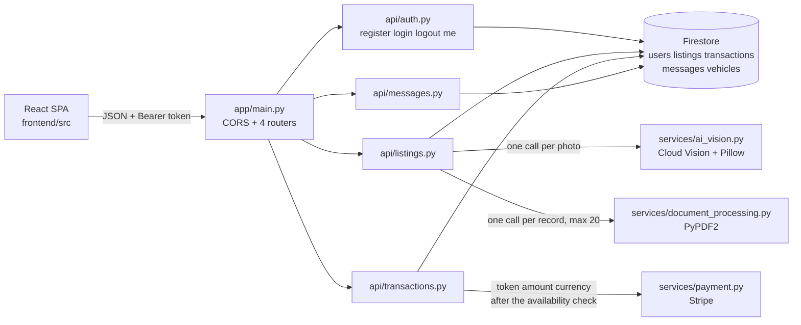

# 1. SETUP

## 1.1 WHAT THIS SYSTEM IS

The Used Car Marketplace is a **Python/FastAPI** service whose application persistence is **Google Cloud Firestore** (native mode, NoSQL documents), using **Google Cloud Vision** to analyse vehicle photographs — with **Pillow** decoding the image bytes on the way in — **PyPDF2** to read maintenance documents, and **Stripe** to settle payments. A **React/TypeScript** single-page application in `frontend/` consumes the API over JSON.

Two points of precision about the data and integration story, because the repository contains material that suggests otherwise:

- **No application code issues a SQL query.** Every read and write in `backend/app/` goes through the single Firestore client in [`app/db/firestore.py`](../backend/app/db/firestore.py); there is no ORM, no connection string and no migration directory. You will nonetheless find SQL named elsewhere: [`Technical Specifications.md`](Technical%20Specifications.md) lists SQL among the project's languages (§4.1, §5.1, §6.1), names SQLAlchemy in its backend framework list (§6.2) and describes Google Cloud SQL as a relational store for transaction history (§6.3), while [`infrastructure/docker/docker-compose.yml`](../infrastructure/docker/docker-compose.yml) declares a `postgres:13` service and hands the backend a `DATABASE_URL`. **That compose service is vestigial** — nothing in the codebase reads `DATABASE_URL`, and that compose file cannot start at all today (**NT-15**). Treat the relational plan as unimplemented intent, not as a second live datastore.
- **Google Cloud Storage is present but unwired.** [`app/db/cloud_storage.py`](../backend/app/db/cloud_storage.py) builds a client at import and offers `upload_file`, `delete_file` and `get_file_url`, but **no module imports it**, so no request path uploads or serves an object. `GOOGLE_CLOUD_STORAGE_BUCKET` is required all the same — `Settings` declares it without a default, so startup fails without it — and the only code that reads it is that unimported module. Photo handling today stores whatever URL strings the caller supplies (**HCF-5**).

This guide takes you from a clean machine to a **running** local application — configured, compiled, linted, served on a port you can call with `curl` or a browser, and ready to modify. Getting that served port today goes through the **local development profile** in [section 1.7.1](#171-the-local-development-profile), because an unmodified checkout stops on a third-party import that sits outside the change set which repaired the rest of the backend (**HCF-3**, [section 3.8](#38-a-clean-boot-still-stops-in-the-payment-module)). The profile is four steps, needs no Google Cloud account and no Stripe account, keeps every stand-in **outside** the repository, and is what every claim in this guide about a served port was checked against. It then explains the domain, the traps, and how to add to the codebase. It is deliberately the *deep* companion to [`README.md`](../README.md), which carries the same setup path in brief. For requirements, personas and scope, read [`Software Requirements Specifications (SRS).md`](Software%20Requirements%20Specifications%20%28SRS%29.md); for architecture, data models and API design, read [`Technical Specifications.md`](Technical%20Specifications.md); for the business case and scope boundary, read [`Software Project Proposal.md`](Software%20Project%20Proposal.md). This guide does not restate those documents — where they are authoritative it links to them, and where the running code has diverged from them it says so explicitly and names the reason.

> **Read this before you judge the system — and before you trust any number in it.** `uvicorn app.main:app` **does not start on an unmodified checkout.** The import chain stops in `app/services/payment.py`, a module that lies outside the change set which made the rest of this backend importable (**HCF-3**, [section 3.8](#38-a-clean-boot-still-stops-in-the-payment-module)). The supported way to get a served port today is the local development profile in [section 1.7.1](#171-the-local-development-profile), which stands that one import in from outside the repository. So every claim below is labelled with how it was established:
>
> | Claim | How it was established |
> | --- | --- |
> | The seven recently changed modules compile and are free of undefined and unused names | `py_compile` and the `flake8` F-code gate, both of which parse rather than import ([section 1.9](#19-verify-your-checkout)) |
> | **13 routes across 9 unique paths** | Read statically off disk — four `include_router` prefixes against thirteen `@router` decorators ([section 2.7](#27-the-routes-as-actually-served)) |
> | The four authentication routes, listing creation and transaction creation behave as documented | Exercised **in process** against an in-memory datastore, with the one out-of-scope Stripe import stood in for, using Starlette’s `TestClient` ([section 6](#6-verifying-behaviour-in-process)) |
> | The same routes answer **over HTTP on a real port** | Driven with `curl` against the local development profile — Uvicorn, the Firestore emulator, and fail-closed stand-ins for Stripe and Cloud Vision ([section 1.7.1](#171-the-local-development-profile)) |
> | Two of the thirteen registered routes still fail on their own logic | Both message routes — reproduced under the profile above, and tracked as **HCF-8** ([section 3.10](#310-messaging-is-reachable-but-not-functional)) |
>
> **The first-party import chain is closed, and the closure stops at that chain.** Every name `app.main` and the four routers it mounts need now exists, is spelled the way its module exports it, and is imported where it is used. One first-party module outside that chain is still un-importable: `backend/app/tasks/background_jobs.py` uses `List` without importing it, reads a `CELERY_BROKER_URL` setting that `Settings` does not declare, and imports a `process_refund` that `app/services/payment.py` does not define. No worker can run until that is fixed (task **NT-6**), and nothing in this guide should be read as saying otherwise.
>
> **Read 13 as routes *registered*, never as endpoints *working*** — two of them do not work, and no port is served until you either take the local profile in [section 1.7.1](#171-the-local-development-profile) or repair **HCF-3** properly.
>
> Every one of those claims is reproducible, and no way of reproducing them needs a running server: [section 1.9](#19-verify-your-checkout) is the gate set you run before every commit, [section 1.10](#110-before-you-call-a-change-done) is the full protocol — ten categories and forty-one numbered assertions, six of them with lettered additions, each naming the artefact that owns it — and [section 6](#6-verifying-behaviour-in-process) is a self-contained script that asserts a hundred and thirty-nine of the same properties in a few seconds with no network, no credential and no server. Each says plainly what it cannot prove, and each points at the concurrency properties that need a Firestore emulator instead, because an in-memory double cannot model a race.
>
> Every gap named here is recorded with its reasons in [section 5](#5-suggested-next-tasks). None of them is something you have misconfigured, and [section 3](#3-common-pitfalls) tells you what each failure looks like so you can recognise it in a second rather than debug it for an hour.

## 1.2 PREREQUISITES

| Requirement | Version | Why |
| --- | --- | --- |
| **A Unix-like OS and a POSIX shell** | Linux or macOS; **bash** 4+ or **zsh** | Every command in this guide is POSIX shell — `export`, `source`, `$PWD`, single-quoted heredocs — and several write scratch files under `/tmp`. On **Windows, use WSL 2** and run everything inside the Linux environment; PowerShell equivalents are not published here, and `cmd`-style quoting will break the JSON payloads below. |
| Python | **3.10 – 3.12**, and use **3.12** | Two different floors, explained below: 3.9 is the *source* floor pinned by continuous integration in [`.github/workflows/backend_ci.yml`](../.github/workflows/backend_ci.yml) (line 19), while installing the verified dependency set needs 3.10 or newer. 3.12 is the validated version. |
| **Command-line tools** | any recent | `git` (repository access), `curl` (every request example, and the local profile's smoke test), and `openssl` **or** Python's `secrets` module for generating `SECRET_KEY`. All of them ship with a stock macOS and with any mainstream Linux. |
| **Docker** *or* **the Google Cloud CLI** | Docker 20.10+ / `gcloud` any recent | Needed **only** to run the Firestore emulator that backs the local development profile in [section 1.7.1](#171-the-local-development-profile) — which is the only way to get a served port today. Either one is enough; you do not need both, and neither is needed for the compile, lint or in-process gates. |
| A Google Cloud project | — | Firestore (native mode), Cloud Storage and Cloud Vision enabled, with Application Default Credentials available locally. Needed **only** for real cloud traffic — see [section 1.2.1](#121-google-credentials-what-needs-them-and-how-to-establish-them). |
| A Stripe test API key | — | `STRIPE_API_KEY` is a required setting, so a value must be present for anything to import. A real key is needed only if you intend to send a real charge. |
| Node.js + npm | 18 or later | Only if you also want to run the SPA ([section 1.8](#18-run-the-spa-optional)). |
| Terraform | — | Optional, and only for the deployment material under `infrastructure/`. |

**All backend code must stay source-compatible with Python 3.9, and you cannot install this dependency set on 3.9.** Both halves are true and they are not in conflict, so keep them apart in your head:

- **Source floor, 3.9.** Continuous integration runs on 3.9, so a genuinely 3.10+ construct — `match`, or an `X | Y` union in an annotation that is evaluated at runtime — will pass locally and fail there.
- **Install floor, 3.10.** The current releases of `google-cloud-firestore`, `google-cloud-storage`, `google-cloud-vision`, `Pillow` and `python-multipart` all declare `Requires-Python >= 3.10`. On 3.9, pip does not fail — it quietly resolves *older* versions of all five, so a 3.9 environment is a different dependency set from the one this project was verified against, and a defect you hit there may not exist here. Pin the versions in [section 1.4](#14-install-dependencies) and use 3.10 or newer.

The two together mean the CI job cannot install what it needs, which is one of the reasons continuous integration is red (**NT-16**). Do not "fix" it by dropping the 3.9 source rule without changing that workflow: the floor and the runner have to move together.

Separately from that floor, **use `typing.List`, `typing.Optional` and `typing.Dict`** rather than the builtin generics `list[...]` and `dict[...]`. This one is house style, not a compatibility requirement: PEP 585 made the builtin generics work in 3.9, so `dict[str, str]` would run — but every existing module uses the `typing` spelling, and a file that mixes the two is harder to read than either.

**Do not exceed 3.12.** Nothing above 3.12 has been validated against this pinned dependency set, and the risk is concentrated in `passlib 1.7.4`, which is unmaintained and predates 3.13. It is not a specific known failure: `passlib` guards its optional `from crypt import crypt` in a `try/except ImportError`, so the standard library's removal of `crypt` in 3.13 does not by itself break the bcrypt backend this project uses. Treat 3.13 and above as untested rather than as broken, and if you must go there, verify hashing and verification first.

Check what you have before you go any further:

```bash
python3 --version
```

If that reports anything outside 3.10–3.12, **do not proceed with it.** Install an in-range interpreter and call it explicitly, substituting `python3.12` wherever `python3` appears below. Skipping this wastes real time: on a 3.13 host, `python3 -m venv` can fail outright, and when it does not, the failure surfaces much later as a confusing dependency error.

### 1.2.1 Google Credentials: What Needs Them, And How To Establish Them

Read this before you go looking for a cloud project, because most of what you will do here needs no credentials at all. The Firestore, Cloud Storage and Cloud Vision clients are constructed when their modules are imported ([section 3.11](#311-clients-are-built-at-import-not-at-startup)), but in the installed SDK versions construction does **not** resolve credentials — the first real API call does. So:

| What you are doing | Google credentials needed? |
| --- | --- |
| Compiling, and the `flake8` F-code gate ([section 1.9](#19-verify-your-checkout)) | **No.** Both parse the source; neither imports it |
| The in-process behavioural harness ([section 6](#6-verifying-behaviour-in-process)) | **No.** It replaces Firestore with an in-memory double and deletes every credential variable from its own environment |
| The local development profile ([section 1.7.1](#171-the-local-development-profile)) | **No.** The Firestore emulator uses anonymous credentials, and Cloud Vision is stood in for. This was verified with `GOOGLE_APPLICATION_CREDENTIALS` unset |
| Talking to a real Firestore, Cloud Storage bucket or Cloud Vision endpoint | **Yes** — Application Default Credentials, established one of the two ways below |

**Option A — the Google Cloud CLI** (best on a workstation you own; the credentials live in your own account):

```bash
# install the CLI first: https://cloud.google.com/sdk/docs/install
gcloud auth application-default login          # opens a browser, writes ADC to your home directory
gcloud config set project <your-gcp-project>
gcloud services enable firestore.googleapis.com storage.googleapis.com vision.googleapis.com
```

**Option B — a service-account key file** (for a CI runner, a container, or a machine with no browser). Create the account and grant it `roles/datastore.user`, `roles/storage.objectAdmin` and `roles/serviceusage.serviceUsageConsumer` in the Cloud console, download the JSON key, then:

```bash
# keep the key OUTSIDE the repository -- this tree has no .gitignore (section 1.3)
export GOOGLE_APPLICATION_CREDENTIALS="$HOME/.config/used-car-marketplace/sa.json"
chmod 600 "$GOOGLE_APPLICATION_CREDENTIALS"
```

**Verify whichever you chose**, before you blame the application for a permission error. Run it with the virtual environment of [section 1.3](#13-create-an-isolated-environment) active, since `google-auth` arrives with the cloud packages:

```bash
python3 -c "import google.auth; c, p = google.auth.default(); print('ADC ok, project:', p)"
```

That prints the project your credentials resolve to. `google.auth.exceptions.DefaultCredentialsError` means neither option is in place — go back and do one of them, or use the local profile, which needs none. A `403 PERMISSION_DENIED ... CONSUMER_INVALID` from a running request means the opposite: credentials resolved, but to a project that is not yours or has the API disabled.

## 1.3 CREATE AN ISOLATED ENVIRONMENT

Unless a command says otherwise, run everything below from the **repository root**, in the order given. Nothing here assumes prior state.

```bash
python3 -m venv .venv
source .venv/bin/activate
```

**The repository has no `.gitignore`, so nothing keeps anything out of your commits automatically.** That is a build-artefact nuisance and a credential hazard, and the second one matters more. Before you create anything:

- Keep the environment directory out of every `git add` you run, or create it outside the working tree entirely.
- **Never commit a file containing secrets** — no `.env`, no service-account JSON, no exported key. `SECRET_KEY` signs every access token, and `STRIPE_API_KEY` moves money; either one in history is a rotation exercise, not a `git rm`. Note that this guide deliberately steers you to *exported* variables rather than a `.env` file ([section 1.5](#15-configure-the-environment)), which keeps the values out of the working tree in the first place.
- If you want local ignores without adding a tracked `.gitignore` — which is a repository-wide decision, not yours to make in passing — put your patterns in `.git/info/exclude`. It is per-clone, never committed, and does the same job.
- Keep your Google credentials file and any key material **outside the repository directory** and point `GOOGLE_APPLICATION_CREDENTIALS` at it there. For anything beyond local development, use a secret manager (Google Secret Manager, or your platform's equivalent) and inject the values as environment variables at deploy time rather than storing them in a file at all.
- Before your first push, run `git status` and read it. In a repository with no ignore rules, that one habit is the whole safety net.

## 1.4 INSTALL DEPENDENCIES

There is deliberately **no `requirements.txt`** in this repository, so the dependency set is installed explicitly. Do not create the manifest as a convenience — one was removed on purpose, and recreating it needs a decision rather than an initiative (task **NT-1** in [section 5](#5-suggested-next-tasks)).

Install in three steps, because the three sets answer different questions and only the first is imported by `backend/app/`.

**1. The application runtime.** Everything `app.main` and its import graph need:

```bash
pip install \
  "fastapi==0.95.2" "pydantic==1.10.26" "uvicorn==0.23.2" \
  "python-jose==3.3.0" "passlib==1.7.4" "bcrypt==4.0.1" \
  "PyPDF2==3.0.1" "python-multipart==0.0.32" \
  "google-cloud-firestore==2.28.1" "google-cloud-storage==3.13.1" \
  "google-cloud-vision==3.15.0" "Pillow==12.3.0" "stripe==15.5.0"
pip check
```

`pip check` must print `No broken requirements found.` Every version above is the one that was actually exercised; **treat all of them as fixed.** Two of the pins are load-bearing in ways that are not obvious, and both are explained in [section 3](#3-common-pitfalls): `pydantic` must stay on v1, and `passlib` must be paired with `bcrypt` below 4.1.

The five cloud and media packages are deliberately **unpinned**, because no pin was ever fixed for them — which is also how **HCF-3** and **HCF-4** arose: the code was written against older SDK generations, and `pip install` gives you today's. The versions the claims in this guide were verified against are in the snapshot table below; pin to those if you want to reproduce them exactly rather than rediscover a provider change.

**The cloud and media packages are pinned here too, and earlier revisions of this guide were wrong to leave them open.** An unpinned install resolves whatever is current on the day it runs, which is not the set anyone verified — and on Python 3.9 it resolves an older set again ([section 1.2](#12-prerequisites)). The versions above are what the assertions in [section 6](#6-verifying-behaviour-in-process) were run against. Note what this block still is not: a *reproducible* install needs a manifest with hashes, which is task **NT-1**; a list of versions in a document only stops the accidental drift.

One of these pins carries a known risk rather than a compatibility constraint. `python-jose 3.3.0` is the subject of CVE-2024-33663 and CVE-2024-33664, both addressed from 3.4.0 onwards. Every token this codebase issues and verifies is HS256 JWS and `ALGORITHM` is restricted to the HMAC family ([section 1.5.1](#151-every-setting-and-what-actually-reads-it)), which is not the algorithm-confusion surface the first advisory turns on — but the pin is a known-vulnerable version and upgrading it is a dependency decision nobody has taken yet (**NT-35**). Do not treat its presence in this list as a clean bill of health.

**2. The tooling the gates need.** Not imported by any application module, and not project dependencies — but the exact commands in [section 1.9](#19-verify-your-checkout) and the script in [section 6](#6-verifying-behaviour-in-process) are asserted against these versions, so pin them:

```bash
pip install "flake8==7.3.0" "httpx==0.27.2"
```

`flake8` is pinned because [section 1.9.2](#192-gate-2--undefined-and-unused-names-across-the-whole-package) states an exact finding count, and a different Pyflakes generation can report a different set. `httpx` is pinned **below 0.28** because 0.28 removed the `Client(app=…)` shortcut that `starlette 0.27`'s `TestClient` relies on — with 0.28 installed, the harness in section 6 cannot construct a client at all.

**3. The worker extra — only if you are working on the task module.** `backend/app/tasks/background_jobs.py` imports Celery, and nothing else in the repository does:

```bash
pip install "celery==5.6.3"
```

Installing it does **not** get you a working worker: that module cannot be imported for four independent reasons and has never executed. It is task **NT-6**, and [section 5.2](#52-work-worth-picking-up) lists the failures in the order you will meet them. Skip this step unless NT-6 is your task; nothing on the HTTP path needs it. There is no broker either — `CELERY_BROKER_URL` is read by that module and declared by no settings object.

Note what none of the three sets contains: **`python-dotenv`**. Pydantic reads a `.env` file only through that optional extra, so configuration comes from exported environment variables and a `.env` file is not read at all — [section 1.5](#15-configure-the-environment) explains what happens if you create one anyway, and why the settings object declares no `env_file`.

**The validated snapshot.** These are the exact versions every command, count and behavioural claim in this guide was checked against. Nothing here is a repository pin — no manifest exists to hold one — so treat it as the reproducible reference, not as a constraint the tooling enforces:

| | Validated version |
| --- | --- |
| Interpreter | Python **3.12.13** |
| Application runtime | `fastapi 0.95.2`, `pydantic 1.10.26`, `starlette 0.27.0` (pulled by FastAPI), `uvicorn 0.23.2`, `python-jose 3.3.0`, `passlib 1.7.4`, `bcrypt 4.0.1`, `PyPDF2 3.0.1`, `python-multipart 0.0.32` |
| Cloud and media (unpinned above) | `google-cloud-firestore 2.28.1`, `google-cloud-storage 3.13.1`, `google-cloud-vision 3.15.0`, `google-cloud-core 2.6.1`, `Pillow 12.3.0`, `stripe 15.5.0` |
| Gate tooling | `flake8 7.3.0`, `httpx 0.27.2` |
| Worker extra | `celery 5.6.3` |
| Packaging toolchain | `pip 26.2.1`, `setuptools 80.9.0`, `wheel 0.48.0` |

Two notes on that last row, because it is the one people trip over. Nothing in this dependency set **requires** `setuptools` at runtime, and a `python3 -m venv` on 3.12 no longer installs it, so an install that never mentions it works fine — the pin is recorded because it is what was validated. Keep it at **80.9.0** if your environment does provide `setuptools`: later releases drop the bundled `pkg_resources`, and one installed module still imports that at module scope (`passlib/pwd.py`, the password *generator* — nothing this application imports). If you upgrade and something unrelated starts raising `ModuleNotFoundError: No module named 'pkg_resources'`, that is the cause.

## 1.5 CONFIGURE THE ENVIRONMENT

The settings object declares **eleven** fields. **Eight have no default**: if any one of them is unset, importing `app.core.config` raises a Pydantic `ValidationError` and nothing starts.

```bash
export PROJECT_NAME="used-car-marketplace"
export API_V1_STR="/api"
export SECRET_KEY="$(openssl rand -hex 32)"
export ACCESS_TOKEN_EXPIRE_MINUTES="60"
export GOOGLE_CLOUD_PROJECT="your-gcp-project"
export GOOGLE_CLOUD_STORAGE_BUCKET="your-bucket"
export STRIPE_API_KEY="sk_test_xxx"
export STRIPE_WEBHOOK_SECRET="whsec_xxx"

# Optional, and shown because it is the one setting whose absence is invisible:
# this is exactly the value the field already defaults to, so exporting it changes
# nothing today but puts the origin your browser will use in front of you. Accepts
# a comma-separated list or a JSON array, and nothing rejects a wildcard, so name
# every origin in full -- see section 3.4.
export ALLOWED_ORIGINS="http://localhost:3000"
```

`sk_test_xxx` and `whsec_xxx` are placeholders — substitute your own test credentials. If `openssl` is unavailable, generate the key with `python3 -c "import secrets; print(secrets.token_hex(32))"` instead.

**Three of these values are secrets, and this repository has no `.gitignore` to protect you.** `SECRET_KEY` signs and verifies every access token — anyone holding it can mint a valid token for any user id — and `STRIPE_API_KEY` and `STRIPE_WEBHOOK_SECRET` are live payment credentials on a real Stripe account, test mode or not. Use a distinct `SECRET_KEY` per environment and never reuse a production one locally; keep all three out of the working tree, out of shell history where you can (a leading space, or a sourced file kept outside the repository), and out of any file you might `git add`. Beyond local development, load them from a secret manager at deploy time rather than from a file. See [section 1.3](#13-create-an-isolated-environment) for the local-ignore mechanism that needs no committed file.

**Exported variables are the only configuration source. A `.env` file is not read.** `Settings.Config` deliberately declares **no** `env_file`, and the reason is worth knowing before you re-add one: Pydantic 1.10.26 reads an env file only through its optional `python-dotenv` extra, that package is not installed, and adding a dependency is outside the current change scope — so a declaration could never *load* a file. It could only stop the process. Until this was removed, `env_file = ".env"` was declared, and a `.env` file present in your working directory made importing `app.core.config` fail outright rather than fall back to the environment:

```text
ImportError: python-dotenv is not installed, run `pip install pydantic[dotenv]`
```

Because `settings = Settings()` runs at module scope, that fired while `app.core.config` was still being imported, so nothing started — the same class of import-time boot failure this backend was repaired for, triggered by following the near-universal `.env` convention. **You will not see that error now.** A `.env` file in the working directory is simply ignored, whatever it contains, so the exports above always govern:

- Put a value in both a `.env` and the environment, and the **environment wins** — trivially, because nothing reads the file. That is also the precedence Pydantic intends where the extra *is* installed: it merges the two sources as `{**dotenv_vars, **env_vars}`, so the environment overrides the file either way.
- Put the required values *only* in a `.env` and export nothing, and you get the normal missing-value failure — `ValidationError: 8 validation errors for Settings`, each one `field required` — rather than a message about a dependency. That is the failure telling you the truth: nothing read the file.
- Set nothing in either place and the optional fields fall back to their declared defaults.

If you want `.env` support, the order matters: get `python-dotenv` authorised and installed (keeping `pydantic==1.10.26`), re-declare `env_file`/`env_file_encoding` on `Settings.Config`, and only then create the file. No `.env.example` exists in this repository and this change did not add one; that whole sequence is one open task (**NT-2**).

### 1.5.1 Every Setting, And What Actually Reads It

Two of the required variables are not yet consumed by any code. They are still mandatory — the settings object refuses to construct without them — so set them anyway and do not spend time looking for their effect.

| Variable | Required | Default | Purpose |
| --- | --- | --- | --- |
| `PROJECT_NAME` | Yes | — | **No consumer yet.** `app/main.py` constructs `FastAPI()` with no title, so this value is required but unused (task **NT-8**). |
| `API_V1_STR` | Yes | — | Builds the OAuth2 `tokenUrl` published in the OpenAPI schema. **Keep it as `/api`**: the router prefixes in `app/main.py` are literals, so a different value desynchronises the advertised token URL from the real one. |
| `SECRET_KEY` | Yes | — | HS256 signing and verification key for every access token. Nothing checks its length, so a short key is accepted and then signs every token with whatever entropy it has — use `openssl rand -hex 32`, which gives 64 characters, and never reuse one across environments (**NT-39**). |
| `ALGORITHM` | No | `HS256` | JWT algorithm, passed as given to both signing and verification. Leave it at `HS256`: it is the symmetric family this project holds a shared secret for, and nothing validates the value, so an asymmetric name fails at the first token issued and `none` would be handed to the signer as written (**NT-39**). |
| `ACCESS_TOKEN_EXPIRE_MINUTES` | Yes | — | Access-token lifetime in minutes. Honoured on every issued token. **Avoid `0`**: `timedelta(minutes=0)` is falsey, and `create_access_token` reads a falsey delta as "unset" and substitutes 15 minutes, so a zero silently means something else. Nothing refuses a value at either extreme, and nothing here can revoke a token before it expires ([section 2.5.1](#251-logout-is-stateless)), so a long lifetime is a long exposure (**NT-39**). |
| `GOOGLE_CLOUD_PROJECT` | Yes | — | Project for the Firestore client, which every import of the application builds, and for the Cloud Storage client, which is built only if `app/db/cloud_storage.py` is imported — and nothing imports it ([section 3.11](#311-clients-are-built-at-import-not-at-startup)). |
| `GOOGLE_CLOUD_STORAGE_BUCKET` | Yes | — | Bucket handle acquired at import by `app/db/cloud_storage.py`. |
| `STRIPE_API_KEY` | Yes | — | Handed to the Stripe client that `app/services/payment.py` constructs at its line 5 — a line no clean import currently reaches (**HCF-3**). Still required regardless. |
| `STRIPE_WEBHOOK_SECRET` | Yes | — | **No consumer yet.** No webhook route exists; the variable is required regardless (task **NT-9**). |
| `SENTRY_DSN` | No | unset | Optional error-reporting endpoint. No consumer yet. |
| `ALLOWED_ORIGINS` | No | `["http://localhost:3000"]` | Origins accepted by the CORS middleware. Accepts a comma-separated list **or** a JSON array, and blank entries are dropped. **Name every origin in full and never use `*`** — see [section 3.4](#34-allowed_origins-takes-two-forms-and-a-wildcard-is-not-safe-here) for what a wildcard actually does here, which is not what it looks like. |

**None of these settings is validated beyond its type.** Pydantic checks that `ACCESS_TOKEN_EXPIRE_MINUTES` is an integer and that the required ones are present, and that is the whole of it: a five-character `SECRET_KEY`, a three-day token lifetime, an unsupported `ALGORITHM` and a wildcard origin all import without complaint and then govern. That is worth knowing rather than assuming, because each of them is read by code that cannot defend itself — the signer takes `ALGORITHM` as given, the token helper reads a falsey lifetime as "unset", and the CORS middleware runs with credentials enabled. Adding those bounds is **NT-39**; until then the values in the export block above are the reviewed ones.

`CELERY_BROKER_URL` is **not** in this table on purpose. The background-task module reads it and the settings object does not declare it, so exporting the variable achieves nothing — but that is only one of the four independent reasons that module cannot be imported, and it is not the first one you meet. Try it and you get `ImportError: cannot import name 'Stripe' from 'stripe'` (or, once that is stood in for, `ImportError: cannot import name 'process_refund' from 'app.services.payment'`); the `AttributeError` for this setting is only reachable after both. Task **NT-6** lists all of them in the order they fire.

## 1.6 SET `PYTHONPATH` — MANDATORY

```bash
export PYTHONPATH="$PWD/backend"
```

This is not a convenience. **The source root is `backend/`, while every import in the codebase is written as top-level `app.…`** — `app.api.auth`, never `backend.app.api.auth`. Python resolves `app` only when the directory that *contains* it is on `sys.path`, and running from the repository root puts the repository root there, not `backend/`. Omit this and every command in this guide fails identically:

```text
ModuleNotFoundError: No module named 'app'
```

Because the path is set to `backend/`, imports are always written `app.api.auth`, never `backend.app.api.auth`. A secondary detail, worth knowing once: `backend/` contains no `__init__.py` files, so `app` and its subdirectories resolve as implicit namespace packages. That works, but it is also why a mistyped path yields a silently empty package rather than an import error.

## 1.7 RUN THE API

The command itself is one line:

```bash
uvicorn app.main:app --reload --port 8000
```

> **Run exactly that on an unmodified checkout and it stops before it binds a port — that is expected, and it is not you.** Startup aborts with `ImportError: cannot import name 'Stripe' from 'stripe'`, raised at line 1 of `backend/app/services/payment.py`: a module that sits on the transactions router's import path and **outside** the change set which made the rest of this backend importable. It is known issue **HCF-3**, the highest-value task in [section 5](#5-suggested-next-tasks), and [section 3.8](#38-a-clean-boot-still-stops-in-the-payment-module) explains it in full. The failure is unrelated to credentials or configuration — it reproduces with and without them.

So there are two ways to run this application, and only the first works today:

| | What it gives you | What it costs |
| --- | --- | --- |
| **[Section 1.7.1](#171-the-local-development-profile) — the local development profile** | A real Uvicorn process serving all 13 routes on a port, backed by the Firestore emulator, with fail-closed stand-ins for the two third-party surfaces this code cannot reach: the `Stripe` symbol the installed SDK does not export, and the Vision client's absent `.image()` method | Four steps, and one file that lives **outside** the repository. Not production, and it sends nothing to Stripe or Cloud Vision |
| **[Section 1.7.2](#172-running-against-real-google-cloud-and-stripe) — real Google Cloud and Stripe** | The system as intended | Blocked: **HCF-3** must be repaired first, which needs authorization. Then credentials ([section 1.2.1](#121-google-credentials-what-needs-them-and-how-to-establish-them)) and a real Stripe key |

Everything in [section 1.9](#19-verify-your-checkout) works under either, and under neither, because none of those gates needs a server running.

### 1.7.1 The Local Development Profile

This is the clean-machine path to a **running, modifiable** application. It changes nothing in the repository: the two stand-ins live in one file in a scratch directory, reached through `PYTHONPATH`, and the datastore is the Firestore emulator. Every expectation printed below was observed from this exact sequence.

**Step 1 — start the Firestore emulator.** Either route works; pick the one whose prerequisite you already have.

```bash
# Route A -- Docker. The `emulators` tag is the Cloud SDK image that ships them.
docker run -d --name firestore-emulator -p 8080:8080 \
  gcr.io/google.com/cloudsdktool/google-cloud-cli:emulators \
  gcloud emulators firestore start --host-port=0.0.0.0:8080

# Route B -- the Google Cloud CLI, if it is installed (the emulator needs a JRE)
gcloud emulators firestore start --host-port=localhost:8080
```

Confirm it answers before you go on. It replies with the literal string `Ok`:

```bash
curl -s http://localhost:8080/
```

**Step 2 — write the profile file, outside the working tree.** It is named `sitecustomize.py` because Python imports that module automatically at interpreter start if it is on `sys.path` — which is what makes it survive `--reload`, since Uvicorn's reloader spawns a fresh interpreter that inherits the same `PYTHONPATH`. It does three things: refuses to run unless the emulator is configured, stands in for `stripe.Stripe` with a client that declines every charge, and stands in for the Vision client's missing method.

```bash
mkdir -p /tmp/ucm-localdev
cat > /tmp/ucm-localdev/sitecustomize.py <<'PY'
"""Local development profile for this backend. NOT part of the repository.

Stands in for the two third-party symbols the installed SDKs do not provide
(HCF-3, HCF-4) and refuses to start unless the Firestore emulator is
configured, so a local run can reach neither a real Google Cloud project nor
a real Stripe account.
"""
import os
import sys
import types

if not os.environ.get("FIRESTORE_EMULATOR_HOST"):
    # Exit rather than raise: the interpreter imports this module through
    # `site`, which swallows exceptions and carries on, so a raise here would
    # only print a warning and leave the stand-ins uninstalled.
    sys.stderr.write(
        "local profile: FIRESTORE_EMULATOR_HOST is unset, so the Firestore "
        "client would address a real project. Refusing to start.\n"
    )
    os._exit(1)


class StripeError(Exception):
    """Stands in for stripe.error.StripeError."""


class _Charges:
    """No charge and no refund ever leaves the machine.

    It declines by default. Set LOCAL_PROFILE_FAKE_CHARGE=1 to report a fake
    settlement instead, which is the only way to walk the purchase path's
    success branch locally.
    """

    @staticmethod
    def create(*_args, **_kwargs):
        if os.environ.get("LOCAL_PROFILE_FAKE_CHARGE") == "1":
            return types.SimpleNamespace(id="ch_local_fake", status="succeeded")
        raise StripeError("local profile: no charge is sent to Stripe")


class _FailClosedStripe:
    """Stands in for the absent `stripe.Stripe` symbol (HCF-3)."""

    def __init__(self, api_key=None):
        self.api_key = api_key
        self.error = types.SimpleNamespace(StripeError=StripeError)
        self.Charge = _Charges
        self.Refund = _Charges


_stripe = types.ModuleType("stripe")
_stripe.Stripe = _FailClosedStripe
_stripe_error = types.ModuleType("stripe.error")
_stripe_error.StripeError = StripeError
_stripe.error = _stripe_error
sys.modules.setdefault("stripe", _stripe)
sys.modules.setdefault("stripe.error", _stripe_error)


class _FailClosedVision:
    """Stands in for ImageAnnotatorClient, whose `.image()` is absent (HCF-4)."""

    def image(self, *_args, **_kwargs):
        raise RuntimeError("local profile: Cloud Vision is not called")


_vision = types.ModuleType("google.cloud.vision")
_vision.ImageAnnotatorClient = _FailClosedVision
sys.modules.setdefault("google.cloud.vision", _vision)
PY
```

**Step 3 — configure the shell.** This is the export block from [section 1.5](#15-configure-the-environment) plus three profile-specific values. Run it from the repository root, with the virtual environment active:

```bash
export FIRESTORE_EMULATOR_HOST="localhost:8080"   # the profile refuses to start without this
export GOOGLE_CLOUD_PROJECT="localdev-$(date +%s)" # a throwaway id: a fresh id is a fresh, empty dataset
unset GOOGLE_APPLICATION_CREDENTIALS               # prove to yourself that no real credential is in play
export PYTHONPATH="/tmp/ucm-localdev:$PWD/backend" # the profile FIRST, then the source root
```

The other required variables — `PROJECT_NAME`, `API_V1_STR`, `SECRET_KEY`, `ACCESS_TOKEN_EXPIRE_MINUTES`, `GOOGLE_CLOUD_STORAGE_BUCKET`, `STRIPE_API_KEY`, `STRIPE_WEBHOOK_SECRET` — must still be set, exactly as [section 1.5](#15-configure-the-environment) shows. Their values can be placeholders here: no real Stripe key is used, and no bucket is touched.

**Step 4 — run it.**

```bash
uvicorn app.main:app --reload --port 8000
```

A successful start prints the application's own startup line, and the interactive documentation is then live:

```text
INFO:app.main:startup complete: firestore and vision clients initialised at import
INFO:     Uvicorn running on http://127.0.0.1:8000 (Press CTRL+C to quit)
```

Two lines, two different formats, and the difference is worth recognising rather than puzzling over. The first is the application's, printed by the handler `logging.basicConfig` installs on the **root** logger — Uvicorn's own logging configuration does not touch root, so `basicConfig` is what governs anything the application logs, in its default `LEVEL:logger:message` form. The second is Uvicorn's, through the loggers it configures for itself. Neither renders the `extra` keys the application attaches to a record ([section 1.11](#111-where-the-logs-go)).

- Swagger UI — <http://localhost:8000/docs>
- OpenAPI schema — <http://localhost:8000/openapi.json>

**Step 5 — smoke-test it, in a second shell.** These four calls are the fastest proof that the profile is working end to end, and each answer below is what it actually returns:

```bash
BASE=http://localhost:8000/api
EMAIL="ada-$(date +%s)@example.test"
STATUS='\n-> HTTP %{http_code}\n'

# 201, with keys access_token, token_type, token, user -- and no password hash anywhere
curl -sS -w "$STATUS" -X POST "$BASE/auth/register" -H 'Content-Type: application/json' \
  -d "{\"email\":\"$EMAIL\",\"password\":\"correct-horse\",\"first_name\":\"Ada\",\"last_name\":\"Lovelace\",\"role\":\"seller\"}"

# 200; the same four keys. Keep the token for the call after this one.
TOKEN=$(curl -sS -X POST "$BASE/auth/login" -H 'Content-Type: application/json' \
  -d "{\"email\":\"$EMAIL\",\"password\":\"correct-horse\"}" \
  | python3 -c 'import json,sys; print(json.load(sys.stdin)["token"])')

# 200 {"user": {...}} -- exactly the seven public fields
curl -sS -w "$STATUS" "$BASE/auth/me" -H "Authorization: Bearer $TOKEN"

# 200 [] -- a public read: note that it carries no Authorization header at all
curl -sS -w "$STATUS" "$BASE/listings/listings"

# 401 with a WWW-Authenticate: Bearer header -- the rejection path, on purpose
curl -sS -w "$STATUS" -X POST "$BASE/auth/login" -H 'Content-Type: application/json' \
  -d "{\"email\":\"$EMAIL\",\"password\":\"wrong\"}"
```

**What the profile does and does not stand in for.** Read this column by column before you report a result:

| Behaviour under the profile | Why |
| --- | --- |
| All four authentication routes, both listing reads, listing creation, both transaction routes: **as documented** | Real handler code, real Pydantic validation, real bcrypt, real JWTs, real Firestore queries against the emulator |
| Listing creation with photos answers **200**, stores `photo_analysis: []` on the document, and prints `ERROR:app.api.listings:photo analysis failed [correlation_id=…]` **and a traceback** once per photo | Not the stand-in — Pillow. `analyze_vehicle_photo` opens the payload with `Image.open` **before** it touches the Vision client, and the payload is a URL string encoded to bytes, so it raises `PIL.UnidentifiedImageError` and the Vision stand-in is never reached. That is **HCF-5** arriving first, and **HCF-4** waiting behind it; the per-photo call is guarded, so the result degrades instead of failing the request ([section 4.4](#44-call-services-synchronously-and-guard-them)). The response body carries the listing's own fields only, so the analysis is visible in Firestore and in the log, not in the answer |
| A purchase answers **400 `Payment processing failed`**, writes no transaction and leaves the vehicle `available`, and the log carries `ERROR:app.api.transactions:payment failed: provider_status=failed provider_error=local profile: no charge is sent to Stripe vehicle=… buyer=… correlation_id=…` | The Stripe stand-in declines every charge, and that record is the stand-in's own reason arriving through the provider's result — the 400 itself says nothing. This is the profile failing closed, not a defect ([section 1.11](#111-where-the-logs-go)) |
| Set `LOCAL_PROFILE_FAKE_CHARGE=1` and the same purchase answers **200**, writes the transaction as `completed` and marks the vehicle `sold` | The stand-in reports a fake settlement. **Nothing was charged.** Use it to walk the success branch, and never treat a green run as evidence that Stripe integration works |
| A purchase needs a vehicle document you wrote yourself | Nothing in this codebase creates one (**HCF-7**, [section 2.9](#29-the-purchase-path)). Write `vehicles/{id}` with `{"status": "available"}` against the emulator first |
| Both message routes answer **500** | **HCF-8**, unchanged and expected ([section 3.10](#310-messaging-is-reachable-but-not-functional)) |
| The SPA still cannot reach it | The client's own blockers, all pre-existing ([section 2.6.2](#262-why-none-of-it-executes-yet)) |

**Limits, stated once and plainly. This profile is for local development only.**

- **It is not a deployment, and it must never be one.** The stand-ins mean no payment is ever taken and no photo is ever analysed. Anything that ran this way and reported success has proved nothing about Stripe or Cloud Vision.
- **The emulator is not Firestore.** It enforces no security rules and needs no indexes, so an index a real project would demand goes unnoticed here.
- **The state is disposable.** A new `GOOGLE_CLOUD_PROJECT` id gives you an empty dataset; the emulator keeps nothing when it stops.
- **It does not close HCF-3.** The repository still cannot boot unaided. Repairing that properly — deciding which Stripe API generation to target — is the real fix, and the profile is what makes the codebase workable until someone is authorized to do it.
- **Report the gate you used.** "Verified under the local development profile" and "verified against real providers" are different claims, and only the first is available today.

**Teardown.** Nothing to undo inside the repository, because nothing there was touched:

```bash
# stop Uvicorn with Ctrl-C, then:
docker rm -f firestore-emulator     # or Ctrl-C the gcloud emulator
rm -rf /tmp/ucm-localdev
```

### 1.7.2 Running Against Real Google Cloud And Stripe

There is no working sequence to publish here yet, and pretending otherwise would waste your afternoon. `app/services/payment.py` cannot be imported against a current Stripe SDK (**HCF-3**), and repairing it means editing a file that is frozen pending authorization — so the honest instruction is: get **HCF-3** authorized and fixed first ([section 5.1](#51-decisions-awaiting-confirmation)). Once it is, this path needs exactly three things beyond [section 1.7.1](#171-the-local-development-profile): Application Default Credentials for a project with Firestore, Cloud Storage and Cloud Vision enabled ([section 1.2.1](#121-google-credentials-what-needs-them-and-how-to-establish-them)), a real `STRIPE_API_KEY`, and **no** `FIRESTORE_EMULATOR_HOST` in the environment — with that variable set, every read and write silently goes to the emulator instead of your project. Expect **HCF-4** to keep real photo analysis failing until it too is repaired; listing creation degrades rather than erroring, which is easy to mistake for success.

## 1.8 RUN THE SPA (OPTIONAL)

The SPA is not required to work on the backend. If you want it:

```bash
cd frontend
npm install
npm start -- --port 3000
```

`npm start` runs **Vite**. Two things to know before you run it:

- **There is no `npm run dev` script.** Earlier documentation instructed one; it has never existed here. The scripts are `start`, `build`, `test`, `lint` and `preview`, and `test` and `lint` both fail immediately because neither `vitest` nor `eslint` is declared as a dependency.
- **Pass the port explicitly.** The repository ships no `vite.config.ts`, so Vite falls back to its own default of `5173` — while `ALLOWED_ORIGINS` defaults to `http://localhost:3000`. Serving on 3000, as above, is what makes the browser's cross-origin requests pass the CORS check.

The dev server starts, and then two things are true that no amount of configuration at your end will change: **the application does not render, and it could not reach this API if it did.** Both are pre-existing, both live in `frontend/`, which the backend change set this guide documents was not authorised to touch, and each is tracked. In brief:

- **Nothing is served to render.** Vite resolves its entry `index.html` from the project root, and this repository keeps it at `frontend/public/index.html` (**NT-15**).
- **`npm install` does not install everything `src/` imports.** `frontend/package.json` declares seven runtime dependencies, and the source imports eight further packages that appear in no manifest: `@stripe/react-stripe-js`, `@stripe/stripe-js`, `browser-image-compression`, `date-fns`, `dompurify`, `formik`, `react-dropzone` and `zod`. Every module that imports one of them fails to resolve, and adding them is a manifest change this backend work was not authorised to make (**NT-34**).
- **The client's module graph does not resolve**, so `tsc` and Vite both fail before any request is built: `createApiInstance` is a module-local `const` in `frontend/src/services/api.ts` and is never exported, yet `services/auth.ts` and `services/payment.ts` import it; `app/utils/auth` and `app/utils/storage` are imported but exist nowhere in the repository; and the `app/…` prefix those imports use is mapped neither in `frontend/tsconfig.json` nor by a bundler alias, because there is no `vite.config.ts` (**NT-30**).
- **Axios never receives a base URL.** `api.ts` reads `process.env.REACT_APP_API_BASE_URL`, and Vite exposes only `VITE_`-prefixed variables, through `import.meta.env` — it puts no `process` in a browser build. With no base, axios resolves every path against the page's own origin, so `/auth/login` would be sent to the dev server rather than to this API (**NT-31**).

**The base a browser client needs is `http://localhost:8000/api`** — the Uvicorn origin from [section 1.7](#17-run-the-api) plus `API_V1_STR`. Under that base the client's `/auth/login`, `/auth/logout` and `/auth/me` compose exactly onto the routes this backend serves; its `/listings` calls still do not, for the reason in [section 3.9](#39-the-doubled-path-segments-are-deliberate). [Section 2.6.2](#262-why-none-of-it-executes-yet) is the full inventory, blocker by blocker, with the configuration a repair has to establish.

## 1.9 VERIFY YOUR CHECKOUT

Four static gates, then one behavioural gate. None of the static gates needs cloud credentials or a running server; the behavioural gate needs neither either, because it runs the application in-process against doubles — it is [section 6](#6-verifying-behaviour-in-process), and it is where every claim in this guide about what the endpoints *do* comes from.

### 1.9.1 Gate 1 — compile every module you changed

The list below is the seven most recently changed — substitute your own files. Silence and exit code 0 is a pass.

```bash
PYTHONPYCACHEPREFIX=/tmp/blitzy-pycache python -m py_compile \
  backend/app/main.py backend/app/core/config.py backend/app/api/auth.py \
  backend/app/api/listings.py backend/app/api/transactions.py \
  backend/app/api/messages.py backend/app/schema/message.py
```

**`PYTHONPYCACHEPREFIX` is there for a reason.** Without it, `py_compile` writes a `__pycache__` directory next to every file it compiles — inside the working tree, in a repository with no `.gitignore` ([section 1.3](#13-create-an-isolated-environment)). Gate 3 below is what would catch that, but only if you read its untracked-file half; sending the bytecode outside the tree means there is nothing to catch. If you prefer no temporary directory at all, compile in memory instead:

```bash
python - <<'EOF'
import pathlib, sys
for name in sys.argv[1:] or [str(p) for p in pathlib.Path('backend/app').rglob('*.py')]:
    compile(pathlib.Path(name).read_text(), name, 'exec')
print('compiled, nothing written')
EOF
```

### 1.9.2 Gate 2 — undefined and unused names, across the whole package

This F-code selection is the project's authoritative static gate; it is what catches the class of defect — a name used but never imported — that previously stopped this backend from importing at all. The gate is the **package**, not a file list:

```bash
python -m flake8 --select=F401,F811,F821,F841 backend/app/
```

**The expected result is one finding.** That is the acceptance criterion the remediation plan for this backend set for this exact command: six findings before the work, one after — a single unused `typing.Optional` import in a file it deliberately did not touch.

**Measured against the delivered tree the command reports ten, so this gate does not pass.** The discrepancy is in the *before* figure, not in the work: run the same selection over the baseline commit and it reports **fifteen**, not six —

```bash
mkdir -p /tmp/baseline
git archive d758168f8b898822b87bc700ddb44a4585abade3 backend/app | tar -x -C /tmp/baseline
(cd /tmp/baseline && python -m flake8 --select=F401,F811,F821,F841 backend/app/ | wc -l)
```

Five of those fifteen were the undefined names that stopped the backend importing — `User` twice in `api/transactions.py`, `User` twice and `firestore` once in `api/messages.py` — and all five are gone. The remaining ten were never counted. Every one of them:

| # | Finding | File:line | Tracked as |
| --- | --- | --- | --- |
| 1 | `F401` unused `typing.Optional` | `backend/app/schema/listing.py:2` | **NT-10** |
| 2 | `F401` unused `typing.Optional` | `backend/app/schema/transaction.py:2` | **NT-10** |
| 3 | `F401` unused `typing.List` | `backend/app/services/ai_vision.py:4` | **NT-10**, in a file frozen by **HCF-4** |
| 4 | `F401` unused `app.core.config.settings` | `backend/app/services/ai_vision.py:5` | **NT-10**, in a file frozen by **HCF-4** |
| 5 | `F841` local `image` assigned and never used | `backend/app/services/ai_vision.py:14` | **HCF-4** — the value the provider call should have used |
| 6 | `F841` local `e` assigned and never used | `backend/app/services/payment.py:46` | **NT-10**, in a file frozen by **HCF-3** |
| 7 | `F841` local `e` assigned and never used | `backend/app/services/payment.py:88` | **NT-10**, in a file frozen by **HCF-3** |
| 8 | `F401` unused `celery.schedules.crontab` | `backend/app/tasks/background_jobs.py:2` | **NT-6** |
| 9 | `F821` undefined name `List` | `backend/app/tasks/background_jobs.py:12` | **NT-6** |
| 10 | `F821` undefined name `List` | `backend/app/tasks/background_jobs.py:34` | **NT-6** |

Every one of the ten sits in a file that the change set which repaired the boot chain was not authorised to modify, so **the gate is reported as blocked rather than rewritten to fit**: the command above stays exactly as it is, the milestone it belongs to is short of its own criterion by nine findings, and it keeps failing until **NT-6** and **NT-10** in [section 5.2](#52-work-worth-picking-up) are authorised and done. Two of the ten are not cosmetic — the `F821` pair at entries 9 and 10 is why `backend/app/tasks/background_jobs.py` cannot be imported at all, so clearing them is a functional repair, not tidying.

Until then, treat those ten as the baseline a clean checkout reports. **An eleventh finding is yours, and so is any `F821` in a file you touched.**

While you are working, the same selection over only your own files is the faster pre-commit check. It is a convenience, **not** this gate, and a clean result from it says nothing about whether the gate above passed:

```bash
python -m flake8 --select=F401,F811,F821,F841 <the files you changed>
```

### 1.9.3 Gate 3 — change containment

Check that you changed only what you meant to change. Run the diff against the commit your work started from; for the change set that repaired this backend, that commit is `d758168f8b898822b87bc700ddb44a4585abade3`:

```bash
git diff d758168f8b898822b87bc700ddb44a4585abade3 --name-status
```

For that change set the output is exactly these nine paths, and nothing else:

```text
M	README.md
M	backend/app/api/auth.py
M	backend/app/api/listings.py
M	backend/app/api/messages.py
M	backend/app/api/transactions.py
M	backend/app/core/config.py
M	backend/app/main.py
A	backend/app/schema/message.py
A	documentation/ONBOARDING.md
```

**Any additional path fails the gate.** When you run the same command against your own branch point, read every line: a path you did not intend to change is either a mistake or a decision you have not written down yet.

**That command is only half the gate, and the missing half is the dangerous one.** `git diff` compares *tracked* content; it says nothing at all about files git has never seen. This repository has no `.gitignore` ([section 1.3](#13-create-an-isolated-environment)), so a `.venv`, a `__pycache__` directory, a scratch harness, an editor swap file, a service-account key or a `.env` you created is **untracked and invisible to the command above** — a clean diff is not a clean tree. Run this too, every time, and treat it as the same gate:

```bash
git status --porcelain --untracked-files=all
```

Every line it prints is either something you meant to add or something that must not be committed. For a change set that is finished and staged, the expected output is exactly the same nine paths with an `M`/`A` in the first column and nothing else; for work in progress, expect your own untracked artefacts and check each one. Patterns you put in `.git/info/exclude` are honoured here as well, which is precisely why that is the right place for them: what the command still prints is then what you have not consciously excluded. `git ls-files --others --exclude-standard` lists only the untracked entries if you want them on their own. Two of the things you will see there matter more than the rest: **a credential file in the tree is a rotation exercise the moment it is committed** ([section 1.5](#15-configure-the-environment)), and the verification script in [section 6](#6-verifying-behaviour-in-process) is meant to live outside the tree for exactly this reason.

### 1.9.4 Gate 4 — style, which is not clean and is not a gate you can pass

There is no Flake8 configuration file anywhere, so a bare `python -m flake8 backend/app/` applies the defaults — including an unusually narrow 79-character line limit — and reports dozens of pre-existing `E501` and `E302` findings in code nobody is being asked to reformat. Do not reformat them, and do not add to them either: keep the lines you write within 79 characters, and put two blank lines before a new top-level `def` or `class`. Comparing the output for a file before and after your change is the quickest way to see that you added nothing.

### 1.9.5 Gate 5 — behaviour

`pytest` cannot serve as this gate: it collects nothing here ([section 3.7](#37-pytest-is-not-a-gate)), and an unstubbed server does not start ([section 3.8](#38-a-clean-boot-still-stops-in-the-payment-module)). What is available is the in-process harness in [section 6](#6-verifying-behaviour-in-process): one script, no credentials, no network, 139 assertions covering the routes, the authentication flow and the input policy in front of it, the attempt ceilings, both write paths, the guards each of them does and does not apply, CORS, the response headers, the 500 contract, the settings contract and the startup and failure log records. Run it before you claim any behaviour works. When what you changed is the *shape* of a request or a response, follow it with the smoke test in [section 1.7.1](#171-the-local-development-profile) — that is the only check here that puts a real socket, a real HTTP parser and a real JSON body in the path.

## 1.10 BEFORE YOU CALL A CHANGE DONE

[Section 1.9](#19-verify-your-checkout) is what you run before every commit. This section is what you run before you call a change **done**. It is **ten categories and forty-one numbered assertions, six of which carry lettered additions**, and it is written out in full so that nobody has to re-derive it from prose — the whole point is that two people checking the same change check the same things.

Every assertion here is reproducible on a laptop with no cloud credentials and **no running server**. Nothing in it is aspirational: each one was executed against this checkout and each one passed.

Some assertions pin a **gap** rather than a guarantee — a request this API accepts that a policy would refuse. They are here because an unwritten gap is one that gets rediscovered as a surprise, and because the day someone closes one, the assertion should fail and be updated deliberately. Each names the task that would close it.

Two sections cover verification, and they are not the same thing. This one is the **checklist** — what has to be true, written out so a reviewer and an author check the same things. [Section 6](#6-verifying-behaviour-in-process) is the **executable** form: one self-contained script that installs the same two stubs, drives the same flows against an in-memory datastore and asserts a hundred and thirty-nine properties in a few seconds. Run section 6 to get an answer; use this section to know what the answer has to cover, including the categories the script deliberately leaves to you.

| # | Category | Assertions | Needs |
| --- | --- | ---: | --- |
| 1 | Compilation | A1 | nothing |
| 2 | F-code lint | A2–A3 | nothing |
| 3 | Import probes | A4–A6 | the stubs in [1.10.1](#1101-the-two-sanctioned-stubs) for A6 |
| 4 | Route and OpenAPI inventory | A7–A9 | stubs |
| 5 | Authentication, and what it does not check | A10–A20 | stubs + a datastore |
| 6 | Listing write path, and its bounds | A21–A26 | stubs + a datastore |
| 7 | Transaction write path, and its guards | A27–A33 | stubs + a datastore |
| 8 | CORS and configuration | A34–A37 | stubs for A34–A35 |
| 9 | Log assertions | A38–A40 | stubs + a datastore |
| 10 | Change-set containment | A41 | git |

**Two things are deliberately *not* gates here.** `pytest` collects nothing ([section 3.7](#37-pytest-is-not-a-gate)), and an unstubbed `uvicorn app.main:app` cannot start ([section 3.8](#38-a-clean-boot-still-stops-in-the-payment-module)). Neither can be used, and neither is a substitute for what follows.

**One further property is outside every category above**, because no in-process assertion can reach it: that the routes actually answer over HTTP, through a real socket, a real HTTP parser and a real JSON body. The smoke test in [section 1.7.1](#171-the-local-development-profile) is what establishes it, and it is worth running whenever you change the shape of a request or a response.

**Concurrency is outside it too**, and saying so is part of the protocol rather than a footnote to it: two simultaneous registrations for one address, and two simultaneous buyers for one vehicle, are both unguarded (**NT-40**, **NT-28**) and neither is observable against an in-memory double, which serialises everything. Take them to a Firestore emulator, under the fail-closed conditions in [1.10.1](#1101-the-two-sanctioned-stubs), and say which gate you used when you report the result.

### 1.10.1 The two sanctioned stubs

Categories 3 through 9 import `app.main`, which means they need the two out-of-scope third-party constructors replaced. **Stub them in the process, never in the repository** — editing `app/services/payment.py` or `app/services/ai_vision.py` is a different change with its own authorization. Put this at the top of your scratch harness, before any `app.*` import:

```python
import sys, types

_stripe = types.ModuleType('stripe')                 # HCF-3: the installed SDK
class _StripeStub:                                   # exposes StripeClient, not Stripe
    def __init__(self, api_key=None): self.api_key = api_key
_stripe.Stripe = _StripeStub
_err = types.ModuleType('stripe.error')
class _StripeError(Exception): pass
_err.StripeError = _StripeError
_stripe.error = _err
sys.modules['stripe'] = _stripe
sys.modules['stripe.error'] = _err

_vision = types.ModuleType('google.cloud.vision')    # HCF-4: no .image() method
class _ImageAnnotatorClientStub:
    def image(self, content=None): raise RuntimeError('stubbed')
_vision.ImageAnnotatorClient = _ImageAnnotatorClientStub
sys.modules['google.cloud.vision'] = _vision
```

**For the datastore, replace the client with an in-memory double, and do it by default.** That is the whole procedure, and it is the same one [section 3.8](#38-a-clean-boot-still-stops-in-the-payment-module) and [section 6](#6-verifying-behaviour-in-process) publish — one answer, not a choice to make per run:

```python
stack.enter_context(mock.patch('google.cloud.firestore.Client',
                               lambda *a, **k: store))
```

It fails closed. A double cannot reach anything you care about, whereas the variable that points at an emulator (`FIRESTORE_EMULATOR_HOST`) is absent by default, and an unguarded run with it absent falls through to whatever `GOOGLE_APPLICATION_CREDENTIALS` names — which may be a real project. Remove that variable and the credential variable from the harness environment, and assert afterwards that `app.db.firestore.db` **is** your double, before you drive anything.

One thing to know before adding a case that signs in: **a failed sign-in now takes 0.75 seconds** by design, and the throttles are module state, so a gate that drives many rejections is slower than it looks and must reset the windows through `reset(app, store)` rather than `store.reset()` alone.

**Two properties a double cannot model**, and they are exactly the two that matter most: whether a registration race resolves to one account, and whether a query really refuses a replayed payment intent. For those, and only those, use an emulator — under these conditions, all of them:

```bash
gcloud emulators firestore start --host-port=localhost:8080
export FIRESTORE_EMULATOR_HOST=localhost:8080
export GOOGLE_CLOUD_PROJECT="probe-$(date +%s)"   # a throwaway, per run
```

- **Assert the variables before importing anything.** `if not os.environ.get('FIRESTORE_EMULATOR_HOST'): sys.exit('refusing to run: no emulator')`. An emulator run that silently became a production run is the failure this guards.
- **Give every run its own `GOOGLE_CLOUD_PROJECT`.** `app/db/firestore.py` builds its client with `project=settings.GOOGLE_CLOUD_PROJECT`, so a fresh id is a fresh, empty dataset and two runs cannot contaminate each other.
- **Delete what you wrote, in a `finally`.** Stream each collection you touched and delete the documents. An emulator that outlives the run keeps its data.
- **Never point one of these runs at a shared emulator or a real project**, and say which gate you used when you report the result: "verified in-process against doubles" and "verified against an emulator" are different claims.

Drive the app with Starlette's `TestClient` (`from fastapi.testclient import TestClient`). Keep `httpx` below 0.28 — 0.28 removed the `Client(app=…)` shortcut `starlette 0.27` relies on. Use it as a **context manager**, or the startup event never fires and A38 cannot pass.

### 1.10.2 Categories 1–4 — the static and structural gates

| # | Assertion | How |
| --- | --- | --- |
| **A1** | All seven changed modules compile | `python -m py_compile` over them exits 0 ([section 1.9](#19-verify-your-checkout)) |
| **A2** | Those modules report **zero** `F401`/`F811`/`F821`/`F841` | the changed-file `flake8` command in [section 1.9](#19-verify-your-checkout) prints nothing |
| **A3** | The tree-wide F-code baseline is still **ten** findings, none in a file you changed | the package-wide `flake8` command in [section 1.9](#19-verify-your-checkout); compare against the table there |
| **A4** | `Message.__fields__` is exactly `['content', 'id', 'read', 'recipient_id', 'sender_id', 'timestamp', 'vehicle_listing_id']`, and the model carries no validators | `python -c "from app.schema.message import Message; print(sorted(Message.__fields__))"` — no stubs needed |
| **A5** | `app.api.messages` and `app.api.transactions` each import with no `ModuleNotFoundError` and no `NameError` | `python -c "import app.api.messages, app.api.transactions"` with the stubs in place |
| **A6** | `import app.main` succeeds | prints your own marker; this is the assertion that the boot chain is whole |
| **A7** | **13 routes across 9 unique `/api` paths**, and the four auth paths are exactly `/api/auth/register`, `/login`, `/logout`, `/me` | the route-table snippet in [section 2.7](#27-the-routes-as-actually-served) |
| **A8** | The nine pre-existing routes are unchanged, **doubled segments included** — `/api/listings/listings` (GET, POST), `/api/listings/listings/{listing_id}` (GET, PUT, DELETE), `/api/transactions/transactions` (POST), `/api/transactions/transactions/{transaction_id}` (GET), `/api/messages/messages` (GET, POST) | same snippet; aggregate the methods per path before comparing, since each method is its own route object |
| **A9** | The OpenAPI security scheme publishes `tokenUrl: /api/auth/login`, and `GET /openapi.json` returns 200 | `app.openapi()['components']['securitySchemes']['OAuth2PasswordBearer']['flows']['password']['tokenUrl']`, then a `TestClient` GET |

A8 is the one people skip, and it is the one that catches an accidental "tidy" of the doubled paths ([section 3.9](#39-the-doubled-path-segments-are-deliberate)). Assert it every time.

### 1.10.3 Categories 5–7 — the behavioural gates

**Category 5 — authentication, and what it does not check (A10–A20).** The first ten are the flow. A20 is the other half of the truth: what the two public routes accept.

| # | Request | Expect |
| --- | --- | --- |
| **A10** | `POST /api/auth/register`, fresh email | **201**; body keys exactly `access_token`, `token_type`, `token`, `user`; the string `hashed_password` appears **nowhere** in the serialized payload; exactly **one** document written, in `users` and no other collection |
| **A11** | the same body again | **409** `Email is already registered`, and the `users` query for that email still returns **one** document |
| **A12** | `POST /api/auth/login`, correct credentials | **200**; `access_token == token`; `user` is an object |
| **A13** | login, wrong password | **401** with header `WWW-Authenticate: Bearer` |
| **A14** | login, unknown email | **401** with a detail **byte-identical** to A13 — this is the no-enumeration property |
| **A15** | `GET /api/auth/me` with the token | **200**; `user` holds exactly `id, email, first_name, last_name, role, created_at, updated_at` |
| **A15b** | compare `user.created_at` and `user.updated_at` from **register**, from **login** and from **`/me`**, for one user | all three strings **byte-identical**, and each ends in `+00:00`. This is a real regression risk rather than a formality: register projects a naive `datetime.utcnow()` while the other two project what Firestore read back, which is tz-aware, so the parity exists only because `_utc_isoformat` normalises it ([section 4.5](#45-projection-discipline-there-is-no-response_model)). **Assert it against the emulator, not the in-memory double** — a double that stores the datetime it was handed returns it unchanged and the divergence never appears |
| **A16** | `/me` with no `Authorization` header | **401** + `WWW-Authenticate: Bearer` (detail `Not authenticated` — see [section 2.5](#25-authentication-and-tokens)) |
| **A17** | `/me` with `Bearer not-a-real-token` | **401** + `WWW-Authenticate: Bearer` (detail `Could not validate credentials`) |
| **A18** | `POST /api/auth/logout` with the token | **200**, body exactly `{"detail": "Logged out"}` |
| **A19** | decode the issued token with `SECRET_KEY` | claims are exactly `['exp', 'sub']`, `sub` is the user's document id, and the measured lifetime matches `ACCESS_TOKEN_EXPIRE_MINUTES` — **not** the 15-minute fallback |
| **A19b** | `POST /api/auth/login` with `{"email": "", "password": ""}`, and again with a 10 000-character password | **401** both times, with the same detail and `WWW-Authenticate: Bearer` as A13 — and **no** 500: a credential that cannot match a stored one is refused before the datastore and before `passlib`, whose own 4096-byte ceiling used to escape as an unhandled `PasswordSizeError` |
| **A19c** | eleven consecutive failed sign-ins from one peer, then a correct one; then three failures, a success, and nine more failures | the eleventh answers **429** with a `Retry-After` header while the first ten answer 401; after the success the counters are cleared, so the nine that follow are all 401. Twenty-one registrations from one peer answer **201** twenty times and **429** after ([section 3.14](#314-the-attempt-ceilings-are-per-process-and-per-connection)) |
| **A19d** | measure the wall-clock time of a sign-in with an unknown address and of one with a known address and a wrong password | both land on the same floor, within tens of milliseconds of each other, rather than differing by the cost of a bcrypt verification. Sample several times: this is a timing property, so one pair proves nothing |
| **A20** | register with `role: "admin"`; with a malformed address; with a one-character password; with a blank name; with a password over 72 bytes. Then register `"Seller@Harness.TEST"` and sign in as `"seller@harness.test"` | **422** for every one of the first five, with **no** document written — the role allow-list, the address shape check, the name bounds and the 8-to-72-byte password band all sit on `RegisterRequest`'s validators ([section 2.2.1](#221-what-registration-accepts)). The sign-in answers **200**, because both routes canonicalise the address identically. Assert the *refusals*, not the acceptances: this table pinned the opposite until the policy landed |

**Category 6 — listing write path and its bounds (A21–A26).** Patch the module-level name, not the service module: `app.api.listings.analyze_vehicle_photo = my_fake`. That is the call site under test.

| # | Request | Expect |
| --- | --- | --- |
| **A21** | `POST` a listing (as a `seller`) with two photo URLs | **200**; the helper is called **exactly twice**, and **each argument is `bytes`** |
| **A22** | the same with `photos: []` | **200**; the helper is **not** called; the stored `photo_analysis` is `[]` |
| **A23** | the same where the helper raises on **every** photo | **200** — a degraded analysis, never a 500; stored `photo_analysis` is `[]` |
| **A24** | the same where it raises on one of two | **200**, and the one successful result is retained |
| **A25** | `POST` a listing as a `buyer` | **403** `Only sellers can create listings`, and **no** helper call |
| **A26** | `POST` with more than 20 maintenance records; with over 900 KiB of maintenance content; with a listing that serializes past 1 MB. Then `POST` with thirteen photos and with a blank photo entry | **422** for each of the first three, the serialized-size case asserted through its log record so it cannot pass by tripping one of the other two. The last two answer **200**, with thirteen outbound provider calls for thirteen photos: nothing bounds the photo list, which is the gap **NT-25** records |

A21 through A24 also prove there is no `await` in front of the call: awaiting a `dict` would turn every one of them into a 500.

**Category 7 — transaction write path and its guards (A27–A33).** Patch `app.api.transactions.process_payment`. Create the vehicle document yourself — nothing in this codebase creates one (**HCF-7**).

| # | Request | Expect |
| --- | --- | --- |
| **A27** | `POST` a transaction as the buyer, vehicle `status: 'available'` | **200**; the helper receives **exactly three** arguments — the transaction's `stripe_payment_intent_id`, its `amount`, and `'usd'` — and the vehicle document becomes `{'status': 'sold'}` |
| **A28** | the same | the vehicle was looked up by **`vehicle_listing_id`**; no `AttributeError` for a field the schema does not declare |
| **A29** | the helper returns `success: False` | **400**; **no** transaction document written; the vehicle **not** marked sold |
| **A30** | the helper returns a dict with **no** `success` key | **400** — `.get('success')` fails safe where `['success']` would raise `KeyError` |
| **A31** | `POST` a transaction whose `buyer_id` is not the caller | **403**, and **no** payment attempted |
| **A32** | `POST` against a `sold` vehicle, and against a vehicle id that does not exist | **400** both times, and **no** payment attempted |
| **A33** | `POST` again with a `stripe_payment_intent_id` a transaction already records. Then give the vehicle document a `price` and a `seller_id` that both contradict the request and `POST` that | **200** both times: the charge is sent a second time for the replay, and the caller's own price and seller are accepted. Two gaps, deliberately pinned — **NT-27**/**NT-28** for the first, **NT-41** for the second |

### 1.10.4 Categories 8–9 — configuration, CORS and logs

| # | Assertion | How |
| --- | --- | --- |
| **A34** | A preflight from an allowed origin returns **200** with `access-control-allow-origin` echoing that origin and `access-control-allow-credentials: true` | `client.options('/api/auth/login', headers={'Origin': 'http://localhost:3000', 'Access-Control-Request-Method': 'POST', 'Access-Control-Request-Headers': 'content-type'})` |
| **A35** | A preflight from an origin outside the list returns **400** with **no** allow-origin header | the same with `Origin: http://evil.test` |
| **A36** | `ALLOWED_ORIGINS` resolves for all nine accepted forms and **never** raises `SettingsError` — unset → `['http://localhost:3000']`, one origin, comma-separated → both, spaced entries → both stripped, JSON array → both, empty or whitespace → `[]`, and `'*'` or `'https://*.example.com'` → kept **verbatim**, because nothing rejects a wildcard | set the variable and construct `Settings()` in a fresh subprocess, once per form; see [section 3.4](#34-allowed_origins-takes-two-forms-and-a-wildcard-is-not-safe-here) |
| **A37** | Unsetting **any one** of the eight required variables fails validation — while a five-character `SECRET_KEY`, an `ACCESS_TOKEN_EXPIRE_MINUTES` of `0` or `4321`, and a lower-case `ALGORITHM` all import **without complaint** | loop over them, one change at a time, constructing `Settings()` in a subprocess. The first half is the contract; the second half is the gap **NT-39** records |
| **A38** | The startup hook logs exactly `startup complete: firestore and vision clients initialised at import`, and no initializer traceback | attach a `logging.Handler` to the `app` namespace, then enter the `TestClient` context |
| **A39** | Under A23, `photo analysis failed` is logged **once per failed photo**, at `ERROR` with its traceback attached, and every record from one request carries the **same** `correlation_id` — **in the rendered message as well as on the record** | read `record.correlation_id` for the field and `record.getMessage()` for the text: each message ends `[correlation_id=…]`, because `logging.basicConfig`'s formatter renders no `extra` keys and the id would otherwise never be printed ([section 1.11](#111-where-the-logs-go)) |
| **A39b** | every response carries `x-content-type-options`, `x-frame-options`, `referrer-policy` and `strict-transport-security`; a response to a request bearing an `Authorization` header, and any response under `/api/auth`, also carries `cache-control: no-store`; `content-security-policy` is present on every path **except** `/docs`, `/docs/oauth2-redirect`, `/redoc` and `/openapi.json` | read `response.headers` on a login 200, a `/me` 401, a `/me` 200, a public listing read and `/docs` ([section 3.15](#315-error-responses-are-json-and-the-documentation-paths-are-csp-exempt)) |
| **A39c** | an unhandled failure answers **500** with `content-type: application/json` and body `{"detail": "Internal server error"}`, and when the request carries an allowed `Origin` the response also carries `access-control-allow-origin`, `access-control-allow-credentials: true` and `Vary: Origin` | `POST /api/messages/messages` with a valid token is the ready-made fixture — it fails by design (**HCF-8**). Assert the headers with an allowed origin and their **absence** with a disallowed one |
| **A40** | Under A28 and A29, a failed charge logs **exactly one** record at `ERROR` carrying the provider's `status` and `error`, the `vehicle_listing_id`, the `buyer_id` and a `correlation_id` — in the printed line as well as on the record — and the payment token appears in **no** record; a **successful** charge logs nothing at all, and a provider *exception* logs one record naming the exception type without duplicating the traceback the server already prints | the same handler, plus `logging.Formatter('%(levelname)s:%(name)s:%(message)s').format(record)` to assert what is *printed*, and a `grep` of the record set for the token you sent ([section 2.9](#29-the-purchase-path)) |

A36 and A37 need **no** stubs and no server — they construct `Settings` in isolation. Run them even when you are only changing configuration.

### 1.10.5 Category 10 — change-set containment

| # | Assertion | How |
| --- | --- | --- |
| **A41** | The change set is exactly the paths the current work authorises, and the working tree holds nothing else at all | `git diff --name-status <base-commit> HEAD` **and** `git status --porcelain`; the second must be empty ([section 1.9.3](#193-gate-3--change-containment)) |

This is a scope gate, not a quality gate, and it is the cheapest one on the list. An extra path in the first output means a frozen file was touched — see [section 5](#5-suggested-next-tasks) for why several of them are frozen and what it takes to unfreeze one. Anything in the second output that you did not put there deliberately is a stray file, and if it looks like a credential, delete it rather than ignore it.

### 1.10.6 What this protocol cannot prove

Say this plainly rather than letting a green run imply more than it earned:

- **No real Cloud Vision or Stripe traffic is exercised.** Categories 6 and 7 verify the **call sites** — arity, types, synchronicity, result handling. The services themselves are stubbed, and both have known defects behind the stub (**HCF-3**, **HCF-4**).
- **Nothing here proves a concurrency property.** The double serialises everything, so A11's sequential 409 says nothing about two registrations arriving together — and the honest answer for that case is that both can succeed, because the check is a query rather than a conditional write ([section 3.12](#312-one-address-is-one-account-and-how-it-is-not-enforced)). Same for two simultaneous buyers. Run those against an emulator, as [1.10.1](#1101-the-two-sanctioned-stubs) describes.
- **A gap that is asserted is still a gap.** A26, A33 and half of A37 pin what this API accepts, not what it should accept. A20 used to belong on that list and no longer does — it now asserts refusals. A green protocol therefore means "no regression", not "no exposure" — [section 5.3](#53-where-to-start) is the list ordered by exposure.
- **A clean install still serves nothing.** Every category from 3 onwards runs under the stubs. On an unstubbed checkout the import fails ([section 3.8](#38-a-clean-boot-still-stops-in-the-payment-module)), so a fully green protocol and a working deployment are not the same claim.
- **The two messaging endpoints are out of scope for categories 5–7 on purpose.** They are reachable and non-functional (**HCF-8**); asserting their behaviour would only assert a known defect.
- **The frontend is untested here.** The SPA does not render ([section 1.8](#18-run-the-spa-optional)), so the contract in [section 2.6](#26-the-spa-contract--treat-it-as-frozen) is verified by reading the client, not by driving it. Anything that needs a browser — rendering, real preflight behaviour in a browser, the login round trip through the SPA — belongs to whoever can run one, and is not covered by any assertion above.

## 1.11 WHERE THE LOGS GO

`backend/app/main.py` calls `logging.basicConfig(level=logging.INFO)` at import, and that one line is the whole of this application's logging configuration. It has to be there: **Uvicorn configures only its `uvicorn*` loggers**, so without it the whole `app.*` namespace inherits root's `WARNING` with no handler attached — the startup record below is created and then dropped, and a guarded failure escapes through `logging.lastResort`, which prints the bare message with no timestamp, no level and no logger name. Every diagnostic line this backend emits was invisible for exactly that reason.

What that gives you, and what it does not:

| Property | Value |
| --- | --- |
| Scope | the **root** logger, so `app.*` records and third-party ones (`httpx`, `google.*`) share it. That is the trade for one line; quieting a chatty library means `logging.getLogger('httpx').setLevel(logging.WARNING)` in your own entry point |
| Level | `INFO` |
| Destination | one `StreamHandler` on standard error, alongside Uvicorn's own output |
| Format | `logging`'s default — `%(levelname)s:%(name)s:%(message)s` |
| Context | **`extra` is not rendered.** The default formatter prints only the fields its format string names, so a value attached through `extra` is carried on the record and never appears in the printed line. This is the one thing about logging here that surprises people — which is why the four records that carry a `correlation_id` interpolate it into the **message** as well |
| Precedence | `basicConfig` returns without doing anything if the root logger already has a handler, so an operator who configures logging **before** importing `app.main` keeps their own configuration entirely, and the `app` namespace itself is never touched |

A successful start prints exactly one line from the startup hook:

```text
INFO:app.main:startup complete: firestore and vision clients initialised at import
```

and a guarded failure inside listing creation prints its message with the exception beneath it, because the handler logs through `logger.exception`:

```text
ERROR:app.api.listings:photo analysis failed [correlation_id=573ca917-501a-4f67-9add-c287c2f13d73]
Traceback (most recent call last):
  ...
RuntimeError: vision provider unavailable
```

**A failed charge prints one line and no traceback**, because the purchase path has no exception to attach — the provider reports its refusal as a return value:

```text
ERROR:app.api.transactions:payment failed: provider_status=failed provider_error=card_declined by issuer vehicle=veh-1 buyer=Tw7IhmsYeORQiHhh7gBL correlation_id=1f3f23e1-55ec-4523-9143-08f34bd99426
```

**The `correlation_id` is in both of those lines, and it is carried twice on purpose.** Both write paths generate one per request and every record they emit carries it in the message as well as through `extra` — listing creation writes `logger.exception("photo analysis failed [correlation_id=%s]", correlation_id, extra={"correlation_id": correlation_id})`, and the purchase path names `correlation_id=…` among the fields of its line. The message copy is what an operator reading this output can actually see, because the default formatter renders no `extra` keys; the `extra` copy is what a structured handler picks up as a field once one exists. Both loops of one listing request share the id, so its photo failures and a maintenance failure from the same call tie together, and both of the purchase path's records share one id too. **These are the only places in the codebase that carry a request id**, and it is per handler rather than per request: giving every line one, from middleware, with structured output and per-namespace levels, is task **NT-29**.

**The purchase path names its fields in the message as well**, precisely because that formatter renders no `extra` keys: `provider_status`, `provider_error`, the vehicle, the buyer and the correlation id are interpolated into the line *and* attached through `extra`, so the record is readable today and machine-readable the day NT-29 lands. Two rules it follows, and they are worth copying. **The payment token is never logged** — `stripe_payment_intent_id` is a credential, and nothing about diagnosing a decline needs it. And **every value the application did not author is clipped to 200 characters and flattened to one printable line** before it reaches a record, because a provider reason carrying a newline would otherwise print as a second, forged log line; `_log_field` in `app/api/transactions.py` is that renderer.

**Two consequences worth knowing before you rely on the output.** The traceback and the provider's own error text *are* printed, because `logger.exception` includes them: a third-party message can quote the request that produced it — a document's contents, a URL, an address — so treat this output as containing request content and point it at a sink whose readers may see it. And nothing here redacts anything: never put a password, a token, an email address or a payload into a message or an `extra` value. `app/api/auth.py` is the pattern to copy — its records name what happened and never the subject it happened to.

**That last rule binds a client just as hard, and the frozen SPA breaks it** — it logs whole rejected axios errors, which carry the sign-in body and a live bearer token. Nothing in the backend does this; the client-side fix is task **NT-32**, and [section 2.6.2](#262-why-none-of-it-executes-yet) has the line numbers.

**Response headers are a related ownership question, and this application now answers the half it can.** `SecurityHeadersMiddleware` in `app/main.py` attaches `x-content-type-options: nosniff`, `x-frame-options: DENY`, `referrer-policy: no-referrer` and `strict-transport-security` to every response; `cache-control: no-store` to any response to a request bearing an `Authorization` header and to everything under `/api/auth`, so a token no longer travels in a storable response; and `content-security-policy: default-src 'none'; frame-ancestors 'none'; base-uri 'none'` to every path except the four documentation ones, which are exempt because Swagger UI and ReDoc load their bundles from a CDN ([section 3.15](#315-error-responses-are-json-and-the-documentation-paths-are-csp-exempt)). What remains someone else's is what only the edge can know: TLS itself, whether HSTS should be preloaded, and host validation — there is still no ingress configuration in this repository, so if you deploy this, that part is yours to write (**NT-38**).

**To take the configuration over**, configure logging yourself *before* `app.main` is imported: attach your own handler to the root logger, point it at a JSON formatter, set whatever levels you want. `basicConfig` will then do nothing, so none of it is overwritten. That is asserted by gate A of the harness in [section 6](#6-verifying-behaviour-in-process) — the startup record reaches a handler attached to the `app` namespace — and by gate C at the call site: two failure records per two failed photos, at `ERROR`, with the traceback attached and one shared `correlation_id` — asserted both as a field of the record and as text in the rendered message. If you touch this code, run that gate: none of it is covered by any committed test, because this project has none that collect ([section 3.7](#37-pytest-is-not-a-gate)).

# 2. DOMAIN CONTEXT

## 2.1 THE SHAPE OF THE BACKEND



Four API modules, each exporting an `APIRouter` named `router`, are mounted by `app/main.py` under `/api/auth`, `/api/listings`, `/api/transactions` and `/api/messages`. Handlers own their HTTP concerns and delegate real work to `app/services/`; persistence goes through the single Firestore client in `app/db/firestore.py`. Request/response bodies are Pydantic **v1** models under `app/schema/`.

## 2.2 ROLES AND WHO MAY DO WHAT

Every user document carries a `role` string. The three values the system recognises are **`buyer`**, **`seller`** and **`admin`**, as specified in [`Technical Specifications.md`](Technical%20Specifications.md) §5.2.

**Registration accepts only the two roles a caller may give itself.** `RegisterRequest.role` is trimmed, lower-cased and checked against an allow-list of exactly `buyer` and `seller`; anything else — `admin`, `wizard`, an empty string — answers **422 `role must be one of: buyer, seller`** and is logged as a refused attempt. That check is load-bearing rather than cosmetic: the role is persisted, read back on every request by `get_current_user`, and trusted by the listing-delete branch below, so while it was absent **one anonymous request could make itself an administrator and delete any seller's listing**. The normalisation matters too, in a way that used to bite quietly: `role: ' Seller '` is now stored as `seller` and passes the seller gate on listing creation, where before it was stored as written and then failed that gate while looking correctly configured.

**Granting `admin` deliberately is a separate gap.** No endpoint hands the role out and nothing audits a grant, so the intended procedure for a real administrator is writing the user document directly — which the application neither authenticates nor records. That is task **NT-14** (an authenticated, administrator-only elevation *and revocation* path that writes its own audit record). Until it lands, the direct write needs controls the code cannot give you:

- Provision administrators only through an **authorized operator channel**: a named service account or human principal with an IAM grant scoped to the `users` collection, never a shared or long-lived key, and never the same credential the running service uses.
- Require the same **change approval** you would require of a deployment — who asked, who approved, which user id, why — and keep that record where your team already keeps change history.
- Keep an **audit trail**. Firestore's own audit logging is the cheapest route: with Data Access audit logs enabled on the project, a direct write is attributable to a principal after the fact, which a bare edit from a developer laptop is not.
- **Grant the minimum.** `admin` confers exactly one privilege in this codebase — deleting another seller's listing — so an over-broad IAM grant buys far more than the role does.
- Remember that a role change takes effect on the **very next request** with an existing token, because `get_current_user` re-reads the document every time ([section 2.5](#25-authentication-and-tokens)). That is what makes revocation by direct write immediate; it is also why an accidental grant is immediate.

Authorization is enforced inline in each handler — there is no shared dependency or decorator for it. These are all of the checks that exist:

| Action | Rule | On violation |
| --- | --- | --- |
| Register | `role`, after trimming and lower-casing, must be `buyer` or `seller`. The address, both names and the password are bounded too ([section 2.2.1](#221-what-registration-accepts)) | 422, naming the field |
| Create a listing | `role` must be exactly `seller` | 403 `Only sellers can create listings` |
| Update a listing | Caller must be the listing's `seller_id` | 403 |
| Delete a listing | Caller must be the listing's `seller_id` **or** have `role == 'admin'` | 403 |
| Create a transaction | Caller's id must equal the request's `buyer_id`. The amount and the seller are taken from the request and checked against nothing (**NT-41**) | 403 |
| Read a transaction | Caller must be the transaction's `buyer_id` or `seller_id` | 403 |
| Send or list messages | Authenticated only; no role restriction | 401 if unauthenticated |

`admin` grants exactly one privilege — deleting another seller's listing. There is no admin-only endpoint and no endpoint that hands the role out (**NT-14**), and registration now refuses to hand it out either — so today the only way an administrator comes into existence is the direct datastore write described above, with the controls it needs.

### 2.2.1 What Registration Accepts

`POST /api/auth/register` is the only unauthenticated write in this API, so what it accepts is worth reading field by field. Every check below lives on a Pydantic v1 `@validator` on `RegisterRequest` in `app/api/auth.py`, which means a bad body is a **422 naming the field** before the duplicate lookup, before bcrypt and before Firestore — nothing is queried, hashed or written.

| Field | What is checked | Stored as |
| --- | --- | --- |
| `email` | Trimmed and lower-cased, then required non-empty, capped at **254 characters** (the longest address SMTP carries) and shape-checked against `^[^@\s]+@[^@\s.]+(\.[^@\s.]+)+$` — so `not-an-email`, an address with an internal space, and `a@localhost` are all refused. `EmailStr` would be the obvious check and is **not** available: it needs `email-validator`, which is not in the pinned set (**NT-1**) | The canonical form, so ` A@B.com ` and `a@b.com` are **one** account |
| `password` | **8 to 72 bytes** of UTF-8. The ceiling is bcrypt's own: it hashes only the first 72 bytes, so anything longer is refused rather than silently truncated ([section 3.13](#313-passwords-are-bounded-at-72-bytes-and-that-bound-is-bcrypts)) | Never stored; only its bcrypt hash is |
| `first_name`, `last_name` | Trimmed, required non-empty, capped at 100 characters, and refused if they contain `<`, `>` or a control character — this API declares no `response_model` and encodes no output, and both listing reads are unauthenticated, so stored markup would be a payload waiting for the first client that renders a name as HTML. Apostrophes, hyphens and non-Latin scripts are left alone | The trimmed value |
| `role` | Trimmed, lower-cased, and one of `buyer` or `seller` — see [section 2.2](#22-roles-and-who-may-do-what) for why this is the one that mattered most | The canonical form |

**What is still not checked**, and both are tasks rather than oversights: nothing proves the address belongs to the person registering it — there is no verification email and no confirmation step, so an attacker can register an address it does not control and hold the account its real owner would later expect (**NT-36**) — and no `@validator` bounds a *write* body, so `photos` and a message's `content` remain unbounded (**NT-25**).

Two properties of this route are worth knowing before you build on it:

- **Uniqueness is checked, not enforced.** Registration queries `users` for the canonical address and answers **409 `Email is already registered`** if it finds one. That is a read followed by a write, so two simultaneous registrations for one address can both succeed. Canonicalisation closes the *spelling* half of that hole — two spellings are now one address, and the second answers 409 — but the race needs a conditional write, which is **NT-40**; [section 3.12](#312-one-address-is-one-account-and-how-it-is-not-enforced) has what it takes.
- **Both public routes now count attempts.** A caller gets ten failed sign-ins per minute per connection and per address, and twenty registrations per minute per connection, then **429 `Too many attempts. Try again later.`** with a `Retry-After` header. Read [section 3.14](#314-the-attempt-ceilings-are-per-process-and-per-connection) before you rely on it: the counters live in one process, so the ceiling multiplies by the number of workers.

`LoginRequest` deliberately carries **no field constraints at all**, which is the right shape for a sign-in: nothing about the *credential* is judged by request validation, so every credential rejection stays uniform — an unknown address and a wrong password are both **401 `Incorrect email or password`** with a `WWW-Authenticate: Bearer` header, and the response cannot be used to enumerate accounts. A 422 on a sign-in attempt would leak exactly what the 401 is careful not to.

What the handler does instead is refuse, **with that same 401**, any credential that could not match a stored one: a blank address or password, an address over 254 characters, or a password over 72 bytes. That closes two holes at once. A blank credential used to authenticate — an account had been registered with an empty address and an empty password, and login queried for precisely that and minted a full token — and an over-long password used to answer **500**, because `passlib` refuses anything above 4096 bytes and the `PasswordSizeError` escaped unhandled. The address is canonicalised here exactly as registration canonicalises it, which is why an account registered as `A@b.com` can now be signed into as `a@b.com`; changing one of those two without the other would lock accounts out.

**Timing is uniform too, and that took deliberate work.** `authenticate_user` returns as soon as its query comes back empty, so an unknown address cost about 5 ms while a known address with a wrong password paid a ~300 ms bcrypt verification — a 60-fold difference that told an unauthenticated caller which addresses have accounts, however identical the two responses looked. Every failure path in `login` is now held to a fixed floor of **0.75 seconds**, measured from the top of the handler, so all three rejections (blank, unknown, wrong) answer in the same time. Two things follow. The floor is a constant, so if a deployment's bcrypt cost ever grows past it the padding stops hiding anything — the handler logs a warning when the real work outruns the floor rather than leaving that to be guessed at. And the ceiling in the paragraph above is checked *before* the padding, so a caller that has filled its window is refused cheaply.

**Two different rejections live at this route, and they are easy to confuse.** FastAPI validates the request body before `login()` is entered, so a body that is not *shaped* like a login attempt never reaches the credential check at all:

| Request | Answer | Rejected by |
| --- | --- | --- |
| No body; `{}`; only `email`; only `password`; `null` for either; a value no coercion can turn into a string; malformed JSON; a form-encoded body | **422**, listing the offending `body/…` locations, with **no** `WWW-Authenticate` header | FastAPI request validation, before the handler |
| Both fields present and coercible to strings — including `""`, whitespace, an unknown email, a wrong password, or a number Pydantic v1 coerces to `str` | **401 `Incorrect email or password`** with `WWW-Authenticate: Bearer` | `authenticate_user`, inside the handler |

Turning those 422s into 401s would hide malformed-request bugs from clients that are simply posting the wrong shape, and the enumeration argument does not apply — a 422 names a *field of the request*, never whether an account exists. What must stay uniform is the credential answer, and it is.

## 2.3 FIRESTORE COLLECTIONS

Firestore is schemaless: collections exist because code writes to them, and nothing enforces field presence, types or uniqueness. The documented models live in [`Technical Specifications.md`](Technical%20Specifications.md) §5.2 and are not repeated here — what follows is what the code actually does.

| Collection | Written by | Read by | Notes |
| --- | --- | --- | --- |
| `users` | `app/api/auth.py` (register) | `app/api/auth.py` (authenticate, resolve token subject), `app/api/messages.py` (recipient exists) | Document id is also stored in the document’s own `id` field. The email is stored **exactly as sent**, so two spellings of one address are two accounts. Firestore has **no unique index on `email`** and nothing here adds one: uniqueness is a pre-write query, which two simultaneous requests can both pass ([section 3.12](#312-one-address-is-one-account-and-how-it-is-not-enforced)). |
| `listings` | `app/api/listings.py` | `app/api/listings.py` | Stores the listing plus derived `photo_analysis` and `maintenance_data`. |
| `transactions` | `app/api/transactions.py` | `app/api/transactions.py` (read by id only) | Written only after payment succeeds, with `status: 'completed'` and its own document id in `id`. Nothing reads it **before** charging, so a replayed `stripe_payment_intent_id` is charged again; a reservation and a provider-level idempotency key are what that needs — **NT-27**, **NT-28**. |
| `messages` | `app/api/messages.py` | `app/api/messages.py` | The handler writes `message.dict()` straight in and nothing bounds it, so a blank or arbitrarily long body is stored as sent — as is a client-supplied `id` or `read` flag. Bounding the body means a validator on the model, and that model is also rebuilt from stored documents on the read path, so the bound has to tolerate what is already stored (**NT-25**). Reachable but not yet functional (**HCF-8**). |
| `vehicles` | `app/api/transactions.py` (updates `status` only) | `app/api/transactions.py` | Read to check `status == 'available'`, then updated to `'sold'` on a successful purchase. Nothing else about the document is read — a `price` or a `seller_id` on it is **not** compared against the request, so the caller's own terms govern (**NT-41**). And nothing is missing more sharply than a **creator**: **no module ever creates or populates a vehicle document**, so a purchase can only be tested against a document you write yourself (**HCF-7**). |

Note that a listing lives in `listings` while the availability check reads `vehicles`. That gap is the substance of **HCF-7**, not an accident of naming, and resolving it is a data-model decision rather than a bug fix.

## 2.4 INTEGRATION POINTS

| Integration | Entry point | Called from | Shape |
| --- | --- | --- | --- |
| Cloud Vision | `analyze_vehicle_photo(image_data: bytes)` | `app/api/listings.py`, once per photo, inline, with **no cap on the number of photos** ([section 2.8](#28-what-the-write-endpoints-bound)) | Synchronous; returns a `dict` of extracted vehicle details. This is the only module that imports **Pillow**, which it uses to open the image bytes before the Vision call |
| PyPDF2 | `process_maintenance_document(document_data: bytes, document_type: str)` | `app/api/listings.py`, once per record, at most `_MAX_MAINTENANCE_RECORDS` (20) per request | Synchronous; returns a `dict`. PDFs are parsed with `PyPDF2.PdfReader`; the module imports no imaging library |
| Stripe | `process_payment(token: str, amount: float, currency: str)` | `app/api/transactions.py`, once per request, after the availability check | Synchronous; returns a `dict` with a `success` key. Validates `currency` against `usd`, `eur`, `gbp` |
| Cloud Storage | `upload_file`, `delete_file`, `get_file_url` | **nothing** | The module is complete but has no importer; photo upload is not wired to it |

**Every one of these is a plain `def`.** None may be awaited. That rule has its own pitfall entry — [section 3.5](#35-never-await-a-service-function-and-never-read-a-dict-by-attribute) — because violating it was one of the defects this codebase was just repaired for.

**Because they are blocking, the handler that calls them ought to be a plain `def` — and only four of the thirteen are.** Starlette runs a synchronous endpoint in its threadpool, so a slow Vision or Stripe call occupies one worker thread instead of the event loop every other request shares; inside an `async def` a single 1-second payment call delays every concurrent request by the full second. The four plain `def` handlers are the authentication routes, which were written that way. The other nine are `async def` bodies doing synchronous I/O directly on the event loop — including **`create_listing` and `create_transaction`, the two that matter most**, because between them they make every Cloud Vision, PyPDF2 and Stripe call in the request path. Converting them is task **NT-22**; it changes handler signatures that are frozen for the current work, so it needs authorization rather than initiative. Read the note in [section 4.1](#41-add-a-router) before you do it: a `SIGALRM`-based timeout does not fire off the main thread, so moving `create_listing` off the loop would silently disarm `document_processing.py`'s wall-clock guard on PDF extraction, and a replacement deadline has to land in the same change.

## 2.5 AUTHENTICATION AND TOKENS

Tokens are **HS256 JWTs** signed with `SECRET_KEY`, carrying **exactly two claims**:

| Claim | Value |
| --- | --- |
| `sub` | The Firestore document id of the user |
| `exp` | Expiry, computed as `datetime.utcnow()` plus `ACCESS_TOKEN_EXPIRE_MINUTES` |

There is no `iat`, no `jti`, no role claim and no refresh token. Authorization is resolved per request by loading the user document named by `sub`, so a role change takes effect on the next request rather than on the next login.

`ACCESS_TOKEN_EXPIRE_MINUTES` is honoured on every token issued. This is worth stating because the setting had no reader at all until the login path added one, and `create_access_token`'s hard-coded 15-minute fallback governs any caller that omits `expires_delta` — so the first token-issuing path written without that argument would have handed a deployment configured for 60 minutes a 15-minute token. Nothing was ever observed doing it, because no route minted a token at all; the gap was latent, not live. The login path passes the configured lifetime explicitly. The fallback still exists in `create_access_token` for callers that supply no lifetime — **if you add a token-issuing path, pass the lifetime explicitly**, exactly as `_issue_token` in `app/api/auth.py` does.

There is one more way that fallback can bite, and nothing closes it: `create_access_token` tests `if expires_delta:`, and `timedelta(minutes=0)` is falsey, so **`ACCESS_TOKEN_EXPIRE_MINUTES=0` is read as "unset" and silently becomes 15 minutes.** Nothing refuses that value, or a three-day one at the other end ([section 1.5.1](#151-every-setting-and-what-actually-reads-it)) — bounding it is **NT-39**. The upper end matters because of the section immediately below: nothing here can withdraw a token early, so its lifetime is the whole of its blast radius.

**The token-bearing responses are marked unstorable.** Every response under `/api/auth`, and every response to a request that carried an `Authorization` header, gets `cache-control: no-store`; every response gets `x-content-type-options`, `x-frame-options`, `referrer-policy` and `strict-transport-security`, and every non-documentation path also gets a `content-security-policy` ([section 1.11](#111-where-the-logs-go), [section 3.15](#315-error-responses-are-json-and-the-documentation-paths-are-csp-exempt)). What is still the edge's to configure is TLS termination, HSTS preloading and host validation (**NT-38**).

A rejected request yields **401** with a `WWW-Authenticate: Bearer` header, but **the body depends on which of two guards rejected it**, and they are different pieces of code:

| Request | Rejected by | Detail |
| --- | --- | --- |
| No `Authorization` header at all | `OAuth2PasswordBearer` (`fastapi.security`), before any handler code runs | `Not authenticated` |
| An `Authorization` header that is not a Bearer header — `Basic …`, a bare token, any other scheme | The same, for the same reason: it looks for the `Bearer` scheme and finds something else | `Not authenticated` |
| `Bearer <token>` where the token is malformed, unsigned, signed with another key, or expired | `get_current_user`, when `jose` raises `JWTError` | `Could not validate credentials` |
| `Bearer <token>` that is valid but whose `sub` names no user document | `get_current_user`, after the Firestore lookup misses | `Could not validate credentials` |
| `Bearer ` with an empty token | `get_current_user` — the scheme matched, so the empty string is passed on and fails to decode | `Could not validate credentials` |

The practical consequence: **`Not authenticated` means the header never arrived in a form the framework recognised; `Could not validate credentials` means a bearer token arrived and was rejected on its merits.** When a client reports the first, look at how it is attaching the header, not at the token. Unifying the two bodies would mean constructing the scheme with `auto_error=False` and handling the missing-token case in `get_current_user` — a change to the frozen dependency, so it has not been made.

Registration and login are the only two authentication routes that answer anything other than 401 on rejection. Register answers **409** on a duplicate email, or **422** when a field is absent or holds a value no coercion can turn into a string — that is the whole of what it rejects ([section 2.2.1](#221-what-registration-accepts)).

**Login has two different rejections and they are easy to confuse.** FastAPI validates the body before `login()` is entered, so a request that is not *shaped* like a login attempt never reaches the credential check:

| Request | Answer | Rejected by |
| --- | --- | --- |
| No body; `{}`; only `email`; only `password`; `null` for either; a value no coercion can turn into a string; malformed JSON; a form-encoded body | **422**, listing the offending `body/…` locations, with **no** `WWW-Authenticate` header | FastAPI request validation, before the handler |
| Both fields present and coercible to strings — including `""`, whitespace, an unknown email, a wrong password, or a number Pydantic v1 coerces to `str` | **401 `Incorrect email or password`** with `WWW-Authenticate: Bearer` | `authenticate_user`, inside the handler |

Forcing those 422s into 401s was considered and rejected: it would hide malformed-request bugs from clients that are simply posting the wrong shape, and the enumeration argument does not apply — a 422 names a *field of the request*, never whether an account exists. What must stay uniform is the credential answer, and it is.

Passwords are hashed with bcrypt through `passlib`'s `CryptContext`. Hashes are stored on the user document as `hashed_password` and are **never returned by any endpoint** — see [section 4.5](#45-projection-discipline-there-is-no-response_model).

### 2.5.1 Logout Is Stateless

`POST /api/auth/logout` returns **200** and does nothing else. There is no denylist, no revocation list, no server-side session and no token store anywhere in this codebase, and the token carries no identifier that could be revoked. **The JWT remains valid until `exp`, including after a successful logout.** You can observe this directly: call `/api/auth/me` with the same token after logging out and it still answers 200.

The route exists because the SPA posts to it and clears its stored token in a `finally` block whatever the response — before this route existed nothing matched that post, so a 404 is what every sign-out would have met as soon as either side could run. Its value is that the client's request succeeds. (That `finally` clears the token through a storage helper the client imports and does not have, so today it cannot run at all — **NT-30**, [section 2.6.2](#262-why-none-of-it-executes-yet). The route's contract is unaffected.) **Do not describe or rely on this endpoint as revocation.** Real revocation is task **HCF-10**.

### 2.5.2 What The Public Routes Do And Do Not Check

`POST /api/auth/register` and `POST /api/auth/login` are the only two unauthenticated routes, so what they check is worth reading as a list rather than inferring from the code. [Section 2.2.1](#221-what-registration-accepts) has the detail; this is the summary, and the second half is the part to plan around.

| Enforced | How |
| --- | --- |
| Field presence and type | Pydantic v1 requires all five registration fields and both login fields, and coerces each to `str`; a missing or uncoercible value is a 422 |
| A role allow-list | `buyer` or `seller` only, trimmed and lower-cased; anything else is a 422 and a logged refusal, so `admin` is no longer self-grantable |
| Bounds and a shape check on every registration field | a 254-character address cap and a hand-written shape check, non-blank names capped at 100 characters and refused if they carry markup, and a password band of 8 to 72 UTF-8 bytes ([section 2.2.1](#221-what-registration-accepts)) |
| Address canonicalisation | both routes trim and lower-case it, so one address is one account and any spelling signs in |
| A duplicate-email check | registration queries `users` for the canonical address and answers 409 before writing anything |
| Uniform credential rejection | one 401 body, with `WWW-Authenticate: Bearer`, for an unknown address, a wrong password, a blank credential and an over-long one alike — and **one response time**, because every failure path is held to a 0.75-second floor |
| An attempt ceiling on both routes | ten failed sign-ins per minute per connection and per address, twenty registrations per minute per connection, then 429 with `Retry-After` ([section 3.14](#314-the-attempt-ceilings-are-per-process-and-per-connection)) |
| No hash in any response | every payload is projected field by field, so `hashed_password` cannot leak ([section 4.5](#45-projection-discipline-there-is-no-response_model)) |
| `Cache-Control: no-store` on every token-bearing response | so a token does not sit in a shared cache or a browser's store |

| Not enforced | What that permits today | Tracked as |
| --- | --- | --- |
| Atomic uniqueness | the 409 is a query followed by a write, so two simultaneous registrations for one address can both succeed | **NT-40**, [section 3.12](#312-one-address-is-one-account-and-how-it-is-not-enforced) |
| An attempt ceiling that survives more than one worker | the counters are module state in one process, so N workers mean N times the configured ceiling and a restart forgets every window | **NT-26** |
| A password policy beyond length | 8 to 72 bytes is the whole of it: nothing checks composition, nothing checks a breach corpus, and nothing expires a password | **NT-24** |
| TLS, HSTS preloading and host validation | the headers this application can set correctly it now sets; the rest only the edge can know, and there is no ingress configuration here | **NT-38** |
| Proof that the address belongs to the registrant | anyone can register an address they do not control, and hold the account its real owner would expect | **NT-36** |
| Any limit on what an account may then create | one account may write unlimited listings and messages, each of them unbounded in size as well as in number | **NT-25** |
| A privacy lifecycle for what registration stores | an address, both names, a role and a hash are persisted with no retention rule, no export path and no deletion path | **NT-37** |
| A grant path for `admin` | registration refuses the role now, which was the defect — and nothing grants it deliberately either, so an administrator is a direct datastore write with no authentication and no audit record behind it | **NT-14** |

**One thing the 409 costs, and it is a deliberate trade rather than an oversight.** `POST /api/auth/register` answers **409 `Email is already registered`** for an address that exists and **201** for one that does not, so an unauthenticated caller can test any address and learn whether it has an account here. Login is careful not to leak that; registration cannot be, because a client sending a duplicate address has to be told what is wrong with it. The usual answer is to keep the 409 and put a ceiling in front of it, and that ceiling now exists — twenty registrations per minute per connection — so enumerating a list costs an attacker time and a visible log line rather than nothing. It is not a *fix*: a single-process ceiling is a speed bump (**NT-26**), and answering 201 to a duplicate and mailing the real owner instead needs **NT-36**'s machinery first.

## 2.6 THE SPA CONTRACT — TREAT IT AS FROZEN

The React client is already written against a specific contract, and the backend was shaped to satisfy it rather than the reverse. **Read this section as two claims, because only one of them is operational.** The wire shapes below are what the client's source expresses; they are frozen, and changing any of them breaks it. Whether the client can *execute* them is a separate question, and today the answer is no — [section 2.6.2](#262-why-none-of-it-executes-yet) sets out every reason. **No part of it has ever been exercised by the SPA itself**: the wire shapes were established by reading the client's source, and every check that backs them drives the backend directly — in process ([section 6](#6-verifying-behaviour-in-process)) and over HTTP with `curl` under the local development profile ([section 1.7.1](#171-the-local-development-profile)). Both confirm the backend's half of each shape below; neither says anything about the client's.

Changing any of the following breaks the SPA, whenever it starts working:

- **Login takes a JSON body**, `{"email": "...", "password": "..."}` — *not* an OAuth2 form post. The client sends JSON, so the route binds a request model. One consequence: Swagger's "Authorize" control, which submits a form, cannot complete the password flow (**HCF-9**). Get a token by calling `POST /api/auth/login` directly and paste it as a bearer header.
- **Login and register return four keys**: `access_token`, `token_type`, `token` and `user`. `access_token` and `token` hold the same string — the first honours the OAuth2 convention, the second is the one the client actually reads. It raises `Login failed: Invalid response from server` if a top-level `token` is missing.
- **`GET /api/auth/me` returns `{"user": {...}}`**, nested, because the client reads `response.data.user`. A flat body hands it `undefined`.
- **The public user projection is exactly seven fields**: `id`, `email`, `first_name`, `last_name`, `role`, `created_at`, `updated_at`. `hashed_password` appears in no response, anywhere.
- **`created_at` and `updated_at` are UTC RFC-3339 strings with an explicit offset** — `'2026-08-13T11:08:02.692334+00:00'` — and the *same* string from all three routes that return a user. That parity is deliberate and it is enforced in one place, `_utc_isoformat` in `app/api/auth.py` ([section 4.5](#45-projection-discipline-there-is-no-response_model)), because the two sides of a Firestore write hand the projection different Python types. Do not remove the offset: a client parsing an offset-less datetime with `new Date()` reads it as local time.
- **Protected requests are meant to carry `Authorization: Bearer <token>`**, attached by the request interceptor in `frontend/src/services/api.ts`. The interceptor is written; it cannot run, because it reads the token through a `getAuthToken` imported from a module that does not exist (**NT-30**).
- The client reads its base URL from **`process.env.REACT_APP_API_BASE_URL`** — an expression Vite never satisfies, so no base reaches axios (**NT-31**). The value it needs is **`http://localhost:8000/api`**. Note also that `infrastructure/docker/docker-compose.yml` sets a differently named `REACT_APP_API_URL`, so even the name that is read is not the name that is set.

The client has **no register function**, so registration is API-only today and no client contract constrains it. **Its request authority is `RegisterRequest` in `app/api/auth.py`** — `email`, `password`, `first_name`, `last_name`, `role`, all required strings, each one bounded and shape-checked by a validator ([section 2.2.1](#221-what-registration-accepts)). That field set was *derived* from the `User` schema, as the model's own comment records, but the two are not the same shape: `RegisterRequest` adds `password`, which `User` never holds, and omits `id`, `created_at`, `updated_at` and `hashed_password`, every one of which the handler assigns itself. Post the `User` field list and you get a 422 for the missing `password`, with the four server-assigned fields you supplied silently ignored. What the route accepts, and the little it checks, is in [section 2.2.1](#221-what-registration-accepts).

### 2.6.1 What The Client Calls, And What Answers It

Seven calls, in the three modules that reach this API. The paths are the client's own — relative to whatever base it is given — so read each row as "base + path":

| Client call | What it sends and reads | This backend serves | Verdict |
| --- | --- | --- | --- |
| `POST /auth/login` — `services/auth.ts:12` | JSON `{email, password}`; reads `data.token` and `data.user`, and stores the token under `authToken` | `POST /api/auth/login` | **Shapes match exactly.** This route exists because of this call |
| `POST /auth/logout` — `services/auth.ts:25` | No body; bearer header; clears the stored token in a `finally` whatever the answer | `POST /api/auth/logout` | **Shapes match.** The 200 is an acknowledgement only ([section 2.5.1](#251-logout-is-stateless)) |
| `GET /auth/me` — `services/auth.ts:36` | Bearer header; reads `data.user` | `GET /api/auth/me` | **Shapes match.** Nested `user`, exactly seven fields |
| `GET /listings` — `services/api.ts:34` | `filters` as query parameters; reads an array | `GET /api/listings/listings` | **Path mismatch.** The client's single-segment path is not served — **HCF-6** |
| `POST /listings` — `services/api.ts:40` | A listing body; reads an object | `POST /api/listings/listings` | **Path mismatch**, same cause — **HCF-6** |
| `POST /upload` — `services/api.ts:48` | `multipart/form-data` with the file under the field name `photo`; reads a string | **Nothing.** No route serves `/upload` under any prefix | **No such endpoint** — **NT-33** |
| `POST /payments/create-intent` — `services/payment.ts:21` | JSON `{amount, currency}`; reads `data.clientSecret` | **Nothing.** No payment-intent route exists; the backend charges inside `POST /api/transactions/transactions` | **No such endpoint** — **NT-33** |

The first three rows are why three of the four authentication routes exist and are shaped as they are; `register` has no client call at all, and takes its shape from the specification and the `User` schema instead. The last four rows are pre-existing client debt that no backend change here touched: two are the doubled-segment divergence, and two name endpoints this API has never had.

### 2.6.2 Why None Of It Executes Yet

Six blockers, all of them in `frontend/`, all pre-existing, none of them repaired by the backend work this guide documents — `frontend/` is outside its authorised change set, so each is recorded rather than fixed. This is the inventory of what stops the *client-to-API seam*; it is not a full audit of the SPA, and **NT-15** carries the further identity and entry-point gaps. The first five are listed in the order a build hits them; the sixth is not a failure at all but a disclosure:

| # | Blocker | Where | What it prevents |
| --- | --- | --- | --- |
| 1 | `createApiInstance` is a module-local `const` and is never exported; the module exports only `fetchListings`, `createListing` and `uploadPhoto` | declared `services/api.ts:6`; imported at `services/auth.ts:1` and `services/payment.ts:2` | The auth and payment clients cannot obtain the shared client, so neither module compiles |
| 2 | `app/utils/auth` and `app/utils/storage` do not exist — there is no `frontend/src/app/` directory, and no `utils/auth.*` or `utils/storage.*` anywhere in the tree | imported at `services/api.ts:2` and `services/auth.ts:2` | `getAuthToken` cannot be resolved, so the bearer interceptor cannot read a token; `setItem`/`removeItem` cannot be resolved, so login cannot store one and logout cannot clear one |
| 3 | The `app/…` prefix is mapped nowhere. `frontend/tsconfig.json` sets `baseUrl: "src"` and maps only `@components/*`, `@pages/*`, `@utils/*`, `@styles/*`, `@hooks/*` and `@context/*`; there is no `vite.config.ts`, so no bundler alias exists either | `frontend/tsconfig.json:18-25` | Even if the two modules above were written, nothing would resolve the import specifier that names them. The same gap applies to the `@/…` prefix the pages and components use |
| 4 | The API base is read as `process.env.REACT_APP_API_BASE_URL`. `REACT_APP_` is a Create-React-App convention; Vite exposes only `VITE_`-prefixed names, through `import.meta.env`, and supplies no `process` in the browser | `services/api.ts:4`, and the same pattern for `REACT_APP_STRIPE_PUBLIC_KEY` at `services/payment.ts:4` | No base reaches axios: with no `process` the read throws `ReferenceError: process is not defined`, and where something has shimmed `process.env` it yields `undefined` instead. Either way axios resolves every path against the page's own origin, so a login goes to the dev server. Exporting the variable does not help — nothing reads it |
| 5 | Eight packages that `frontend/src` imports are declared in no manifest: `@stripe/react-stripe-js`, `@stripe/stripe-js`, `browser-image-compression`, `date-fns`, `dompurify`, `formik`, `react-dropzone`, `zod` | `frontend/package.json` declares seven runtime dependencies; the imports sit in `src/index.tsx`, four `src/components/`, four `src/schema/`, three `src/utils/` and two `src/services/` modules | `npm install` cannot install them, so every module importing one fails to resolve for `tsc` and for Vite alike. Declaring them is a manifest change, which needs the same authorisation as any other frontend edit (**NT-34**) |
| 6 | The response interceptor logs the whole rejected axios error, and the auth layer logs some of them again | `services/api.ts:24`; `services/auth.ts:27` and `:39` | Not a compile failure, a disclosure: that object carries `config.data`, which on a sign-in is the `{email, password}` body, and `config.headers.Authorization`, which is a live token ([section 1.11](#111-where-the-logs-go)) |

Rows 1 to 3 are task **NT-30**, row 4 is **NT-31**, row 5 is **NT-34**, row 6 is **NT-32**. **Rows 1 to 5 have to be settled together**: the first three and the fifth are what make the client compile, and without the fourth a compiling client still addresses the wrong host. What a repair has to establish, stated exactly — **none of this is in the repository, and writing it is a frontend change that needs authorisation first**:

```text
new   frontend/vite.config.ts        resolve.alias: { app: <absolute path to frontend/src> }
edit  frontend/tsconfig.json         paths: { "app/*": ["*"] }   -- baseUrl is already "src"
edit  frontend/src/services/api.ts   export const createApiInstance = …
                                     const API_BASE_URL = import.meta.env.VITE_API_BASE_URL
new   frontend/src/utils/auth.ts     getAuthToken() reads the 'authToken' key
new   frontend/src/utils/storage.ts  setItem / getItem / removeItem on that same key
new   frontend/.env.local            VITE_API_BASE_URL=http://localhost:8000/api
```

Two details decide whether that actually works. **One key name, everywhere:** `services/auth.ts` writes and clears `authToken`, so whatever supplies `getAuthToken` must read that exact key or the interceptor will never find the token login just stored. **Both resolvers, not one:** `tsc` reads `tsconfig.json` and Vite reads its own config, so mapping the prefix in only one of them leaves either a type error or a runtime resolution failure.

With all of that in place, `http://localhost:8000/api` + `/auth/login` is `/api/auth/login`, and the three authentication rows of [section 2.6.1](#261-what-the-client-calls-and-what-answers-it) work. The listing rows still do not (**HCF-6**), the two unmatched endpoints still 404 (**NT-33**), and nothing is reachable at all until **HCF-3** lets a server start ([section 3.8](#38-a-clean-boot-still-stops-in-the-payment-module)). CORS is the one part already aligned: `ALLOWED_ORIGINS` defaults to `http://localhost:3000`, which is the origin the SPA is served from when you pass the port as [section 1.8](#18-run-the-spa-optional) shows.

## 2.7 THE ROUTES AS ACTUALLY SERVED

Thirteen routes registered across nine unique paths, eleven of them working ([section 3.10](#310-messaging-is-reachable-but-not-functional)). The OpenAPI security scheme publishes `tokenUrl: /api/auth/login`.

| Method | Served path | Router prefix + decorator | Bearer token |
| --- | --- | --- | --- |
| POST | `/api/auth/register` | `/api/auth` + `/register` (201) | no |
| POST | `/api/auth/login` | `/api/auth` + `/login` | no |
| POST | `/api/auth/logout` | `/api/auth` + `/logout` | **yes** |
| GET | `/api/auth/me` | `/api/auth` + `/me` | **yes** |
| GET | `/api/listings/listings` | `/api/listings` + `/listings` | no — **public read** |
| POST | `/api/listings/listings` | `/api/listings` + `/listings` | **yes**, and `role` must be `seller` |
| GET | `/api/listings/listings/{listing_id}` | `/api/listings` + `/listings/{listing_id}` | no — **public read** |
| PUT, DELETE | `/api/listings/listings/{listing_id}` | `/api/listings` + `/listings/{listing_id}` | **yes**, plus ownership ([section 2.2](#22-roles-and-who-may-do-what)) |
| POST | `/api/transactions/transactions` | `/api/transactions` + `/transactions` | **yes** |
| GET | `/api/transactions/transactions/{transaction_id}` | `/api/transactions` + `/transactions/{transaction_id}` | **yes** |
| POST, GET | `/api/messages/messages` | `/api/messages` + `/messages` | **yes** |

The four authentication paths match [`Technical Specifications.md`](Technical%20Specifications.md) §5.3 exactly.

**Two of the thirteen operations need no token at all.** `GET /api/listings/listings` and `GET /api/listings/listings/{listing_id}` declare no `current_user` dependency, so a browse is open to anyone — deliberate for a marketplace, and worth knowing before you assume a 401 protects a read. Every other operation except register and login rejects an unauthenticated caller with 401 ([section 2.5](#25-authentication-and-tokens)).

**The repeated segments in the other five paths are real.** Each router is mounted under a prefix that already names its area, while its own decorators repeat that segment — so the served path is `/api/listings/listings`, not `/api/listings`. The specification documents the single-segment form, and the SPA calls the single-segment form. **Do not tidy this.** The paths are frozen so that no client contract changes silently as a side effect of unrelated work; reconciling them is a deliberate, breaking change tracked as **HCF-6** and covered again in [section 3.9](#39-the-doubled-path-segments-are-deliberate).

See [section 4.2](#42-mount-it-in-mainpy) for how a prefix and a decorator concatenate into a served path.

To read the two halves off disk — which works today, needs no imports and no server, and shows exactly thirteen decorators against four prefixes:

```bash
grep -n "include_router" backend/app/main.py
grep -rn "^@router\." backend/app/api/
```

Asking the application itself is authoritative, and it needs one thing the two `grep`s do not: the stand-in for the third-party import that stops a bare `python -c "import app.main"` ([section 3.8](#38-a-clean-boot-still-stops-in-the-payment-module)). The harness in [section 6](#6-verifying-behaviour-in-process) supplies it, so its first gate is exactly this question, asked of the composed application and answered as assertions rather than as output you have to eyeball:

```text
PASS 13 routes are registered
PASS across 9 unique paths
PASS the four auth operations are exactly as documented
PASS the nine pre-existing operations keep their served paths
PASS OpenAPI publishes tokenUrl /api/auth/login
PASS GET /openapi.json answers 200
```

The fourth of those is the regression guard for this table: it compares the nine non-auth operations against the literal list above, so a prefix "tidied" by accident fails the gate instead of silently changing a client contract.

## 2.8 WHAT THE WRITE ENDPOINTS BOUND

Two facts make bounds a correctness concern here rather than a nicety: **a Firestore document may not exceed 1 MiB**, and handlers write `model.dict()` straight into a collection, so an unbounded field is an unbounded document. Every external call these endpoints make is also blocking, which makes **where each bound sits** as important as whether it exists — and on that second question this API currently has three bounds, all of them in one handler and none of them in front of a provider call.

`create_listing` runs in this order: the seller-role gate, then the photo loop — one blocking Cloud Vision call per entry, with **nothing bounding how many entries there are** — then the maintenance record-count check and the maintenance loop it guards, then assembly, then the serialized-size check, then the Firestore write. Read two consequences off that order: **no rejected request ever writes to Firestore**, because every guard precedes the write; but **a rejected request has already paid for every provider call**, because the only bounds sit below the photo loop rather than above it. A caller who sends fifty photos and then trips the serialized-size check has cost fifty Cloud Vision round trips for a 422.

| Endpoint | Bound | Answer when exceeded | Enforced by |
| --- | --- | --- | --- |
| `POST /api/listings/listings` | At most **20 maintenance records** (`_MAX_MAINTENANCE_RECORDS`), and at most **900 KiB of decoded content in aggregate** across them (`_MAX_MAINTENANCE_CONTENT_BYTES`). A record whose `content` is **present but empty**, or of a type that is neither `str`, `bytes` nor `bytearray`, is rejected — but a record with **no `content` key at all, or `content: null`, is skipped silently** rather than rejected, and contributes nothing to `maintenance_data` | 422 `Unable to process maintenance documents` | The handler; the aggregate is checked as it accumulates, so it stops at the record that crosses the line |
| `POST /api/listings/listings` | The serialized listing — request fields plus the derived `photo_analysis` and `maintenance_data` — must stay under **1,000,000 bytes** (`_MAX_SERIALIZED_LISTING_BYTES`) | 422 `Listing payload is too large to store` | The handler, after assembly and **before** the Firestore write |

That is the whole list. **Four things a reader expects to find here are not bounded at all**, and each is a task rather than a footnote:

| Not bounded | What one request can do today | Tracked as |
| --- | --- | --- |
| `VehicleListing.photos` — count, per-entry size, aggregate size | a caller decides how many outbound Cloud Vision calls one request makes; a blank entry is accepted and analysed | **NT-25** |
| `Message.content` | a blank body, or an arbitrarily long one, is written to Firestore exactly as sent | **NT-25** |
| A write body — `photos` and a message's `content` | one request decides how many outbound provider calls it makes, and a message body of any size is written as sent. **Registration** is the exception: every one of its fields is now bounded and shape-checked ([section 2.2.1](#221-what-registration-accepts)) | **NT-25** |
| How many listings or messages one account may create | unlimited, each permanent, every one enlarging an unpaginated list response | **NT-25**, **NT-20** |

Three things to carry when you add the missing ones:

- **Where a bound lives changes what it protects.** A bound on the model rejects the request before your handler exists, which is the right home for a plain field like `Message.content` — with one caution, that `app/api/messages.py` rebuilds the same model from stored documents on the read path, so a validator there also runs against everything already written. A bound in the handler is the only option when the value is derived, as the serialized-listing check is, or when it must precede an outbound call, which is exactly where the photo bound belongs.
- **Make them byte bounds, not length bounds.** `len()` on a `str` under-counts every non-ASCII character, so check the size of the encoded payload that is actually handed on. The maintenance aggregate does this — copy it.
- **The 1 MiB ceiling is Firestore's, not ours.** An over-size document that slips past these checks is rejected by Firestore with an error no handler here catches — which is why the serialized check exists at all, and why any new field you add to a written model needs one too ([section 4.3](#43-add-a-schema)).

## 2.9 THE PURCHASE PATH

`POST /api/transactions/transactions` moves real money against an external provider and then writes to Firestore, so read it before you change anything near it. What the handler does, in order:

1. **Authorise.** The caller must be the request's `buyer_id`, or 403.
2. **Check availability.** `vehicles/{vehicle_listing_id}` must exist with `status == 'available'`, or 400. Note the field: the schema has no `vehicle_id`, and reading one was the `AttributeError` that made this endpoint fail on every request.
3. **Charge**, synchronously — `process_payment(stripe_payment_intent_id, amount, 'usd')`. The token is the request's payment intent id because that is the only Stripe-credential-shaped field the frozen schema declares (**HCF-1**), and the currency is pinned because the schema has no currency field.
4. **Read the result by key.** `payment_result.get('success')` — the helper returns a plain `dict`, and `.get` rather than `['success']` means a malformed result is treated as a failed payment instead of raising. Falsey means 400, before anything is written.
5. **Log the failure if there is one**, at `ERROR`, with the provider's own `status` and `error`, the vehicle, the buyer and a correlation id generated for the request — and never the payment token. The 400 the caller receives says only `Payment processing failed`, so this record is the only place a declined card, a provider outage and a malformed provider response can be told apart, counted or alerted on ([section 1.11](#111-where-the-logs-go)).
6. **On success**, write the transaction document with `status: 'completed'` and its own id, then update the vehicle to `status: 'sold'`.

That is every step, and one thing that is *not* a step: nothing is logged when a charge succeeds. Only failures are recorded here, so a purchase leaves no application line of its own — an audit line per charge, and a counter, are part of what a real deployment needs and belong with the reservation in **NT-27**/**NT-28**.

**An exception escaping the provider is a different case, and is also recorded.** `process_payment` catches `Exception` itself and answers with a dict, so anything that gets past it is the integration breaking rather than a card being refused — which is what **HCF-3** looks like from here. The handler logs it at `ERROR` with the exception type and the same context, then re-raises it untouched: the caller still receives a body with no detail in it -- the JSON `{"detail": "Internal server error"}` the application's own exception handler produces ([section 3.15](#315-error-responses-are-json-and-the-documentation-paths-are-csp-exempt)) -- no writes happen, the vehicle stays `'available'`, and the traceback is printed once by the server rather than twice by repeating it in the handler. **Four things this path does not do, all of which matter if real money is involved** — they are the delivered state, not something you have misconfigured:

- **The amount and the seller come from the request and are checked against nothing.** A caller names its own price and names the seller the sale is recorded against — and that named seller becomes a principal who may later read the transaction. The vehicle document is read for its `status` and nothing else, so even a document carrying a `price` and a `seller_id` does not constrain the request (**NT-41**).
- **A replayed payment intent is charged again.** Nothing looks for a transaction already recording the same `stripe_payment_intent_id`, and `process_payment` sends no provider-level idempotency key, so a client retrying a request whose answer it never saw pays twice — at the application *and* at the provider (**NT-27**).
- **Two buyers can both pay for one car.** The availability read and the `'sold'` update are separate, unguarded steps, so two concurrent requests can both see `'available'` and both be charged. Only an atomic reservation closes it (**NT-28**).
- **The two writes are not atomic.** A crash between them leaves a charged card with either no transaction document or a vehicle still marked `'available'`, and nothing reconciles either state afterwards (**NT-28**).

One consequence for local work: nothing in this system creates a vehicle document (**HCF-7**), so to exercise the endpoint at all you must write `vehicles/{id}` yourself with `{"status": "available"}` — that one field is all the handler reads, and a `price` and a `seller_id` are what whatever eventually creates these documents will need to write before **NT-41** can settle a purchase's terms from the record.

# 3. COMMON PITFALLS

Most of what follows was learned the hard way. Several entries exist because the exact mistake they describe was shipped into this repository, stopped the backend from importing, and had to be diagnosed from a stack trace — including three defects nobody had reported and which only surfaced once the reported ones were cleared.

## 3.1 SYMPTOM LOOKUP

Start here. Match the message, then read the section.

| What you see | What it means | Section |
| --- | --- | --- |
| `ModuleNotFoundError: No module named 'app'` | `PYTHONPATH` is not set | [1.6](#16-set-pythonpath--mandatory) |
| `pydantic...ValidationError: 1 validation error for Settings` | One of the eight required variables is unset, or a value cannot be coerced to its declared type. The message names the field. Nothing checks a value against a *policy*, so this is the only settings failure there is (**NT-39**) | [1.5](#15-configure-the-environment) |
| `ValidationError` naming settings you are sure you set — in a `.env` file | Nothing reads a `.env` here: `Settings.Config` declares no `env_file`, so the file is ignored and the variables are simply unset. Export them. (An older checkout declared `env_file` and answered this with `ImportError: python-dotenv is not installed` instead, killing the process outright; that error is no longer reachable) | [1.5](#15-configure-the-environment) |
| `SettingsError: error parsing env var "allowed_origins"` | You are running an older checkout; the current one accepts both forms | [3.4](#34-allowed_origins-takes-two-forms-and-a-wildcard-is-not-safe-here) |
| A log line with no `correlation_id` in it, where the code attaches one through `extra` | Expected for **your** record: `logging.basicConfig` renders no `extra` keys, so an id passed only that way is on the record and never in the text. The four records in `create_listing` and both of the purchase path's records interpolate it into the message for exactly that reason — copy the pattern, or configure a formatter that emits `extra` (**NT-29**) | [1.11](#111-where-the-logs-go) |
| `INFO` lines from `httpx` or the Google client stack you did not ask for | Expected: logging is configured on the **root** logger, so every library at `INFO` prints alongside the application (**NT-29**) | [1.11](#111-where-the-logs-go) |
| `ImportError: cannot import name 'Stripe' from 'stripe'` | Known, out of scope, not your setup | [3.8](#38-a-clean-boot-still-stops-in-the-payment-module) |
| `TypeError: object dict can't be used in 'await' expression` | You awaited a synchronous service function | [3.5](#35-never-await-a-service-function-and-never-read-a-dict-by-attribute) |
| `AttributeError: 'dict' object has no attribute 'success'` | You read a dict result by attribute instead of by key | [3.5](#35-never-await-a-service-function-and-never-read-a-dict-by-attribute) |
| `NameError: name 'User' is not defined` at import | A name used in an annotation was never imported | [3.6](#36-annotations-are-evaluated-at-import) |
| `AttributeError: 'Settings' object has no attribute '…'` | A setting is read but not declared on `Settings` | [4.6](#46-add-a-setting) |
| `ImportError: cannot import name 'x_router'` | A router was imported under a name its module does not export | [4.2](#42-mount-it-in-mainpy) |
| 404 on a path you are sure exists | Probably the doubled segment: try `/api/listings/listings` | [3.9](#39-the-doubled-path-segments-are-deliberate) |
| 422 from `POST /api/auth/register` | Either a field is absent, `null` or uncoercible to `str`, or it failed a validator. The `detail` names the field and says which: a `role` outside `buyer`/`seller`, an address that is blank, over 254 characters or not shaped like an address, a name that is blank, over 100 characters or carries markup, or a password outside **8 to 72 UTF-8 bytes** | [2.2.1](#221-what-registration-accepts) |
| 422 from `POST /api/auth/login` where you expected 401 | The body is not shaped like a login attempt — a field is missing, `null`, uncoercible, or the payload is not JSON. Credential rejection is 401; request-shape rejection is 422 | [2.5](#25-authentication-and-tokens) |
| 401 from `POST /api/auth/login` with credentials you are sure are right | Case and surrounding space are no longer the answer — both routes canonicalise the address. Check instead whether the password is over **72 bytes** (refused with the same 401, because registration cannot have stored it) or whether the account predates the canonicalisation and was stored with capitals | [2.2.1](#221-what-registration-accepts) |
| 422 `field required` for `id`, `seller_id`/`buyer_id`, `status`, `created_at` or `updated_at` when creating a listing or transaction | Not your mistake: `VehicleListing` and `Transaction` declare every field required, so the body has to carry all of them. **Send real values rather than placeholders, though, because the handlers overwrite almost none of them** — creating a listing replaces only `seller_id`, from your token; creating a transaction replaces only `id` and `status`. Everything else you send is stored as sent, and a placeholder `buyer_id` answers **403** rather than 200, because it is compared with the caller instead of being assigned. **NT-23** | [4.3](#43-add-a-schema) |
| A listing creation that is slow, or a bill from Cloud Vision larger than you expected | Nothing bounds `photos`, so one request makes one provider call per entry however many you send (**NT-25**) | [2.8](#28-what-the-write-endpoints-bound) |
| 401 `Not authenticated` where you expected `Could not validate credentials` | The `Authorization` header is missing or is not a Bearer header, so the token never reached the dependency | [2.5](#25-authentication-and-tokens) |
| 500 from either `/api/messages/messages` route | Known messaging defect, and it is **HCF-8** rather than anything you did — sending fails on the timestamp sentinel after the write, listing fails on a duplicated `id` keyword | [3.10](#310-messaging-is-reachable-but-not-functional) |
| CORS failure in the browser with the API answering fine in `curl` | Origin is not in `ALLOWED_ORIGINS`, or the SPA is on Vite's default port 5173 | [1.8](#18-run-the-spa-optional), [3.4](#34-allowed_origins-takes-two-forms-and-a-wildcard-is-not-safe-here) |
| `Failed to resolve import "app/services/api"` from Vite, or `Cannot find module 'app/utils/auth'` from `tsc` | Pre-existing and not your setup: the SPA's client module graph does not resolve — an unexported client, two modules that do not exist, and a prefix mapped nowhere. **NT-30** | [1.8](#18-run-the-spa-optional), [2.6.2](#262-why-none-of-it-executes-yet) |
| `ReferenceError: process is not defined` in the browser, or a request from the SPA arriving at the dev server — `http://localhost:3000/auth/login` rather than port 8000 | The client reads `process.env.REACT_APP_API_BASE_URL` and Vite satisfies neither half of that: no `process`, and only `VITE_`-prefixed names on `import.meta.env`. The base it needs is `http://localhost:8000/api`. **NT-31** | [1.8](#18-run-the-spa-optional), [2.6.2](#262-why-none-of-it-executes-yet) |
| 429 `Too many attempts. Try again later.` | You filled an attempt window: ten failed sign-ins per minute per connection or per address, or twenty registrations per minute per connection. `Retry-After` says how long to wait, a successful sign-in clears the sign-in counters, and restarting the process clears everything | [3.14](#314-the-attempt-ceilings-are-per-process-and-per-connection) |
| A sign-in that takes about three quarters of a second to be rejected | Deliberate: every failed sign-in is held to a 0.75-second floor so an unknown address cannot be told from a wrong password by timing. A *successful* sign-in is not padded | [2.2.1](#221-what-registration-accepts) |
| 500 `{"detail": "Internal server error"}` as JSON, with CORS headers | The unhandled-exception handler, doing its job: whatever failed, the answer reaches the caller readably instead of being discarded by the browser. The traceback is in the server log | [3.15](#315-error-responses-are-json-and-the-documentation-paths-are-csp-exempt) |
| `pytest` reports collection errors | Expected; the suite is broken | [3.7](#37-pytest-is-not-a-gate) |
| 409 `Email is already registered` on register | An earlier registration used that address in any spelling: both are canonicalised before the query, so a different case or a stray space **is** a duplicate now | [2.5.2](#252-what-the-public-routes-do-and-do-not-check) |
| 422 `Unable to process maintenance documents` | More than 20 records, over 900 KiB of content in total, or a record whose `content` is present but empty or of an unusable type. A record carrying **no** `content` is skipped rather than rejected, so it is not this | [4.4](#44-call-services-synchronously-and-guard-them) |
| 422 `Listing payload is too large to store` | The assembled listing — your fields plus the derived analysis and maintenance data — serialises to over 1,000,000 bytes. The photo analysis counts towards it | [2.8](#28-what-the-write-endpoints-bound) |
| 400 `Vehicle is not available for purchase` | No `vehicles/{vehicle_listing_id}` document, or its `status` is not `available` — remember **no module creates or populates** one, so you have to write it yourself; the purchase path only ever *updates* a document that already exists, to `'sold'` | [2.9](#29-the-purchase-path) |
| A card charged twice for one vehicle | Expected, and it is not a provider fault: nothing refuses a replayed payment intent and no idempotency key is sent (**NT-27**) | [2.9](#29-the-purchase-path) |
| Nothing at all in the log where you expected a line | Something reconfigured logging after import, or you are reading a logger below the root's level | [1.11](#111-where-the-logs-go) |

## 3.2 PYDANTIC V1 IS MANDATORY

**Symptom.** After a well-meant `pip install --upgrade pydantic`, `BaseSettings` cannot be imported from `pydantic` and every schema module fails.

**Cause.** `fastapi 0.95.2` is built against Pydantic **v1**. The pin is `pydantic==1.10.26`. Pydantic v2 moved `BaseSettings` to the separate `pydantic-settings` package and changed validator, config and parsing APIs — `app/core/config.py` depends on all of them.

**What to do.** Keep the pin. Write v1-style models: `class Config`, `@validator`, `Optional[X] = None`, `.dict()`. If you find v2 syntax in a snippet you are copying (`model_config`, `@field_validator`, `.model_dump()`), translate it. Upgrading both FastAPI and Pydantic together is a real project, not a housekeeping step.

## 3.3 `passlib 1.7.4` NEEDS `bcrypt` BELOW 4.1

**Symptom.** Password hashing or verification raises, or logs a `bcrypt version` error, and login stops working.

**Cause.** `passlib 1.7.4` reads the bcrypt backend's version through an attribute that `bcrypt 4.1` removed. The pin `bcrypt==4.0.1` is deliberate, not incidental.

**What to do.** Never upgrade `bcrypt` on its own. If hashing breaks, check `pip show bcrypt` first — it is the likeliest cause and takes ten seconds to rule out.

## 3.4 `ALLOWED_ORIGINS` TAKES TWO FORMS, AND A WILDCARD IS NOT SAFE HERE

**Symptom.** Historically, exporting the obvious `ALLOWED_ORIGINS=http://localhost:3000` raised `SettingsError: error parsing env var "allowed_origins"` **at import**, before the application existed.

**Cause.** Pydantic v1 JSON-decodes complex-typed environment values inside its settings source, *before* any field validator can run. A bare comma-separated string is not valid JSON, so the decode failed and took the whole process with it — the very class of import-time failure this backend was repaired for. A `pre=True` validator cannot intercept it, because it never runs.

**What to do.** Nothing about the parsing — it is handled, via a `Config.parse_env_var` override that special-cases this one field and delegates everything else to the default behaviour. Both of these are correct, and so are the edge cases:

```bash
export ALLOWED_ORIGINS="http://localhost:3000,http://localhost:5173"
export ALLOWED_ORIGINS='["http://localhost:3000","http://localhost:5173"]'
```

| Value | Result |
| --- | --- |
| unset | `['http://localhost:3000']` |
| `http://a.test,http://b.test` | `['http://a.test', 'http://b.test']` |
| `["http://a.test","http://b.test"]` | `['http://a.test', 'http://b.test']` |
| empty, or whitespace only | `[]` — restrictive, and never a crash |
| ` http://a.test , , http://b.test ` | `['http://a.test', 'http://b.test']` — entries trimmed, blanks dropped |
| `*` | `['*']` — **accepted, and it means allow-all; see below** |
| `https://*.example.com` | `['*.example.com'…]` verbatim — accepted and then matches **nothing**, because this middleware does no pattern matching |

> **`ALLOWED_ORIGINS='*'` is accepted, and it is the one value you must not deploy.** Nothing refuses it: the field is a `List[str]` with no validator, so a wildcard imports cleanly and then governs (**NT-39** is the task that would refuse it at import, which is where a value like this should be caught).
>
> **It is worse than it looks, because the framework does not fail safe.** Because `allow_credentials=True`, Starlette answers a preflight by echoing back the *exact requesting origin* rather than a literal `*` (`preflight_explicit_allow_origin` in `starlette/middleware/cors.py`), so **every** origin passes the check and every response looks individually approved. The wildcard is not a half-measure; it is an allow-all wearing the appearance of a specific answer. Set exact origins: `ALLOWED_ORIGINS="https://app.example.com,https://admin.example.com"`.
>
> **A pattern is not a middle ground either.** `https://*.example.com` is stored verbatim and compared verbatim, so it matches no real origin at all — you get the restrictive behaviour by accident rather than the permissive one, which is a confusing way to discover that this middleware has no pattern support.
>
> **What an allow-all actually buys an attacker, stated precisely.** This API authenticates with a bearer token that the SPA stores and attaches explicitly, and it sets no cookie and keeps no server-side session — so a page the user did not visit cannot make an *authenticated* request to this backend today. A browser only attaches ambient credentials, and CORS only relaxes the same-origin policy for *reading responses*; a token in `localStorage` is not ambient. What a permissive origin list does give away is (a) the ability for any site to read **unauthenticated** responses that a browser could otherwise not read cross-origin — here that includes the public listing endpoints, and [section 2.8](#28-what-the-write-endpoints-bound) explains why those responses carry raw maintenance-document content — and (b) the whole attack surface the moment anyone moves this API to cookie or session authentication, which is a one-line change on the client and a total change in exposure. Treat exact origins as the state you want to be in *before* that happens, not after.
>
> Narrowing the method and header lists, which are still `['*']`, is task **NT-11**; they are not the origin check and do not become safe because the origin list is exact.

If you add another complex-typed setting, it needs the same treatment; [section 4.6](#46-add-a-setting) shows where.

A browser CORS failure while `curl` succeeds means the browser's `Origin` is not in this list — `curl` sends no `Origin` header, so it never exercises the check at all.

## 3.5 NEVER AWAIT A SERVICE FUNCTION, AND NEVER READ A DICT BY ATTRIBUTE

**Symptom.** One of three, on every single request to the endpoint, empty input included. `TypeError: object dict can't be used in 'await' expression` when you await a call that returned normally. A `TypeError` raised *inside* the callee when the argument is the wrong type, which is what an awaited call with a bad argument actually reports — `a bytes-like object is required, not 'list'` was the one this backend hit, from the photo helper's first statement, and it fires before there is any dict to await. And `AttributeError: 'dict' object has no attribute 'success'` when you read the result. They are independent defects: fixing the argument leaves the `await` wrong, and fixing the `await` leaves the attribute read wrong.

**Cause.** Everything in `app/services/` is a plain `def` returning a plain value. `async def` handlers make it *look* as though `await` belongs in front of a call, and it does not. Two live call sites had this exact defect, which is why neither listing creation nor transaction creation could ever succeed.

**What to do.** Call them directly and read their results by key:

```python
# Correct — synchronous call, one image at a time, result read by key.
analysis = analyze_vehicle_photo(payload)          # payload must be bytes
result = process_payment(token, amount, 'usd')     # all three arguments required
if not result.get('success'):                      # .get, not ['success'], not .success
    raise HTTPException(status_code=400, detail="Payment processing failed")
```

Three details are worth copying exactly:

- **`.get('success')`, not `['success']`.** A malformed result then reads as a payment failure instead of raising `KeyError` — it fails safe.
- **`analyze_vehicle_photo` takes one image as `bytes`**, not a collection and not a URL string. Loop, and normalise each entry.
- **`process_payment` takes all three of `(token, amount, currency)`.** Passing two raises `TypeError`, and passing them in the wrong order silently sends an amount where a token belongs. `currency` is validated against `usd`, `eur` and `gbp`.

One refinement, not an exception: inside an `async def` handler you may hand the call to a worker thread with `await run_in_threadpool(analyze_vehicle_photo, payload)`. That is still calling a synchronous function synchronously — the `await` is on the thread, never on the callee — and it stops a provider round trip from stalling the event loop. No handler does it today (task **NT-22**), and `await analyze_vehicle_photo(payload)` remains wrong in every context.

Before you call anything in `app/services/`, read its signature. Only two of the three service modules are even reachable at runtime today (see **HCF-3**, **HCF-4**), so the signature is the contract.

## 3.6 ANNOTATIONS ARE EVALUATED AT IMPORT

**Symptom.** `NameError: name 'User' is not defined` when a module is imported — not when a handler is called.

**Cause.** Python evaluates function annotations when the `def` statement executes. No module here uses `from __future__ import annotations`, so every name in a signature must be importable at import time. Two modules annotated `current_user: User = Depends(get_current_user)` without importing `User`, and the whole backend failed to boot as a result. This is precisely the class of defect the F-code lint gate in [section 1.9](#19-verify-your-checkout) catches, and why that gate is worth running before every commit.

**What to do.** Import every name you annotate with. Run the `F821` gate. Do not "fix" this by deferring annotation evaluation — the codebase does not use that mechanism anywhere, and FastAPI needs real objects to build its request models from.

The same rule explains a related convention: **`datetime.utcnow()` is this codebase's UTC clock.** It is non-deprecated on the 3.9 CI floor, though 3.12 warns about it. Use it in new code for consistency; migrating the whole codebase to timezone-aware datetimes is a coordinated change, tracked as task **NT-12**, not something to do incidentally in a feature branch.

## 3.7 `pytest` IS NOT A GATE

**Symptom.** `pytest` reports `3 errors during collection` and runs zero tests.

**Cause.** All three modules under `backend/tests/` were written against a completely different application: `test_api.py` imports `app.models`, `app.database` and `app.auth`; `test_services.py` imports top-level `services.*` and `integrations.*`; `test_tasks.py` imports `backend.tasks`. None of those modules has ever existed here.

**What to do.** Use `py_compile` and the `flake8` F-code selection from [section 1.9](#19-verify-your-checkout) as your static gates, and the in-process harness in [section 6](#6-verifying-behaviour-in-process) as your behavioural one — it drives the app with Starlette's `TestClient`, so it needs the `httpx==0.27.2` from step 2 of [section 1.4](#14-install-dependencies). Repairing the suite so that `pytest` becomes a real gate is task **NT-5** and is a genuinely valuable first contribution — section 6 is a ready-made specification for what those tests should assert.

## 3.8 A CLEAN BOOT STILL STOPS IN THE PAYMENT MODULE

**Symptom.**

```text
File ".../backend/app/services/payment.py", line 1, in <module>
    from stripe import Stripe
ImportError: cannot import name 'Stripe' from 'stripe'
```

**Cause.** Current Stripe SDKs expose `StripeClient`; they have no `Stripe` symbol. `app/services/payment.py` sits on the import chain `app.main` → `app.api.transactions` → `app.services.payment`, so this one line stops the whole application.

**What to do.** Recognise it and move on — **this is not something you have misconfigured.** It is known issue **HCF-3**, it lies outside the change set that made this backend importable, and repairing it needs a decision about which Stripe API generation to target, because the surrounding code also calls a legacy Charge creation. Until that is authorised, **an unstubbed `uvicorn app.main:app` cannot be an acceptance gate** for backend work. Two things stand in its place, and they answer different questions:

| You want to | Use | Datastore |
| --- | --- | --- |
| Assert behaviour — before a commit, or after changing a handler | The in-process harness in [section 6](#6-verifying-behaviour-in-process): one script, 139 assertions, a few seconds | An **in-memory double**. No emulator, no network, no credentials — and it asserts that before it runs |
| Actually serve traffic — to poke it with `curl`, open Swagger, or point a client at it | The local development profile in [section 1.7.1](#171-the-local-development-profile) | The **Firestore emulator**, with a throwaway project id, under a profile that refuses to start without it |

Both install the same two stand-ins, and neither puts them in the repository: editing `app/services/payment.py` or `app/services/ai_vision.py` is a different change with its own authorization. Use one of the two rather than assembling your own, because three details are easy to get wrong and each has cost someone here an afternoon:

- **Replace the constructors *before* `app.main` is imported.** All three clients are built at module import ([section 3.11](#311-clients-are-built-at-import-not-at-startup)), so a patch applied afterwards patches nothing.
- **Then assert the substitution took.** `assert app.db.firestore.db is my_double` fails closed; without it a silent miss means your "verified" run went somewhere real.
- **Use `TestClient` as a context manager.** A bare `TestClient(app)` never fires the startup event, so anything you assert about startup is vacuous.

**Which datastore, and why it matters.** An in-process double cannot touch anything you care about; an emulator can be reached by anything that resolves `FIRESTORE_EMULATOR_HOST`, and if that variable is *absent* the same client silently falls through to whatever `GOOGLE_APPLICATION_CREDENTIALS` names — which is why section 6 deletes both variables and asserts they are gone, and why the local profile refuses to start unless the emulator variable is set. If you need an emulator inside a verification run — to check an index, or a query the double does not model — carry those guards with you: assert the variable before you import anything, give the run its own throwaway project id, and delete what you wrote afterwards.

**State the gate you used when you report results:** "verified in-process against doubles, with the payment import stood in for" and "verified against a running server" are different claims, and only the first is available today.


**What "everything else works" does and does not mean.** With this one import stubbed, the whole authentication flow — register, login, logout, `/me`, and every 401 branch — was driven end to end in process, as were listing creation and transaction creation. That is the extent of the claim. It excludes four things that remain broken with or without the stub: both message routes fail on their own logic (**HCF-8**), real Cloud Vision calls fail so photo analysis degrades to nothing (**HCF-4**), transaction creation cannot find an `available` vehicle document because no module ever creates one (**HCF-7**), and the SPA neither renders nor can address this API ([section 1.8](#18-run-the-spa-optional), [section 2.6.2](#262-why-none-of-it-executes-yet)).

## 3.9 THE DOUBLED PATH SEGMENTS ARE DELIBERATE

**Symptom.** `POST /api/listings` returns 404 and you are certain the route exists.

**Cause.** It does exist, at `/api/listings/listings`. The prefix in `app/main.py` and the path in the decorator each contribute the same segment. Only the four authentication routes are free of this, because that module had no routes to preserve when it was given its HTTP surface.

**What to do.** Use the served paths from [section 2.7](#27-the-routes-as-actually-served) and print the route table when in doubt. **Do not renumber the prefixes to make them prettier.** The specification and the SPA both use the single-segment form, so correcting this is a breaking change that has to be coordinated across both — tracked as **HCF-6**.

## 3.10 MESSAGING IS REACHABLE BUT NOT FUNCTIONAL

**Symptom.** `GET /api/messages/messages` answers 200 while you have no messages, then fails once one exists. `POST` fails with a serialization error mentioning a `Sentinel` object; the subsequent `GET` fails with `TypeError: … Message() got multiple values for keyword argument 'id'`.

**Cause.** Two defects inside handler logic that the import-level repair did not touch. Sending writes Firestore's `SERVER_TIMESTAMP` sentinel into the object it then returns, and the response encoder cannot serialize a sentinel. Listing hydrates each document with `Message(**msg.to_dict(), id=msg.id)` while the stored document already carries an `id` key, so the keyword is supplied twice.

**What to do.** Do not chase it as a regression, and do not "fix" it by changing the message schema — a schema that rejects the sentinel simply fails one line earlier. Both defects are in route logic that is out of scope for the current work and are tracked together as **HCF-8**. Stated precisely, with the qualification that matters: **13 routes are registered — read off disk — and 11 of them behaved as documented, both in process against a double and over HTTP under the local development profile ([section 1.7.1](#171-the-local-development-profile)). On an unmodified checkout none of the 13 answers at all**, because the application does not import ([section 3.8](#38-a-clean-boot-still-stops-in-the-payment-module)).

**Three residuals sit in the same logic, and all of them wait for HCF-8.** `Message.content` is required and typed and **bounded by nothing**, so a blank or arbitrarily long body is written as sent (**NT-25**) — and bounding it on the model is not a free win, because `app/api/messages.py` rebuilds that same model from stored documents on the read path, so a validator there also runs against everything already written and has to tolerate it. A client-supplied `id` or `read` flag is stored as sent for the same reason. And **sending writes before it fails**, so a client retrying a request whose answer it never saw duplicates the message; whoever repairs the route should give it idempotency in the same change.

## 3.11 CLIENTS ARE BUILT AT IMPORT, NOT AT STARTUP

**Symptom.** An import of almost any module fails on credentials or configuration, long before you have started a server or called an endpoint.

**Cause.** Module-level construction, in four places. Read the last two columns together, because a constructor at module level only runs if something imports that module *and* the import gets past its first line: one of these four is never imported by anything, and one is imported but never reached.

| Module | Line | Constructed when this module is imported | Built by a clean `import app.main` today? |
| --- | --- | --- | --- |
| `app/db/firestore.py` | 5 | Firestore `Client` | **Yes** — all four API modules import `db`, and this is the first of the three reached |
| `app/services/ai_vision.py` | 7 | `ImageAnnotatorClient` | **Yes** — via `app.api.listings` |
| `app/services/payment.py` | 5 | The Stripe client | **No, not today.** The module *is* on the path, via `app.api.transactions`, but its line 1 `from stripe import Stripe` raises before line 5 ever runs — so this is where the chain stops and the client is never constructed (**HCF-3**). It is built only once that import is stubbed or repaired |
| `app/db/cloud_storage.py` | 4–5 | Storage `Client` and a bucket handle | **No** — the module has zero importers, so nothing on the request path ever builds it |

So a clean `import app.main` builds two of the four — Firestore, then Vision — and then stops inside `app/services/payment.py` without building the Stripe client ([section 3.8](#38-a-clean-boot-still-stops-in-the-payment-module)). Three of the four are on the import path and only the fourth is not: the Cloud Storage client is built solely if you import `app.db.cloud_storage` yourself, which nothing does (**HCF-5**) — yet `GOOGLE_CLOUD_STORAGE_BUCKET` is still required, because `Settings` declares it without a default and settings validation does not care who reads it. Configuration must be valid *before* any import — which is why [section 1.5](#15-configure-the-environment) comes before [section 1.7](#17-run-the-api).

**What to do.** Export the variables first. Note the corollary, because it explains something you will otherwise find puzzling: **the startup hook in `app/main.py` deliberately performs no initialization.** It once imported and awaited `initialize_db`, `initialize_vision_model` and `initialize_document_processor`, none of which was ever defined anywhere in the repository — three `ImportError`s waiting at line 8. Since the clients are already built at import and the document processor needs no client, there was no initialization work left to do, so the awaits were **removed rather than stubbed out**, and the hook now logs one line — `startup complete: firestore and vision clients initialised at import`, which you will see because the same module calls `logging.basicConfig(level=logging.INFO)` on the root logger ([section 1.11](#111-where-the-logs-go)). Whether to reintroduce real initializers — for lazy construction, or a startup health check — is an open decision, **HCF-2**. If you add one, put it in that hook; do not add a second startup event.

Being built at import is also why credentials are not needed for the compile and lint gates: those never import the modules, they only parse them.

## 3.12 ONE ADDRESS IS ONE ACCOUNT, AND HOW IT IS NOT ENFORCED

**Symptom.** You expect a duplicate registration to be refused, and you want to know what actually stops it — a query, or something stronger.

**Cause.** It is a query, and a query cannot enforce uniqueness. `POST /api/auth/register` reads `users` for the submitted address and answers **409 `Email is already registered`** if it finds one, then writes. Between that read and that write another request can do exactly the same thing, so **two simultaneous registrations for one address both succeed**. `authenticate_user` then resolves sign-in with `.limit(1)`, so which of the two passwords works is not determined.

**The address half of this is closed.** Firestore's equality filter is case-sensitive, so this used to be worse than a race: nothing trimmed or lower-cased, ` A@b.test ` and `a@b.test` were two accounts, and signing in with a spelling other than the one registered answered 401. Both routes now canonicalise before they query, so one address is one account and any spelling signs in. What remains is the race itself, and canonicalisation is its prerequisite rather than its fix — two spellings can no longer claim two rows, but two simultaneous requests for one spelling still can.

**What a real constraint takes**, when you come to add it (**NT-40**) — and the order matters, because normalising without a constraint just moves the collision:

1. **Canonicalise first.** Trim and lower-case the address on both request models, so one address has one representation in the duplicate query, in the stored document and in the sign-in lookup.
2. **Then make the claim conditional.** A marker document — `user_emails/{sha256(canonical_email)}` — written with `create()` rather than `set()` is a *conditional* write: it raises `AlreadyExists` if the document is there. Claim it **before** the account is written, and of two simultaneous registrations exactly one proceeds while the other gets the same 409 a sequential duplicate gets. Release the claim if the account write then fails, or an address is stranded with nothing behind it. [Section 4.7](#47-uniqueness-and-money-neither-pattern-is-in-place) has the shape.
3. **Keep the query.** It stays useful as the fast path and as the only thing that catches accounts created before the marker collection existed.
4. **Budget for the deployment half.** A new collection is a resource no existing IAM policy or security rule grants, so the grant has to land with the code or every registration starts answering 500 instead of 201.

**What to do meanwhile.** Treat one-address-one-account as a convention this API asks for rather than one it enforces, and know that an in-memory double cannot show you the failure: it serialises everything, so the race never happens. Proving it either way needs a Firestore emulator — see [section 1.10.1](#1101-the-two-sanctioned-stubs) for the fail-closed conditions, and expect **more than one** 201 out of four simultaneous attempts today.

## 3.13 PASSWORDS ARE BOUNDED AT 72 BYTES, AND THAT BOUND IS BCRYPT'S

**Symptom.** `POST /api/auth/register` answers 422 `password must be at most 72 bytes long, which is all bcrypt hashes` for a password a user considers perfectly reasonable, and `POST /api/auth/login` answers 401 for that same password rather than explaining itself.

**Cause, and why refusing is the right answer.** bcrypt hashes only the first 72 bytes of its input and `passlib` discards the rest without a word. Before the bound existed, a 102-character password registered happily and then authenticated on its first 72 bytes **with a completely different tail** — so any two passwords sharing a 72-byte prefix were interchangeable, and a long passphrase promised strength it did not have. Above `passlib`'s own 4096-byte ceiling it was worse: `PasswordSizeError` escaped as an unhandled **500** in `text/plain` that a browser then discarded for want of CORS headers ([section 3.15](#315-error-responses-are-json-and-the-documentation-paths-are-csp-exempt)).

Three consequences to keep straight:

- **The bound is measured in UTF-8 bytes, not characters**, because bytes are what bcrypt counts. A 72-character password of Japanese text is well over 72 bytes and is refused; the message says bytes for that reason.
- **Login answers 401, not 422.** A password too long to have been stored cannot match, so it gets the same rejection as a wrong one — a 422 there would tell an unauthenticated caller something about the request that the 401 is careful not to ([section 2.2.1](#221-what-registration-accepts)).
- **Pre-hashing is the alternative, and it is not a small change.** Hashing the password with SHA-256 before bcrypt removes the ceiling entirely, but it invalidates every stored hash, so it needs a migration and a decision rather than an edit (**NT-24**).

## 3.14 THE ATTEMPT CEILINGS ARE PER PROCESS AND PER CONNECTION

**Symptom.** A load test, or a colleague sharing your office IP, meets **429 `Too many attempts. Try again later.`** And in the other direction: a ceiling of ten does not seem to hold when the service runs with several workers.

**What is actually configured.** `app/api/auth.py` holds two `_FixedWindowThrottle` instances — a dict of monotonic timestamps behind a lock, pruned on access. Failed sign-ins are counted twice, once per connection peer and once per address, at **ten per sixty seconds** each; registrations that reach the handler are counted per peer at **twenty per sixty seconds**. A filled window answers 429 with `Retry-After`, and a successful sign-in clears both of its buckets, so a user's own typos do not lock them out.

**Three limitations, stated because each has a wrong assumption that looks right:**

- **The counters are module state in one process.** With N Uvicorn workers the effective ceiling is N times the configured one, and a restart forgets every window. A bound that survives either needs a shared store — Redis, Memorystore, a Firestore document with a TTL — or a policy at the gateway. Both are dependencies or infrastructure this repository cannot add on its own initiative (**NT-1**, **NT-26**).
- **`X-Forwarded-For` is deliberately ignored.** The peer comes from the connection. Nothing here terminates TLS or strips that header, so honouring it would let a caller reset its own counter by inventing one — but behind a trusted proxy every request collapses onto the proxy's address instead, and the whole deployment then shares one bucket. Making the trusted-proxy depth configuration is the fix, and it has to come before that header is believed.
- **A malformed body never consumes a slot**, because request validation refuses it before the handler runs. That is deliberate — an attacker should not be able to exhaust a legitimate caller's window with garbage — but it also means the registration ceiling counts only attempts that got as far as the duplicate check.

**When you are testing**, `_LOGIN_THROTTLE.reset()` and `_REGISTER_THROTTLE.reset()` forget every window; the harness in [section 6](#6-verifying-behaviour-in-process) calls them between gates for exactly that reason. Restarting the process does the same thing.

## 3.15 ERROR RESPONSES ARE JSON, AND THE DOCUMENTATION PATHS ARE CSP-EXEMPT

**Symptom.** A browser client reports `Failed to fetch` and nothing else; or a `content-security-policy` header appears on some paths and not others and looks like a bug.

**The 500 contract.** Starlette's `ServerErrorMiddleware` is the outermost layer of the stack, so a 500 it produces is created *after* `CORSMiddleware` has been left behind and carries none of its headers. A browser then discards the response for want of an allow-origin header, and the page can only report `Failed to fetch` — byte-identical to what it shows when the service is not running at all, so neither a user nor client code could tell a bug from an outage, and nothing counting status codes saw either. `app/main.py` registers an `@app.exception_handler(Exception)` that runs in that same outermost position and therefore applies the headers itself: the body is `{"detail": "Internal server error"}` as `application/json`, and when the request carried an `Origin` in `ALLOWED_ORIGINS` the response also carries `access-control-allow-origin` (echoing the origin, because the middleware runs with `allow_credentials=True` and a wildcard is invalid with credentials), `access-control-allow-credentials: true` and `Vary: Origin`. Nothing is swallowed: `ServerErrorMiddleware` re-raises after calling the handler, so Uvicorn still logs the traceback.

**The CSP exemption.** `SecurityHeadersMiddleware` attaches `content-security-policy: default-src 'none'; frame-ancestors 'none'; base-uri 'none'` to every path **except** `/docs`, `/docs/oauth2-redirect`, `/redoc` and `/openapi.json`. That is not an oversight to tidy: FastAPI 0.95.2 serves Swagger UI and ReDoc from a CDN with an inline bootstrap script, so `default-src 'none'` would blank the only browser UI this application actually serves. Self-hosting those bundles is what would let the exemption go — and it would also fix `/redoc`, which is blank today for an unrelated reason (**NT-42**, **NT-43**).

**If you add a route that needs its own caching or framing rules**, set the header in the handler: the middleware only fills in a header that is not already present, so a handler's own value wins.

# 4. HOW TO EXTEND

The patterns below are the ones the codebase already uses. Follow them rather than importing habits from other FastAPI projects — several of the conventions here exist because the alternative demonstrably broke this application.

## 4.1 ADD A ROUTER

Create `backend/app/api/<area>.py`. **Export the router under the name `router`** — every one of the four existing API modules does, and `app/main.py` relies on it.

```python
from fastapi import APIRouter, Depends, HTTPException
from app.schema.user import User          # import every name you annotate with
from app.db.firestore import db
from app.api.auth import get_current_user

router = APIRouter()                       # the name must be `router`


# A plain `def`, not `async def`: the body's only real work is a blocking
# Firestore read, so Starlette runs this in its threadpool instead of on the
# event loop. See the note below before you reach for `async`.
@router.get('/widgets/{widget_id}')
def get_widget(widget_id: str, current_user: User = Depends(get_current_user)):
    doc = db.collection('widgets').document(widget_id).get()
    if not doc.exists:
        raise HTTPException(status_code=404, detail="Widget not found")
    return doc.to_dict()
```

`Depends(get_current_user)` is the whole authentication story: it resolves the bearer token, loads the user document and raises 401 with a `WWW-Authenticate: Bearer` header if anything is wrong. Add authorization inline in the handler, matching the style in [section 2.2](#22-roles-and-who-may-do-what).

**`def` or `async def` is the one decision in this template that has a wrong answer, so make it deliberately.** The rule is simple: `async def` is correct only if the body actually `await`s something. Every I/O client in this codebase is synchronous — the Firestore client, Cloud Vision, PyPDF2, Stripe — so a handler that touches any of them has nothing to await, and declaring it `async` puts blocking calls directly on the event loop where they delay every other in-flight request. A plain `def` handler goes to Starlette's threadpool instead, which is what you want. That is why the example above is a `def`, and why the four handlers named below are.

Three consequences worth carrying:

- **Four handlers get this right and nine do not; copy the four.** The four authentication handlers — `register`, `login`, `logout` and `read_current_user` — are plain `def`, so their bcrypt hashing and Firestore reads and writes run in the threadpool. The other nine are `async def` bodies performing synchronous I/O directly on the event loop: `create_listing` (Cloud Vision and PyPDF2), `get_listings`, `get_listing`, `update_listing`, `delete_listing`, `create_transaction` (Stripe), `get_transaction` and both message routes. They are left that way because their signatures are frozen route logic and converting them needs authorization — tracked as **NT-22**. Follow the rule in new code rather than the majority of the existing code.
- **Never make a handler `async` and then `await` something that is not awaitable.** That was a real defect in this repository, on two live call sites; see [section 3.5](#35-never-await-a-service-function-and-never-read-a-dict-by-attribute).
- **Check for signal-based timeouts before you move a body off the event loop**, because this codebase has one. `signal.SIGALRM` can only be armed on the main thread, and a threadpool thread is not the main thread: `app/services/document_processing.py` guards PDF extraction with `SIGALRM` when it can and falls back to an **unguarded** read when it cannot. `create_listing` is `async def`, so it runs on the main thread and that wall-clock ceiling does apply today — but the same fact means converting it to `def` under **NT-22** would silently drop the ceiling, leaving only the byte, page and aggregate limits. Neither shape is free: the `async def` it has keeps the ceiling and blocks the event loop for the duration; a `def` frees the loop and loses it. If the body you are converting has a timeout of that shape, replace it with one that does not depend on signals in the same change.

## 4.2 MOUNT IT IN `main.py`

In `backend/app/main.py`, import the router **with an alias** and include it:

```python
from app.api.widgets import router as widgets_router
...
app.include_router(widgets_router, prefix='/api/widgets', tags=['Widgets'])
```

The alias is not decoration. `app/main.py` previously did `from app.api.auth import auth_router` against modules that export `router`, which raised `ImportError: cannot import name 'auth_router'` on line 3 of the composition root — the backend could not be imported at all, so no port was ever bound. Aliasing on import keeps each module's public surface as `router` while `app/main.py` reads clearly. **Keep the pattern.**

**The prefix and the decorator path concatenate.** `prefix='/api/widgets'` with a decorator of `@router.get('/widgets/{widget_id}')` serves `/api/widgets/widgets/{widget_id}`. That is exactly how the existing doubled paths arose ([section 3.9](#39-the-doubled-path-segments-are-deliberate)). For a new router, pick one place to name the area — a decorator of `/{widget_id}` under prefix `/api/widgets` serves the clean `/api/widgets/{widget_id}` — and verify with the route-table commands in [section 2.7](#27-the-routes-as-actually-served) before you commit.

## 4.3 ADD A SCHEMA

Put request and response models in `backend/app/schema/` as **Pydantic v1** `BaseModel` subclasses:

```python
from pydantic import BaseModel
from typing import Any, Optional


class Widget(BaseModel):
    id: Optional[str] = None       # server-assigned: optional on input
    owner_id: Optional[str] = None # server-assigned from the token
    name: str                      # client-supplied and required
    active: bool = False
    created_at: Optional[Any] = None
```

Conventions that matter:

- **Fields your handler assigns must be optional**, or the client cannot post a valid body — and a field counts as server-assigned only if a handler actually writes it. Get that distinction right before you copy anything from the two pre-existing write-path schemas, because **they declare every field required while their handlers overwrite almost none of them:**
  - `create_listing` overwrites exactly one field: `seller_id`, from the token. The **stored** document keeps the `id` you sent — only the object returned to you carries the generated document id — and `status`, `created_at` and `updated_at` are persisted exactly as submitted.
  - `create_transaction` overwrites exactly two: `id` and `status`. `buyer_id` is not assigned at all — it is **compared** with the caller and answers 403 on a mismatch, so it is request input that a placeholder cannot satisfy. `seller_id`, `amount`, `stripe_payment_intent_id`, `created_at` and `updated_at` are persisted exactly as submitted, which is the same fact [section 2.9](#29-the-purchase-path) records as **NT-41**.

  So a caller has to send all of those fields today, and most of what it sends is what ends up stored. `Message` is the schema that follows the rule: only `recipient_id` and `content` are required. Follow `Message` in anything new — mark a field `Optional[...] = None` **only where your handler is the one writing it**, and write it there — and see **NT-23** for why loosening the two existing schemas is a handler change as much as a schema change. Both schema files and both handler bodies are frozen for now, so this is documented rather than fixed.
- **Use `typing.Optional` and `typing.List`.** `X | None` in an annotation genuinely breaks on the 3.9 CI floor; `list[X]` would work there (PEP 585) but is not the spelling any module in this repository uses — see [section 1.2](#12-prerequisites).
- **Pydantic v1 ignores unknown keys and permits attribute assignment.** That is why handlers can construct a model from a Firestore dict carrying extra derived keys, and then set `model.id = doc_ref.id` afterwards.
- **A Firestore sentinel value needs a permissive annotation.** `Optional[Any]` is used for a timestamp field that holds `SERVER_TIMESTAMP` on the way out and a real timestamp on the way back in.
- **Validate what an endpoint accepts, on the model.** A Pydantic v1 `@validator` runs while FastAPI binds the body, so a bad request is a 422 that names the field and your handler never runs: nothing is queried, hashed or written. Return the *cleaned* value from the validator — trimmed, case-normalised — because every authorization and uniqueness check in this codebase compares stored strings exactly, so a value normalised once at the boundary is a value the rest of the code never has to normalise again. **`RegisterRequest` in `app/api/auth.py` is the example to copy**: four validators covering an allow-list, a canonicalised and shape-checked address, bounded names and a byte-measured password band, each raising `ValueError` with a message a client can act on ([section 2.2.1](#221-what-registration-accepts)). It is the *only* such example — every other model in this repository still accepts anything its annotations allow, which is why a write body is unbounded (**NT-25**). Put a validator on your own models, and read those two tasks before you assume an existing model has cleaned anything for you.
- **Bound every field that reaches Firestore, authenticated or not.** A Firestore document may not exceed **1 MiB**, and handlers here write `model.dict()` straight into a collection, so an unbounded `str` is an unbounded document. The minimum is a named `_MAX_*_BYTES` ceiling, a non-empty check, and a length measured on the **UTF-8 encoding** rather than the character count — `len(value)` under-counts every non-ASCII string. The one in-repo precedent is `_MAX_MAINTENANCE_CONTENT_BYTES` in `app/api/listings.py`, for a value the handler has to accumulate before it can be measured; note where it sits, which is *after* the input has already been decoded ([section 2.8](#28-what-the-write-endpoints-bound)). Nothing bounds a plain client-supplied field — `Message.content` and `VehicleListing.photos` are both unbounded (**NT-25**). Authentication only changes who can send an oversized document, not whether it is stored.

### 4.3.1 When The Code And The Specification Disagree, The Code Wins

`backend/app/schema/message.py` names its fields `recipient_id` and `timestamp`, while [`Technical Specifications.md`](Technical%20Specifications.md) §5.2 names the same concepts `receiverId` and `createdAt`. The schema follows the code because `backend/app/api/messages.py` — which already reads `message.recipient_id` and writes `timestamp`, and whose route logic is out of scope for the current work — is the frozen consumer. A specification-faithful schema would have raised `AttributeError` on the first request.

The judgement generalises: **when a frozen consumer and a document disagree, conform to the consumer and record the divergence** rather than silently breaking working code or silently contradicting the specification. Every divergence in this repository is written down in [section 5](#5-suggested-next-tasks); add yours there too.

## 4.4 CALL SERVICES SYNCHRONOUSLY, AND GUARD THEM

Copy this shape from `app/api/listings.py`: one correlation id per request, hoisted so every log line in the handler shares it; one call per item, each guarded, so a failure degrades the result instead of failing the request.

The block below is an **excerpt of the real handler, quoted as it stands on disk** — comments trimmed for length and a few added for orientation, nothing else altered. The body stops after the photo loop; the real handler continues with the maintenance record-count check and its own guarded loop, then assembly, a serialized-size check and the Firestore write. **Read it for the calling convention, not as a complete pattern** — the bullets below name what it is missing.

```python
import logging
import uuid

from fastapi import APIRouter, Depends, HTTPException

from app.api.auth import get_current_user
from app.schema.listing import VehicleListing
from app.schema.user import User
from app.services.ai_vision import analyze_vehicle_photo

logger = logging.getLogger(__name__)        # renders under the `app` namespace

router = APIRouter()


@router.post('/listings')
async def create_listing(listing: VehicleListing,
                         current_user: User = Depends(get_current_user)):
    if current_user.role != 'seller':
        raise HTTPException(status_code=403, detail="Only sellers can create listings")

    correlation_id = str(uuid.uuid4())      # once per request, not once per loop

    # One call per photo, each guarded. Nothing bounds how many there are.
    photo_analysis = []
    for photo in listing.photos:
        # Normalise the argument to the type the callee declares -- bytes here.
        payload = photo.encode('utf-8') if isinstance(photo, str) else photo
        try:
            photo_analysis.append(analyze_vehicle_photo(payload))
        except Exception:
            # The id is interpolated into the message AND passed through
            # `extra`: the first is what gets printed, the second is what a
            # structured handler would read. See section 1.11.
            logger.exception(
                "photo analysis failed [correlation_id=%s]",
                correlation_id,
                extra={"correlation_id": correlation_id},
            )
    # ... the real handler goes on to bound and process maintenance records,
    # assemble the listing, check its serialized size and write it to Firestore.
```

Four things to copy from it, and two it does not do:

- **No `await` on the callee.** It is synchronous ([section 3.5](#35-never-await-a-service-function-and-never-read-a-dict-by-attribute)), so awaiting the dict it returns is invalid on its own. The old `await analyze_vehicle_photo(listing.photos)` never got as far as proving that, because the wrong argument (next bullet) raised `TypeError` inside the callee first, on every request. Two independent defects, and this loop removes both — never reintroduce either.
- **One item per call**, with the argument normalised to the declared type. `analyze_vehicle_photo` declares `image_data: bytes` and takes one image, not a collection; the old call passed the whole `List[str]`.
- **One correlation id per request, hoisted above the loops, and carried twice.** Both of this handler's loops log with the same id, so one failing listing can be traced across them — and every one of those calls puts the id in the message *and* in `extra`. Do both in anything you add: `logging.basicConfig` renders no `extra` keys, so the message copy is the only one an operator sees, while the `extra` copy is what a structured handler will pick up as a field when one exists ([section 1.11](#111-where-the-logs-go), **NT-29**).
- **Guard the call itself.** The photo pipeline has a known unresolved defect (**HCF-4**), so an unguarded call would turn every listing creation into a 500 for the seller. `logger.exception` records the failure with its traceback and the request proceeds with a degraded analysis, which is the right trade for an enrichment step — but weigh it per call site: a traceback published to a shared sink carries absolute paths, library internals and whatever text the provider chose to return, so for anything quoting a provider's message prefer a `logger.warning` with an allow-list of fields and put the traceback behind `logger.debug(..., exc_info=True)`.
- **Log the failure even when you do not swallow it, and decide which of the two you are doing.** The other call site in this backend, `process_payment` in `app/api/transactions.py`, is the counter-example worth reading next to this one: the same correlation id and the same named fields, but the failure is **not** degraded. A refused charge answers 400 and an exception escaping the provider is re-raised for the server's own 500, because a purchase that half-happened is worse than a purchase that failed — where a listing with no photo labels is merely poorer. What both share is that **the failure is recorded either way**: the request that ends in a 400 or a 500 is exactly the one an operator has to be able to find afterwards. And what that call site adds, because it quotes a provider's message rather than dumping a traceback, is the allow-list the bullet above asks for — `provider_status`, `provider_error`, the vehicle, the buyer, the correlation id, each clipped to 200 characters and flattened to one printable line by `_log_field`, and never the payment credential ([section 2.9](#29-the-purchase-path), [section 1.11](#111-where-the-logs-go)).
- **It does not bound its input, and it should.** Nothing checks how many photos arrived or how large each is, so the caller decides how many outbound provider calls one request makes. When you add that (**NT-25**), put it **above** the loop: a bound below it stops the write but not the work already paid for, which is exactly the position the maintenance and serialized-size guards are in ([section 2.8](#28-what-the-write-endpoints-bound)). Measure the encoded payload rather than the string, and say less in the response than in the log — which ceiling a request hit is operator information.
- **It does not time anything out, and the calls are inline.** A provider round trip occupies the event loop for its whole duration, because this handler is `async def` ([section 4.1](#41-add-a-router)), and `analyze_vehicle_photo` accepts no timeout. Moving this work to a background job and giving the provider calls deadlines is part of task **NT-22**.

## 4.5 PROJECTION DISCIPLINE: THERE IS NO `response_model`

**No route in this repository declares a `response_model`.** Whatever a handler returns is what the client receives, so nothing stops a model with sensitive fields from being serialized in full — and the `User` schema carries `hashed_password`.

Project explicitly. The reference is `_public_user` in `backend/app/api/auth.py`, which returns exactly the seven public fields and makes hash leakage structurally impossible rather than merely unlikely:

```python
def _public_user(user: User) -> dict:
    return {
        'id': user.id, 'email': user.email,
        'first_name': user.first_name, 'last_name': user.last_name,
        'role': user.role,
        'created_at': _utc_isoformat(user.created_at),
        'updated_at': _utc_isoformat(user.updated_at),
    }
```

**The two timestamps go through `_utc_isoformat` for a reason worth knowing before you write another projection.** A field's Python type is not the same on both sides of a Firestore write: `register` projects the value it just built from `datetime.utcnow()`, which is **naive**, while `login` and `/me` project the same field after a round trip, and Firestore returns a `DatetimeWithNanoseconds` carrying `tzinfo=timezone.utc`. Left alone, `.isoformat()` renders those two as `'…T11:08:02.692334'` and `'…T11:08:02.692334+00:00'` — one user's `created_at`, two shapes, decided by which route answered. That is not only untidy: a client parsing the offset-less form with `new Date()` reads it as **local** time, so the instant moves by the reader's timezone. The helper labels a naive value UTC (this codebase's convention — `datetime.utcnow()`) and converts an aware one, so every route emits the same RFC-3339 string. **Normalise on the way out whenever a field can reach a response from both sides of a write.** The clock itself is untouched by this: `datetime.utcnow()` still writes the documents and still sets token expiry, and migrating that is **NT-12**.

**Never return a `User` object from a handler.** If you introduce another model with sensitive fields, give it a projection helper in the same way. Adding `response_model` declarations across the API would enforce this at the framework level and is task **NT-13**; until then the discipline is manual.

One subtlety to know before you add a return annotation: **FastAPI infers a `response_model` from one.** Five handlers carry annotations — four in `app/api/listings.py` (`get_listings` → `List[VehicleListing]`, `get_listing` → `VehicleListing`, `update_listing` → `VehicleListing`, `delete_listing` → `dict`) and one in `app/api/messages.py` (`get_messages` → `List[Message]`) — so those five are filtered through the annotated model whether or not that was intended. The other eight carry none, and that means two different things. The four authentication handlers return hand-built dicts, deliberately, so that the four-key body the SPA expects survives intact and `_public_user` remains the only thing deciding which user fields go out. The remaining four — `create_listing`, `create_transaction`, `get_transaction` and `send_message` — return a Pydantic model with no annotation to filter it, so **every field of that model is serialized**, including any the handler set from a Firestore document. That is safe only because none of those models carries a secret; it is not safe by construction. Annotate a return type only when you want the filtering, project explicitly when you want to choose the fields, and never rely on the absence of an annotation to hide anything.

## 4.6 ADD A SETTING

Declare it on `Settings` in `backend/app/core/config.py`. Reading `settings.ANYTHING_UNDECLARED` raises `AttributeError` at the point of use — and because middleware is registered at module scope, that means **at import**, which is exactly how `ALLOWED_ORIGINS` once prevented the application from starting.

- **Required**: annotate with no default, and accept that every environment must now supply it or fail to boot. Eight settings are in this category.
- **Optional**: give it a default. `SENTRY_DSN: Optional[str] = None` is the in-file precedent.
- **Complex-typed** (`List`, `Dict`, nested models): it needs handling in `Config.parse_env_var`, or a plain comma-separated value from an operator raises `SettingsError` at import. See [section 3.4](#34-allowed_origins-takes-two-forms-and-a-wildcard-is-not-safe-here).
- **Security-relevant**: give it a `@validator` and refuse a value outside policy, rather than letting the code that reads it discover the problem. **No setting here does this yet** — every one of the ten is checked for its type and nothing else, so a five-character `SECRET_KEY`, a zero or three-day token lifetime, a mistyped `ALGORITHM` and a bare `*` origin all import cleanly and then govern ([section 1.5.1](#151-every-setting-and-what-actually-reads-it), task **NT-39**). The test is simple: if a wrong value would be *accepted and then quietly weaken something*, it belongs in a validator, because a refusal at import is the one failure an operator cannot miss and a weakened deployment is the one they never see.

Then document it in [section 1.5.1](#151-every-setting-and-what-actually-reads-it) — a required variable with no documentation is a boot failure waiting for the next person — and give it a reader in the same change. Two required settings currently have no consumer at all (**NT-8**, **NT-9**), which is a small trap for everyone who follows.

## 4.7 UNIQUENESS AND MONEY: NEITHER PATTERN IS IN PLACE

Firestore has no unique index and no multi-document constraint, and an external payment provider has no rollback. Two places in this codebase need a pattern for that — registration and the purchase path — and **neither has one today**. Both are written down here as the shape to build, because both are a task rather than a precedent: **NT-40** for uniqueness, **NT-27** and **NT-28** for the money.

**A marker document is how you get uniqueness, and nothing here uses one yet.** A query cannot enforce it: two requests can both find nothing and both write, which is exactly what registration does today ([section 3.12](#312-one-address-is-one-account-and-how-it-is-not-enforced)). Derive a document id from the value that must be unique and claim it with a *conditional* write. `create()` fails if the document exists, which makes the claim atomic on its own — no transaction required:

```python
marker_ref = db.collection('user_emails').document(
    hashlib.sha256(canonical_email.encode('utf-8')).hexdigest()
)
try:
    marker_ref.create({'user_id': user_ref.id, 'created_at': now})
except AlreadyExists:                    # google.api_core.exceptions
    raise HTTPException(status_code=409, detail="Email is already registered")
try:
    user_ref.set(user_data)
except Exception:
    marker_ref.delete()                  # release, or the address is stranded
    raise
```

A digest rather than the raw value, because a Firestore id may not contain `/` and may not be `.` or `..` — and because a digest keeps the address itself out of an id that other things may read. **The compensating delete is not optional**: without it, a failed account write leaves an address nobody can ever register, with nothing behind it to explain why. Two further things the sketch assumes: the address has to be canonicalised *before* it is hashed, or two spellings claim two markers and the constraint buys nothing — `RegisterRequest`'s validator already does that, so pass it `payload.email` rather than the raw body; and a new collection is a resource no existing IAM policy or security rule grants, so the grant has to ship with the code or every registration answers 500 instead of 201.

If you need more than one document to appear together — a record and its marker, say — reach for a transaction instead, reading inside it so contention is detected:

```python
transaction = db.transaction()

@firestore.transactional
def _commit(txn):
    if marker_ref.get(transaction=txn).exists:
        raise DuplicateError()
    txn.create(marker_ref, {...})
    txn.create(record_ref, record_data)      # both, or neither

_commit(transaction)
```

**Reserve before you call an external service, and compensate if it fails — this half does not exist either.** The purchase path reads the vehicle, charges, then writes: nothing records the attempt first, so a client that retries a request whose answer it never saw is charged again, and two simultaneous buyers for one vehicle are both charged before either write lands ([section 2.9](#29-the-purchase-path)). What is missing is a reservation: claim the thing being bought — move the vehicle to a `pending_payment` status and record the attempt, keyed by the payment credential — inside one transaction, *then* charge, then either release on a decline or settle on success (**NT-27**, **NT-28**).

Three rules that come from getting this wrong:

- **Translate datastore errors, never let them surface.** Contention aborts a transaction without saying why: `google.api_core.exceptions.AlreadyExists` means someone else won, and a bare `GoogleAPICallError` means "unknown — re-read and decide". Catch both and answer 409 or 503; an uncaught abort is a 500 for what is really a race you already handle. This is not hypothetical bookkeeping — it is the same route by which a missing IAM grant on a new collection arrives, as `PermissionDenied`.
- **Do everything that can fail before the write that cannot be undone.** Registration already gets the ordering right for the wrong reason: it builds the `User` and mints the token before it writes the account, so a validation or signing failure cannot leave an account whose owner was never told it exists. Keep that ordering when you add the marker — claim, then write, then answer — and keep the release path on every failure after the claim.
- **Make a retry safe.** Look for the work already recorded — by payment credential, by marker, by whatever identifies the operation — and answer with that result, or a 409, instead of repeating the side effect. **Nothing in this repository does this yet**: neither the purchase path nor the message send is idempotent, so both duplicate their side effect on a retry. Build it into anything new that moves money or sends a message, rather than adding it afterwards.

# 5. SUGGESTED NEXT TASKS

Everything below was found while making this backend importable and giving authentication an HTTP surface. None of it was in scope for that work, and none of it is in the delivered code. Each entry records the **interim position** actually taken, so you can see what the code does today before deciding what it should do.

Two groups. **HCF** entries need a *decision* — a human has to choose between defensible options, and picking one unilaterally would be the wrong kind of initiative. **NT** entries need *work*, and most are self-contained enough to be a good first contribution.

**The HCF register below is closed at ten entries**, and it is closed deliberately: it is the register the Agent Action Plan carried to a human, and this guide is not entitled to add to it. Everything else found since — including six questions about how this API holds up against an uncooperative caller — is filed in [section 5.2](#52-work-worth-picking-up) as work, not as a decision someone else has already taken. **Read NT-25, NT-27, NT-28, NT-39, NT-40 and NT-41 before you deploy anything**; they are why this API should not take real money or meet an untrusted caller yet, and [section 5.3](#53-where-to-start) orders everything by exposure. Where an entry says *partly done*, the part that is done is described in the present tense and the part that is not is named — the register is meant to be read against the code, not instead of it.

## 5.1 DECISIONS AWAITING CONFIRMATION

| ID | Item | Interim position taken |
| --- | --- | --- |
| **HCF-1** | Should `Transaction` gain `payment_method`, `currency`, or a `vehicle_id` distinct from `vehicle_listing_id`? Explicit fields would enable genuine multi-currency and multi-instrument payments. | The **caller** was corrected instead of the schema: it now uses the existing `vehicle_listing_id` and passes `stripe_payment_intent_id` as the payment token, with currency pinned to `'usd'`. `backend/app/schema/transaction.py` is untouched. Related, and part of the same decision: `stripe_payment_intent_id` names a **PaymentIntent**, while `process_payment` passes its `token` argument to a legacy **Charge** creation — a generation mismatch that a currency or payment-method field would not fix on its own. |
| **HCF-2** | Should the three startup initializers be reinstated as real functions? | Removed, with the rationale recorded in the code. The Firestore and Vision clients are already built at import and the document processor needs no client, so there was nothing left to initialize; the awaits were removed rather than stubbed. Confirm that no lazy construction or startup health check is wanted. See [section 3.11](#311-clients-are-built-at-import-not-at-startup). |
| **HCF-3** | `backend/app/services/payment.py` line 1 does `from stripe import Stripe`, which the installed SDK cannot satisfy — it exposes `StripeClient`. | Flagged, not fixed: authorization is needed to touch `app/services/payment.py`. **This is why an unstubbed boot cannot be the acceptance gate** for backend work. The highest-value task here. |
| **HCF-4** | `backend/app/services/ai_vision.py` lines 20 and 44 call `client.image(...)`, which the installed Cloud Vision SDK does not provide, so real photo analysis fails. | Flagged; it sits inside logic that is out of scope. Worth knowing which failure you will actually see: **line 14's `Image.open` raises first** for anything that is not real image bytes, and today's payloads are URL strings, so **HCF-5** is what fires and this defect sits unreached behind it. Either way the calling loop is guarded, so the failure is logged with a traceback and degrades the analysis instead of failing the request. |
| **HCF-5** | `VehicleListing.photos` holds URL **strings** while `analyze_vehicle_photo` declares **bytes**, so a fetch step is needed before analysis can produce meaningful labels. | The corrected call is type-correct and guarded — each entry is encoded to bytes — but no fetch was added, because that would be a behavioural expansion. Do not expect `app/db/cloud_storage.py` to supply the missing half: it exposes `upload_file`, `delete_file` and `get_file_url`, and `get_file_url` returns a URL string, so there is **no download or read-bytes path anywhere in the codebase**. Whoever takes this on has to write one, and **a fetch of a caller-supplied URL is a server-side request forgery primitive unless it is written as a hardened fetch from the start** — a timeout alone is nowhere near enough. The minimum: allow only `http`/`https` and reject every other scheme; resolve the host and check the resolved IP against a deny-list of private, loopback, link-local, multicast and reserved ranges **and** the cloud metadata endpoint (`169.254.169.254`, and `metadata.google.internal` here), re-checking after every redirect rather than only before the first request, because DNS can change between the check and the connection; cap redirects at a small number and revalidate each hop; require a response `Content-Type` in an image allow-list and cap the body in bytes *while streaming*, not after; set a connect and a read timeout; and never forward the response body or error text back to the caller, since that is how an internal service's reply becomes readable. Decide too whether photos should be uploaded through `cloud_storage.py` in the first place — an upload path the client uses is a smaller attack surface than a fetch path an attacker names. Settle **NT-25** in the same change: real image bytes make an unbounded photo list far more expensive than URL strings do. |
| **HCF-6** | Served paths are `/api/listings/listings` and siblings, not the documented `/api/listings`. | Paths and prefixes left exactly as they are, per the contract freeze. Both the specification and the SPA use the single-segment form, so fixing this is a coordinated breaking change. See [section 3.9](#39-the-doubled-path-segments-are-deliberate). |
| **HCF-7** | Nothing **creates or populates** a `'vehicles'` document. `app/api/transactions.py` reads one to check availability and updates it to `status = 'sold'`, so the collection is written — but only ever updated, never created, and by no other module. | Flagged; explicitly out of scope. Consequence today: transaction creation cannot succeed against data this system produced, because no vehicle document with `status == 'available'` ever comes into existence. You have to write a `vehicles/{id}` document by hand to exercise the endpoint at all ([section 2.9](#29-the-purchase-path)). Deciding whether `listings` and `vehicles` are one collection or two is the data-model decision behind **HCF-1**; the obvious resolution is for listing creation to write it, and whatever does so should also carry the `price` and `seller_id` that **NT-41** needs in order to settle a purchase’s terms from the record. |
| **HCF-8** | `backend/app/api/messages.py` writes a non-serializable Firestore `SERVER_TIMESTAMP` sentinel into its own response (line 38), and lines 54 and 56 hydrate with `Message(**msg.to_dict(), id=msg.id)` against a document that already carries an `id` key, raising a duplicate-keyword `TypeError` once any message exists. | Creating the missing schema restored **importability and reachability only** — **both message endpoints remain non-functional.** Post-fix state: 13 routes registered (read statically off disk), of which 11 behaved as documented — in process against a double, and over HTTP under the local development profile of [section 1.7.1](#171-the-local-development-profile); an unmodified checkout still serves none of them (**HCF-3**). A schema change cannot fix this; the route logic has to change. See [section 3.10](#310-messaging-is-reachable-but-not-functional). |
| **HCF-9** | Swagger's "Authorize" password flow cannot complete, because login consumes JSON rather than form data. | The frozen client contract governs; a separate form-encoded token route would be a tenth endpoint and exceed scope. Obtain a token from `POST /api/auth/login` and paste it as a bearer header. |
| **HCF-10** | Logout is stateless — no revocation mechanism exists anywhere. | Flagged and documented as a limitation, never presented as revocation. Any real solution needs a token store or a denylist, plus a `jti` claim to key it on. See [section 2.5.1](#251-logout-is-stateless). |

## 5.2 WORK WORTH PICKING UP

| ID | Task | Detail |
| --- | --- | --- |
| **NT-1** | Add a pinned dependency manifest | `backend/requirements.txt` is absent, and a previous one was removed as out of scope, so recreating it needs authorization rather than initiative. Until then the install block in [section 1.4](#14-install-dependencies) is the manifest — and continuous integration installs from a file that does not exist. |
| **NT-2** | Make `.env` work, then add `.env.example` | Three steps, and the order matters. `Settings.Config` declares no `env_file` today, so a `.env` file is ignored ([section 1.5](#15-configure-the-environment)) — the declaration was removed because `python-dotenv` is not in the installed set, which made a `.env` in the working directory raise `ImportError` at import and stop the process instead of configuring it. So: authorise and install that dependency (blocked by the same no-new-dependency scope as **NT-1**), then re-declare `env_file`/`env_file_encoding`, and only then is a committed `.env.example` useful. Do not re-declare `env_file` on its own — that reinstates the boot failure. Until all three land, the export block in [section 1.5](#15-configure-the-environment) is the configuration. |
| **NT-3** | Add Dockerfiles — and clean the compose file's credentials before it can start | There is no Dockerfile anywhere in the repository, so `infrastructure/docker/docker-compose.yml` cannot build either service and the CI `docker build` step cannot work. **Do not simply add the two Dockerfiles and start the stack**, because the compose file that is harmless while it cannot run stops being harmless the moment it can: it hardcodes `DATABASE_URL=postgresql://user:password@…` and `JWT_SECRET=your_jwt_secret_here`, so the first stack that boots from it runs with a published password and a placeholder signing key — and a placeholder `SECRET_KEY`/`JWT_SECRET` is not a weak secret, it is a *known* one, so anyone can mint a token for any user id ([section 1.5](#15-configure-the-environment)). Replace both with values injected from the environment or a secret manager, and settle **NT-15**'s wider compose contradictions in the same change — the stack also runs a `postgres:13` service that no application code uses. |
| **NT-4** | Decide on a license | No `LICENSE` file exists. Earlier documentation asserted MIT; **do not invent a license** — the terms of use are genuinely undetermined and only the project owners can settle them. |
| **NT-5** | Repair the test suite | All three modules under `backend/tests/` import packages that have never existed here, so nothing collects. Rewriting them against the real `app.*` layout would give the project its first real gate. See [section 3.7](#37-pytest-is-not-a-gate). |
| **NT-6** | Fix the Celery task module | `backend/app/tasks/background_jobs.py` **cannot be imported**, so no worker can run and none of this code has ever executed. Do not treat it as working code with a bug in it — read it as a draft. Every defect below is deterministic, and the order is the order you will actually meet them, each stage only observable once the one before it is out of the way. **Stage 0 — the dependency.** Celery is not in the application runtime set at all, so line 1 raises `ModuleNotFoundError: No module named 'celery'` until you install the worker extra ([section 1.4](#14-install-dependencies), step 3). **Stage 1 — HCF-3, reached through this module's own imports.** Line 7 imports from `app.services.payment`, whose line 1 is the unsatisfiable `from stripe import Stripe`, so the failure you see is `ImportError: cannot import name 'Stripe' from 'stripe'` — the same blocker as everywhere else ([section 3.8](#38-a-clean-boot-still-stops-in-the-payment-module)), and it fires before anything about this module is diagnosable. **Stage 2 — the wrong symbol.** With Stripe repaired or stood in for, that same line 7 raises `ImportError: cannot import name 'process_refund' from 'app.services.payment'`: the service defines `process_payment` and `create_refund`, and never `process_refund`. **Stage 3 — the undeclared setting.** Line 9 reads `settings.CELERY_BROKER_URL` and raises `AttributeError: 'Settings' object has no attribute 'CELERY_BROKER_URL'`. **Exporting the variable does not help** — `Settings` does not declare the field, so Pydantic never reads it; declaring it is the fix ([section 4.6](#46-add-a-setting)), and it needs a broker to point at, which this project does not run. **Stage 4 — the undefined name.** Lines 12 and 34 annotate parameters `List[str]` while the module imports no `typing` name: `NameError: name 'List' is not defined`, and these are the two `F821` entries in the [section 1.9](#19-verify-your-checkout) baseline. **Then the call sites, once it imports at all:** line 19 passes a URL string to `analyze_vehicle_photo`, which declares `image_data: bytes` — the same class of defect as **HCF-5**; line 41 calls `process_maintenance_document(url)` whose real signature is `(document_data: bytes, document_type: str)`, so it is both the wrong type *and* one argument short; line 74 calls the refund helper with one argument while `create_refund(charge_id, amount)` takes two; and lines 76, 83 and 85 read `refund_result.success` and `refund_result.error_message`, while every return path in `payment.py` builds a plain `dict` whose failure key is `error` — so the access style and the key name are both wrong. **And logic that would still be wrong afterwards:** the six helpers at the foot of the file — `aggregate_photo_results`, `check_for_discrepancies`, `aggregate_document_results`, `check_for_inconsistencies`, `is_listing_expired`, `log_failed_refund` — are `pass` stubs, so each task would write `None` into Firestore or silently never fire; and `@celery_app.task` is stacked over `@celery_app.on_after_configure.connect` on lines 55–56 and 66–67, which registers a signal receiver rather than a schedule, so nothing is periodic and the unused `crontab` import at line 2 (the baseline's `F401`) is the trace of a schedule that was never written. Fix stages 2 to 4 first — nothing else is observable until the module imports — and note that **NT-21** builds directly on this. |
| **NT-7** | Remove or adopt `backend/app/core/security.py` | Dead code: zero importers anywhere. It duplicates the password and token helpers from `app/api/auth.py` and holds a *correct* `tokenUrl` expression that can never take effect. Two copies of security logic, one of them unreachable, is a trap for the next reader — delete it or make it the single source. |
| **NT-8** | Wire up `PROJECT_NAME` | Required, and read by nothing: `app/main.py` calls `FastAPI()` with no `title`. Pass it, so `/docs` and the OpenAPI document are named. |
| **NT-9** | Wire up or drop `STRIPE_WEBHOOK_SECRET` | Required, and read by nothing, because no webhook route exists. Either add webhook handling or stop demanding the value. |
| **NT-10** | Clear the residual lint baseline — and with it, the project's own acceptance gate | Ten findings, in five files across four areas of the package, all listed with their line numbers in [section 1.9.2](#192-gate-2--undefined-and-unused-names-across-the-whole-package): two unused `typing.Optional` imports (`schema/listing.py:2`, `schema/transaction.py:2`); three in `services/ai_vision.py` — an unused `typing.List`, an unused `settings`, and an `image` local that is assigned and then never passed to the provider call; two unused `except … as e` bindings in `services/payment.py` (lines 46 and 88); and three in `tasks/background_jobs.py` — an unused `crontab` plus the two `F821 undefined name 'List'` entries that are the reason that module cannot be imported. **This is not one edit.** Each area needs its own judgement: deleting an unused import is trivial, but the `image` local is a symptom of **HCF-4**, the two `e` bindings sit in the module frozen behind **HCF-3** and should either log the exception or stop capturing it, and the `background_jobs.py` entries belong with the rest of **NT-6**. The two schema files are the only genuinely mechanical part, and they were left untouched because the change set that repaired the boot chain was not authorised to touch them. Clearing all ten is what takes the gate in section 1.9.2 from failing to passing, so it is worth more than its size suggests. |
| **NT-11** | Narrow the CORS policy | `allow_methods` and `allow_headers` are both `['*']` with `allow_credentials=True`. Only the missing *setting* was a defect; narrowing the policy is a security improvement that was not authorized here. |
| **NT-12** | Migrate to timezone-aware datetimes | `datetime.utcnow()` is the codebase's convention and is non-deprecated on the 3.9 floor, but 3.12 warns and a future release removes it. This has to be done consistently across token issuance, expiry and every stored timestamp — coordinated, not incidental. **Scope note: the two user timestamps that reach a client are already normalised on the way out** by `_utc_isoformat` ([section 4.5](#45-projection-discipline-there-is-no-response_model)), so this task is about the clock and the stored values, not the wire form — and when it lands, that helper's naive branch becomes unreachable rather than wrong. Leave it in place regardless: `login` and `/me` read timestamps back out of Firestore, and any document written before the migration is still naive on the way in. |
| **NT-13** | Declare `response_model` on the routes — and strip raw maintenance content while you are there | No route declares one today, which is why hand-written projection is the only thing keeping password hashes out of responses ([section 4.5](#45-projection-discipline-there-is-no-response_model)). It is also why a second, larger disclosure is still open: `create_listing` keeps whatever `maintenance_records[*].content` a seller sends, writes it into the listing document beside the derived `maintenance_data`, and **both listing reads are unauthenticated**, so a receipt or service invoice — names, addresses, phone numbers, a VIN — becomes world-readable. Do both halves in one change: store the raw content privately, or not at all, and return only approved derived metadata through an explicit response model. Until then, treat the maintenance fields as public and send only what you would publish. |
| **NT-14** | Add a privileged administrator-elevation workflow | There is no deliberate way to create an administrator: no endpoint grants the role and nothing audits a grant. What is missing in code is an authenticated, administrator-only path that grants the role and writes its own audit record — and, since a role change takes effect on the very next request ([section 2.5](#25-authentication-and-tokens)), a corresponding path to revoke it. Until then the intended procedure is a direct Firestore write, which is **unauthenticated, unauthorized and unrecorded by the application**; [section 2.2](#22-roles-and-who-may-do-what) sets out the operator-channel, approval and audit-logging controls that have to compensate. **Do it with NT-24, not before it**: registration currently stores whatever `role` a caller sends, `admin` included, so an elevation endpoint would be guarding a door that is already open. It was not added here because the change set is fixed at four authentication routes; a fifth would need authorization. |
| **NT-15** | Fix the frontend's identity and its entry point | Several independent pre-existing gaps, none of which is the client-to-API seam — **NT-30** and **NT-31** own that. `frontend/package.json` is named `task-management-frontend` and described as a task-management app; `frontend/public/index.html` is titled "Personal Finance Tracker"; the SPA serves nothing to render, because Vite resolves its entry `index.html` from the project root while the file sits in `public/` and there is no `vite.config.ts` to point it elsewhere; the compose backend is published on port 5000 rather than 8000; and the compose stack runs a `postgres:13` service with a `DATABASE_URL`, contradicting the Firestore implementation entirely. The `@/…` import prefix that the pages and components use is mapped nowhere either, and eight of its targets — including `components/PhotoGallery`, `components/ProfileForm` and `services/document_processing` — are files that do not exist. |
| **NT-16** | Get continuous integration green | [`.github/workflows/backend_ci.yml`](../.github/workflows/backend_ci.yml) has four defects you can prove from this clone and one dependency you cannot: it installs from a `requirements.txt` that does not exist (**NT-1**), runs a non-collectable test suite (**NT-5**), builds a Docker image with no Dockerfile (**NT-3**), and **pins Python 3.9, on which the verified dependency set cannot be installed at all** — five of the cloud and media packages declare `Requires-Python >= 3.10`, so that runner would silently resolve older versions than anyone tested ([section 1.2](#12-prerequisites)). Moving the runner and keeping the 3.9 *source* rule, or moving both together, is a decision to take explicitly rather than by dropping whichever is inconvenient. It also references four repository secrets — `GCP_PROJECT_ID`, `GCP_SA_KEY`, `GKE_CLUSTER_NAME` and `GKE_ZONE` — and whether those are configured is **not observable from a local checkout**; confirm it in the repository settings rather than assuming either way. Its `flake8 .` step lints the whole tree with default rules, not the F-code selection this project actually uses, so it would report a different set of findings from [section 1.9](#19-verify-your-checkout). |
| **NT-17** | Adopt a component library or design system | None is in use. Tailwind CSS is declared in `frontend/package.json` but is not wired up — there is no `tailwind.config.js`, no `postcss.config.js`, and **not one `.css` file in the repository**. Adopting one is a separate deliverable, not a side effect of backend work. |
| **NT-18** | Rewrite or delete the shell scripts | Both are stale enough to mislead. `scripts/setup_environment.sh` installs Node 14, runs `pip install -r requirements.txt` and `cp .env.example .env` against files that do not exist, runs `npm install` at a root with no `package.json`, calls `gcloud init` interactively, and sets up a local SQL database this system does not use. `scripts/deploy.sh` builds `./backend/api`, `./backend/auth` and `./backend/search`, none of which exist — the backend is a single application — and changes into a root `terraform/` directory that lives at `infrastructure/terraform/`. **Do not run either script; follow [section 1](#1-setup) instead.** |
| **NT-19** | Add `CONTRIBUTING.md` | No such file exists, and [`README.md`](../README.md) points at this guide in its place. A short document covering branch naming, the commit style already visible in the log, and the two gates in [section 1.9](#19-verify-your-checkout) would be enough. |
| **NT-20** | Page and order the collection queries | Every list query in this codebase streams a whole collection with no `limit`, no `order_by` and no cursor, so response time and memory grow with the data: `app/api/listings.py`'s `get_listings` streams all `listings` matching its filters (and applies none of them when a filter is zero-like, a truthiness quirk worth fixing in the same pass); `app/api/messages.py` runs **two** unbounded streams and then sorts the combined result **in memory**; `app/db/firestore.py`'s `query_documents` helper streams whatever it is given; and `app/tasks/background_jobs.py` scans `listings` and `transactions` by status. Add `limit`/`start_after` paging and explicit `order_by`, and return a page cursor rather than a bare list. Firestore also needs a composite index for any ordered multi-filter query, so this task includes declaring those indexes. |
| **NT-21** | Batch the per-document writes in the task module | `app/tasks/background_jobs.py` issues **one `update()` per result** — `update_listing_status` writes once per expired listing, `process_scheduled_refunds` once per refunded transaction, and both re-resolve the document reference they already hold. That is an N+1 write pattern against a per-second write budget. Use `db.batch()` (or `bulk_writer()`), reuse the reference from the streamed snapshot, and chunk at Firestore's 500-write batch limit. **NT-6** must land first — the module cannot import today. |
| **NT-22** | Move the blocking handlers off the event loop, and give the providers deadlines | **Nine of the thirteen handlers are `async def` bodies doing synchronous I/O directly on the event loop**, so one slow read or one slow provider call delays every other in-flight request: `create_listing` (Cloud Vision once per photo, PyPDF2 once per maintenance record), `create_transaction` (a network round trip to Stripe), `get_listings`, `get_listing`, `update_listing`, `delete_listing`, `get_transaction` and both message routes. Only the four authentication routes are plain `def` and get Starlette's threadpool. Converting the rest is mechanical — delete the `async` keyword, since none of them awaits anything — but it changes handler signatures that are frozen for the current work, which is why it was not done here. Do it together with **NT-20**, whose paging changes the same lines. Three things to carry into it: `fastapi.concurrency.run_in_threadpool` is the alternative where a signature must stay `async`; a `SIGALRM`-based timeout stops working off the main thread, so converting `create_listing` silently drops the PDF wall-clock ceiling it has today ([section 4.1](#41-add-a-router)); and neither `analyze_vehicle_photo` nor `process_payment` accepts a deadline, so both need real timeout parameters when their signatures are opened rather than a signal-based guard. |
| **NT-23** | Loosen the write-path schemas **and make the handlers the writers**, in one change | `VehicleListing` (`backend/app/schema/listing.py`) and `Transaction` (`backend/app/schema/transaction.py`) declare every field required, including `id`, `seller_id`/`buyer_id`, `status`, `created_at` and `updated_at`, so a caller has to invent placeholder values purely to pass body validation and any client written the obvious way gets a 422 listing five fields it should never have had to send. **The schema half on its own is not the fix, because the server does not currently write most of those fields:** `create_listing` overwrites only `seller_id`, and `create_transaction` only `id` and `status` — everything else a caller sends is what gets stored, and `buyer_id` is *compared* with the caller rather than assigned, so optionalising it alone would turn every valid purchase into a 403 against `None`. Do both halves together: give each field `Optional[...] = None` as `Message` does ([section 4.3](#43-add-a-schema)), and in the same change derive `buyer_id` from `current_user`, the seller and the amount from the vehicle record (**NT-41**), `status` and both timestamps server-side, and persist the generated document id rather than the caller's `id`. Anything less admits incomplete documents and a response hydration that fails on the fields nobody filled in. It was not done here because both schema files and both handler bodies are frozen for the current work — and because it changes what an existing client may send, it wants the same coordination as **HCF-6**. |
| **NT-24** | Finish the registration policy — *the first four parts are done* | `POST /api/auth/register` validates every field now, on `@validator`s on `RegisterRequest`, so a bad body is a 422 before the duplicate lookup, before bcrypt and before Firestore ([section 2.2.1](#221-what-registration-accepts)). **Done:** (a) `role` is trimmed, lower-cased and restricted to `buyer`/`seller`, with the refusal logged, so `admin` is no longer self-grantable — **NT-14** is now the *only* way to create an administrator and should land next; (b) the address is trimmed and lower-cased by both public routes, so one address is one account and any spelling signs in; (c) the address is capped at 254 characters and shape-checked by hand, because `EmailStr` needs `email-validator`, which the pinned set does not include (**NT-1**), and the names are trimmed, required non-empty, capped at 100 characters and refused if they carry markup or control characters; (d) the password band is 8 to 72 UTF-8 **bytes**, refusing rather than letting bcrypt truncate silently ([section 3.13](#313-passwords-are-bounded-at-72-bytes-and-that-bound-is-bcrypts)). `LoginRequest` still carries no field constraints, deliberately, and the handler refuses an unusable credential with the ordinary 401 instead. **Still open:** a password policy beyond length — composition, a breach-corpus check, expiry — and pre-hashing if the 72-byte ceiling is ever judged too low, which invalidates every stored hash and so needs a migration. Ownership of the address is still **NT-36**. |
| **NT-25** | Bound the write bodies, and then bound how many of them one account may send | Two axes, and **neither is bounded today**. **(a) Per request.** `VehicleListing.photos` is an unbounded `List[str]`, so a caller decides how many outbound Cloud Vision calls one request makes — thirteen photos is thirteen provider calls, and a blank entry is accepted and analysed ([section 2.8](#28-what-the-write-endpoints-bound)). `Message.content` is an unbounded `str` written straight into a Firestore document that may not exceed 1 MiB. Add a count ceiling, a per-entry byte ceiling and an aggregate byte ceiling for photos, and a non-blank check with a byte ceiling for the message body — measured on the **UTF-8 encoding**, and enforced **before the first outbound call**, so a rejected request pays for no provider work. The maintenance guards in `app/api/listings.py` show the shape and also show the trap: they sit *after* the input has been decoded, so they stop the write but not the work. One caution for the message body: `app/api/messages.py` rebuilds `Message` from stored documents on the read path, so a validator there also runs against everything already written and has to tolerate it. **(b) Per account.** One registered seller may write unlimited listings, one account unlimited messages — each individually valid, all permanent, every one enlarging an unpaginated list response. A per-account daily quota or a cost-based limit is the missing control, and it pairs with **NT-20**. **(c) Size the photo ceilings against HCF-5** — a cap chosen for URL strings is the wrong cap once photos are real image bytes. |
| **NT-26** | Make the attempt ceilings real beyond one process — *a first ceiling is in place* | `POST /api/auth/login` and `POST /api/auth/register` now count attempts and answer **429** with `Retry-After`: failed sign-ins at ten per minute per connection **and** per address, registrations at twenty per minute per connection, with a successful sign-in clearing its buckets and the filled bucket logged rather than the address ([section 3.14](#314-the-attempt-ceilings-are-per-process-and-per-connection)). Timing parity came with it — every failed sign-in is held to a 0.75-second floor, so an unknown address can no longer be told from a wrong password by response time, and the ceiling is checked *before* that padding so the expensive path sits behind it. **What is still missing is the part that needs a decision.** The counters are module state in one process, so N workers mean N times the ceiling and a restart forgets every window; a real bound needs a shared store (Redis, Memorystore, Firestore with a TTL) or a gateway policy, and **no dependency may be added here without authorization** (**NT-1**), so that choice comes first. `X-Forwarded-For` is deliberately ignored, which is right with nothing in front of the service and wrong behind a proxy, so the trusted-proxy depth has to become configuration rather than a constant. And the floor is a constant: if a deployment's bcrypt cost ever approaches 0.75 s the padding stops hiding anything — the handler logs a warning when that happens, and the constant then needs raising. |
| **NT-27** | Make a repeated purchase safe, at the application and at the provider | Two halves of one defect, and neither exists today. **Application-side**: nothing looks for a transaction already recording the request's `stripe_payment_intent_id`, so a client retrying a request whose answer it never saw is charged a second time — the ordinary case, and the cheap one to close, though a query before the charge is a check rather than a guarantee and the real fix is the reservation in **NT-28**. **Provider-side**: `process_payment` sends no idempotency key, so nothing at Stripe prevents the duplicate either. A provider-level key makes the guarantee end-to-end, but it means editing `app/services/payment.py`, which is frozen pending **HCF-3**. Do all three in one change. |
| **NT-28** | Finalise a purchase in one transaction, reserve before charging, and reconcile | Three related gaps on the money path. The availability read and the `'sold'` update are separate unguarded steps, so **two simultaneous buyers can both see `'available'` and both be charged**. The transaction document and the `'sold'` update are two separate writes, so a crash between them leaves a charged card with no matching transaction, or a sale with an unsold vehicle. And nothing records the attempt *before* the charge, so there is nothing to reconcile against afterwards. What closes all three is a reservation: claim the vehicle — into a `pending_payment` status, with an attempt record keyed by the payment credential — inside one Firestore transaction, *then* charge, then release on a decline or settle on success, with both final writes in one transaction. Add a sweep for charges with no transaction: settle them, or refund through `create_refund` and release the vehicle. Do it with **NT-27**; [section 4.7](#47-uniqueness-and-money-neither-pattern-is-in-place) has the shape. |
| **NT-29** | Decide what the logs should feed — *the correlation id is now visible* | [Section 1.11](#111-where-the-logs-go) is one `logging.basicConfig(level=logging.INFO)` call, which is right for a terminal and wrong for anything else. **Done:** the four records in `create_listing` and both of `create_transaction`'s records carry their `correlation_id` in the message as well as through `extra`, so the identifier that ties a request's lines together is actually printed — it used to be on the record and invisible. **Still open, and unchanged:** `basicConfig` configures the **root** logger, so every third-party library at `INFO` — `httpx`, the Google client stack — prints alongside the application; the output is plain text, so nothing downstream can parse a field; and the id is assigned per handler, in exactly the two write paths, rather than per request in middleware, so no other route's lines correlate at all. If this system gets a log aggregator: swap in a JSON formatter that serialises the record's own attributes, set explicit levels per namespace instead of one root level, and assign a request id in middleware — at which point the message-interpolation above becomes redundant and should be removed in the same change rather than left to duplicate the field. |
| **NT-30** | Make the SPA's API client importable | The client does not compile, so **nothing in the contract at [section 2.6](#26-the-spa-contract--treat-it-as-frozen) can execute** however exactly the backend satisfies it. Three defects, all in `frontend/`, each with its line number in [section 2.6.2](#262-why-none-of-it-executes-yet): `createApiInstance` is a module-local `const` in `services/api.ts` that `services/auth.ts` and `services/payment.ts` both import; `app/utils/auth` and `app/utils/storage` are imported and exist nowhere in the tree; and the `app/…` prefix is mapped neither in `frontend/tsconfig.json` nor by a bundler alias, there being no `vite.config.ts`. Export the client, supply the two modules — or repoint both imports at a single storage module — and map the prefix **in `tsconfig.json` *and* in a Vite config, because the two resolvers are independent and one without the other leaves either a type error or a runtime resolution failure**. Use one key name throughout: `services/auth.ts` writes and clears `authToken`, so `getAuthToken` has to read that key or the interceptor never finds the token login just stored. Do this with **NT-31** — a client that compiles but cannot address the API is no further forward. The `@/…` prefix needs the same mapping treatment and belongs with **NT-15**. |
| **NT-31** | Give the SPA a usable API base | `frontend/src/services/api.ts:4` reads `process.env.REACT_APP_API_BASE_URL`. `REACT_APP_` is a Create-React-App convention and this is a Vite project: Vite exposes only `VITE_`-prefixed variables, through `import.meta.env`, and puts no `process` in a browser build — so that read throws or yields nothing, axios is left resolving every path against the page's own origin, and exporting the variable changes nothing because nothing reads it. Adopt `import.meta.env.VITE_API_BASE_URL` and give it the value **`http://localhost:8000/api`** — the Uvicorn origin plus `API_V1_STR` — from `frontend/.env.local` in development and from the deployment environment elsewhere; `services/payment.ts:4` needs the same treatment for `REACT_APP_STRIPE_PUBLIC_KEY`. Then align `infrastructure/docker/docker-compose.yml`, which sets a third name, `REACT_APP_API_URL`, and publishes the backend on port 5000 rather than 8000. Afterwards the three authentication calls compose exactly onto their routes and the listing calls still answer 404 (**HCF-6**) — expect that rather than reading it as a new defect. Pairs with **NT-30**. |
| **NT-32** | Redact the client's error logging | `frontend/src/services/api.ts:24` logs the whole rejected axios error from its response interceptor, and `frontend/src/services/auth.ts:27` and `:39` log some of them a second time. That object is not a message: `config.data` on a sign-in **is** the `{email, password}` body and `config.headers.Authorization` **is** a live bearer token, so a browser console — and anything that forwards console output onwards — ends up holding plaintext passwords and usable tokens. Log an allow-list instead: the HTTP status, a stable application code, a safe message. Never `config`, `data`, `headers`, the token, the email or the password; and drop the duplicated auth-layer logging rather than redacting it twice. This is the client-side half of the rule the backend already follows ([section 1.11](#111-where-the-logs-go)), and it is the only frontend item on this list that is a security fix rather than a repair. Decide the storage question in the same change: the token currently lives in web storage, which is readable by any script that runs on the page, and moving to a cookie would need the CORS and CSRF story rewritten (**NT-11**), so it is a decision, not a refactor. |
| **NT-33** | Settle the client's two unmatched endpoints | The client calls two paths this API does not serve under any prefix, and both answer 404 even after **NT-30** and **NT-31**: `services/api.ts:48`'s `uploadPhoto()` posts `multipart/form-data` with the file under the field name `photo` to `/upload` and expects a string back, and `services/payment.ts:21`'s `createPaymentIntent()` posts `{amount, currency}` to `/payments/create-intent` and expects a `clientSecret`. Each can be settled two ways, and both ways need a decision. **Implement them** — which means new routes, and the change set that gave this backend its authentication surface was fixed at four, so a fifth needs authorization. An upload route at least has somewhere to land: `app/db/cloud_storage.py` is complete, exposes `upload_file`, and has no importer today. A payment-intent route would also have to settle the generation mismatch in **HCF-1**, since `process_payment` creates a legacy Charge out of what the schema calls a PaymentIntent id. **Or remove the calls**, if the SPA is not going to use them. Decide the upload half together with **HCF-5** and **NT-25**: it determines where photo bytes come from, and therefore what has to bound them. |
| **NT-34** | Declare the SPA's undeclared dependencies | `frontend/src` imports eight packages that `frontend/package.json` does not declare: `@stripe/react-stripe-js` and `@stripe/stripe-js` (`src/index.tsx`, `components/PaymentForm.tsx`, `services/payment.ts`), `browser-image-compression` (`utils/imageProcessing.ts`, `services/imageProcessing.ts`), `date-fns` (`utils/formatting.ts`), `dompurify` (`utils/validation.ts`), `formik` (`components/VehicleDetailsForm.tsx`), `react-dropzone` (`components/MaintenanceDocumentUploader.tsx`, `components/PhotoUploader.tsx`) and `zod` (`utils/validation.ts` and all four `src/schema/` modules). `npm install` therefore leaves every one of those imports unresolvable, so the affected modules fail for `tsc` and for Vite whatever **NT-30** does about the client's own graph. Two decisions, not one: whether each package is wanted at all, and for those that stay, which versions. Check the call sites while you are there rather than only the manifest — `utils/validation.ts:3` imports `dompurify` as a default export and then calls it, `sanitize(input)`, but DOMPurify's default export is an object with a `sanitize` method, so that line is a `TypeError` waiting to happen even once the package is installed. Declaring a dependency is a manifest change and this project authorises none without a decision, the same constraint as **NT-1**. Also missing and worth settling in the same pass: `eslint` and `vitest`, which `package.json`'s own `lint` and `test` scripts invoke and which nothing declares, so both scripts fail immediately. |
| **NT-35** | Upgrade `python-jose`, and plan the framework upgrade behind it | The pinned `python-jose 3.3.0` is affected by CVE-2024-33663 and CVE-2024-33664, both addressed from 3.4.0. Reachability is limited today — every token is HS256 JWS and `ALGORITHM` is restricted to the HMAC family — but this is a known-vulnerable pin, not a cleared one. Upgrading is a dependency change and needs the same authorization as **NT-1**. Look at the wider set in the same pass: `fastapi 0.95.2` and `starlette 0.27.0` are also old enough to carry advisories that the current route surface happens not to exercise, and every one of them gets harder to patch the longer the pin set sits. Any framework move has to be planned against the Pydantic-v1 constraint ([section 3.2](#32-pydantic-v1-is-mandatory)) and the runtime floors in [section 1.2](#12-prerequisites). |
| **NT-36** | Verify that an address belongs to the person registering it | Registration validates an address's *shape* and enforces its uniqueness, and neither is ownership: anyone can register an address they do not control, and hold the account its real owner would later expect — which also makes any future password-reset-by-email flow unsafe to build on top. What is missing is a confirmation step: a signed, single-use, expiring token sent to the address, an account marked unverified until it is presented, and a decision about what an unverified account may do. Password reset and email change need the same machinery, so design all three together rather than bolting the first one on. |
| **NT-37** | Give stored personal data a lifecycle | Registration persists an address, both names, a role and a password hash; messages persist their bodies; listings persist whatever maintenance content a seller sent (**NT-13**). None of it has a retention period, a consent record, an export path or a deletion path — **deleting a user is not an operation this API has**, and nothing cascades, so a subject request cannot be answered today. Decide the purpose and retention for each collection, then add an authenticated export and an authenticated deletion with defined cascade rules (what happens to a sold vehicle's transaction record, which almost certainly must be retained, versus the messages around it, which need not be). This is the work that turns a demo datastore into one that can hold real users. |
| **NT-38** | Own the rest of the transport hardening at the edge — *the application's own half is done* | The application used to set **no response header at all**. It now sets the ones it can set correctly wherever it is deployed: `x-content-type-options: nosniff`, `x-frame-options: DENY`, `referrer-policy: no-referrer` and `strict-transport-security` on every response; `cache-control: no-store` on every response under `/api/auth` and on any response to a request bearing an `Authorization` header, so a token no longer travels in a storable response; and `content-security-policy: default-src 'none'; frame-ancestors 'none'; base-uri 'none'` on every path except the four documentation ones ([section 3.15](#315-error-responses-are-json-and-the-documentation-paths-are-csp-exempt)). **Still open, and genuinely the edge's:** TLS termination itself, whether HSTS should be submitted for preloading (the header is set unconditionally, which is inert over plain HTTP and correct over HTTPS, but preloading is a decision about a domain rather than an application), and **host validation** — nothing validates `Host`, and `TrustedHostMiddleware` is the usual answer when a service can be deployed without a known proxy. Two smaller items belong here too: `access-control-expose-headers` is not sent, so page JavaScript cannot read the `WWW-Authenticate` challenge it is sent and has to parse `detail` instead (adding it means editing the CORS block, which is frozen); and the CORS method and header lists are still `['*']` (**NT-11**). |
| **NT-39** | Validate the security-relevant settings at import | All ten settings are checked for their type and nothing else, so four wrong values import cleanly and then govern: a `SECRET_KEY` short enough to brute-force (HS256 signs with the raw bytes, so a five-character key is a five-character key), an `ACCESS_TOKEN_EXPIRE_MINUTES` of `0` — which mints tokens that are already expired — or of three days, an `ALGORITHM` outside the HMAC family or in the wrong case, and an `ALLOWED_ORIGINS` of `*`, which with `allow_credentials=True` is an allow-all ([section 3.4](#34-allowed_origins-takes-two-forms-and-a-wildcard-is-not-safe-here)). Add a `@validator` per field and refuse each one, so the failure is a `ValidationError` at import that an operator cannot miss rather than a weakened deployment nobody sees. Two cautions: `ALLOWED_ORIGINS` is parsed in `Config.parse_env_var` before validators run, so put the wildcard refusal in the validator and leave the parsing where it is; and choose the lifetime bounds deliberately, because a refusal is a boot failure for anyone whose current value falls outside them. |
| **NT-40** | Make email uniqueness atomic | Registration's 409 is a query followed by a write, so two simultaneous registrations for one address can both succeed, and `authenticate_user`'s `.limit(1)` then makes it undetermined which password signs in ([section 3.12](#312-one-address-is-one-account-and-how-it-is-not-enforced)). Firestore has no unique index, so the constraint has to be a conditional write: a `user_emails/{sha256(canonical_email)}` marker claimed with `create()` before the account is written and released if that write fails — [section 4.7](#47-uniqueness-and-money-neither-pattern-is-in-place) has the shape, including the compensating delete that is not optional. **Do NT-24 first**, or two spellings of one address claim two markers and the constraint buys nothing. Budget for the deployment half too: a new collection is a resource no existing IAM policy or security rule grants, so the grant has to land with the code or every registration answers 500 instead of 201. An in-memory double cannot verify this either way; it needs an emulator, under the conditions in [section 1.10.1](#1101-the-two-sanctioned-stubs). |
| **NT-41** | Settle a purchase's terms from the vehicle record | `POST /api/transactions/transactions` takes the `amount` and the `seller_id` from the request and compares them with nothing, so a caller names its own price and names the seller the sale is recorded against — and that named seller becomes a principal entitled to read the transaction ([section 2.9](#29-the-purchase-path)). The fix is to read the terms from `vehicles/{vehicle_listing_id}`, which the handler already fetches for its `status`, and refuse a request that disagrees. **It is blocked on data, not on code**: nothing creates or populates a vehicle document (**HCF-7**), so there is no `price` and no `seller_id` to compare against, and a check written today would have nothing to check. Settle HCF-7 first, make whatever writes `vehicles/{id}` write both fields, then decide the harder half — whether a record that cannot supply the terms is a **409** rather than a request the server trusts. Do it with **NT-23**, which stops the caller sending those fields at all. |
| **NT-42** | Give the SPA a rendering entry point, or stop shipping it | The single largest gap in this repository, and it is not a seam problem: **the SPA renders nothing at all.** Served by its own declared command, every route answers 404 and the only HTML it serves is a raw Create-React-App template titled "Personal Finance Tracker" with four literal `%PUBLIC_URL%` placeholders and no module script; `#root` ends up with zero children, zero interactive elements and zero height at every viewport width. Removing every unresolved import still leaves it blank, because **ten source modules the graph needs do not exist on disk** — `utils/auth`, `utils/storage`, `services/document_processing`, and the components `ProfileForm`, `ListingManagement`, `PhotoGallery`, `VehicleSpecs`, `MaintenanceHistory`, `TransactionDetails`, `PaymentStatus` — and one of them sits on the entry file's first dependency hop. Two further blockers are proven present rather than suspected: `App.tsx` imports and renders `Switch` with v5 `component=`/`exact` props while the installed `react-router-dom` is 6.30.4, which exports no such name; and `index.tsx` calls React 17's `ReactDOM.render` against React 18.3.1. The minimum change is a root `index.html` with a module entry script, the ten modules created or their imports removed, a v6 migration of the router with `/login` and `/register` actually declared, `createRoot`, and at least one component wired to `services/auth.ts` so the authentication API has a consumer at all. Do it with **NT-15**, **NT-30**, **NT-31** and **NT-34** — each of those is a piece of the same broken client, and none of them is worth doing alone. |
| **NT-43** | Self-host the API documentation bundles, and unblank `/redoc` | `/redoc` answers 200 and renders a **completely blank** page: FastAPI 0.95.2 hard-codes `redoc@next/bundles/redoc.standalone.js`, jsDelivr answers that path with a 404 today, and Chrome then refuses the non-JavaScript body, so `window.Redoc` is never defined and the `<redoc>` element never upgrades. `/docs` works only because the `swagger-ui-dist@4` path it hard-codes still resolves — which is the second half of this task: **both documentation surfaces depend on a public CDN**, so in an air-gapped or egress-filtered deployment both would be blank, and both are exempted from the content-security policy for exactly that reason ([section 3.15](#315-error-responses-are-json-and-the-documentation-paths-are-csp-exempt)). Self-hosting the two bundles fixes the outage, removes the CDN dependency and lets the CSP exemption go, in one change. It cannot be done by passing a URL to `FastAPI()`: **0.95.2 accepts no `redoc_js_url` argument** — verified against the installed version — so it means either disabling the built-in doc routes and serving your own, or moving the framework pin (**NT-35**), and both touch the composition root that the current work is not authorised to change. |
| **NT-44** | Make the API usable from its own documentation | Swagger's **Authorize** control cannot complete: the published scheme is an OAuth2 *password* flow, so the dialog posts `application/x-www-form-urlencoded` `grant_type=password&username=…&password=…` to a route that binds a JSON body, and the answer is a 422 in a red panel that never auto-dismisses and displaces the page by ~157 px. The `tokenUrl` is correct; the *scheme type* is not compatible. Because the scheme also carries no token-paste field, **nine of the thirteen documented operations cannot be exercised from the application's only working UI at all** — you have to mint a token with `curl` and use it elsewhere. Two defensible fixes, both needing authorization: declare `HTTPBearer` instead, which renders a paste field and matches the JSON login, or add a form-encoded token route, which would be a tenth endpoint. This is **HCF-9** seen from the user's side rather than the contract's, and it is worth settling before anyone calls this API developer-usable. |
| **NT-45** | Return the document id from the listing collection read | `GET /api/listings/listings` builds each item as `VehicleListing(**doc.to_dict())` and never sets `listing_data['id'] = doc.id`, while the single-listing read one function below **does**. Every row therefore echoes the id the *client* submitted, which for any well-formed client is the empty string — so a collection of four listings comes back with four empty ids, indistinguishable from each other. **No list-to-detail journey is possible from the list payload**, which is precisely what a browse screen needs; deep-linking and deduplication are impossible for the same reason. The fix is one line, mirroring the read below it, and it sits inside a handler the current change set is not authorised to touch. Settle it with **NT-23**, which stops the caller sending an `id` at all. |
| **NT-46** | Make messaging work, and stop it losing data — *the hazard is worse than "non-functional"* | Both message endpoints are mounted and neither works (**HCF-8**), which is documented in [section 3.10](#310-messaging-is-reachable-but-not-functional) — but one detail deserves its own line, because it is a data-integrity problem rather than an outage: **`POST /api/messages/messages` writes the document and *then* fails.** The Firestore `SERVER_TIMESTAMP` sentinel goes into the response object, the encoder cannot serialise it, and the caller gets a 500 for a write that actually succeeded — so a client that retries duplicates the message, silently, every time. The read side then fails for a different reason once any document exists: `Message(**msg.to_dict(), id=msg.id)` raises a duplicate-keyword `TypeError`, because the persisted document already carries an `id` key. Both are inside frozen route logic and neither can be fixed from the schema: assign a concrete UTC timestamp before serialising (or re-read the document), and build the model from a dict with `id` removed. Until then, treat a 500 from that route as "probably written". |
| **NT-47** | Document what the routes actually answer | No route declares a `response_model` (**NT-13**) and none declares its error responses either, so `/openapi.json` documents every success payload as a bare `string` and shows **"Undocumented"** against every real 401, 409 and 429 — including on the four authentication routes, whose four-key response body is the one thing a client integrator most needs to see. The two halves belong together and both are additive: declare the response models, and declare the error responses (`401` with the Bearer challenge, `409` on a duplicate address, `429` with `Retry-After`) so the published contract matches the served one. |
| **NT-48** | Filter on what a caller actually asked for | `GET /api/listings/listings` accepts five named query parameters and **silently ignores every other one**, so `?make=X&status=available` returns all of make `X` regardless of status and a client filtering on an unsupported field receives unfiltered data believing it is filtered. Decide the contract — refuse an unknown parameter with a 422, or document the accepted set as closed and return it in the response — rather than leaving it ambiguous. Do it with **NT-20**, whose paging changes the same query construction. |
| **NT-49** | Make the API documentation usable with a keyboard and at a phone's width | The application's only working UI is stock `swagger-ui-dist@4`, and measured against WCAG it is not production-ready: the **Authorize** label sits at 2.03:1 contrast against white and the method pills at the same ratio, focus rings measure 1.80:1, **all 63 interactive elements** are under the 44×44 px touch-target guidance (the padlocks are 30×24), thirteen copy-to-clipboard controls are keyboard-unreachable with a zero-width hit area until hovered, the Authorize modal has no `role=dialog`, no `aria-modal`, no Escape-to-close and never returns focus to its trigger, and at 375 px its buttons sit 3 px below the panel edge until the pane is scrolled. Expanding any operation at 320 px overflows the viewport by 18 px. **None of this is repository code**, which is why it is one task rather than nine: it is fixed by owning the surface — self-host the bundle (**NT-43**) and either style over it or replace it with a documentation UI that meets the standard. Whatever replaces it, the same measurements are the acceptance criteria. |
| **NT-50** | Stop the listing update taking its owner from the request | `PUT /api/listings/listings/{id}` checks ownership against the **stored** `seller_id` — that guard holds, and a different seller is refused with a 403 — and then persists `listing.dict(exclude_unset=True)`, which carries the **caller's** `seller_id` straight onto the document. So the field that decides who owns a listing is writable by whoever currently owns it, and two ordinary outcomes follow. An owner who echoes the schema's required `seller_id` as the empty string — which is what a client has to send on creation, because the server overwrites it there ([section 4.3](#43-add-a-schema)) — **orphans the record**: no principal matches `''`, so nobody but an administrator can update or delete it again, and this repository has no deliberate way to make one (**NT-14**). An owner who sends another account's id **hands the listing over**, verified end to end: the original owner's delete then answers 403 and the named account's answers 200. Neither needs an attacker, and the second is not a transfer feature — nothing records it, and the seller a buyer would be dealing with changes silently. The fix is to ignore the submitted `seller_id` and re-assert the stored one, the same way creation assigns it, inside a handler the current change set is not authorised to touch. Settle it with **NT-23** and **NT-45**, which are the same shape of problem on the same model: fields the client should not be sending, and a field the read should be returning. |


| **NT-42** | Substitute or remove the four `%PUBLIC_URL%` placeholders — and give the shell a module entry point | `frontend/public/index.html` carries four unsubstituted `%PUBLIC_URL%` placeholders, a Create-React-App convention that Vite does not implement, and their effect is not a missing file but **three HTTP 500s on every single load** of the one document that serves: `%PUBLIC_URL%/config.js`, `%PUBLIC_URL%/manifest.json` and `%PUBLIC_URL%/favicon.ico`. Vite's transform middleware calls `decodeURI()` on the request path, `%PU` is not a valid percent-escape, so it raises `URIError` and the dev server answers **500 with no `content-type`** rather than 404 — the response body is verbatim `{"message":"URI malformed","stack":"    at decodeURI (<anonymous>)\n    at viteTransformMiddleware …"}`. The fourth placeholder, the `apple-touch-icon` `logo192.png`, answers 500 too; desktop Chrome simply never requests it, while `manifest.json` is requested **twice** on a cold load — and the 2,208-byte error-overlay body it returns embeds a Node stack trace with absolute host filesystem paths, which is dev-server-only but should not reach shared tooling. The browser console also records `Manifest fetch … failed, code 500`. **Two halves, and the second is the one that matters**: replace the placeholders with real root-relative paths (or delete the tags for files the project does not have — there is no `config.js` and no `favicon.ico` in the tree), and add the `<script type="module" src="/src/index.tsx">` the document does not have. Today the only `<script>` is `%PUBLIC_URL%/config.js`, which is **not** `type="module"`, so no application JavaScript is ever fetched and no bundle appears in the network log at all. Do it with **NT-15**, which moves the file to where Vite looks for it; neither half renders anything on its own. |
| **NT-43** | Serve the SPA shell for unknown paths, and give the app its own not-found screen | Two independent gaps that present as one symptom, and both survive **NT-15** unless they are done with it. **(a) No history-API fallback.** There is no `vite.config.ts`, so nothing tells the dev server to answer a client-side route with the shell: every one of the application's URLs — `/`, `/search`, `/create-listing`, `/profile`, `/vehicle/:id`, `/transaction/:id`, and the `/login`, `/register`, `/cars`, `/sell` targets `Header.tsx` links to — returns **404 with a zero-length body**. Because the body is empty Chrome discards it and commits `chrome-error://chromewebdata/`, so every pixel a user sees on every route is **Chromium's own error interstitial**, `#root` is `null`, and a hard reload is indistinguishable from a cold navigation. Set `appType: 'spa'` (or an explicit fallback) in a Vite config, and the same rule in whatever serves the production build — an SPA that 404s its own deep links is a server configuration defect, not a client one. **(b) No catch-all route and a v5 import.** `App.tsx` declares no `<Route path="*">`, so a fabricated path and a declared one are byte-identical once the fallback exists, and there is no application-authored "not found" wording anywhere in the tree — a case-insensitive search for `not found`, `404`, `no such` or `does not exist` across the served documents matches nothing the app wrote, only Chrome's own `HTTP ERROR 404` line. `App.tsx` also imports `Switch`, which **react-router-dom 6.30.4 does not export**, so the router module cannot even evaluate: replace it with `Routes` in the same change. Verify by requesting a made-up path and seeing the app's own screen rather than the browser's. |
| **NT-44** | Render authentication and error states as UI | The API is protocol-correct and the client shows none of it. Four states were exercised and all four fail: an unauthenticated `/profile` shows the browser's error page with **no sign-in wording and nowhere to redirect to**, because no `/login` screen renders; and `GET /api/auth/me` without a token, a `GET` to the POST-only `/api/auth/login`, and a missing listing each hand the browser **raw JSON** (`{"detail":"Not authenticated"}`, `{"detail":"Method Not Allowed"}`, `{"detail":"Listing not found"}`) with zero headings, landmarks, controls or live regions. **The backend needs no change for any of it** — the status codes, the `WWW-Authenticate: Bearer` and `Allow` headers and the detail strings are all correct and leak nothing ([section 2.5](#25-authentication-and-tokens)). What is missing is entirely client-side: a route guard that sends an unauthenticated caller to a real sign-in screen, an error boundary that turns a rejected request into a rendered message, and an empty/loading state on the screens that fetch. Sequence it after **NT-43** (there is no route to guard until routes resolve) and after **NT-30**/**NT-31** (there is no request to fail until the client can make one), and treat the four states above as the acceptance list. |

## 5.3 WHERE TO START

**Read this list in order if anyone might expose this service.** It is ordered by what an uncooperative caller can do today, not by size, and the first three are the reason this API should not be internet-facing yet. Nothing on it is "merely unfinished".

| # | Blocker | What it permits today | Task |
| --- | --- | --- | --- |
| 1 | **There is no deliberate way to create an administrator** | Registration now refuses the role, which closes the hole that let any anonymous caller grant it to itself — but nothing grants it *properly* either, so the only route to an administrator is an unauthenticated, unaudited direct datastore write ([section 2.2](#22-roles-and-who-may-do-what)). The controls that have to compensate until an audited grant path exists are listed there | **NT-14** |
| 2 | **A purchase can be charged twice, and two buyers can both pay for one car** | Nothing refuses a replayed payment intent and no idempotency key is sent, so a client retrying a request whose answer it never saw pays again; the availability read and the `'sold'` update are unguarded, so two concurrent requests both succeed; and a crash between the two final writes leaves a charged card with nothing reconciling it. Money moves | **NT-27**, **NT-28** |
| 3 | **Purchase terms come from the request** | A caller names its own price and names the seller the sale is recorded against — and that named seller becomes a principal entitled to read the transaction. Blocked on **HCF-7**: nothing writes a vehicle record to check against | **NT-41**, **HCF-7** |
| 4 | **Raw maintenance-document content is publicly readable** | Whatever a seller uploads is stored on the listing and returned by two unauthenticated endpoints, so a receipt or invoice publishes names, addresses and a VIN. This one needs no attacker at all — an ordinary crawler is enough | **NT-13** |
| 5 | **A listing's owner is whatever the request says it is** | The update handler writes the `seller_id` it is sent, so an owner can hand a listing to another account with no record of it, and an ordinary client echoing the empty `seller_id` it had to send on creation orphans the listing beyond anyone's reach | **NT-50** |
| 6 | **The attempt ceilings do not survive more than one worker** | Both public routes count attempts and answer 429 now, and failed sign-ins are timing-uniform — but the counters are per process, so N workers mean N times the ceiling and a restart forgets every window. Credential stuffing and address enumeration through the register 409 are slowed, not stopped | **NT-26** |
| 7 | **Nothing bounds a write body** | One request decides how many outbound Cloud Vision calls it makes, and a message body of any size is written as sent — an authenticated caller can spend the project's provider budget and fill its datastore | **NT-25** |
| 8 | **No setting is validated beyond its type** | A five-character `SECRET_KEY`, a token lifetime of zero or three days, and an `ALLOWED_ORIGINS` of `*` — which with credentials enabled is an allow-all — all import cleanly and then govern | **NT-39** |
| 9 | **The client cannot execute, so nothing exercises any of this** | The SPA renders a blank document with zero interactive elements, and ten of the source modules its graph imports do not exist. That is not an exposure in itself — it is why none of the rows above has ever been met by a real user, and why every one of them is a first encounter waiting to happen | **NT-42** |
| 10 | **No account can be deleted and nothing has a retention rule** | A subject access or deletion request cannot be answered, and personal data accumulates with no defined purpose or lifetime | **NT-37** |
| 11 | **A known-vulnerable JWT library is pinned** | Reachability is limited today because every token is HS256 JWS, but the pin is a published-advisory version and the whole pin set is old enough to be hard to patch | **NT-35** |
| 12 | **The transport hardening the application cannot do itself has no owner** | The application now sets its own half — nosniff, `DENY`, no-referrer, HSTS, a content-security policy off the documentation paths, and `no-store` on anything carrying a token ([section 3.15](#315-error-responses-are-json-and-the-documentation-paths-are-csp-exempt)). What no component owns is TLS termination itself, whether HSTS is submitted for preloading, and `Host` validation; the CORS method and header lists are still `['*']`, and there is no ingress configuration in this repository to hold any of it | **NT-38**, **NT-11** |
| 13 | **Uniqueness is a query, and addresses are not canonicalised** | Two simultaneous registrations for one address both succeed, and two spellings of one address are two accounts | **NT-40**, **NT-24** |
| 14 | **Anyone can register an address they do not own** | Ownership is never proved, so any future password-reset flow inherits the problem | **NT-36** |
| 15 | **The frontend logs bearer tokens** | Whole Axios errors, headers included, reach `console.error`. Latent only because the SPA does not render | **NT-32** |
| 16 | **List endpoints are unpaginated** | Every list response streams a whole collection, and nothing limits how many documents one account may add to it | **NT-20**, **NT-25** |

**If you want the single most useful change to the *project* rather than to its security posture: HCF-3.** It is the one gap between a fresh clone and a served API, and everything else becomes easier to verify once `uvicorn app.main:app` actually stays up. It is not on the list above because a service that cannot start cannot be attacked — which is the only reason the ten above are not already urgent, and a poor reason to relax about them.

**If you want the SPA to reach this API at all, NT-30 and NT-31 are one job, not two.** The client cannot compile without the first and cannot address the API without the second, and neither is observable end to end until **HCF-3** lets a server start — so plan all three together, and expect the listing calls to keep answering 404 afterwards (**HCF-6**).

**And if you want the SPA to render at all, that is a fourth job: NT-15, NT-42 and NT-43 together.** Those three are what stand between a running dev server and a first painted pixel — the entry point is in the wrong directory, the document has no module script and three of its subresource URLs answer 500, and no client route resolves. Measured against the current tree the SPA contributes **zero** elements at every breakpoint: no stylesheet, no element carrying a `class` attribute, no link, button, input or form on any screen, an accessibility tree of one node, and Lighthouse unable to score a single audit because no first contentful paint ever happens. **Take that as the reason to distrust any clean frontend result, including a clean one from a test run**: responsive, accessibility, theming and visual-consistency checks all pass vacuously against an empty page, and they say nothing about the real UI until these three land. **NT-44** and **NT-17** are what turn a rendering app into a usable one, and both are wasted effort before it renders. **NT-32** is the other frontend item worth doing regardless of that sequencing: it is a handful of lines, needs no decision, and keeps passwords and bearer tokens out of the browser console.

If you would rather start small, **NT-8**, **NT-10**, **NT-19** and **NT-32** are each self-contained, need no decision from anyone, and are low-risk — but each still has something to check before you call it done:

| Task | How you know it worked |
| --- | --- |
| **NT-8** — pass `PROJECT_NAME` to `FastAPI()` | The compile and F-code gates in [section 1.9](#19-verify-your-checkout) stay clean, and `app.openapi()['info']['title']` reads back your value. That second check imports `app.main`, so it needs the **HCF-3** blocker resolved or stubbed ([section 3.8](#38-a-clean-boot-still-stops-in-the-payment-module)). |
| **NT-10** — delete the two unused schema imports | `python -m flake8 --select=F401,F811,F821,F841 backend/app/` reports **8** findings instead of 10, and the two files still compile. Do not touch the other eight ([NT-10](#52-work-worth-picking-up) explains why). Note this moves the A3 baseline in [section 1.10](#110-before-you-call-a-change-done) from ten to eight — update that assertion in the same change. |
| **NT-19** — write `CONTRIBUTING.md` | There is no automated gate, which is exactly why it needs care: check that every link in it resolves, and that the gates it documents are the same commands as [section 1.9](#19-verify-your-checkout) and [section 1.10](#110-before-you-call-a-change-done) rather than a paraphrase that will drift. |
| **NT-32** — redact the client's error logging | `grep -rn "console.error" frontend/src/services/` shows no call passing a raw error object, and a failed sign-in in the browser console shows a status and a message with no `config`, `headers`, `data`, email, password or token anywhere in it. Check the logout and current-user handlers too — they log the same errors a second time, and both have to stop. |

If you want to make the project verifiable, **NT-5** — a collectable test suite — is worth more than any other single contribution on this list. The harness in [section 6](#6-verifying-behaviour-in-process) is its specification: 139 assertions that already exist and that nothing runs for you.

If you are looking at this before it carries real traffic, do **NT-20**, **NT-21** and **NT-22** while the data is still small. Each one is a pattern repeated in several places, and every one of them gets more expensive to change once there are documents to migrate and clients depending on a list response that has no page cursor.

# 6. VERIFYING BEHAVIOUR IN-PROCESS

## 6.1 WHAT THIS IS, AND WHAT IT IS NOT

Everything this guide says about what the endpoints *do* — that registration answers 201 and a sequential repeat answers 409, that the vision helper is called once per photo with `bytes`, that a declined charge writes nothing, that a log record carries its correlation id — was established by running the script in [section 6.3](#63-the-script). It is published here so that you can repeat it rather than take it on trust, and so that when you change a handler you can find out in a few seconds whether you broke one of those properties.

It is **verification only**, and that has consequences worth being explicit about:

- **It is not a test suite and it is not committed.** Save it outside the working tree — `/tmp/verify_backend.py` is fine — or delete it when you are done. The repository has no `.gitignore` ([section 1.3](#13-create-an-isolated-environment)), so a copy left in the tree shows up as an untracked path in `git status --porcelain` — which is the half of [gate 3](#193-gate-3--change-containment) that catches it. A committed-diff comparison would not: git does not track it, so there is nothing to diff. Making these checks permanent means rewriting `backend/tests/` against the real `app.*` layout, which is task **NT-5**; until someone does, this script is the closest thing the project has to a specification for that work.
- **It needs no cloud credentials, no emulator, no server and no network.** It replaces Firestore with an in-memory double and both unsatisfiable third-party constructors with stand-ins, and it removes every environment variable that could point a client somewhere real. It cannot reach a Google Cloud project, a shared Firestore emulator or a Stripe account, and it asserts that before it does anything else. That is the fail-closed default described in [section 1.10.1](#1101-the-two-sanctioned-stubs), and it is the only procedure this guide publishes for driving the app.
- **Some of what it pins is a gap, not a guarantee.** Several assertions record what this API accepts today and a policy would refuse — an unbounded photo list, a replayed payment intent, a purchase priced by its own buyer — because a gap nobody has written down is a gap that gets rediscovered as a surprise. The registration gaps used to be the headline example and are now asserted the other way round, as refusals: when a gap closes, the harness fails and is updated on purpose, which is exactly what happened here. Each such row in [section 6.4](#64-what-it-asserts) names the task that would close it, and the day one is closed the harness fails and has to be updated on purpose.
- **Concurrency is deliberately outside it**, because an in-memory double cannot model it: two simultaneous registrations for one address, and two simultaneous buyers for one vehicle, are both unguarded here (**NT-40**, **NT-28**) and neither is observable against a double. Take them to a Firestore emulator, under the conditions in [section 1.10.1](#1101-the-two-sanctioned-stubs) — assert the emulator variables before importing anything, use a throwaway project id, delete what you wrote — and report which gate you used.
- **The one dependency it adds is not a project dependency.** `TestClient` needs `httpx`, and `httpx 0.28` removed the `Client(app=…)` shortcut that `starlette 0.27` relies on, so install `httpx==0.27.2` for the harness. Do not add it to any manifest: no dependency may be added to this project without authorisation ([section 5.2](#52-work-worth-picking-up)), and nothing in `backend/app/` imports it.

## 6.2 BEFORE YOU RUN IT

```bash
# from the repository root, with the virtual environment active
export PYTHONPATH="$PWD/backend"
pip install "httpx==0.27.2"          # step 2 of section 1.4, if you skipped it
```

That is all the preparation there is. You do **not** need the eight required environment variables set: the script exports its own throwaway values for all of them, which is deliberate, because it keeps a real `STRIPE_API_KEY` out of a verification run and makes the token-lifetime assertion deterministic (`ACCESS_TOKEN_EXPIRE_MINUTES=60`). It then deletes `GOOGLE_APPLICATION_CREDENTIALS`, `FIRESTORE_EMULATOR_HOST`, `FIRESTORE_DATASET` and `GCLOUD_PROJECT` from its own environment, and refuses to continue if `PYTHONPATH` is unset.

Save the script and run it:

```bash
python /tmp/verify_backend.py
```

It prints one line per assertion and a summary, takes about half a minute, and exits 0 only when every assertion held. Most of that time is deliberate: every failed sign-in it drives is held to a 0.75-second floor so the timing-parity assertion means something ([section 2.2.1](#221-what-registration-accepts)). The settings gate at the end is the slow part: each `ALLOWED_ORIGINS` form needs its own subprocess, because `Settings` is built once at import and cannot be re-read in a live process.

```text
PASS fail closed: the application holds the double, not a client
PASS fail closed: no emulator or credential variable is in the environment
PASS the startup hook logs exactly one line
PASS 13 routes are registered
...
PASS an unset required setting still refuses to import

139 assertions, 139 passed, 0 failed
```

A `FAIL` line prints what it got and what it wanted, so the label plus that pair is normally enough to locate the change that caused it.

## 6.3 THE SCRIPT

```python
"""Behavioural verification harness for this backend. VERIFICATION ONLY.

Not application code, not a pytest module, and not committed: save it
outside the working tree, or delete it when you are done. Run it from the
repository root:

    export PYTHONPATH="$PWD/backend"
    pip install "httpx==0.27.2"          # TestClient needs httpx < 0.28
    python /tmp/verify_backend.py

It supplies its own throwaway configuration, replaces Firestore with an
in-memory double, and stands in for the two third-party surfaces this code
cannot reach: the `Stripe` symbol payment.py imports and the installed SDK
does not export (HCF-3), and the `.image()` method ai_vision.py calls on a
Vision client that has no such method (HCF-4). So it needs no cloud
credentials and reaches no network. Exit code 0 means every assertion held.
"""

import json
import logging
import os
import subprocess
import sys
import time
import types
import uuid
from contextlib import ExitStack, contextmanager
from datetime import datetime
from unittest import mock

# --- 0. Fail closed --------------------------------------------------------
# Configuration is supplied here and every variable that could point a
# client at real or shared infrastructure is removed, so the harness cannot
# reach a live Firestore, a Firestore emulator or a real Stripe account even
# when the shell that launched it is configured for one.
HARNESS_ENV = {
    'PROJECT_NAME': 'verification-harness',
    'API_V1_STR': '/api',
    'SECRET_KEY': 'harness-only-' + uuid.uuid4().hex,
    'ACCESS_TOKEN_EXPIRE_MINUTES': '60',
    'GOOGLE_CLOUD_PROJECT': 'harness-no-such-project',
    'GOOGLE_CLOUD_STORAGE_BUCKET': 'harness-no-such-bucket',
    'STRIPE_API_KEY': 'sk_test_harness_not_a_real_key',
    'STRIPE_WEBHOOK_SECRET': 'whsec_harness_not_a_real_secret',
    'ALLOWED_ORIGINS': 'http://localhost:3000',
}
FORBIDDEN_ENV = ('GOOGLE_APPLICATION_CREDENTIALS', 'FIRESTORE_EMULATOR_HOST',
                 'FIRESTORE_DATASET', 'GCLOUD_PROJECT')
os.environ.update(HARNESS_ENV)
for _name in FORBIDDEN_ENV:
    os.environ.pop(_name, None)
if not os.environ.get('PYTHONPATH'):
    sys.exit('PYTHONPATH is unset: export PYTHONPATH="$PWD/backend" first')

RESULTS = []
STAMP = '2026-01-01T12:00:00'
PASSWORD = 'harness-password'


def ok(label, condition, detail=''):
    RESULTS.append(bool(condition))
    print('%-4s %s%s' % ('PASS' if condition else 'FAIL', label,
                         '' if condition else ' -> ' + str(detail)))


def eq(label, actual, expected):
    ok(label, actual == expected, 'got %r, wanted %r' % (actual, expected))


# --- 1. In-memory Firestore double ----------------------------------------
# Exactly the surface the four api modules use. It is a stand-in for call
# and response shape, not an emulator: it enforces no index, no uniqueness
# and no ordering, and an operator it does not implement raises instead of
# quietly matching everything.
class Snap:
    def __init__(self, doc_id, data):
        self.id, self._data = doc_id, data

    @property
    def exists(self):
        return self._data is not None

    def to_dict(self):
        return None if self._data is None else dict(self._data)


class Doc:
    def __init__(self, store, collection, doc_id):
        self._store, self._name, self.id = store, collection, doc_id

    def get(self):
        return Snap(self.id, self._store.docs(self._name).get(self.id))

    def set(self, data):
        self._store.docs(self._name)[self.id] = dict(data)
        self._store.writes += 1

    def update(self, data):
        docs = self._store.docs(self._name)
        if self.id not in docs:
            raise KeyError('%s/%s does not exist' % (self._name, self.id))
        docs[self.id].update(dict(data))
        self._store.writes += 1

    def delete(self):
        self._store.docs(self._name).pop(self.id, None)
        self._store.writes += 1


class Query:
    OPS = {'==': lambda v, t: v == t,
           '>=': lambda v, t: v is not None and v >= t,
           '<=': lambda v, t: v is not None and v <= t}

    def __init__(self, store, collection, filters=(), cap=None):
        self._store, self._name = store, collection
        self._filters, self._cap = tuple(filters), cap

    def where(self, field, operator, value):
        if operator not in self.OPS:
            raise NotImplementedError('operator %r not doubled' % operator)
        return Query(self._store, self._name,
                     self._filters + ((field, operator, value),), self._cap)

    def limit(self, count):
        return Query(self._store, self._name, self._filters, count)

    def get(self):
        found = []
        for doc_id, data in self._store.docs(self._name).items():
            if all(self.OPS[op](data.get(f), v) for f, op, v in self._filters):
                found.append(Snap(doc_id, data))
            if self._cap is not None and len(found) >= self._cap:
                break
        return found

    def stream(self):
        return iter(self.get())


class Collection(Query):
    def document(self, doc_id=None):
        return Doc(self._store, self._name, doc_id or uuid.uuid4().hex[:20])

    def add(self, data):
        ref = self.document()
        ref.set(data)
        return (datetime(2026, 1, 1, 12, 0), ref)


class Firestore:
    def __init__(self):
        self._collections, self.writes = {}, 0

    def collection(self, name):
        return Collection(self, name)

    def docs(self, name):
        return self._collections.setdefault(name, {})

    def count(self, name):
        return len(self.docs(name))

    def collections(self):
        # Which collections a request actually touched, so an assertion can
        # say "this and nothing else" rather than only counting one of them.
        return list(self._collections)

    def reset(self):
        self._collections.clear()
        self.writes = 0


def stripe_stand_in():
    """The `Stripe` symbol app/services/payment.py line 1 imports.

    The installed SDK exposes StripeClient and no Stripe, which is known
    issue HCF-3 and outside the authorised change set, so the symbol is
    supplied here rather than repaired there.
    """
    module = types.ModuleType('stripe')

    class StripeError(Exception):
        pass

    charge = types.SimpleNamespace(create=lambda **kw: types.SimpleNamespace(
        id='ch_harness', status='succeeded'))
    module.Stripe = lambda api_key: types.SimpleNamespace(
        Charge=charge, Refund=charge,
        error=types.SimpleNamespace(StripeError=StripeError))
    module.error = types.SimpleNamespace(StripeError=StripeError)
    return module


class Records(logging.Handler):
    """Keeps the LogRecord objects, so an `extra` key can be asserted.

    logging.basicConfig's formatter prints the message and nothing a caller
    attached through `extra`, so asserting a correlation id against formatted
    text would assert the formatter rather than the handler. Keeping the
    records asserts what the application actually attached.
    """

    def __init__(self):
        super().__init__()
        self.records = []
        # The application's own format, so `printed` shows what an operator
        # would actually read -- which is not the same question as what the
        # record carries. Both are asserted, separately.
        self.setFormatter(
            logging.Formatter('%(levelname)s:%(name)s:%(message)s'))

    def emit(self, record):
        self.records.append(record)

    def reset(self):
        self.records = []

    def failures(self):
        return [record for record in self.records
                if record.levelno >= logging.ERROR]

    def printed(self):
        return [self.format(record) for record in self.records]


class Spy:
    """Records every call, then returns a result or raises."""

    def __init__(self, result=None, raises=None):
        self.result, self.raises, self.calls = result, raises, []

    def __call__(self, *args, **kwargs):
        self.calls.append((args, kwargs))
        if self.raises is not None:
            raise self.raises
        return self.result


@contextmanager
def spying(module, name, spy):
    with mock.patch.object(module, name, spy):
        yield spy


def listing_body(photos=(), records=()):
    return {'id': 'server-assigned', 'seller_id': 'server-assigned',
            'make': 'Toyota', 'model': 'Corolla', 'year': 2019,
            'mileage': 42000, 'price': 15000.0, 'condition': 'good',
            'photos': list(photos), 'maintenance_records': list(records),
            'status': 'available', 'created_at': STAMP, 'updated_at': STAMP}


def purchase_body(buyer_id, seller_id, vehicle_id, amount=15000.0,
                  intent='pi_harness_abc'):
    # Each attempt names its own payment intent unless a case is deliberately
    # replaying one: an intent that has already been charged is refused.
    return {'id': 'server-assigned', 'buyer_id': buyer_id,
            'seller_id': seller_id, 'vehicle_listing_id': vehicle_id,
            'amount': amount, 'status': 'pending',
            'stripe_payment_intent_id': intent,
            'created_at': STAMP, 'updated_at': STAMP}


def reset(app, store):
    """Forget the datastore and both attempt windows between gates.

    The throttles in app/api/auth.py are module state, so without this a later
    gate inherits an earlier one's counters and starts answering 429 -- the
    same property section 3.14 warns about for a multi-worker deployment.
    """
    store.reset()
    app.api.auth._LOGIN_THROTTLE.reset()
    app.api.auth._REGISTER_THROTTLE.reset()


def register(client, email, role):
    """Register one account and return its public user and auth header."""
    reply = client.post('/api/auth/register', json={
        'email': email, 'password': PASSWORD, 'first_name': 'Test',
        'last_name': 'User', 'role': role})
    assert reply.status_code == 201, reply.text
    body = reply.json()
    return body['user'], {'Authorization': 'Bearer ' + body['token']}


def promote(store, user, role='admin'):
    """Give an existing account a role registration will not grant.

    Registration accepts only buyer and seller, so an administrator cannot be
    created through the API -- which is the point of that check. The role is
    written straight onto the stored document instead, which is exactly the
    procedure section 2.2 documents for a real deployment, and it takes effect
    on the very next request because get_current_user re-reads the document
    every time. The caller's existing token stays valid.
    """
    store.docs('users')[user['id']]['role'] = role


# --- 2. Gates -------------------------------------------------------------
def gate_composition(app, client, log):
    eq('the startup hook logs exactly one line',
       [record.getMessage() for record in log.records].count(
           'startup complete: firestore and vision clients initialised at '
           'import'), 1)
    rows = sorted((r.path, ','.join(sorted(r.methods)))
                  for r in app.main.app.routes if r.path.startswith('/api'))
    eq('13 routes are registered', len(rows), 13)
    eq('across 9 unique paths', len({path for path, _ in rows}), 9)
    eq('the four auth operations are exactly as documented',
       [r for r in rows if r[0].startswith('/api/auth')],
       [('/api/auth/login', 'POST'), ('/api/auth/logout', 'POST'),
        ('/api/auth/me', 'GET'), ('/api/auth/register', 'POST')])
    eq('the nine pre-existing operations keep their served paths',
       [r for r in rows if not r[0].startswith('/api/auth')],
       [('/api/listings/listings', 'GET'),
        ('/api/listings/listings', 'POST'),
        ('/api/listings/listings/{listing_id}', 'DELETE'),
        ('/api/listings/listings/{listing_id}', 'GET'),
        ('/api/listings/listings/{listing_id}', 'PUT'),
        ('/api/messages/messages', 'GET'),
        ('/api/messages/messages', 'POST'),
        ('/api/transactions/transactions', 'POST'),
        ('/api/transactions/transactions/{transaction_id}', 'GET')])
    eq('OpenAPI publishes tokenUrl /api/auth/login',
       app.main.app.openapi()['components']['securitySchemes']
       ['OAuth2PasswordBearer']['flows']['password']['tokenUrl'],
       '/api/auth/login')
    eq('GET /openapi.json answers 200',
       client.get('/openapi.json').status_code, 200)


def gate_auth(app, store, client, jwt, settings):
    fresh = client.post('/api/auth/register', json={
        'email': 'seller@harness.test', 'password': PASSWORD,
        'first_name': 'Sam', 'last_name': 'Seller', 'role': 'seller'})
    eq('a fresh registration answers 201', fresh.status_code, 201)
    eq('it returns exactly four keys', sorted(fresh.json()),
       ['access_token', 'token', 'token_type', 'user'])
    ok('no hash appears anywhere in that payload',
       'hashed_password' not in fresh.text and '$2b$' not in fresh.text)
    eq('one user document is written', store.count('users'), 1)
    eq('the account is the only thing written', sorted(store.collections()),
       ['users'])
    eq('the stored role is the canonical form',
       fresh.json()['user']['role'], 'seller')
    ok('the token-bearing response is marked unstorable',
       fresh.headers.get('cache-control') == 'no-store',
       dict(fresh.headers))
    eq('and it carries the four transport headers',
       [fresh.headers.get(name) for name in (
           'x-content-type-options', 'x-frame-options', 'referrer-policy',
           'strict-transport-security')],
       ['nosniff', 'DENY', 'no-referrer',
        'max-age=31536000; includeSubDomains'])
    ok('with a content-security-policy, this not being a docs path',
       fresh.headers.get('content-security-policy')
       == "default-src 'none'; frame-ancestors 'none'; base-uri 'none'")

    again = client.post('/api/auth/register', json={
        'email': 'seller@harness.test', 'password': 'another-password',
        'role': 'seller', 'first_name': 'Sam', 'last_name': 'Seller'})
    eq('a duplicate email answers 409 with its own detail',
       (again.status_code, again.json()['detail']),
       (409, 'Email is already registered'))
    eq('and writes no second document', store.count('users'), 1)

    # Every field is checked by a validator on RegisterRequest, so a body a
    # policy would refuse never reaches the duplicate lookup, bcrypt or
    # Firestore. These rows assert the refusals; until the policy landed they
    # asserted the opposite, each one labelled as a gap.
    def registration(**overrides):
        body = {'email': 'fresh@harness.test', 'password': PASSWORD,
                'first_name': 'Fresh', 'last_name': 'Caller', 'role': 'buyer'}
        body.update(overrides)
        return client.post('/api/auth/register', json=body)

    for label, overrides in (
            ('role admin', {'role': 'admin',
                            'email': 'self-admin@harness.test'}),
            ('role ADMIN, differently cased',
             {'role': 'ADMIN', 'email': 'cased-admin@harness.test'}),
            ('an unknown role', {'role': 'wizard',
                                 'email': 'wizard@harness.test'}),
            ('an address with no domain', {'email': 'not-an-address'}),
            ('an address with an internal space',
             {'email': 'has space@harness.test'}),
            ('an address over 254 characters',
             {'email': 'a' * 250 + '@harness.test'}),
            ('a one-character password',
             {'password': 'p', 'email': 'short@harness.test'}),
            ('a password over 72 bytes',
             {'password': 'a' * 73, 'email': 'long@harness.test'}),
            ('a blank name',
             {'first_name': '   ', 'email': 'blank@harness.test'}),
            ('a name carrying markup',
             {'first_name': '',
              'email': 'markup@harness.test'})):
        eq('registration with %s answers 422' % label,
           registration(**overrides).status_code, 422)
    eq('and none of them is stored', store.count('users'), 1)
    eq('so no role but buyer or seller can be self-granted', sorted(
        doc['role'] for doc in store.docs('users').values()), ['seller'])
    # What the policy must not refuse: a real name, and the boundary value.
    eq('a name with an apostrophe and a hyphen is accepted',
       registration(email='obrien@harness.test', first_name="Se'an",
                    last_name="O'Brien-Smith").status_code, 201)
    eq('a password of exactly 72 bytes is accepted',
       registration(email='exactly72@harness.test',
                    password='a' * 72).status_code, 201)
    # A missing field is a 422 from Pydantic rather than from the policy.
    eq('a body missing a required field answers 422', client.post(
        '/api/auth/register', json={'email': 'partial@harness.test'}
    ).status_code, 422)
    # The address is canonicalised, so one address is one account whatever
    # case it arrives in -- and the duplicate check sees through the spelling.
    mixed = client.post('/api/auth/register', json={
        'email': '  Mixed.Case@Harness.TEST ', 'password': PASSWORD,
        'first_name': 'Mixed', 'last_name': 'Case', 'role': 'buyer'})
    eq('a mixed-case address registers and is stored canonicalised',
       (mixed.status_code, mixed.json()['user']['email']),
       (201, 'mixed.case@harness.test'))
    eq('registering another spelling of it answers 409',
       client.post('/api/auth/register', json={
           'email': 'MIXED.CASE@harness.test', 'password': PASSWORD,
           'first_name': 'Mixed', 'last_name': 'Case',
           'role': 'buyer'}).status_code, 409)

    good = client.post('/api/auth/login', json={
        'email': 'seller@harness.test', 'password': PASSWORD})
    eq('login answers 200', good.status_code, 200)
    eq('a different case of the same address signs in',
       client.post('/api/auth/login', json={
           'email': ' SELLER@harness.TEST ',
           'password': PASSWORD}).status_code, 200)
    eq('access_token and token carry one value',
       good.json()['access_token'], good.json()['token'])
    eq('the public user comes back with it',
       good.json()['user']['email'], 'seller@harness.test')

    wrong = client.post('/api/auth/login', json={
        'email': 'seller@harness.test', 'password': 'not-the-password'})
    eq('a wrong password answers 401 with WWW-Authenticate: Bearer',
       (wrong.status_code, wrong.headers.get('www-authenticate')),
       (401, 'Bearer'))
    unknown = client.post('/api/auth/login', json={
        'email': 'nobody@harness.test', 'password': PASSWORD})
    eq('an unknown email answers 401 with the identical detail',
       (unknown.status_code, unknown.json()['detail']),
       (401, wrong.json()['detail']))

    token = good.json()['token']
    headers = {'Authorization': 'Bearer ' + token}
    me = client.get('/api/auth/me', headers=headers)
    eq('GET /me with a valid token answers 200', me.status_code, 200)
    eq('/me returns exactly the seven public fields', sorted(me.json()
       ['user']), ['created_at', 'email', 'first_name', 'id', 'last_name',
                   'role', 'updated_at'])
    ok('no hash appears in the /me payload either',
       'hashed_password' not in me.text and '$2b$' not in me.text)
    for label, sent in (('no token', {}),
                        ('a malformed token',
                         {'Authorization': 'Bearer not.a.jwt'})):
        refused = client.get('/api/auth/me', headers=sent)
        eq('/me with %s answers 401 and the Bearer challenge' % label,
           (refused.status_code, refused.headers.get('www-authenticate')),
           (401, 'Bearer'))
    out = client.post('/api/auth/logout', headers=headers)
    eq('logout answers 200 and acknowledges',
       (out.status_code, out.json()), (200, {'detail': 'Logged out'}))
    ok('the profile response is marked unstorable too',
       me.headers.get('cache-control') == 'no-store')
    # A credential that cannot match a stored one is refused exactly like a
    # wrong one: no 422 that would distinguish it, and no 500. An over-long
    # password used to escape as passlib's PasswordSizeError.
    for label, credential in (
            ('a blank credential', {'email': '', 'password': ''}),
            ('a whitespace credential', {'email': '  ', 'password': '  '}),
            ('a 10 000-character password',
             {'email': 'seller@harness.test', 'password': 'a' * 10000})):
        refused = client.post('/api/auth/login', json=credential)
        eq('%s answers 401 with the same detail and challenge' % label,
           (refused.status_code, refused.json()['detail'],
            refused.headers.get('www-authenticate')),
           (401, wrong.json()['detail'], 'Bearer'))
    # Both public routes count attempts. The sign-in ceiling is ten failures
    # per window per peer; a success clears the peer's bucket.
    app.api.auth._LOGIN_THROTTLE.reset()
    codes = [client.post('/api/auth/login', json={
        'email': 'seller@harness.test', 'password': 'not-the-password'
    }).status_code for _ in range(11)]
    eq('ten failed sign-ins are refused 401 and the eleventh 429',
       (codes[:10], codes[10]), ([401] * 10, 429))
    refusal = client.post('/api/auth/login', json={
        'email': 'seller@harness.test', 'password': PASSWORD})
    eq('while the window is full even a correct credential is refused',
       (refusal.status_code, refusal.headers.get('retry-after', '').isdigit()),
       (429, True))
    app.api.auth._LOGIN_THROTTLE.reset()
    client.post('/api/auth/login', json={
        'email': 'seller@harness.test', 'password': 'not-the-password'})
    client.post('/api/auth/login', json={
        'email': 'seller@harness.test', 'password': PASSWORD})
    eq('a success clears the counters, so nine more failures are all 401',
       [client.post('/api/auth/login', json={
           'email': 'seller@harness.test', 'password': 'not-the-password'
       }).status_code for _ in range(9)], [401] * 9)
    app.api.auth._LOGIN_THROTTLE.reset()
    # Timing parity: an unknown address must not answer faster than a known
    # one with a wrong password. Both are held to the same floor, so the
    # difference should be milliseconds rather than one bcrypt verification.
    started = time.monotonic()
    client.post('/api/auth/login', json={'email': 'nobody@harness.test',
                                         'password': PASSWORD})
    unknown = time.monotonic() - started
    started = time.monotonic()
    client.post('/api/auth/login', json={'email': 'seller@harness.test',
                                         'password': 'not-the-password'})
    incorrect = time.monotonic() - started
    ok('an unknown address and a wrong password cost the same',
       abs(unknown - incorrect) < 0.15
       and min(unknown, incorrect) >= app.api.auth
       ._LOGIN_MIN_FAILURE_SECONDS - 0.01,
       'unknown %.3fs, wrong password %.3fs' % (unknown, incorrect))
    app.api.auth._LOGIN_THROTTLE.reset()

    claims = jwt.decode(token, settings.SECRET_KEY,
                        algorithms=[settings.ALGORITHM])
    eq('the token carries exactly sub and exp', sorted(claims),
       ['exp', 'sub'])
    lifetime = claims['exp'] - int(time.time())
    ok('the configured lifetime governs, not the 15-minute fallback',
       3480 < lifetime <= 3600, '%d seconds' % lifetime)


def gate_listings(app, store, client, log):
    seller, as_seller = register(client, 'sell@harness.test', 'seller')
    buyer, as_buyer = register(client, 'buy@harness.test', 'buyer')
    # Registration refuses to grant `admin`, so the role is written onto the
    # stored document instead -- the same procedure a real deployment has to
    # use until NT-14 lands, and it takes effect on the next request.
    admin, as_admin = register(client, 'admin@harness.test', 'buyer')
    promote(store, admin)
    vision = Spy(result={'type': 'Car'})
    with spying(app.api.listings, 'analyze_vehicle_photo', vision):
        made = client.post('/api/listings/listings', headers=as_seller,
                           json=listing_body(photos=['https://a/1.jpg',
                                                     'https://a/2.jpg']))
    eq('two photos answer 200', made.status_code, 200)
    eq('the vision helper is called once per photo', len(vision.calls), 2)
    eq('each argument arrives as encoded bytes',
       [call[0][0] for call in vision.calls],
       [b'https://a/1.jpg', b'https://a/2.jpg'])
    listing_id = made.json()['id']
    eq('every result is stored against the listing',
       store.docs('listings')[listing_id]['photo_analysis'],
       [{'type': 'Car'}, {'type': 'Car'}])

    idle = Spy(result={'type': 'Car'})
    with spying(app.api.listings, 'analyze_vehicle_photo', idle):
        none = client.post('/api/listings/listings', headers=as_seller,
                           json=listing_body())
    eq('an empty photo list answers 200 without calling the helper',
       (none.status_code, len(idle.calls)), (200, 0))

    log.reset()
    failing = Spy(raises=RuntimeError('vision provider unavailable'))
    with spying(app.api.listings, 'analyze_vehicle_photo', failing):
        degraded = client.post('/api/listings/listings', headers=as_seller,
                               json=listing_body(photos=['https://a/1.jpg',
                                                         'https://a/2.jpg']))
    failures = [record for record in log.records
                if record.getMessage().startswith('photo analysis failed')]
    eq('every photo failing still answers 200', degraded.status_code, 200)
    eq('the analysis degrades to empty instead of failing the request',
       store.docs('listings')[degraded.json()['id']]['photo_analysis'], [])
    eq('each failure is logged once', len(failures), 2)
    eq('both records carry one shared correlation id',
       len({record.correlation_id for record in failures}), 1)
    ok('each is logged with its traceback, through logger.exception',
       all(record.levelno == logging.ERROR and record.exc_info is not None
           for record in failures))
    # And the id is in the rendered text, not only on the record:
    # logging.basicConfig's formatter renders no `extra` keys, so a caller
    # reading the log would otherwise never see it (section 1.11).
    ok('the id appears in the message each record renders',
       all('[correlation_id=%s]' % record.correlation_id
           in record.getMessage() for record in failures),
       [record.getMessage() for record in failures])

    # One photo of two failing keeps the result of the other: the guard is per
    # photo, not per request.
    calls = {'n': 0}

    def flaky(payload):
        calls['n'] += 1
        if calls['n'] == 1:
            raise RuntimeError('vision provider unavailable')
        return {'type': 'Car'}

    with spying(app.api.listings, 'analyze_vehicle_photo', flaky):
        partial = client.post('/api/listings/listings', headers=as_seller,
                              json=listing_body(photos=['https://a/1.jpg',
                                                        'https://a/2.jpg']))
    eq('one failing photo of two keeps the successful result',
       (partial.status_code,
        store.docs('listings')[partial.json()['id']]['photo_analysis']),
       (200, [{'type': 'Car'}]))

    # Nothing bounds the photo list itself, so every entry costs one outbound
    # call however many are sent. That is the gap NT-25 records.
    unbounded = Spy(result={'type': 'Car'})
    with spying(app.api.listings, 'analyze_vehicle_photo', unbounded):
        many = client.post('/api/listings/listings', headers=as_seller,
                           json=listing_body(
                               photos=['https://a/%d.jpg' % n
                                       for n in range(13)]))
        eq('thirteen photos answer 200 with thirteen provider calls',
           (many.status_code, len(unbounded.calls)), (200, 13))
        eq('a blank photo entry answers 200 as well', client.post(
            '/api/listings/listings', headers=as_seller,
            json=listing_body(photos=['https://a/1.jpg', ''])).status_code,
           200)
    with spying(app.api.listings, 'analyze_vehicle_photo', Spy(result={})):
        eq('a caller who is not a seller answers 403',
           client.post('/api/listings/listings', headers=as_buyer,
                       json=listing_body()).status_code, 403)
        eq('more than 20 maintenance records answers 422',
           client.post('/api/listings/listings', headers=as_seller,
                       json=listing_body(records=[
                           {'content': 'oil change', 'format': 'text'}] * 21)
                       ).status_code, 422)
        heavy = listing_body(records=[
            {'content': 'x' * 500000, 'format': 'text'},
            {'content': 'y' * 500000, 'format': 'text'}])
        eq('more than 900 KiB of maintenance content answers 422',
           client.post('/api/listings/listings', headers=as_seller,
                       json=heavy).status_code, 422)
        # Inside the maintenance bounds and still over the document ceiling,
        # which is what keeps the serialized-size guard reachable and
        # asserted. Its log record is asserted too, so this case cannot pass
        # by tripping one of the maintenance bounds instead of the guard it is
        # here to cover.
        log.reset()
        eq('a serialized listing over 1 MB answers 422',
           client.post('/api/listings/listings', headers=as_seller,
                       json=listing_body(
                           photos=['u' * 250000] * 3,
                           records=[{'content': 'x' * 450000,
                                     'format': 'text'}] * 2)
                       ).status_code, 422)
        ok('and it is the serialized-size guard that refused it',
           any(record.getMessage().startswith(
               'listing exceeds serialized size budget')
               for record in log.records))
    body = listing_body()
    eq('the owner may update the listing',
       client.put('/api/listings/listings/' + listing_id, headers=as_seller,
                  json=body).status_code, 200)
    # Gap pinned (NT-50): the update persists the seller_id it was sent, so an
    # ordinary client echoing the placeholder it had to send on creation takes
    # the listing away from its owner. The admin delete below only works
    # because of it.
    eq('and the update takes the owner from the request rather than the record',
       store.collection('listings').document(listing_id).get()
       .to_dict()['seller_id'], body['seller_id'])
    eq('so the owner can no longer delete its own listing',
       client.delete('/api/listings/listings/' + listing_id,
                     headers=as_seller).status_code, 403)
    eq('another seller may not update it',
       client.put('/api/listings/listings/' + listing_id, headers=as_buyer,
                  json=body).status_code, 403)
    eq('a non-owner who is not an admin may not delete it',
       client.delete('/api/listings/listings/' + listing_id,
                     headers=as_buyer).status_code, 403)
    eq('an admin may delete another seller listing',
       client.delete('/api/listings/listings/' + listing_id,
                     headers=as_admin).status_code, 200)


def gate_purchase(app, store, client, log, TestClient):
    buyer, as_buyer = register(client, 'buy@harness.test', 'buyer')
    seller, as_seller = register(client, 'sell@harness.test', 'seller')
    store.collection('vehicles').document('veh-1').set(
        {'status': 'available'})
    body = purchase_body(buyer['id'], seller['id'], 'veh-1')

    log.reset()
    settled = Spy(result={'success': True, 'charge_id': 'ch_harness',
                          'amount': 15000.0, 'currency': 'usd',
                          'status': 'succeeded'})
    with spying(app.api.transactions, 'process_payment', settled):
        bought = client.post('/api/transactions/transactions',
                             headers=as_buyer, json=body)
    eq('a purchase answers 200', bought.status_code, 200)
    eq('a settled purchase logs nothing at all', log.records, [])
    eq('the provider receives exactly (token, amount, currency)',
       settled.calls, [(('pi_harness_abc', 15000.0, 'usd'), {})])
    eq('the transaction is recorded as completed',
       (bought.json()['status'], store.count('transactions')),
       ('completed', 1))
    eq('the vehicle is marked sold', store.docs('vehicles')['veh-1'],
       {'status': 'sold'})
    recorded = next(iter(store.docs('transactions')))

    for label, result, intent, reason in (
            ('a declined payment',
             {'success': False, 'error': 'card_declined by issuer',
              'status': 'failed'}, 'pi_declined', 'card_declined by issuer'),
            ('a result with no success key', {}, 'pi_malformed', 'none')):
        store.docs('vehicles')['veh-1'] = {'status': 'available'}
        writes = store.writes
        log.reset()
        with spying(app.api.transactions, 'process_payment', Spy(result)):
            refused = client.post(
                '/api/transactions/transactions', headers=as_buyer,
                json=purchase_body(buyer['id'], seller['id'], 'veh-1',
                                   intent=intent))
        eq('%s answers 400 and writes nothing' % label,
           (refused.status_code, store.writes, store.count('transactions'),
            store.docs('vehicles')['veh-1']),
           (400, writes, 1, {'status': 'available'}))
        # The 400 says only "Payment processing failed", so this record is the
        # only place the reason exists. Read both what it carries and what it
        # prints: the handler names its fields in the message precisely because
        # the application's formatter renders no `extra` keys (NT-29).
        eq('%s logs exactly one record, at ERROR' % label,
           [record.levelname for record in log.records], ['ERROR'])
        ok('%s logs the vehicle, the buyer and a correlation id' % label,
           all(getattr(log.records[0], key, None) == value for key, value in
               (('vehicle_listing_id', 'veh-1'), ('buyer_id', buyer['id'])))
           and bool(getattr(log.records[0], 'correlation_id', None)),
           log.records[0].__dict__)
        ok('%s prints its correlation id and its vehicle' % label,
           log.records[0].correlation_id in log.printed()[0]
           and 'vehicle=veh-1' in log.printed()[0], log.printed())
        ok('%s prints the provider reason it was given' % label,
           'provider_error=%s' % reason in log.printed()[0], log.printed())
        ok('%s never prints the payment token' % label,
           intent not in log.printed()[0], log.printed())

    # Nothing refuses a payment intent that has already been charged, and
    # nothing checks the request's terms against the vehicle record, so both
    # go through. These two assertions record gaps: NT-27 and NT-41.
    store.docs('vehicles')['veh-1'] = {'status': 'available'}
    replayed = Spy(result={'success': True, 'charge_id': 'ch_again'})
    with spying(app.api.transactions, 'process_payment', replayed):
        again = client.post('/api/transactions/transactions',
                            headers=as_buyer, json=body)
    eq('a repeated payment intent is charged a second time',
       (again.status_code, len(replayed.calls), store.count('transactions')),
       (200, 1, 2))

    store.collection('vehicles').document('veh-2').set(
        {'status': 'available', 'price': 99999.0,
         'seller_id': 'someone-else'})
    disagreeing = Spy(result={'success': True, 'charge_id': 'ch_disagree'})
    with spying(app.api.transactions, 'process_payment', disagreeing):
        mismatch = client.post(
            '/api/transactions/transactions', headers=as_buyer,
            json=purchase_body(buyer['id'], seller['id'], 'veh-2',
                               intent='pi_mismatch'))
    eq('a caller may name its own price and its own seller',
       (mismatch.status_code, len(disagreeing.calls)), (200, 1))

    with spying(app.api.transactions, 'process_payment', Spy({})):
        eq('a caller who is not the buyer answers 403',
           client.post('/api/transactions/transactions', headers=as_seller,
                       json=purchase_body(buyer['id'], seller['id'], 'veh-1',
                                          intent='pi_not_buyer')
                       ).status_code, 403)
        eq('an absent vehicle answers 400',
           client.post('/api/transactions/transactions', headers=as_buyer,
                       json=purchase_body(buyer['id'], seller['id'], 'gone',
                                          intent='pi_absent')
                       ).status_code, 400)
        store.docs('vehicles')['veh-1'] = {'status': 'sold'}
        eq('a vehicle that is not available answers 400',
           client.post('/api/transactions/transactions', headers=as_buyer,
                       json=purchase_body(buyer['id'], seller['id'], 'veh-1',
                                          intent='pi_sold')
                       ).status_code, 400)
    # An exception escaping process_payment is the integration breaking rather
    # than a card being refused (HCF-3 is exactly that), so it is not
    # swallowed: the handler records it and re-raises, and the caller gets a
    # body with no detail in it -- the JSON 500 the application's own
    # exception handler produces, which is what makes it readable by a
    # browser at all (section 3.15). Server exceptions are turned into
    # responses here so that is observable, and no traceback is attached to
    # the boundary's record, because the server renders the propagated one and
    # two copies help nobody.
    store.docs('vehicles')['veh-1'] = {'status': 'available'}
    writes = store.writes
    log.reset()
    broken = Spy(raises=RuntimeError('provider connection reset'))
    with spying(app.api.transactions, 'process_payment', broken):
        crashed = TestClient(app.main.app, raise_server_exceptions=False).post(
            '/api/transactions/transactions', headers=as_buyer,
            json=purchase_body(buyer['id'], seller['id'], 'veh-1',
                               intent='pi_provider_down'))
    eq('a provider that raises answers a detail-free JSON 500 and writes '
       'nothing',
       (crashed.status_code, crashed.json(), store.writes,
        store.docs('vehicles')['veh-1']),
       (500, {'detail': 'Internal server error'}, writes,
        {'status': 'available'}))
    eq('the payment boundary logs one ERROR record naming the exception type',
       [(record.levelname, getattr(record, 'payment_exception', None),
         record.exc_info) for record in log.failures()
        if record.name == 'app.api.transactions'],
       [('ERROR', 'RuntimeError', None)])
    eq('and the composition root logs the 500 it answered with, once',
       [(record.levelname, record.name, record.exc_info)
        for record in log.failures() if record.name == 'app.main'],
       [('ERROR', 'app.main', None)])

    eq('a participant may read the transaction',
       client.get('/api/transactions/transactions/' + recorded,
                  headers=as_buyer).status_code, 200)
    outsider, as_outsider = register(client, 'third@harness.test', 'buyer')
    eq('a third party may not', client.get(
        '/api/transactions/transactions/' + recorded,
        headers=as_outsider).status_code, 403)
    eq('an unknown transaction answers 404', client.get(
        '/api/transactions/transactions/nope',
        headers=as_buyer).status_code, 404)


def gate_cors(client):
    request = {'Access-Control-Request-Method': 'POST',
               'Access-Control-Request-Headers': 'content-type'}
    allowed = client.options('/api/auth/login', headers=dict(
        request, Origin='http://localhost:3000'))
    eq('a preflight from an allowed origin answers 200 and echoes it',
       (allowed.status_code,
        allowed.headers.get('access-control-allow-origin'),
        allowed.headers.get('access-control-allow-credentials')),
       (200, 'http://localhost:3000', 'true'))
    denied = client.options('/api/auth/login', headers=dict(
        request, Origin='http://evil.harness.test'))
    eq('a preflight from any other origin answers 400 with no allow header',
       (denied.status_code,
        'access-control-allow-origin' in denied.headers), (400, False))


def gate_messaging(app, store, TestClient):
    """HCF-8: both message routes are mounted, and neither works.

    Server exceptions become responses here so the two known defects are
    observed rather than raised. This is what substantiates "13 registered,
    11 functional" instead of asserting it.
    """
    with TestClient(app.main.app, raise_server_exceptions=False) as client:
        sender, as_sender = register(client, 'sender@harness.test', 'buyer')
        recipient, _ = register(client, 'recipient@harness.test', 'seller')
        missing = client.post('/api/messages/messages', headers=as_sender,
                              json={'recipient_id': 'nobody',
                                    'content': 'hello'})
        eq('the route is mounted: an unknown recipient is its own 404',
           (missing.status_code, missing.json()['detail']),
           (404, 'Recipient user not found'))
        sent = client.post('/api/messages/messages', headers=as_sender,
                           json={'recipient_id': recipient['id'],
                                 'content': 'hello'})
        eq('sending still fails on the unserializable timestamp sentinel',
           sent.status_code, 500)
        # However it failed, the answer is readable by a browser now: JSON
        # with the origin echoed, rather than the text/plain a browser
        # discards for want of an allow-origin header (section 3.15).
        eq('the 500 is JSON with a stable detail',
           (sent.headers.get('content-type'), sent.json()),
           ('application/json', {'detail': 'Internal server error'}))
        ok('and it carries the security headers',
           sent.headers.get('x-content-type-options') == 'nosniff'
           and sent.headers.get('cache-control') == 'no-store')
        allowed = client.post(
            '/api/messages/messages',
            headers=dict(as_sender, Origin='http://localhost:3000'),
            json={'recipient_id': recipient['id'], 'content': 'hello'})
        eq('a 500 answered to an allowed origin is CORS-decorated',
           (allowed.headers.get('access-control-allow-origin'),
            allowed.headers.get('access-control-allow-credentials')),
           ('http://localhost:3000', 'true'))
        other = client.post(
            '/api/messages/messages',
            headers=dict(as_sender, Origin='http://evil.test'),
            json={'recipient_id': recipient['id'], 'content': 'hello'})
        ok('and a 500 answered to any other origin is not',
           'access-control-allow-origin' not in other.headers)
        eq('the document is written before that failure',
           store.count('messages'), 3)
        eq('listing still fails on the duplicated id keyword',
           client.get('/api/messages/messages',
                      headers=as_sender).status_code, 500)

        # Nothing bounds the body: a blank or arbitrarily long message reaches
        # the write exactly as the frozen handler wrote it. NT-25 records it.
        for label, content in (('a blank body', '   '),
                               ('a 5000-character body', 'x' * 5000)):
            eq('%s reaches the write rather than a 422' % label,
               client.post('/api/messages/messages', headers=as_sender,
                           json={'recipient_id': recipient['id'],
                                 'content': content}).status_code, 500)
        eq('so five messages are stored, none of them readable',
           store.count('messages'), 5)


def gate_settings():
    """Each form in its own process: Settings is built once, at import."""
    probe = ('from app.core.config import settings\n'
             'import json; print(json.dumps(settings.ALLOWED_ORIGINS))')

    def parse(value):
        environment = dict(os.environ)
        if value is None:
            environment.pop('ALLOWED_ORIGINS', None)
        else:
            environment['ALLOWED_ORIGINS'] = value
        done = subprocess.run([sys.executable, '-c', probe], env=environment,
                              capture_output=True, text=True)
        if done.returncode:
            return done.stderr.strip().splitlines()[-1]
        return json.loads(done.stdout)

    for label, value, expected in (
            ('unset falls back to the default', None,
             ['http://localhost:3000']),
            ('one origin parses', 'http://localhost:3000',
             ['http://localhost:3000']),
            ('a comma-separated list parses', 'http://a.test, http://b.test',
             ['http://a.test', 'http://b.test']),
            ('a JSON array parses', '["http://a.test", "http://b.test"]',
             ['http://a.test', 'http://b.test']),
            ('an empty value yields no origins rather than raising', '', []),
            ('whitespace yields no origins rather than raising', '   ', []),
            ('spaced entries are stripped one by one',
             ' http://a.test , http://b.test ',
             ['http://a.test', 'http://b.test']),
            ('a bare wildcard is accepted verbatim', '*', ['*']),
            ('a wildcard pattern is accepted verbatim',
             'https://*.example.com', ['https://*.example.com'])):
        eq('ALLOWED_ORIGINS: ' + label, parse(value), expected)

    # No setting carries a policy beyond its type, so a value that a policy
    # would refuse is accepted and then governs. Section 5.2 records the ones
    # worth adding; these are what a deployment gets today.
    for label, overrides in (
            ('a five-character SECRET_KEY', {'SECRET_KEY': 'short'}),
            ('a zero token lifetime',
             {'ACCESS_TOKEN_EXPIRE_MINUTES': '0'}),
            ('a token lifetime of three days',
             {'ACCESS_TOKEN_EXPIRE_MINUTES': '4321'}),
            ('a lower-case ALGORITHM', {'ALGORITHM': 'hs256'})):
        environment = dict(os.environ, ALLOWED_ORIGINS='http://localhost:3000')
        environment.update(overrides)
        done = subprocess.run([sys.executable, '-c', probe], env=environment,
                              capture_output=True, text=True)
        ok('settings: %s imports without complaint' % label,
           done.returncode == 0, done.stderr.strip()[-160:])

    without = dict(os.environ)
    without.pop('SECRET_KEY')
    done = subprocess.run([sys.executable, '-c', probe], env=without,
                          capture_output=True, text=True)
    ok('an unset required setting still refuses to import',
       done.returncode != 0 and 'validation error' in done.stderr.lower(),
       done.stderr.strip()[-120:])


def main():
    store = Firestore()
    with ExitStack() as stack:
        # sys.modules is mutated through patch.dict so the entry is removed
        # again on exit, and both client constructors are replaced before
        # the application imports them, because both are built at import.
        stack.enter_context(mock.patch.dict(sys.modules,
                                            {'stripe': stripe_stand_in()}))
        stack.enter_context(mock.patch('google.cloud.firestore.Client',
                                       lambda *a, **k: store))
        stack.enter_context(mock.patch(
            'google.cloud.vision.ImageAnnotatorClient', lambda *a, **k: None))
        from fastapi.testclient import TestClient
        from jose import jwt
        import app.api.auth              # noqa: F401  probed below
        import app.api.listings          # noqa: F401  patched below
        import app.api.transactions      # noqa: F401  patched below
        import app.db.firestore
        import app.main
        from app.core.config import settings

        ok('fail closed: the application holds the double, not a client',
           app.db.firestore.db is store)
        ok('fail closed: no emulator or credential variable is in the '
           'environment', not any(os.environ.get(n) for n in FORBIDDEN_ENV))

        # The application configures logging with logging.basicConfig, whose
        # formatter renders no `extra` keys, so the records themselves are
        # captured rather than their printed text: correlation_id is an
        # attribute on the record, and that is what section 1.11 documents.
        log = Records()
        logging.getLogger('app').addHandler(log)
        # TestClient as a context manager, so the startup event runs; a bare
        # TestClient(app) never fires it.
        with TestClient(app.main.app) as client:
            gate_composition(app, client, log)
            reset(app, store)
            gate_auth(app, store, client, jwt, settings)
            reset(app, store)
            gate_listings(app, store, client, log)
            reset(app, store)
            gate_purchase(app, store, client, log, TestClient)
            gate_cors(client)
        reset(app, store)
        gate_messaging(app, store, TestClient)
        gate_settings()
        logging.getLogger('app').removeHandler(log)
    passed = sum(RESULTS)
    print('\n%d assertions, %d passed, %d failed'
          % (len(RESULTS), passed, len(RESULTS) - passed))
    return 0 if passed == len(RESULTS) else 1


if __name__ == '__main__':
    sys.exit(main())
```

## 6.4 WHAT IT ASSERTS

Two fail-closed preflight assertions and seven gates, 139 assertions in all. The order matters: the preflight first, because a run that reached real infrastructure would be worse than no run; composition next, because nothing else can be true if the application does not compose; and the settings gate last, because it spawns subprocesses.

Several rows below record a **gap** rather than a guarantee — a request that a policy would refuse and this API accepts. They are assertions all the same: they pin what the code does today, so that the day someone adds the policy the harness fails and has to be updated deliberately. Each names the task in [section 5.2](#52-work-worth-picking-up) that would close it.

| Gate | Assertions | What it establishes |
| --- | --- | --- |
| Fail closed | 2 | The application under test holds the in-memory double rather than a Firestore client, and no credential or emulator variable survives in the environment. |
| A — composition | 7 | The startup hook logs exactly one line; 13 routes register across 9 unique paths; the four authentication operations are exactly `POST /register`, `POST /login`, `POST /logout`, `GET /me` under `/api/auth`; the nine pre-existing operations still serve the paths in [section 2.7](#27-the-routes-as-actually-served), character for character; OpenAPI publishes `tokenUrl: /api/auth/login`; `GET /openapi.json` answers 200. |
| B — authentication | 50 | A fresh registration answers 201 with exactly `access_token`, `token_type`, `token`, `user`, writes one user document and touches no other collection; a repeat of that address answers 409 with `Email is already registered` and writes nothing more; a correct login answers 200 with `access_token` equal to `token`; a wrong password and an unknown email both answer 401 with an identical detail and `WWW-Authenticate: Bearer`; `GET /me` answers 200 with exactly the seven public fields; `/me` with no token and with a malformed token both answer 401 with the same challenge; logout answers 200 with `{"detail": "Logged out"}`; the issued token carries exactly `sub` and `exp`, with the configured hour rather than the helper's 15-minute fallback. No response payload contains `hashed_password` or a bcrypt prefix — checked against the raw response text, not the parsed body, so a nested occurrence cannot slip through. **The input policy is asserted as refusals**: ten malformed registrations — `role: admin`, `role: ADMIN`, an unknown role, an address with no domain, one with an internal space, one over 254 characters, a one-character password, a password over 72 bytes, a blank name and a name carrying markup — each answer **422** with **nothing written**, while a name with an apostrophe and a hyphen and a password of exactly 72 bytes are accepted; a mixed-case address is stored canonicalised and another spelling of it answers 409; and a different case of a registered address **signs in**. A blank credential, a whitespace credential and a 10 000-character password each answer 401 with the same detail and challenge as a wrong password — not 422, and not 500. Ten failed sign-ins answer 401 and the eleventh **429** with `Retry-After`, a correct credential is refused while that window is full, and a success clears the counters so nine further failures are all 401. An unknown address and a wrong password are measured to cost the **same** time, both at or above the 0.75-second floor. Token-bearing responses carry `cache-control: no-store` plus the four transport headers and a `content-security-policy`. |
| C — listing creation | 25 | Two photos produce exactly two calls into the vision helper, each receiving one `bytes` payload, and both results are stored on the listing document; an empty photo list calls it not at all; every photo raising still answers 200, stores an empty analysis, and logs `photo analysis failed` twice at `ERROR` through `logger.exception` — with the traceback attached and one shared `correlation_id` both as a field of the record and **rendered in its message**; one photo of two failing keeps the other's result. A caller who is not a seller answers 403; the record-count, aggregate-content and serialized-size guards each answer 422, the last one asserted through its own log record so it cannot pass by tripping a maintenance bound instead; the owner may update, another seller may not, a non-owner who is not an admin may not delete, and an administrator may — an administrator the gate creates by writing the role onto the stored document, because registration refuses to grant it. **Gaps pinned here**: nothing bounds the photo list, so thirteen photos mean thirteen outbound provider calls and a blank entry is accepted (**NT-25**); and the update writes the `seller_id` it was **sent** rather than the one on record, so the owner's own update orphans the listing and its next delete answers 403 — which is the only reason the administrator delete above is the one that succeeds (**NT-50**). |
| D — the purchase path | 28 | A purchase answers 200; the provider receives exactly `('pi_harness_abc', 15000.0, 'usd')` — three positional arguments, the payment-intent id as the token, the pinned currency; the transaction document is written once with `status: 'completed'` and the vehicle becomes `{'status': 'sold'}`, and a settled purchase logs nothing at all. A declined result and a result with **no** `success` key both answer 400 with the store's write counter unchanged, no transaction recorded and the vehicle still `'available'` — and each logs **exactly one** record, at `ERROR`, carrying the vehicle, the buyer and a correlation id, printing the correlation id, the vehicle and the provider's reason under the application's own formatter, and printing the payment token nowhere. A provider that *raises* answers a detail-free JSON `{"detail": "Internal server error"}` with nothing written, and logs two `ERROR` records with no traceback of their own because the propagated one is already rendered: the payment boundary's, naming the exception type, and the composition root's, recording the 500 it answered with. A caller who is not the buyer answers 403; an absent vehicle and a vehicle that is not `'available'` answer 400; a participant may read the transaction, a third party answers 403, an unknown id answers 404. **Gaps pinned here**: replaying a payment intent that is already recorded charges it a second time (**NT-27**), and a caller may name its own price and its own seller even when the vehicle record contradicts both (**NT-41**). |
| E — CORS | 2 | A preflight from `http://localhost:3000` answers 200 with the origin echoed and `access-control-allow-credentials: true`; a preflight from any other origin answers 400 with no allow-origin header at all. |
| F — messaging | 11 | Both message routes are mounted — an unknown recipient produces the handler's own 404, not a route miss — and both are still broken: sending answers 500 on the unserializable `SERVER_TIMESTAMP` sentinel *after* the document has been written, and listing answers 500 on the duplicated `id` keyword (**HCF-8**). This is what makes "13 registered, 11 functional" a measurement rather than a claim, and it doubles as the fixture for the 500 contract: that response is `application/json` with `{"detail": "Internal server error"}`, carries the security headers, and carries `access-control-allow-origin` and `access-control-allow-credentials` when the request's origin is allowed and neither when it is not. **Gap pinned here**: nothing bounds the body, so a blank message and a 5000-character one both reach the write (**NT-25**). |
| G — settings | 14 | Nine accepted `ALLOWED_ORIGINS` forms — unset, one origin, comma-separated, spaced entries, a JSON array, empty, whitespace, a bare `*` and a `*` pattern — each parsed in its own subprocess, because `Settings` is constructed once at import and a value cannot be re-read in a live process; plus proof that unsetting a required variable still refuses the import with a `ValidationError`. **Gaps pinned here**: a five-character `SECRET_KEY`, a zero token lifetime, a three-day lifetime and a lower-case `ALGORITHM` all import without complaint, because no setting carries a policy beyond its type. |

## 6.5 WHAT IT DOES NOT COVER

Stated plainly, because a coverage claim is worth nothing without its boundary:

- **No real provider traffic.** Cloud Vision and Stripe are stood in for, so the defects inside them (**HCF-3**, **HCF-4**) are neither reproduced nor cleared here. The harness proves the *call sites* are correct — arity, types, synchronicity, how the result is read — and nothing about the providers themselves.
- **The double is not an emulator.** It models call and response shape only: no index requirements, no ordering guarantees, no transactions, and no concurrency of any kind. Gate B shows that a *sequential* repeat of an address answers 409; it cannot show what two simultaneous registrations do, and the answer there is that both can succeed, because the check is a query rather than a conditional write ([section 3.12](#312-one-address-is-one-account-and-how-it-is-not-enforced)). Take that to an emulator, under the fail-closed conditions in [section 1.10.1](#1101-the-two-sanctioned-stubs), and do not read a green harness as covering it.
- **The ceiling it proves is one process's ceiling.** Gate B asserts that the eleventh failed sign-in answers 429, that a success clears the counters and that twenty-one registrations from one peer are refused after twenty — all of which is exact for a single process and says nothing about a deployment with several workers, where the effective ceiling multiplies (**NT-26**, [section 3.14](#314-the-attempt-ceilings-are-per-process-and-per-connection)). Nor does it prove anything about a distributed caller: the peer key is a single client here.
- **The purchase path's concurrency defects are not reproduced.** Gate D pins that a replay is charged twice, which is the sequential case; two genuinely simultaneous buyers, and a crash between the transaction write and the `'sold'` update, are outside what a double can model (**NT-28**).
- **What the log *prints* beyond the records of the two write paths.** Gate C asserts the listing path's `correlation_id` both as a field of the record and as text in the rendered message, and gate D asserts the purchase path's printed line the same way — but both do it through a `logging.Formatter` the harness builds with the application's own format string, not through the process's real handler. Every other log line in the codebase carries whatever the default formatter renders and nothing more, no assertion here covers a formatter you configure yourself, and what an operator finally sees depends on that formatter ([section 1.11](#111-where-the-logs-go), **NT-29**).
- **A `photos` entry that is already `bytes`.** The handler's `isinstance(photo, str)` guard has a bytes branch, and it is unreachable through HTTP: `VehicleListing.photos` is `List[str]`, and Pydantic v1 coerces every entry to `str` before the handler sees it. The branch is defensive, and it is covered by inspection rather than by a request — do not read the 139 as covering it.
- **Timing parity is asserted as a range, not as a constant-time proof.** Gate B measures one unknown-address rejection against one wrong-password rejection and requires them within 150 ms of each other and at or above the floor. That is enough to catch the 60-fold difference that existed before the floor; it is **not** a statistical constant-time analysis, and a padded response is not the same thing as a constant-time comparison.
- **Nothing outside the backend's HTTP surface.** The SPA, the Celery module (**NT-6**, which cannot even be imported), the Terraform under `infrastructure/`, and performance or load behaviour of any kind.
- **It is not a regression gate.** Nothing runs it for you. Continuous integration is red for four unrelated reasons (**NT-16**) and would not run this script even when green, so it protects the properties above only at the moment you choose to run it.

## 6.6 EXTENDING IT

Add a case where its gate lives, and keep the three properties that make the script safe to run: state is reset between gates with `store.reset()`, a stand-in is installed with `mock.patch.object` so it is removed again afterwards, and no assertion depends on the order of anything Firestore returned. Three habits are worth copying — assert against the *store* as well as the response when a handler's real effect is a write; assert a negative with the write counter (`store.writes` unchanged) rather than with the absence of a document, because the second passes for the wrong reason when a name is misspelled; and when what you are pinning is a **gap** rather than a guarantee, say so in the label and name the task that would close it, so that the failure it produces later reads as "the gap was closed" instead of "the harness broke".

If a case you want needs a Firestore behaviour the double does not model — an index requirement, a query shape it does not implement — do not quietly point this script at an emulator. Take the emulator-backed profile in [section 1.7.1](#171-the-local-development-profile) instead, which already carries the guards ([section 3.8](#38-a-clean-boot-still-stops-in-the-payment-module) contrasts the two), and keep this script's fail-closed preflight exactly as it is.
