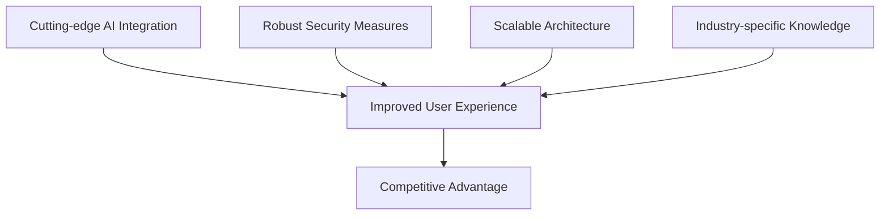
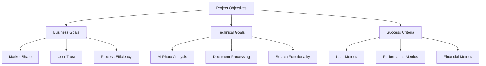
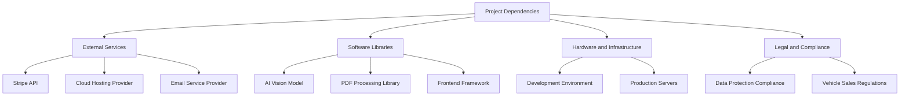
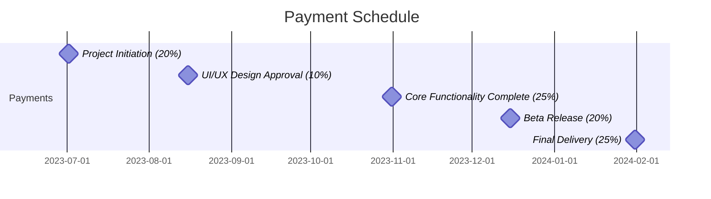
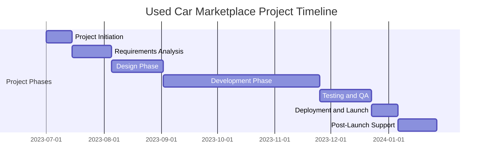
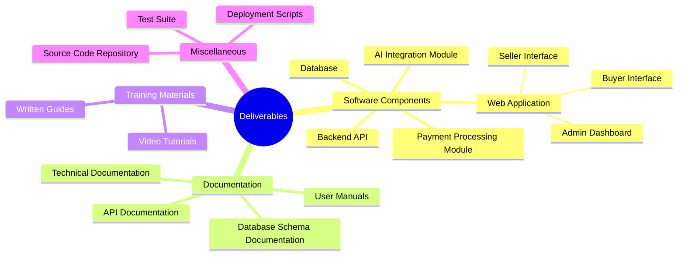

# EXECUTIVE SUMMARY

## PROJECT OVERVIEW

The Used Car Marketplace project aims to revolutionize the online buying and selling experience for pre-owned vehicles. Our client seeks to address the challenges of trust, transparency, and efficiency in the used car market. The proposed solution leverages cutting-edge technology to create a user-friendly platform that automates and streamlines the listing process for sellers while providing comprehensive, verified information for buyers.

Key features of the marketplace include:

1. Automated photo analysis for vehicle details extraction
2. Intelligent document processing for maintenance and repair history
3. User-friendly listing creation with AI-assisted descriptions
4. Advanced search functionality for buyers
5. Secure transaction processing with integrated payment gateway

## OBJECTIVES

1. Simplify the car listing process for sellers through AI-powered automation
2. Enhance trust and transparency by providing verified vehicle information
3. Improve the search experience for potential buyers
4. Streamline the transaction process with secure, integrated payments
5. Reduce fraudulent listings and improve overall marketplace quality
6. Increase user engagement and satisfaction for both buyers and sellers

## VALUE PROPOSITION

Our agency offers a unique combination of technical expertise and industry knowledge to deliver a state-of-the-art used car marketplace:

1. **AI-Powered Accuracy**: Our implementation of advanced computer vision and natural language processing ensures highly accurate vehicle information extraction and verification.

2. **Seamless User Experience**: By automating complex processes, we create an intuitive platform that caters to both tech-savvy users and those less familiar with online marketplaces.

3. **Enhanced Trust and Safety**: Our robust verification processes and secure payment integration build confidence among users, setting the platform apart from competitors.

4. **Scalable Architecture**: The solution is designed to handle growing user bases and expanding feature sets, ensuring long-term viability and ROI.

5. **Industry Expertise**: Our team's deep understanding of the automotive market allows us to anticipate user needs and implement features that address specific pain points in the used car buying and selling process.

By choosing our agency, the client gains a partner committed to delivering a transformative solution that will redefine the online used car marketplace landscape.

## PROJECT OBJECTIVES

### BUSINESS GOALS

1. Increase market share in the online used car marketplace sector
2. Enhance user trust and satisfaction in the platform
3. Streamline the car listing and buying process
4. Reduce fraudulent listings and improve overall marketplace quality
5. Increase revenue through successful transactions and potential premium features

### TECHNICAL GOALS

1. Implement an AI-powered photo analysis system for accurate vehicle detail extraction
2. Develop an intelligent document processing system for maintenance and repair history
3. Create a user-friendly interface for listing creation and management
4. Build a robust search functionality with advanced filtering options
5. Integrate a secure payment gateway with Stripe for seamless transactions
6. Develop a scalable architecture to support future growth and feature additions

### SUCCESS CRITERIA

| Metric | Target |
|--------|--------|
| User Acquisition | 20% increase in new users within 6 months of launch |
| Listing Accuracy | 95% accuracy in AI-extracted vehicle details |
| User Satisfaction | 4.5/5 star average rating from both buyers and sellers |
| Transaction Volume | 15% increase in successful transactions within 3 months |
| Listing Creation Time | 50% reduction in average time to create a listing |
| Search Relevance | 90% of users find desired vehicles within first 5 search results |
| Fraud Reduction | 80% decrease in reported fraudulent listings |
| Platform Uptime | 99.9% availability |
| Mobile Usage | 40% of transactions completed on mobile devices |

# SCOPE OF WORK

## IN-SCOPE

The Used Car Marketplace project will include the following tasks, features, and functionalities:

1. User Interface Development
   - Seller interface for photo upload and listing creation
   - Buyer interface for searching and viewing listings
   - Responsive design for desktop and mobile devices

2. AI-Powered Photo Analysis
   - Integration of a small vision model (e.g., Moondream)
   - Extraction of vehicle details (make, model, year, condition, mileage)
   - User verification and correction interface for extracted information

3. Document Processing
   - Upload functionality for maintenance and repair documents (PDFs, text summaries)
   - Document classification (service record, receipt, text summary)
   - Extraction of relevant repair and maintenance details

4. Database Design and Management
   - Storage of vehicle information, listings, and user data
   - Efficient querying for search functionality

5. Listing Creation and Management
   - Automated listing generation using extracted and user-provided information
   - AI-assisted description generation for vehicle listings
   - Pricing input and storage

6. Search Functionality
   - Implementation of a search bar on the homepage
   - Advanced filtering options based on vehicle attributes
   - Relevance-based results display

7. Transaction Processing
   - Integration of Stripe payment gateway
   - "Transact" button implementation on listing pages
   - PDF receipt generation for completed purchases
   - Automatic listing removal post-purchase

8. Security and Data Protection
   - Secure user authentication and authorization
   - Encryption of sensitive data
   - Compliance with relevant data protection regulations

9. Performance Optimization
   - Caching mechanisms for frequently accessed data
   - Database query optimization
   - Front-end performance enhancements

10. Testing and Quality Assurance
    - Unit testing for all components
    - Integration testing for system cohesion
    - User acceptance testing (UAT)

11. Deployment and Hosting
    - Setup of production environment
    - Continuous integration and deployment (CI/CD) pipeline

12. Documentation
    - User manuals for buyers and sellers
    - Technical documentation for system maintenance

## OUT-OF-SCOPE

The following items are explicitly excluded from the project scope:

1. Physical vehicle inspections or verifications
2. Integration with external vehicle history report services (e.g., Carfax)
3. Real-time video streaming or live chat functionality
4. Mobile app development (native iOS or Android apps)
5. Integration with external financing or insurance providers
6. Automated pricing suggestions or market value estimations
7. Multi-language support (initial release will be in English only)
8. Vehicle shipping or logistics arrangements
9. User identity verification beyond basic account creation
10. Automated license plate recognition or VIN decoding

## ASSUMPTIONS

The project plan is based on the following assumptions:

1. The client will provide timely feedback and approvals at designated project milestones.
2. The chosen AI model (e.g., Moondream) will be suitable for the required photo analysis tasks.
3. Stripe API will remain stable and compatible throughout the development process.
4. The client has the necessary rights to use and process user-submitted photos and documents.
5. Users will have access to devices capable of taking clear, high-resolution photos of vehicles.
6. The project will not require additional hardware beyond standard cloud hosting services.
7. Third-party services and APIs (e.g., cloud storage, email services) will maintain their current functionality and pricing structures.
8. The client will handle any necessary legal compliance related to vehicle sales in their operating jurisdictions.
9. The development team will have continuous access to necessary development tools and environments.
10. The project timeline allows for potential adjustments due to the complexity of AI integration.

## DEPENDENCIES

The project has the following dependencies that could impact the timeline or deliverables:

1. External Services:
   - Stripe API for payment processing
   - Cloud hosting provider for application deployment
   - Email service provider for user notifications

2. Software Libraries:
   - AI vision model (e.g., Moondream) for photo analysis
   - PDF processing library for document handling
   - Frontend framework (e.g., React, Vue.js) for UI development

3. Hardware and Infrastructure:
   - Development environment setup and maintenance
   - Production servers with sufficient capacity for AI processing and data storage

4. Legal and Compliance:
   - Approval of terms of service and privacy policy
   - Compliance with local vehicle sales regulations in operating jurisdictions

5. Client Resources:
   - Availability of client stakeholders for regular meetings and approvals
   - Access to any existing brand guidelines or design preferences

6. Third-Party Integrations:
   - Stability and compatibility of the chosen AI model
   - Continued support and documentation for all integrated services

7. Data:
   - Availability of a test dataset for AI model training and testing
   - Sample vehicle documents for developing the document processing feature

8. Skills and Expertise:
   - Availability of team members with AI integration experience
   - Access to subject matter experts in the used car market (if needed)

9. Timeline:
   - Coordination with any planned marketing or launch activities by the client
   - Alignment with Stripe's release schedule for any new features we plan to use

10. Security:
    - Timely security audits and penetration testing
    - Acquisition of necessary SSL certificates for secure communications

## BUDGET AND COST ESTIMATES

### COST BREAKDOWN

The following table provides a detailed breakdown of the project costs:

| Category | Item | Quantity | Unit Cost | Total Cost |
|----------|------|----------|-----------|------------|
| Labor | Senior Full-Stack Developer | 800 hours | $150/hour | $120,000 |
| Labor | AI/ML Specialist | 400 hours | $175/hour | $70,000 |
| Labor | UI/UX Designer | 300 hours | $125/hour | $37,500 |
| Labor | Project Manager | 400 hours | $140/hour | $56,000 |
| Labor | QA Specialist | 300 hours | $100/hour | $30,000 |
| Software | AI Vision Model License | 1 | $10,000 | $10,000 |
| Software | PDF Processing Library License | 1 | $2,000 | $2,000 |
| Software | Frontend Framework License | 1 | $0 (Open Source) | $0 |
| Infrastructure | Cloud Hosting (Development) | 6 months | $1,000/month | $6,000 |
| Infrastructure | Cloud Hosting (Production) | 1 year | $2,000/month | $24,000 |
| Services | Stripe Integration | 1 | $5,000 | $5,000 |
| Services | Security Audit | 1 | $15,000 | $15,000 |
| Miscellaneous | Testing Devices | 5 | $1,000 | $5,000 |
| Miscellaneous | Contingency (10%) | 1 | $38,050 | $38,050 |
| **Total** | | | | **$418,550** |

### PAYMENT SCHEDULE

The proposed payment schedule is tied to project milestones:

1. Project Initiation (20%): $83,710 - Due upon contract signing
2. UI/UX Design Approval (10%): $41,855 - Due upon client approval of design mockups
3. Core Functionality Complete (25%): $104,637.50 - Due upon completion of AI integration, database setup, and basic listing functionality
4. Beta Release (20%): $83,710 - Due upon successful deployment of beta version for testing
5. Final Delivery (25%): $104,637.50 - Due upon project completion and client acceptance

### BUDGET CONSIDERATIONS

Several factors could impact the budget, and we have strategies in place to manage these risks:

1. AI Model Performance:
   - Risk: The chosen AI vision model may require additional fine-tuning or a more powerful alternative.
   - Mitigation: We've allocated extra hours for the AI/ML specialist and included a contingency budget.

2. Scalability Challenges:
   - Risk: As the platform grows, infrastructure costs may increase more rapidly than anticipated.
   - Mitigation: We'll implement cost-optimization strategies and regularly review cloud resource allocation.

3. Regulatory Compliance:
   - Risk: Changes in data protection or vehicle sales regulations may require additional development work.
   - Mitigation: We've included a buffer in the development hours and will stay informed about relevant regulations.

4. Third-Party Service Changes:
   - Risk: Stripe or other integrated services may change their APIs or pricing structures.
   - Mitigation: We'll design with modularity in mind to allow for easier service swaps if necessary.

5. Scope Creep:
   - Risk: Client requests for additional features may expand the project scope.
   - Mitigation: We'll use a change request process and adjust the budget and timeline accordingly for any approved changes.

6. Security Vulnerabilities:
   - Risk: The security audit may uncover issues requiring significant additional work.
   - Mitigation: We've allocated ample time for security-focused development and included a post-audit buffer.

7. Performance Optimization:
   - Risk: Achieving the desired system performance may require more optimization than initially estimated.
   - Mitigation: We've included performance testing in our QA process and allocated time for optimization work.

8. Exchange Rate Fluctuations:
   - Risk: For any international expenses, currency fluctuations could impact costs.
   - Mitigation: We'll use forward contracts or set aside a small forex contingency if applicable.

9. Talent Availability:
   - Risk: Difficulty in finding specialized AI talent could delay the project or increase costs.
   - Mitigation: We have a network of contractors we can engage if needed, and have factored this into our contingency.

10. Hardware Costs:
    - Risk: Testing on a wide range of devices could incur additional hardware costs.
    - Mitigation: We've included a budget for testing devices and will utilize emulators where possible.

By carefully monitoring these potential issues and maintaining open communication with the client, we aim to deliver the project within the proposed budget while meeting all specified requirements.

## TIMELINE AND MILESTONES

### PROJECT TIMELINE

The Used Car Marketplace project is estimated to take approximately 6 months from initiation to completion. The high-level timeline is outlined below:

### KEY MILESTONES

| Milestone | Description | Target Date |
|-----------|-------------|-------------|
| M1: Project Kickoff | Project initiation, team assembly, and initial planning | 2023-07-01 |
| M2: Requirements Approval | Client sign-off on detailed project requirements | 2023-08-04 |
| M3: Design Approval | Completion of UI/UX design and system architecture | 2023-09-01 |
| M4: Core Functionality Complete | Basic listing creation, search, and transaction processing implemented | 2023-10-27 |
| M5: AI Integration Complete | Photo analysis and document processing features fully integrated | 2023-11-24 |
| M6: Beta Release | Feature-complete version ready for comprehensive testing | 2023-12-22 |
| M7: Production Deployment | Platform launched and operational | 2024-01-05 |
| M8: Project Closure | Post-launch support completed, final documentation delivered | 2024-01-26 |

### CRITICAL PATH

The following tasks and activities are critical to keeping the project on schedule:

1. AI Model Selection and Integration
   - Evaluation and selection of the vision model (e.g., Moondream)
   - Integration of the model with the photo upload and analysis system

2. Database Design and Implementation
   - Design of the database schema to accommodate all required data points
   - Implementation and optimization of the database for efficient querying

3. Core Functionality Development
   - Implementation of the listing creation process
   - Development of the search functionality
   - Integration of the Stripe payment gateway

4. User Interface Development
   - Creation of responsive designs for all key pages
   - Implementation of the frontend using the chosen framework

5. Testing and Quality Assurance
   - Comprehensive testing of AI-powered features
   - Performance testing and optimization
   - Security audits and vulnerability assessments

6. Deployment Preparation
   - Setup of the production environment
   - Configuration of CI/CD pipelines
   - Final data migration and system checks

To ensure the project remains on track, we will:

- Conduct weekly progress reviews focusing on critical path items
- Implement a risk management strategy to identify and mitigate potential delays
- Maintain open communication channels with the client for quick decision-making
- Utilize agile methodologies to adapt to changes and maintain flexibility
- Allocate additional resources to critical path tasks if necessary to meet deadlines

By closely monitoring these critical path elements and adhering to our milestone schedule, we aim to deliver the Used Car Marketplace project on time and within scope.

# DELIVERABLES

## LIST OF DELIVERABLES

The Used Car Marketplace project will produce the following tangible outputs:

1. Software Components
   - Web Application
     - Seller Interface
     - Buyer Interface
     - Admin Dashboard
   - Backend API
   - Database
   - AI Integration Module
   - Payment Processing Module

2. Documentation
   - Technical Documentation
   - User Manuals (Buyer and Seller)
   - API Documentation
   - Database Schema Documentation

3. Training Materials
   - Video Tutorials
   - Written Guides

4. Miscellaneous
   - Source Code Repository
   - Deployment Scripts
   - Test Suite

## DELIVERY SCHEDULE

The following table outlines the expected delivery dates for each major deliverable:

| Deliverable | Expected Delivery Date |
|-------------|------------------------|
| Requirements Document | 2023-08-04 |
| UI/UX Design Mockups | 2023-08-25 |
| Database Schema | 2023-09-08 |
| Backend API (Alpha) | 2023-09-29 |
| AI Integration Module | 2023-10-20 |
| Web Application (Beta) | 2023-11-17 |
| Payment Processing Module | 2023-12-01 |
| User Manuals | 2023-12-08 |
| Technical Documentation | 2023-12-15 |
| Video Tutorials | 2023-12-22 |
| Fully Integrated System (Release Candidate) | 2024-01-05 |
| Final Deployment | 2024-01-19 |
| Project Closure Report | 2024-01-26 |

## ACCEPTANCE CRITERIA

To ensure that each deliverable meets the client's requirements, the following acceptance criteria will be used:

1. Web Application
   - Responsive design works on desktop and mobile devices
   - All features outlined in the requirements document are implemented
   - User interface matches approved design mockups
   - Passes all functional tests with 100% success rate
   - Achieves performance benchmarks (e.g., page load times under 3 seconds)

2. AI Integration Module
   - Accurately extracts vehicle details from photos with at least 95% accuracy
   - Correctly classifies and processes maintenance documents
   - Integrates seamlessly with the web application
   - Processes photos and documents within specified time limits

3. Backend API
   - Adheres to RESTful principles
   - Includes comprehensive error handling
   - Passes all unit and integration tests
   - Meets specified performance criteria under load testing

4. Database
   - Implements the approved schema design
   - Supports all required queries with optimal performance
   - Includes necessary indexes and optimizations
   - Successfully handles concurrent operations

5. Payment Processing Module
   - Integrates successfully with Stripe API
   - Processes test transactions without errors
   - Generates accurate receipts in PDF format
   - Implements proper security measures for handling sensitive data

6. Documentation
   - Covers all aspects of system architecture and functionality
   - Is clear, concise, and free of technical errors
   - Includes all necessary diagrams and examples
   - Passes review by technical and non-technical stakeholders

7. Training Materials
   - Cover all key features of the platform
   - Are easy to understand for the target audience
   - Include practical examples and use cases
   - Receive positive feedback from a test group of users

8. Source Code
   - Follows agreed-upon coding standards
   - Is properly commented and documented
   - Passes static code analysis with no critical issues
   - Achieves specified code coverage in unit tests

9. Deployment Scripts
   - Successfully deploy the application to the production environment
   - Include rollback procedures
   - Are well-documented and repeatable

10. Test Suite
    - Covers all critical paths and edge cases
    - Achieves specified code coverage percentage
    - Can be run automatically as part of the CI/CD pipeline

Each deliverable will be subject to a formal review process involving key stakeholders from both the development team and the client side. Acceptance will be granted only when all criteria are met and any identified issues are resolved to the client's satisfaction.