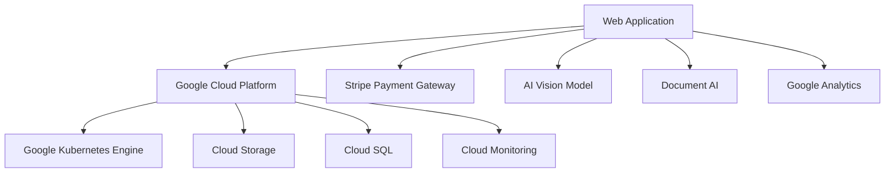
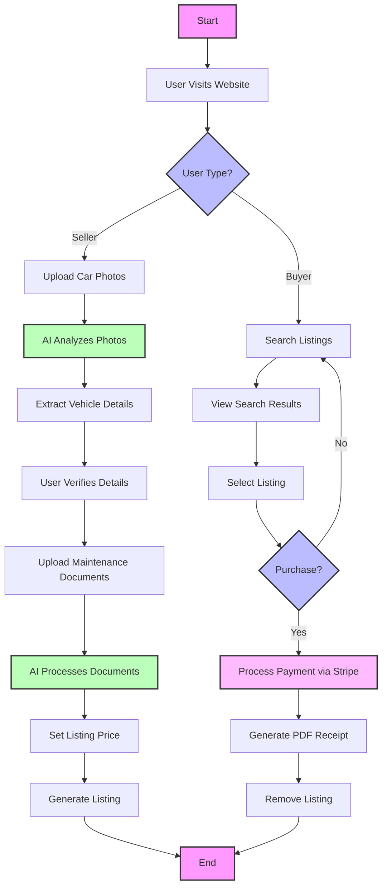
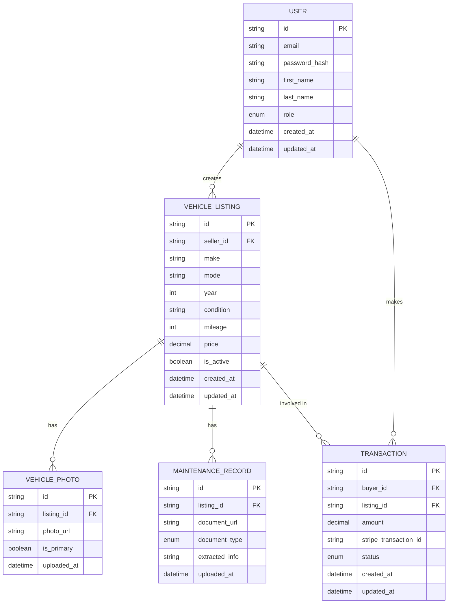
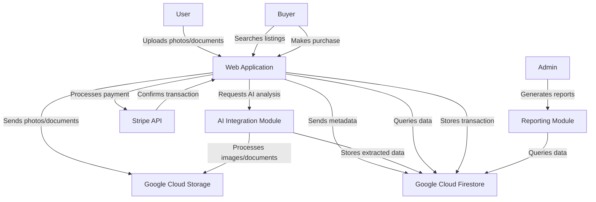

# 1. INTRODUCTION

## 1.1 PURPOSE

The purpose of this Software Requirements Specification (SRS) document is to provide a comprehensive and detailed description of the Used Car Marketplace project. This document serves as the primary reference for all stakeholders involved in the development, implementation, and maintenance of the system. It aims to:

1. Clearly define the functional and non-functional requirements of the Used Car Marketplace.
2. Establish a common understanding between the client, development team, and other stakeholders.
3. Serve as a basis for project planning, cost estimation, and resource allocation.
4. Provide a benchmark for validation and verification of the final product.

The intended audience for this SRS includes:

- Project managers and team leads
- Software developers and engineers
- Quality assurance testers
- UI/UX designers
- Client representatives and stakeholders
- System administrators and maintenance personnel

This document assumes that readers have a basic understanding of e-commerce platforms, web technologies, and the used car market.

## 1.2 SCOPE

The Used Car Marketplace is a state-of-the-art online platform designed to revolutionize the buying and selling experience of pre-owned vehicles. The system leverages advanced technologies, including artificial intelligence and secure payment processing, to create a trustworthy and efficient marketplace for both sellers and buyers.

### Goals

1. Simplify the process of listing used cars for sale
2. Enhance the accuracy and reliability of vehicle information
3. Provide a user-friendly search and discovery experience for potential buyers
4. Streamline the transaction process from listing to purchase
5. Reduce fraudulent activities and increase trust in the marketplace

### Benefits

1. Time and cost savings for sellers through automated information extraction
2. Increased confidence for buyers with verified vehicle information
3. Improved market efficiency by connecting sellers and buyers more effectively
4. Enhanced user experience through intuitive interfaces and AI-assisted features
5. Reduced risk of fraud and disputes in used car transactions

### Core Functionalities

1. **AI-Powered Photo Analysis**: Utilizing a small vision model (e.g., Moondream) to automatically extract vehicle details from uploaded photos.

2. **Intelligent Document Processing**: Analyzing and categorizing maintenance records, receipts, and summaries to provide comprehensive vehicle history.

3. **User-Friendly Listing Creation**: Guiding sellers through an intuitive process to create detailed and accurate car listings.

4. **Advanced Search and Filtering**: Enabling buyers to easily find vehicles matching their criteria through a powerful search interface.

5. **Secure Transaction Processing**: Integrating Stripe payment gateway for safe and efficient monetary transactions.

6. **Responsive Web Application**: Delivering a seamless experience across desktop and mobile devices using React and Tailwind CSS.

7. **Scalable Backend Architecture**: Implementing a robust Python-based backend with Google Cloud services for optimal performance and scalability.

The Used Car Marketplace aims to set a new standard in the online automotive retail space by combining cutting-edge technology with user-centric design, ultimately creating a more transparent, efficient, and trustworthy platform for used car transactions.

# 2. PRODUCT DESCRIPTION

## 2.1 PRODUCT PERSPECTIVE

The Used Car Marketplace is a standalone web application designed to operate within the broader ecosystem of online automotive retail. While it functions independently, it integrates with external services and platforms to enhance its capabilities:

1. **Cloud Infrastructure**: The application is built on Google Cloud Platform (GCP), leveraging services such as Google Kubernetes Engine for containerization and scalability, Cloud Storage for file management, and Cloud SQL for database hosting.

2. **Payment Processing**: Integration with Stripe's payment gateway enables secure financial transactions within the platform.

3. **AI Services**: The system utilizes a small vision model (e.g., Moondream) for photo analysis, which may be hosted on GCP's AI Platform or run as a containerized service.

4. **Document Processing**: Google Cloud's Document AI may be employed to enhance the processing and analysis of maintenance records and receipts.

5. **Analytics and Monitoring**: Google Analytics and Cloud Monitoring are integrated to provide insights into user behavior and system performance.

The application's architecture can be visualized as follows:

## 2.2 PRODUCT FUNCTIONS

The Used Car Marketplace provides the following key functions:

1. **User Authentication and Management**
   - User registration and login
   - Profile management for buyers and sellers

2. **Vehicle Listing Creation**
   - Photo upload and AI-powered analysis
   - Automated extraction of vehicle details
   - Manual input and verification of vehicle information
   - Document upload for maintenance and repair history

3. **Listing Management**
   - Edit, update, or remove listings
   - Set pricing and adjust listing details

4. **Search and Discovery**
   - Advanced search functionality with multiple filters
   - Relevance-based results display
   - Saved searches and alerts

5. **Vehicle Information Display**
   - Detailed vehicle pages with photos, specifications, and history
   - AI-generated vehicle descriptions

6. **Transaction Processing**
   - Secure payment processing through Stripe integration
   - Purchase confirmation and receipt generation

7. **User Interaction**
   - Messaging system between buyers and sellers
   - Rating and review system for completed transactions

8. **Admin Functions**
   - Content moderation
   - User management
   - Analytics and reporting

## 2.3 USER CHARACTERISTICS

The Used Car Marketplace caters to three primary user groups:

1. **Sellers**
   - Characteristics: Individual car owners, small dealerships, or professional car flippers
   - Technical Expertise: Varied, from basic to advanced
   - Goals: Quickly and easily list vehicles for sale, reach a wide audience of potential buyers
   - Persona: "Sarah the Seller" - A 35-year-old professional looking to upgrade her car and sell her current vehicle efficiently

2. **Buyers**
   - Characteristics: Individuals or families in the market for a used car
   - Technical Expertise: Basic to intermediate
   - Goals: Find reliable vehicles, compare options, and make informed purchasing decisions
   - Persona: "Brian the Buyer" - A 28-year-old first-time car buyer looking for a reliable used vehicle within his budget

3. **Administrators**
   - Characteristics: Platform managers and support staff
   - Technical Expertise: Advanced
   - Goals: Maintain platform integrity, manage users, and ensure smooth operation
   - Persona: "Admin Alex" - A 40-year-old experienced e-commerce platform manager responsible for overseeing the marketplace

## 2.4 CONSTRAINTS

The Used Car Marketplace operates under the following constraints:

1. **Technical Constraints**
   - Must be compatible with modern web browsers (Chrome, Firefox, Safari, Edge)
   - Mobile responsiveness is required for all user interfaces
   - AI model size must be optimized for quick processing without compromising accuracy
   - Database design must support efficient querying of large datasets

2. **Regulatory Constraints**
   - Compliance with data protection regulations (e.g., GDPR, CCPA)
   - Adherence to online marketplace regulations and consumer protection laws
   - Compliance with financial regulations related to online transactions

3. **Business Constraints**
   - Initial launch limited to a single country or region
   - Budget limitations for third-party services and API usage
   - Timeline constraints for development and launch

4. **Operational Constraints**
   - System must handle peak loads during high-traffic periods
   - Maintenance windows must be scheduled to minimize user disruption
   - Support for a minimum of 10,000 concurrent users

5. **Security Constraints**
   - Implementation of robust encryption for user data and transactions
   - Regular security audits and penetration testing required
   - Compliance with PCI DSS for handling payment information

6. **User Interface Constraints**
   - Adherence to Web Content Accessibility Guidelines (WCAG) 2.1 Level AA
   - Maximum page load time of 3 seconds on standard broadband connections
   - Support for the latest two major versions of each supported browser

## 2.5 ASSUMPTIONS AND DEPENDENCIES

The project is based on the following assumptions and dependencies:

### Assumptions

1. Users have access to devices with cameras capable of taking high-quality photos of vehicles
2. The majority of users have a basic understanding of vehicle specifications and terminology
3. Sellers are willing to provide accurate and detailed information about their vehicles
4. The chosen AI model (e.g., Moondream) will be sufficient for accurate vehicle detail extraction
5. The volume of listings and transactions will grow steadily, allowing for gradual scaling of infrastructure

### Dependencies

1. **External Services**
   - Continued availability and reliability of the Stripe payment gateway
   - Stability of the Google Cloud Platform and its services
   - Ongoing support and updates for the chosen AI vision model

2. **Third-Party Libraries**
   - React and its ecosystem for frontend development
   - Python libraries for backend development and AI integration
   - Tailwind CSS for styling and responsive design

3. **Regulatory Compliance**
   - Ongoing compliance with evolving data protection and e-commerce regulations
   - Ability to adapt to changes in vehicle sales laws and regulations

4. **User Adoption**
   - Successful marketing and user acquisition strategies
   - Positive user feedback and word-of-mouth promotion

5. **Data Quality**
   - Availability of accurate and up-to-date vehicle information for AI model training
   - Cooperation from users in providing and verifying vehicle details

6. **Technical Skills**
   - Availability of developers skilled in React, TypeScript, Python, and AI integration
   - Ongoing training and skill development for the development team

7. **Infrastructure**
   - Reliable internet connectivity for cloud service operations
   - Scalable cloud resources to accommodate growth

8. **Security**
   - Timely security updates for all system components
   - Ongoing monitoring and rapid response to potential security threats

By acknowledging these assumptions and dependencies, the project team can better plan for potential risks and ensure the successful development and deployment of the Used Car Marketplace.

Here's the PROCESS FLOWCHART section for the Used Car Marketplace SRS using Mermaid JS:

## PROCESS FLOWCHART

The following flowchart illustrates the main processes of the Used Car Marketplace:

This flowchart outlines the main processes for both sellers and buyers in the Used Car Marketplace:

1. The user visits the website, implemented using React and Tailwind CSS for a responsive and modern UI.

2. The user is identified as either a seller or a buyer.

3. For Sellers:
   - They upload car photos, which are processed by the AI vision model (e.g., Moondream).
   - The AI extracts vehicle details, which the user verifies or corrects.
   - The seller uploads maintenance documents, which are processed by the AI.
   - The seller sets a listing price, and the listing is generated and added to the database.

4. For Buyers:
   - They can search listings using the advanced search functionality.
   - They view search results and can select individual listings for more details.
   - If they decide to purchase, the payment is processed via the Stripe integration.
   - Upon successful payment, a PDF receipt is generated, and the listing is removed from the marketplace.

The backend processes, including AI analysis, document processing, and database operations, are implemented in Python for optimal performance and integration with AI libraries.

This flowchart provides a high-level overview of the system's main processes, illustrating the user journey for both sellers and buyers, and highlighting the key AI-powered features that set this marketplace apart from traditional platforms.

Here's a breakdown of the Used Car Marketplace product into features, with the requested sub-sections for each:

1. User Authentication and Management

ID: F001
DESCRIPTION: Implement a secure user authentication system for buyers, sellers, and administrators.
PRIORITY: High

| Requirement ID | Requirement Description |
|----------------|--------------------------|
| F001-1 | User registration with email verification |
| F001-2 | Secure login with password hashing |
| F001-3 | Password reset functionality |
| F001-4 | User profile management |
| F001-5 | Role-based access control (buyer, seller, admin) |

2. AI-Powered Photo Analysis

ID: F002
DESCRIPTION: Utilize a small vision model to automatically extract vehicle details from uploaded photos.
PRIORITY: High

| Requirement ID | Requirement Description |
|----------------|--------------------------|
| F002-1 | Integration of Moondream or similar AI vision model |
| F002-2 | Photo upload interface with preview |
| F002-3 | Extraction of vehicle make, model, year, condition, and mileage |
| F002-4 | User verification interface for extracted information |
| F002-5 | Storage of verified vehicle details in the database |

3. Intelligent Document Processing

ID: F003
DESCRIPTION: Analyze and categorize maintenance records, receipts, and summaries to provide comprehensive vehicle history.
PRIORITY: Medium

| Requirement ID | Requirement Description |
|----------------|--------------------------|
| F003-1 | Document upload interface for PDFs and text summaries |
| F003-2 | AI-powered document classification (service record, receipt, summary) |
| F003-3 | Extraction of relevant details (repair type, cost, date) |
| F003-4 | Storage of processed document information in the database |
| F003-5 | Display of document summary in vehicle listing |

4. Listing Creation and Management

ID: F004
DESCRIPTION: Provide an intuitive interface for sellers to create and manage vehicle listings.
PRIORITY: High

| Requirement ID | Requirement Description |
|----------------|--------------------------|
| F004-1 | Step-by-step listing creation wizard |
| F004-2 | Integration of AI-extracted vehicle details |
| F004-3 | Manual input fields for additional information |
| F004-4 | Pricing input and storage |
| F004-5 | Listing edit and delete functionality |

5. Advanced Search and Filtering

ID: F005
DESCRIPTION: Implement a powerful search interface for buyers to find vehicles matching their criteria.
PRIORITY: High

| Requirement ID | Requirement Description |
|----------------|--------------------------|
| F005-1 | Full-text search functionality |
| F005-2 | Advanced filtering options (make, model, year, price range, etc.) |
| F005-3 | Sort results by relevance, price, or date listed |
| F005-4 | Save search criteria functionality |
| F005-5 | Pagination of search results |

6. Secure Transaction Processing

ID: F006
DESCRIPTION: Integrate Stripe payment gateway for safe and efficient monetary transactions.
PRIORITY: High

| Requirement ID | Requirement Description |
|----------------|--------------------------|
| F006-1 | Stripe API integration |
| F006-2 | Secure payment form implementation |
| F006-3 | Transaction processing and confirmation |
| F006-4 | PDF receipt generation |
| F006-5 | Automatic listing removal after successful purchase |

7. Responsive Web Application

ID: F007
DESCRIPTION: Develop a responsive web application using React and Tailwind CSS for optimal user experience across devices.
PRIORITY: High

| Requirement ID | Requirement Description |
|----------------|--------------------------|
| F007-1 | Responsive design for desktop, tablet, and mobile |
| F007-2 | Implementation of React components for UI elements |
| F007-3 | Utilization of Tailwind CSS for styling |
| F007-4 | Optimized performance and load times |
| F007-5 | Cross-browser compatibility |

8. Admin Dashboard

ID: F008
DESCRIPTION: Create an administrative interface for managing users, listings, and platform settings.
PRIORITY: Medium

| Requirement ID | Requirement Description |
|----------------|--------------------------|
| F008-1 | User management (view, edit, suspend accounts) |
| F008-2 | Listing moderation and management |
| F008-3 | Transaction history and reporting |
| F008-4 | Platform settings configuration |
| F008-5 | Analytics dashboard for key metrics |

9. Messaging System

ID: F009
DESCRIPTION: Implement a messaging system for communication between buyers and sellers.
PRIORITY: Medium

| Requirement ID | Requirement Description |
|----------------|--------------------------|
| F009-1 | In-app messaging interface |
| F009-2 | Real-time message notifications |
| F009-3 | Message history and thread management |
| F009-4 | File attachment capability |
| F009-5 | Reporting and blocking functionality |

10. Review and Rating System

ID: F010
DESCRIPTION: Develop a system for users to rate and review their transaction experiences.
PRIORITY: Low

| Requirement ID | Requirement Description |
|----------------|--------------------------|
| F010-1 | User rating submission interface |
| F010-2 | Written review functionality |
| F010-3 | Display of aggregate ratings on user profiles |
| F010-4 | Moderation system for reviews |
| F010-5 | Integration of ratings into search result ranking |

These features will be implemented using TypeScript, React, and Tailwind CSS for the frontend, Python for the backend, and Google Cloud services for hosting and infrastructure. The AI components will utilize the specified vision model (e.g., Moondream) and appropriate natural language processing libraries for document analysis.

# NON-FUNCTIONAL REQUIREMENTS

## PERFORMANCE

1. Response Time
   - Web pages should load within 2 seconds under normal conditions.
   - API responses should be delivered within 200ms for 95% of requests.
   - Search results should be returned within 500ms for queries with up to 1000 results.

2. Throughput
   - The system should support at least 1000 concurrent users without degradation in performance.
   - The platform should handle a minimum of 100 transactions per minute during peak hours.

3. Resource Usage
   - CPU utilization should not exceed 70% under normal load conditions.
   - Memory usage should not exceed 80% of available RAM.
   - Database queries should be optimized to use no more than 10% of CPU time.

4. Image Processing
   - AI-powered photo analysis should complete within 5 seconds per image.
   - Document processing should take no longer than 10 seconds per document.

## SAFETY

1. Data Backup
   - Automated daily backups of all user data and system configurations.
   - Backup retention period of 30 days.
   - Ability to restore from backup within 4 hours of system failure.

2. Fault Tolerance
   - Implement redundancy for critical system components to ensure 99.9% uptime.
   - Graceful degradation of non-critical features during partial system failures.

3. Error Handling
   - Comprehensive error logging and monitoring system.
   - Automatic notification to system administrators for critical errors.

4. Data Integrity
   - Implement database transactions to ensure data consistency.
   - Regular data integrity checks to detect and report any inconsistencies.

## SECURITY

1. Authentication
   - Multi-factor authentication option for user accounts.
   - Password complexity requirements (minimum 12 characters, including uppercase, lowercase, numbers, and special characters).
   - Account lockout after 5 failed login attempts.

2. Authorization
   - Role-based access control (RBAC) for different user types (buyers, sellers, administrators).
   - Principle of least privilege applied to all system components.

3. Data Encryption
   - Use of HTTPS/TLS 1.3 for all data transmissions.
   - Encryption of sensitive data at rest using AES-256.
   - Secure key management using Google Cloud KMS.

4. Privacy
   - Compliance with GDPR and CCPA regulations.
   - User data anonymization for analytics and reporting purposes.
   - Opt-in consent for data collection and processing.

5. Security Auditing
   - Regular penetration testing (at least twice a year).
   - Automated vulnerability scanning of the application and infrastructure.
   - Security incident response plan with defined procedures and roles.

## QUALITY

1. Availability
   - 99.9% uptime guaranteed during business hours.
   - Scheduled maintenance windows communicated at least 48 hours in advance.

2. Maintainability
   - Well-documented codebase with inline comments and external documentation.
   - Modular architecture to facilitate easy updates and feature additions.
   - Use of dependency management tools (npm for frontend, pip for backend).

3. Usability
   - Intuitive user interface design following Material Design principles.
   - Accessibility compliance with WCAG 2.1 Level AA standards.
   - Support for multiple languages (initially English, with easy addition of new languages).

4. Scalability
   - Horizontal scalability of application servers to handle increased load.
   - Use of Google Cloud's auto-scaling features for dynamic resource allocation.
   - Database sharding strategy for handling large data volumes.

5. Reliability
   - Mean Time Between Failures (MTBF) of at least 720 hours.
   - Mean Time To Repair (MTTR) of less than 2 hours for critical issues.
   - Automated system health checks every 5 minutes.

## COMPLIANCE

1. Legal
   - Compliance with local vehicle sales regulations in operating jurisdictions.
   - Adherence to consumer protection laws regarding online transactions.
   - Implementation of a clear and legally compliant refund policy.

2. Regulatory
   - GDPR compliance for handling personal data of EU residents.
   - CCPA compliance for California residents' data rights.
   - PCI DSS compliance for handling credit card information.

3. Standards
   - ISO/IEC 27001 compliance for information security management.
   - OpenAPI (Swagger) specification for API documentation.
   - Adherence to Google Cloud's best practices for cloud-native applications.

4. Accessibility
   - WCAG 2.1 Level AA compliance for web accessibility.
   - Support for screen readers and keyboard navigation.

5. Environmental
   - Implementation of energy-efficient coding practices.
   - Use of Google Cloud's carbon-neutral data centers.

6. Reporting
   - Automated generation of compliance reports for auditing purposes.
   - Regular internal audits to ensure ongoing compliance with all relevant standards and regulations.

These non-functional requirements will be implemented using TypeScript, React, and Tailwind CSS for the frontend, Python for the backend, and leveraging Google Cloud services for hosting, security, and scalability. The development team will ensure that all components of the Used Car Marketplace adhere to these requirements throughout the development lifecycle and beyond.

# DATA REQUIREMENTS

## DATA MODELS

The Used Car Marketplace will utilize the following data models to represent the core entities and their relationships:

These data models will be implemented using Google Cloud Firestore, a NoSQL document database, to ensure scalability and flexibility. The relationships between entities will be maintained through document references.

## DATA STORAGE

### Data Retention

1. User data: Retained for the lifetime of the account, with an option for users to request data deletion in compliance with GDPR and CCPA.
2. Vehicle listings: Retained for 5 years after the listing is marked as sold or deactivated.
3. Transaction records: Retained for 7 years to comply with financial regulations.
4. Maintenance records and vehicle photos: Retained for the lifetime of the associated vehicle listing.

### Redundancy and Backup

1. Google Cloud Firestore will be configured for multi-region replication to ensure high availability and data redundancy.
2. Daily backups of the entire database will be performed and stored in Google Cloud Storage with the following retention policy:
   - Daily backups retained for 30 days
   - Weekly backups retained for 3 months
   - Monthly backups retained for 1 year

3. Vehicle photos and maintenance documents will be stored in Google Cloud Storage with multi-region redundancy.

### Recovery

1. A disaster recovery plan will be implemented with the following key components:
   - Automated failover to secondary regions in case of primary region failure
   - Regular testing of backup restoration processes
   - Documented procedures for data recovery in various scenarios (e.g., data corruption, accidental deletion)

2. Recovery Time Objective (RTO): 4 hours
3. Recovery Point Objective (RPO): 1 hour

### Scalability

1. Google Cloud Firestore will be used as the primary database, which automatically scales to handle increased load.
2. Google Cloud Storage will be used for storing large files (photos and documents), which provides virtually unlimited scalability.
3. Caching layers using Google Cloud Memorystore will be implemented to reduce database load for frequently accessed data.

## DATA PROCESSING

### Data Security

1. Encryption at rest: All data stored in Google Cloud Firestore and Google Cloud Storage will be encrypted using Google-managed encryption keys.
2. Encryption in transit: All data transmissions will use TLS 1.3 encryption.
3. Access control:
   - Identity and Access Management (IAM) will be used to control access to Google Cloud resources.
   - Application-level role-based access control (RBAC) will be implemented to manage user permissions.
4. Sensitive data handling:
   - Personal Identifiable Information (PII) will be stored in a separate, more restricted collection in Firestore.
   - Payment information will not be stored; instead, Stripe's token system will be used.

### Data Flow

The following diagram illustrates the high-level data flow within the Used Car Marketplace:

### Data Processing Steps

1. Photo Upload and Analysis:
   - User uploads vehicle photos through the React-based UI.
   - Photos are stored in Google Cloud Storage.
   - AI Integration Module (Python-based) analyzes photos to extract vehicle details.
   - Extracted data is stored in Google Cloud Firestore.

2. Document Processing:
   - User uploads maintenance documents through the UI.
   - Documents are stored in Google Cloud Storage.
   - AI Integration Module processes documents to extract relevant information.
   - Extracted data is stored in Google Cloud Firestore.

3. Search and Retrieval:
   - User initiates a search query through the UI.
   - Backend API (Python-based) queries Google Cloud Firestore.
   - Results are returned to the UI and displayed using React components.

4. Transaction Processing:
   - Buyer initiates a purchase through the UI.
   - Backend API integrates with Stripe for payment processing.
   - Transaction details are stored in Google Cloud Firestore.
   - Vehicle listing is updated to reflect the sale.

5. Reporting and Analytics:
   - Admin requests generate reports through the UI.
   - Reporting Module queries Google Cloud Firestore for relevant data.
   - Reports are generated and displayed using React components and data visualization libraries.

By implementing these data requirements, the Used Car Marketplace will ensure efficient data management, robust security, and scalable performance to support the platform's growth and user needs.

# 3. EXTERNAL INTERFACES

## 3.1 USER INTERFACES

The Used Car Marketplace will provide intuitive and responsive user interfaces for buyers, sellers, and administrators. The interfaces will be developed using React and styled with Tailwind CSS to ensure a modern, consistent, and mobile-friendly design.

### 3.1.1 Seller Interface

The seller interface will include the following key components:

1. Vehicle Listing Creation Wizard
   - Step-by-step guide for uploading photos and entering vehicle details
   - AI-assisted information extraction and verification
   - Document upload for maintenance records

2. Listing Management Dashboard
   - Overview of active and sold listings
   - Edit and update functionality for existing listings
   - Sales performance metrics and analytics

3. Messaging Center
   - Communication interface with potential buyers
   - Notification system for new messages and inquiries

### 3.1.2 Buyer Interface

The buyer interface will consist of:

1. Homepage with Search Functionality
   - Prominent search bar with advanced filtering options
   - Featured listings and personalized recommendations

2. Vehicle Listing Pages
   - Detailed vehicle information and photo gallery
   - Maintenance history and document viewer
   - Contact seller and make offer buttons

3. User Dashboard
   - Saved searches and favorite listings
   - Transaction history and active bids
   - Account settings and preferences

### 3.1.3 Admin Interface

The admin interface will include:

1. User Management
   - User account overview and moderation tools
   - Access control and role management

2. Listing Moderation
   - Review and approval process for new listings
   - Content moderation tools and flagging system

3. Analytics Dashboard
   - Platform-wide performance metrics
   - User engagement and transaction statistics

4. System Configuration
   - AI model fine-tuning options
   - Platform settings and feature toggles

[Placeholder for UI mockups]

## 3.2 HARDWARE INTERFACES

The Used Car Marketplace is a web-based application that does not require specific hardware interfaces. However, the following considerations should be noted:

1. Camera Integration
   - The application will interact with device cameras (smartphones, tablets, or webcams) for photo uploads.
   - Standard web APIs (e.g., MediaDevices API) will be used to access camera functionality.

2. Touch Screen Support
   - The user interface will be optimized for touch screen interactions on mobile devices and tablets.
   - Tailwind CSS will be utilized to ensure proper touch target sizes and responsive layouts.

3. Printing Support
   - The application will generate printer-friendly versions of vehicle listings and transaction receipts.
   - Standard browser printing APIs will be used to ensure compatibility across devices.

## 3.3 SOFTWARE INTERFACES

The Used Car Marketplace will interact with various software systems and components:

1. AI Vision Model (e.g., Moondream)
   - Interface: RESTful API
   - Purpose: Photo analysis for vehicle detail extraction
   - Data Exchange: JSON format for input (image data) and output (extracted details)

2. Google Cloud Services
   - Cloud Storage
     - Interface: Google Cloud Storage API
     - Purpose: Store and retrieve vehicle photos and documents
   - Cloud Firestore
     - Interface: Firestore API
     - Purpose: Store and query application data
   - Google Kubernetes Engine
     - Interface: Kubernetes API
     - Purpose: Host and manage application containers

3. Stripe Payment Gateway
   - Interface: Stripe API
   - Purpose: Process secure payments for vehicle transactions
   - Data Exchange: JSON format for payment intents and confirmations

4. PDF Processing Library (e.g., PyPDF2)
   - Interface: Python library API
   - Purpose: Extract text and metadata from uploaded PDF documents
   - Data Exchange: Python objects for document content and structure

5. Email Service Provider (e.g., SendGrid)
   - Interface: RESTful API
   - Purpose: Send transactional emails and notifications
   - Data Exchange: JSON format for email content and recipient information

## 3.4 COMMUNICATION INTERFACES

The Used Car Marketplace will utilize the following communication interfaces:

1. HTTP/HTTPS
   - Protocol: HTTP/1.1 and HTTP/2
   - Purpose: All client-server communications
   - Security: TLS 1.3 for encrypted connections

2. WebSocket
   - Protocol: WebSocket over TLS
   - Purpose: Real-time messaging and notifications
   - Data Format: JSON for message payloads

3. RESTful API
   - Protocol: HTTP/HTTPS
   - Purpose: Backend API for frontend-backend communication
   - Data Format: JSON for request and response bodies
   - Authentication: JWT (JSON Web Tokens) for secure API access

4. gRPC
   - Protocol: HTTP/2
   - Purpose: Internal microservices communication
   - Data Format: Protocol Buffers for efficient data serialization

5. SMTP
   - Protocol: SMTP over TLS
   - Purpose: Sending email notifications via the chosen email service provider
   - Data Format: MIME for email content

6. Database Communication
   - Protocol: Google Cloud Firestore client library
   - Purpose: Communication between application servers and the database
   - Security: IAM-based authentication and encryption in transit

7. Cloud Storage
   - Protocol: HTTPS
   - Purpose: Uploading and retrieving files from Google Cloud Storage
   - Authentication: Signed URLs for secure, time-limited access to resources

These communication interfaces will ensure secure, efficient, and scalable data exchange between all components of the Used Car Marketplace system, adhering to best practices and leveraging the Google Cloud ecosystem where applicable.

# APPENDICES

## GLOSSARY

- **AI Vision Model**: A machine learning model designed to analyze and extract information from images, such as vehicle details from photographs.
- **Document Processing**: The automated extraction and classification of information from various document types, such as maintenance records and receipts.
- **Listing**: A detailed entry in the marketplace that contains information about a specific vehicle for sale.
- **Stripe**: A payment processing platform used for secure online transactions.
- **Tailwind CSS**: A utility-first CSS framework used for rapid UI development.
- **TypeScript**: A typed superset of JavaScript that compiles to plain JavaScript.
- **React**: A JavaScript library for building user interfaces.
- **Google Cloud Platform (GCP)**: A suite of cloud computing services provided by Google.
- **Kubernetes**: An open-source system for automating deployment, scaling, and management of containerized applications.
- **Firestore**: A flexible, scalable NoSQL cloud database provided by Google Cloud Platform.
- **CI/CD**: Continuous Integration and Continuous Deployment, a method to frequently deliver apps to customers by introducing automation into the stages of app development.

## ACRONYMS

- **API**: Application Programming Interface
- **CCPA**: California Consumer Privacy Act
- **GDPR**: General Data Protection Regulation
- **GKE**: Google Kubernetes Engine
- **IAM**: Identity and Access Management
- **JWT**: JSON Web Token
- **KMS**: Key Management Service
- **ML**: Machine Learning
- **PCI DSS**: Payment Card Industry Data Security Standard
- **PDF**: Portable Document Format
- **RBAC**: Role-Based Access Control
- **REST**: Representational State Transfer
- **SPA**: Single Page Application
- **SQL**: Structured Query Language
- **SRS**: Software Requirements Specification
- **SSL**: Secure Sockets Layer
- **TLS**: Transport Layer Security
- **UI**: User Interface
- **UX**: User Experience
- **VIN**: Vehicle Identification Number

## ADDITIONAL REFERENCES

1. React Documentation: https://reactjs.org/docs/getting-started.html
2. TypeScript Handbook: https://www.typescriptlang.org/docs/
3. Tailwind CSS Documentation: https://tailwindcss.com/docs
4. Python Official Documentation: https://docs.python.org/3/
5. Google Cloud Documentation: https://cloud.google.com/docs
6. Stripe API Reference: https://stripe.com/docs/api
7. Moondream GitHub Repository: https://github.com/vikhyat/moondream
8. WCAG 2.1 Guidelines: https://www.w3.org/TR/WCAG21/
9. GDPR Official Text: https://gdpr-info.eu/
10. CCPA Official Text: https://oag.ca.gov/privacy/ccpa
11. PCI DSS Requirements: https://www.pcisecuritystandards.org/document_library/
12. OAuth 2.0 Specification: https://oauth.net/2/
13. JSON Web Token (JWT) Introduction: https://jwt.io/introduction/
14. RESTful API Design Best Practices: https://restfulapi.net/
15. Google Kubernetes Engine Documentation: https://cloud.google.com/kubernetes-engine/docs
16. Firestore Data Modeling Guide: https://firebase.google.com/docs/firestore/data-modeling
17. Web Content Accessibility Guidelines (WCAG) 2.1: https://www.w3.org/TR/WCAG21/
18. National Highway Traffic Safety Administration (NHTSA) VIN Decoder: https://vpic.nhtsa.dot.gov/api/
19. ISO/IEC 27001 Information Security Standard: https://www.iso.org/isoiec-27001-information-security.html
20. OpenAPI Specification: https://swagger.io/specification/

These additional references provide in-depth information on the technologies, standards, and best practices relevant to the Used Car Marketplace project. They serve as valuable resources for the development team and stakeholders throughout the project lifecycle.