# 1. INTRODUCTION

## 1.1 SYSTEM OVERVIEW

The Used Car Marketplace is a comprehensive web-based platform designed to revolutionize the buying and selling experience of pre-owned vehicles. This state-of-the-art system leverages cutting-edge technologies to create a trustworthy, efficient, and user-friendly marketplace for both sellers and buyers.

### 1.1.1 High-Level Architecture

The system is built on a modern, scalable architecture that combines frontend and backend technologies to deliver a seamless user experience. The high-level architecture can be visualized as follows:

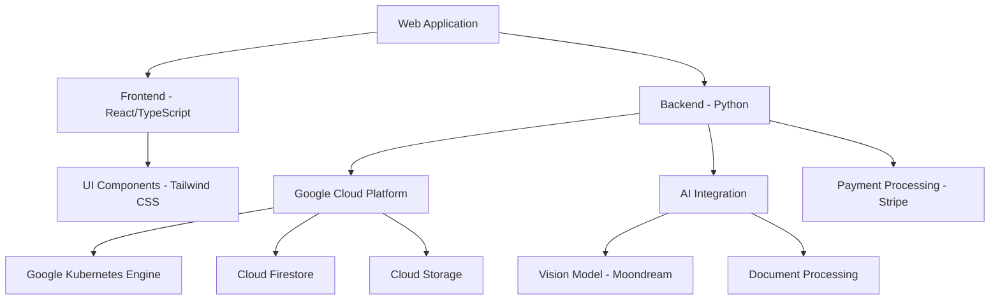

### 1.1.2 Key Components

1. **Frontend Application**
   - Built with React and TypeScript
   - Responsive design using Tailwind CSS
   - Single Page Application (SPA) architecture

2. **Backend Services**
   - Developed in Python
   - RESTful API design
   - Microservices architecture deployed on Google Kubernetes Engine

3. **Database**
   - Google Cloud Firestore for scalable, real-time data storage

4. **File Storage**
   - Google Cloud Storage for vehicle photos and documents

5. **AI Integration**
   - Custom integration of Moondream or similar vision model for photo analysis
   - Natural Language Processing (NLP) for document analysis

6. **Payment Processing**
   - Stripe integration for secure transactions

7. **Authentication and Authorization**
   - JWT-based authentication
   - Role-Based Access Control (RBAC)

### 1.1.3 Core Functionalities

The Used Car Marketplace offers the following key functionalities:

1. **Intelligent Listing Creation**
   - AI-powered photo analysis for automatic vehicle detail extraction
   - Document processing for maintenance history
   - User-friendly listing creation wizard

2. **Advanced Search and Discovery**
   - Full-text search with advanced filtering options
   - Personalized recommendations based on user preferences

3. **Secure Transactions**
   - Integrated payment processing through Stripe
   - Automated listing management post-purchase

4. **User Management**
   - Role-based access for buyers, sellers, and administrators
   - Profile management and preferences

5. **Communication Platform**
   - In-app messaging between buyers and sellers
   - Notification system for updates and offers

6. **Admin Tools**
   - Content moderation capabilities
   - Analytics dashboard for platform insights

7. **Mobile Responsiveness**
   - Optimized user experience across devices

### 1.1.4 Technology Stack

| Layer | Technologies |
|-------|--------------|
| Frontend | React, TypeScript, Tailwind CSS |
| Backend | Python, FastAPI |
| Database | Google Cloud Firestore |
| File Storage | Google Cloud Storage |
| Containerization | Docker, Google Kubernetes Engine |
| AI/ML | Custom integration (e.g., Moondream), TensorFlow |
| Payment | Stripe API |
| Authentication | JWT, Google Cloud Identity Platform |
| CI/CD | Google Cloud Build, GitHub Actions |

This system overview provides a high-level understanding of the Used Car Marketplace's architecture, components, and core functionalities. The combination of modern frontend technologies, scalable backend services, and advanced AI capabilities positions the platform to deliver a superior user experience in the competitive used car market.

# 4. SYSTEM ARCHITECTURE

## 4.1 PROGRAMMING LANGUAGES

The Used Car Marketplace will utilize the following programming languages:

| Language   | Purpose                                   | Justification                                                                                                   |
|------------|-------------------------------------------|------------------------------------------------------------------------------------------------------------------|
| TypeScript | Frontend development                      | Provides static typing for improved code quality and developer productivity in large-scale React applications. |
| React      | Frontend UI library                       | Offers a component-based architecture for building interactive and reusable UI elements.                        |
| Python     | Backend development and AI integration    | Versatile language with extensive libraries for web development, AI, and data processing.                       |
| SQL        | Database queries (when needed)            | Standard language for complex queries in relational databases, used alongside Firestore for specific use cases. |

## 4.2 HIGH-LEVEL ARCHITECTURE DIAGRAM

The following diagram provides an overview of the Used Car Marketplace system architecture:

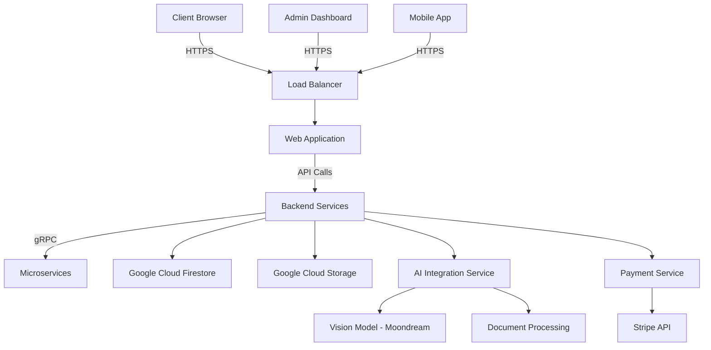

## 4.3 COMPONENT DIAGRAMS

### 4.3.1 Frontend Components

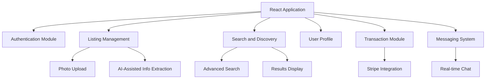

### 4.3.2 Backend Components

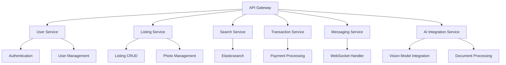

## 4.4 SEQUENCE DIAGRAMS

### 4.4.1 Vehicle Listing Creation

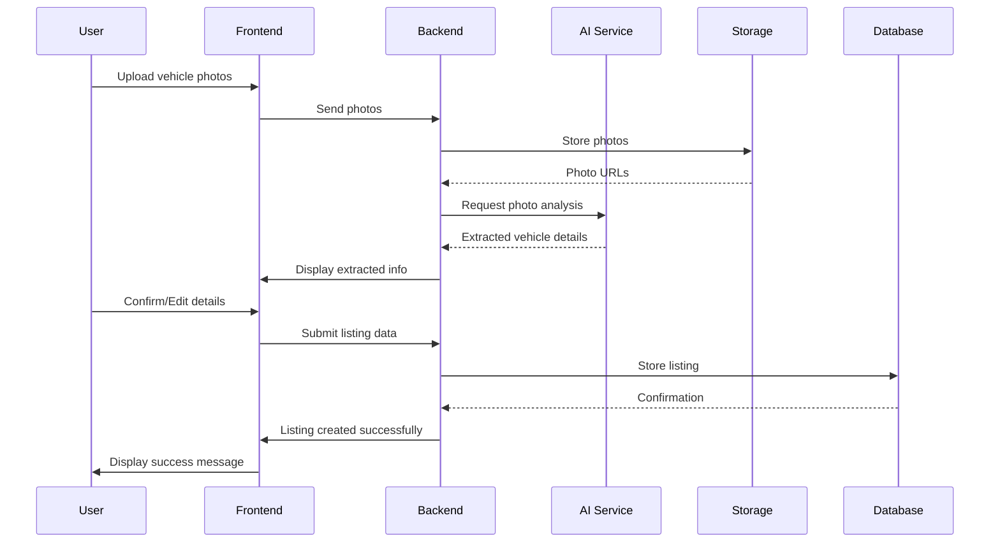

### 4.4.2 Vehicle Search and Purchase

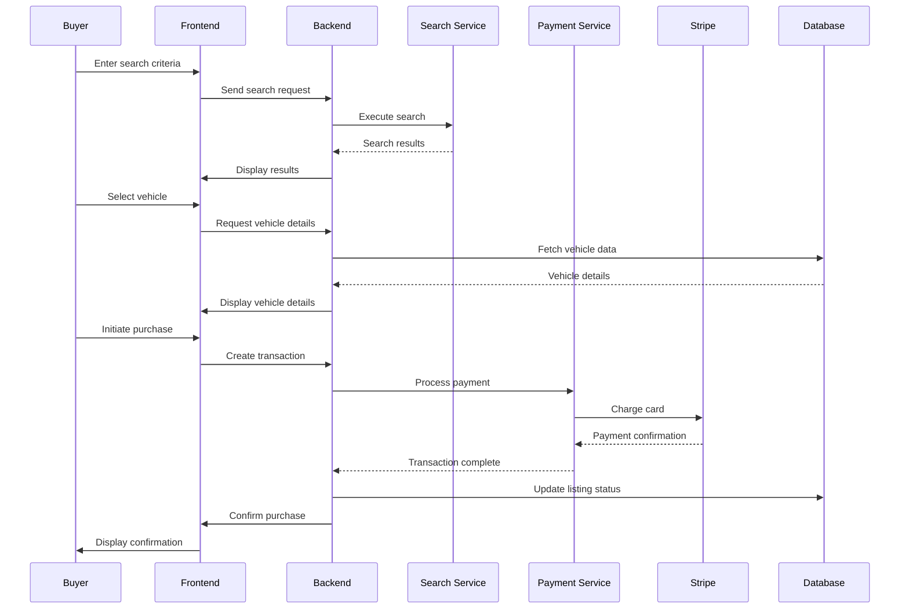

## 4.5 DATA-FLOW DIAGRAM

The following diagram illustrates the flow of information through the Used Car Marketplace system:

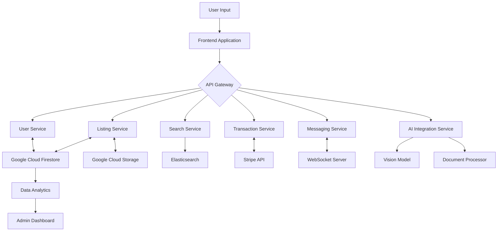

In this data flow:

1. User input is received through the frontend application.
2. The frontend communicates with backend services via the API Gateway.
3. Backend services interact with various data stores and external services:
   - User and Listing data is stored in Google Cloud Firestore.
   - Images and documents are stored in Google Cloud Storage.
   - Search functionality is powered by Elasticsearch.
   - Payments are processed through the Stripe API.
   - Real-time messaging uses WebSocket connections.
   - AI services analyze images and documents.
4. Data from various sources is aggregated for analytics and admin reporting.

This architecture ensures efficient data flow, scalability, and separation of concerns, allowing for easy maintenance and future enhancements of the Used Car Marketplace platform.

# 5. SYSTEM DESIGN

## 5.1 PROGRAMMING LANGUAGES

The Used Car Marketplace will utilize the following programming languages:

| Language   | Purpose                                   | Justification                                                                                                   |
|------------|-------------------------------------------|------------------------------------------------------------------------------------------------------------------|
| TypeScript | Frontend development                      | Provides static typing for improved code quality and developer productivity in large-scale React applications. |
| React      | Frontend UI library                       | Offers a component-based architecture for building interactive and reusable UI elements.                        |
| Python     | Backend development and AI integration    | Versatile language with extensive libraries for web development, AI, and data processing.                       |
| SQL        | Database queries (when needed)            | Standard language for complex queries in relational databases, used alongside Firestore for specific use cases. |

## 5.2 DATABASE DESIGN

The Used Car Marketplace will primarily use Google Cloud Firestore, a NoSQL document database, for its flexibility and scalability. The database design will consist of the following main collections:

1. Users
2. VehicleListings
3. Transactions
4. Messages

### Users Collection

```typescript
interface User {
  id: string;
  email: string;
  firstName: string;
  lastName: string;
  role: 'buyer' | 'seller' | 'admin';
  createdAt: Timestamp;
  updatedAt: Timestamp;
}
```

### VehicleListings Collection

```typescript
interface VehicleListing {
  id: string;
  sellerId: string;
  make: string;
  model: string;
  year: number;
  mileage: number;
  price: number;
  condition: string;
  photos: string[];
  maintenanceRecords: {
    documentUrl: string;
    documentType: 'service' | 'receipt' | 'summary';
    extractedInfo: string;
  }[];
  status: 'active' | 'sold' | 'inactive';
  createdAt: Timestamp;
  updatedAt: Timestamp;
}
```

### Transactions Collection

```typescript
interface Transaction {
  id: string;
  buyerId: string;
  sellerId: string;
  vehicleListingId: string;
  amount: number;
  status: 'pending' | 'completed' | 'cancelled';
  stripePaymentIntentId: string;
  createdAt: Timestamp;
  updatedAt: Timestamp;
}
```

### Messages Collection

```typescript
interface Message {
  id: string;
  senderId: string;
  receiverId: string;
  vehicleListingId: string;
  content: string;
  read: boolean;
  createdAt: Timestamp;
}
```

## 5.3 API DESIGN

The Used Car Marketplace API will follow RESTful principles and use JSON for data exchange. The main endpoints will include:

### Authentication

- `POST /api/auth/register`: Register a new user
- `POST /api/auth/login`: Authenticate a user
- `POST /api/auth/logout`: Log out a user
- `GET /api/auth/me`: Get current user information

### Vehicle Listings

- `GET /api/listings`: Get all listings (with pagination and filtering)
- `GET /api/listings/:id`: Get a specific listing
- `POST /api/listings`: Create a new listing
- `PUT /api/listings/:id`: Update a listing
- `DELETE /api/listings/:id`: Delete a listing

### Transactions

- `POST /api/transactions`: Create a new transaction
- `GET /api/transactions/:id`: Get transaction details
- `PUT /api/transactions/:id/status`: Update transaction status

### Messages

- `GET /api/messages`: Get user's messages
- `POST /api/messages`: Send a new message
- `PUT /api/messages/:id/read`: Mark a message as read

### AI Integration

- `POST /api/ai/analyze-photo`: Analyze vehicle photo
- `POST /api/ai/process-document`: Process maintenance document

## 5.4 USER INTERFACE DESIGN

The Used Car Marketplace UI will be built using React and Tailwind CSS, focusing on responsiveness and user-friendly design. Key components include:

### Home Page

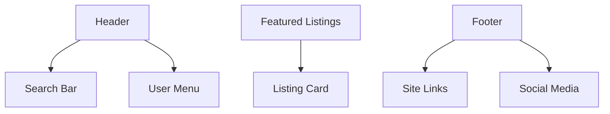

### Vehicle Listing Creation

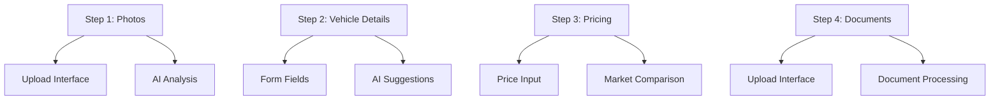

### Search Results

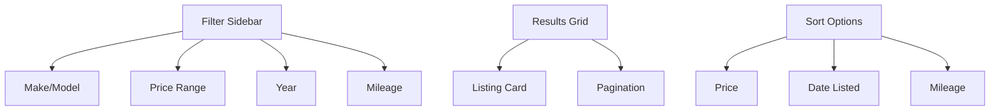

### Vehicle Details Page

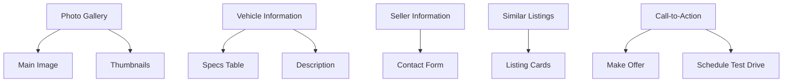

The UI components will be implemented using React functional components with hooks for state management. Tailwind CSS will be used for styling, ensuring a consistent and responsive design across all pages.

This system design provides a comprehensive overview of the programming languages, database structure, API endpoints, and user interface components for the Used Car Marketplace. The design leverages modern web technologies and cloud services to create a scalable and user-friendly platform for buying and selling used cars.

# 6. TECHNOLOGY STACK

## 6.1 PROGRAMMING LANGUAGES

The Used Car Marketplace will utilize the following programming languages:

| Language   | Purpose                                   | Justification                                                                                                   |
|------------|-------------------------------------------|------------------------------------------------------------------------------------------------------------------|
| TypeScript | Frontend development                      | Provides static typing for improved code quality and developer productivity in large-scale React applications. |
| JavaScript | Frontend development (React ecosystem)    | Essential for React and certain npm packages that may not have full TypeScript support.                         |
| Python     | Backend development and AI integration    | Versatile language with extensive libraries for web development, AI, and data processing.                       |
| SQL        | Database queries (when needed)            | Standard language for complex queries in relational databases, used alongside Firestore for specific use cases. |

## 6.2 FRAMEWORKS AND LIBRARIES

The project will leverage the following frameworks and libraries:

### Frontend

| Framework/Library | Purpose                                        |
|-------------------|------------------------------------------------|
| React             | UI component library for building the frontend |
| React Router      | Handling client-side routing                   |
| Redux             | State management for complex application state |
| Axios             | HTTP client for API requests                   |
| Tailwind CSS      | Utility-first CSS framework for styling        |
| React Query       | Data fetching and caching library              |
| Formik            | Form management and validation                 |
| React Testing Library | Component testing                          |

### Backend

| Framework/Library | Purpose                                        |
|-------------------|------------------------------------------------|
| FastAPI           | High-performance web framework for building APIs |
| SQLAlchemy        | ORM for database operations                    |
| Pydantic          | Data validation and settings management        |
| pytest            | Testing framework for Python                   |
| Celery            | Distributed task queue for background jobs     |
| NumPy             | Numerical computing library for AI operations  |
| Pillow            | Image processing library                       |
| PyPDF2            | PDF processing library                         |

## 6.3 DATABASES

The Used Car Marketplace will employ the following database solutions:

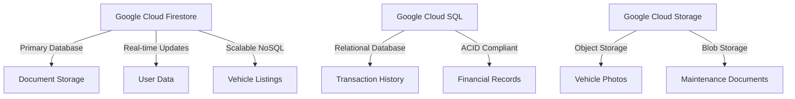

1. **Google Cloud Firestore**: Primary NoSQL database for storing user data, vehicle listings, and other application data requiring real-time updates and high scalability.

2. **Google Cloud SQL (PostgreSQL)**: Relational database for storing structured data that requires ACID compliance, such as transaction histories and financial records.

3. **Google Cloud Storage**: Object storage for large files such as vehicle photos and maintenance documents.

## 6.4 THIRD-PARTY SERVICES

The system will integrate the following external services and APIs:

1. **Stripe API**: For secure payment processing and handling financial transactions.

2. **Google Cloud Vision API**: To supplement the custom AI model (Moondream) for additional image analysis capabilities.

3. **Google Maps API**: For location-based services and mapping functionality in vehicle listings.

4. **SendGrid API**: For transactional email services, such as user notifications and account verifications.

5. **Twilio API**: For SMS notifications and potential future integration of voice services.

6. **Cloudflare**: For CDN services, DDoS protection, and SSL/TLS encryption.

7. **Auth0**: For advanced authentication and authorization services, including social login options.

8. **Sentry**: For error tracking and performance monitoring in both frontend and backend applications.

9. **Algolia**: For advanced search functionality, providing fast and relevant search results for vehicle listings.

10. **Google Analytics**: For tracking user behavior and generating insights on platform usage.

This technology stack leverages modern, scalable technologies that align with the project requirements and the specified preferences for TypeScript, React, Tailwind CSS, Python, and Google Cloud services. The combination of these technologies will enable the development of a robust, performant, and maintainable Used Car Marketplace platform.

# 7. SECURITY CONSIDERATIONS

## 7.1 AUTHENTICATION AND AUTHORIZATION

The Used Car Marketplace will implement a robust authentication and authorization system to ensure secure access and appropriate permissions for all users.

### 7.1.1 Authentication

1. **JSON Web Tokens (JWT)**
   - JWTs will be used for secure authentication and session management.
   - Tokens will be short-lived (1 hour) with refresh token functionality.

2. **Multi-Factor Authentication (MFA)**
   - Optional MFA using Time-based One-Time Passwords (TOTP).
   - Integration with Google Authenticator or similar apps.

3. **Password Policy**
   - Minimum 12 characters with a mix of uppercase, lowercase, numbers, and special characters.
   - Password strength meter implemented in the UI using React components.
   - Bcrypt for password hashing with a work factor of 12.

4. **OAuth 2.0 Integration**
   - Support for social login (Google, Facebook) using OAuth 2.0 protocol.

### 7.1.2 Authorization

1. **Role-Based Access Control (RBAC)**
   - Roles: Guest, Buyer, Seller, Admin
   - Permissions matrix:

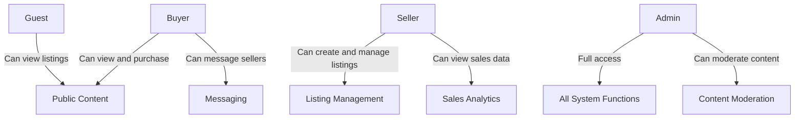

2. **JWT Claims**
   - User roles and permissions encoded in JWT payload.
   - Backend validation of JWT claims for each API request.

3. **API Authorization**
   - Implementation of middleware for route protection based on user roles.

```typescript
// Example of protected route middleware
const protectedRoute = (allowedRoles: string[]) => {
  return (req: Request, res: Response, next: NextFunction) => {
    const userRole = req.user.role;
    if (allowedRoles.includes(userRole)) {
      next();
    } else {
      res.status(403).json({ error: 'Access denied' });
    }
  };
};

// Usage in routes
app.get('/api/admin/users', protectedRoute(['admin']), adminController.getUsers);
```

## 7.2 DATA SECURITY

### 7.2.1 Encryption

1. **Data at Rest**
   - Google Cloud Firestore and Cloud Storage encryption using AES-256.
   - Customer-managed encryption keys (CMEK) for sensitive data.

2. **Data in Transit**
   - TLS 1.3 for all network communications.
   - HTTPS enforced across the entire application.

3. **End-to-End Encryption**
   - Implementation of end-to-end encryption for the messaging system using the Signal Protocol.

### 7.2.2 Data Classification

| Data Type | Classification | Storage | Access Control |
|-----------|----------------|---------|----------------|
| User Credentials | Highly Sensitive | Encrypted in Firestore | Admin only |
| Payment Information | Highly Sensitive | Not stored (Stripe token only) | N/A |
| Vehicle Listings | Public | Firestore | Public read, Seller/Admin write |
| User Messages | Private | Encrypted in Firestore | Sender/Receiver only |
| Maintenance Records | Confidential | Encrypted in Cloud Storage | Buyer/Seller/Admin |

### 7.2.3 Data Retention and Deletion

- Implement automated data retention policies in compliance with GDPR and CCPA.
- Provide user interface for data export and account deletion requests.
- Secure data erasure procedures for deleted accounts and expired listings.

## 7.3 SECURITY PROTOCOLS

### 7.3.1 Network Security

1. **Firewall Configuration**
   - Use of Google Cloud Firewall rules to restrict network access.
   - Implementation of Web Application Firewall (WAF) for protection against common web exploits.

2. **DDoS Protection**
   - Utilization of Google Cloud Armor for DDoS mitigation and traffic filtering.

3. **Virtual Private Cloud (VPC)**
   - Isolation of backend services within a private VPC network.
   - Use of Cloud NAT for outbound internet access from private instances.

### 7.3.2 Application Security

1. **Input Validation**
   - Server-side validation of all user inputs using Python's input validation libraries.
   - Client-side validation using React form libraries for improved UX.

2. **Cross-Site Scripting (XSS) Prevention**
   - Implementation of Content Security Policy (CSP) headers.
   - Use of React's built-in XSS protection and DOMPurify for additional sanitization.

3. **Cross-Site Request Forgery (CSRF) Protection**
   - Implementation of anti-CSRF tokens for all state-changing operations.

4. **API Security**
   - Rate limiting and throttling to prevent abuse.
   - API versioning to manage changes and updates securely.

### 7.3.3 Monitoring and Incident Response

1. **Logging and Monitoring**
   - Centralized logging using Google Cloud Logging.
   - Real-time monitoring and alerting with Google Cloud Monitoring.

2. **Security Information and Event Management (SIEM)**
   - Integration with Google Cloud's Security Command Center for threat detection and security analytics.

3. **Incident Response Plan**
   - Documented procedures for handling security incidents.
   - Regular drills and updates to the incident response plan.

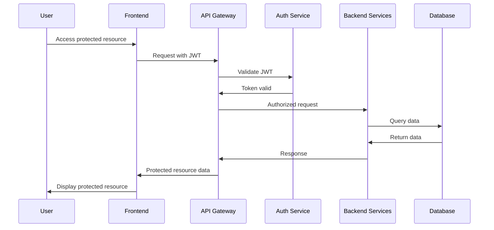

### 7.3.4 Compliance and Auditing

1. **Regular Security Audits**
   - Conduct quarterly internal security audits.
   - Annual third-party penetration testing.

2. **Compliance Certifications**
   - Maintain PCI DSS compliance for payment processing.
   - Implement controls for SOC 2 Type II compliance.

3. **Security Training**
   - Mandatory security awareness training for all employees.
   - Regular phishing simulations and security best practices updates.

By implementing these security considerations, the Used Car Marketplace will maintain a robust security posture, protecting user data and ensuring the integrity of the platform. Regular reviews and updates to these security measures will be conducted to address evolving threats and maintain compliance with industry standards.